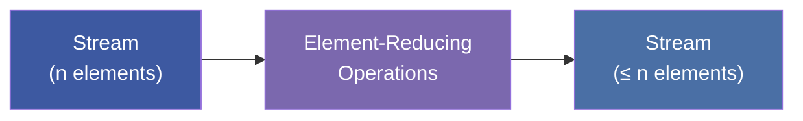
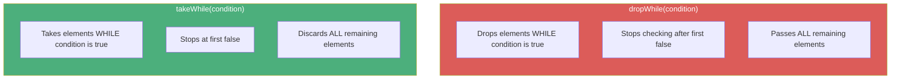
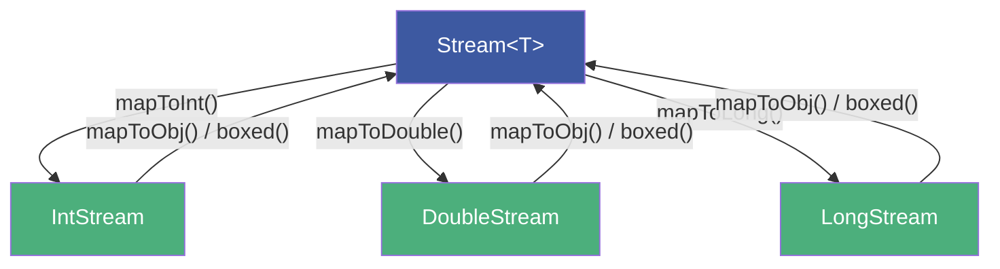
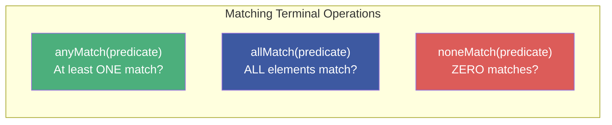
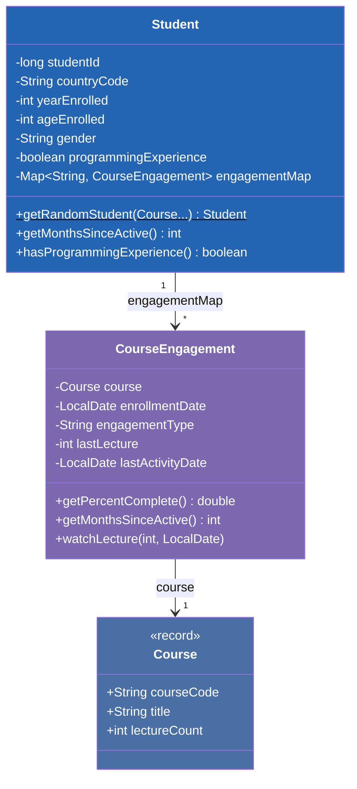

# :material-pencil: Topic Note Part 2: Intermediate & Terminal Operations

> **Course:** Java Programming Masterclass — Tim Buchalka (Udemy)
> **Section:** 17 — Comprehensive Java Streams Operations, Pipelines, and Sources
> **Lectures:** 6–12
> **Status:** :material-check-circle: Complete

---

## :material-target: Learning Objectives

By the end of this part, you should be able to:

- [x] Use all element-reducing operations: `distinct`, `filter`, `limit`, `skip`, `takeWhile`, `dropWhile`
- [x] Use all element-transforming operations: `map`, `mapToInt`/`mapToDouble`/`mapToObj`, `peek`, `sorted`
- [x] Switch between generic and primitive streams using specialized map operations
- [x] Apply `Comparator` chaining within stream `sorted` operations
- [x] Use terminal operations: `count`, `summaryStatistics`, `allMatch`, `anyMatch`, `noneMatch`
- [x] Build a Student Engagement domain model for stream processing
- [x] Combine multiple intermediate and terminal operations in practical challenges

---

## :material-filter: 1. Intermediate Operations — Element Reducing

These operations **may change the number of elements** in the resulting stream.



### Operation Reference

| Operation | Parameter | Description |
|-----------|-----------|-------------|
| `distinct()` | None | Removes duplicates (uses `equals()`) |
| `filter(predicate)` | `Predicate<T>` | Keeps elements where predicate is `true` |
| `limit(n)` | `long` | Truncates stream to first `n` elements |
| `skip(n)` | `long` | Discards first `n` elements |
| `takeWhile(predicate)` | `Predicate<T>` | Takes elements **while** predicate is true, stops at first `false` |
| `dropWhile(predicate)` | `Predicate<T>` | Drops elements **while** predicate is true, passes all after first `false` |

### `filter` — The WHERE Clause

```java
IntStream.iterate((int) 'A', i -> i <= (int) 'z', i -> i + 1)
    .filter(Character::isAlphabetic)     // Remove non-alpha chars ([ \ ] ^ _ `)
    .filter(i -> Character.toUpperCase(i) > 'E')  // Multiple filters allowed!
    .forEach(s -> System.out.printf("%c", s));
```

!!! info "Multiple Filters"
    You can chain as many `filter` operations as you want. The stream processor may **combine** them internally for optimization.

### `skip` — Offset from Start

```java
IntStream.iterate((int) 'A', i -> i <= (int) 'z', i -> i + 1)
    .filter(Character::isAlphabetic)
    .skip(5)                             // Skip A, B, C, D, E → start at F
    .forEach(s -> System.out.printf("%c", s));
```

### `dropWhile` vs `takeWhile` — Conditional Slicing



```java
// Combined: select only uppercase F through Z
IntStream.iterate((int) 'A', i -> i <= (int) 'z', i -> i + 1)
    .filter(Character::isAlphabetic)
    .dropWhile(i -> i <= 'E')            // Drop A–E
    .takeWhile(i -> i < 'a')             // Take until lowercase starts
    .forEach(s -> System.out.printf("%c", s));
// Output: FGHIJKLMNOPQRSTUVWXYZ
```

!!! warning "`dropWhile`/`takeWhile` vs `filter`"
    `filter` checks **every** element. `dropWhile`/`takeWhile` check **until the first state change** — they are one-time gates, not continuous filters. Works best with **ordered** streams; unordered streams produce **non-deterministic** results.

### `distinct` — Remove Duplicates

```java
// Map all letters to uppercase, then remove duplicates
IntStream.iterate((int) 'A', i -> i <= (int) 'z', i -> i + 1)
    .filter(Character::isAlphabetic)
    .map(Character::toUpperCase)
    .distinct()                          // Only A–Z (26 unique letters)
    .forEach(s -> System.out.printf("%c", s));
```

Uses `equals()` to determine uniqueness. For random streams:

```java
Stream.generate(() -> random.nextInt((int) 'A', (int) 'Z' + 1))
    .limit(50)                           // Generate 50 random
    .distinct()                          // Remove duplicates
    .sorted()                            // Natural order
    .forEach(s -> System.out.printf("%c", s));
```

---

## :material-swap-horizontal: 2. Intermediate Operations — Element Transforming

These operations process **every** element but **don't change the count**.

### `map` — One-to-One Transformation

```java
// Stream of integers → Stream of Seat records
Stream.iterate(0, i -> i < maxSeats, i -> i + 1)
    .map(i -> new Seat(
        (char) ('A' + i / seatsInRow),   // Row marker
        i % seatsInRow + 1               // Seat number
    ))
    .forEach(System.out::println);
```

### Switching Between Stream Types



| From | To | Operation |
|------|------|-----------|
| `Stream<T>` | `IntStream` | `mapToInt(ToIntFunction)` |
| `Stream<T>` | `DoubleStream` | `mapToDouble(ToDoubleFunction)` |
| `Stream<T>` | `LongStream` | `mapToLong(ToLongFunction)` |
| `IntStream` / `DoubleStream` / `LongStream` | `Stream<T>` | `mapToObj(Function)` or `boxed()` |

```java
var seatStream = Stream.iterate(0, i -> i < 100, i -> i + 1)
    .map(i -> new Seat((char)('A' + i/10), i%10 + 1));

// Switch to DoubleStream for prices
seatStream
    .mapToDouble(Seat::price)            // Stream<Seat> → DoubleStream
    .mapToObj("%.2f"::formatted)         // DoubleStream → Stream<String>
    .forEach(System.out::println);
```

!!! danger "Primitive Stream `map` Returns Same Type"
    On `DoubleStream`, `map()` must return a `double`. To return a different type, use `mapToObj()` or `boxed()` first.

### `sorted` — Ordering the Stream

```java
// Requires Comparable OR a Comparator
seatStream
    .sorted(Comparator.comparing(Seat::price)
        .thenComparing(Seat::toString))
    .forEach(System.out::println);
```

Without a `Comparator`, calling `sorted()` on non-Comparable types throws `ClassCastException` at runtime.

### `peek` — Debugging Window

```java
seatStream
    .skip(5)
    .limit(10)
    .peek(s -> System.out.println("--> " + s))   // Debug output
    .sorted(Comparator.comparing(Seat::price))
    .forEach(System.out::println);
```

!!! info "`peek` Is Still an Intermediate Operation"
    Without a terminal operation, `peek` produces **no output** — it's lazy like everything else. Designed for debugging; the API docs state it "mainly exists to support debugging."

---

## :material-chart-bar: 3. Terminal Operations — Aggregation & Matching

### Statistical Operations (Primitive Streams)

```java
var result = IntStream.iterate(0, i -> i <= 1000, i -> i + 10)
    .summaryStatistics();

System.out.println(result);
// IntSummaryStatistics{count=101, sum=50500, min=0, average=500.0, max=1000}
```

| Operation | Return Type | Description |
|-----------|-------------|-------------|
| `summaryStatistics()` | `IntSummaryStatistics` / `DoubleSummaryStatistics` | Count, sum, min, avg, max in one call |
| `count()` | `long` | Number of elements |
| `sum()` | `int` / `long` / `double` | Sum of all elements |
| `min()` | `OptionalInt` / `OptionalDouble` | Minimum value |
| `max()` | `OptionalInt` / `OptionalDouble` | Maximum value |
| `average()` | `OptionalDouble` | Average of all elements |

### Practical Example — Leap Year Analysis

```java
var leapYearData = IntStream.iterate(2000, y -> y <= 2025, y -> y + 1)
    .filter(i -> i % 4 == 0)
    .peek(System.out::println)           // See which years match
    .summaryStatistics();

System.out.println(leapYearData);
// IntSummaryStatistics{count=7, sum=14084, min=2000, average=2012.0, max=2024}
```

### Matching Operations

All return `boolean` and take a `Predicate`:



```java
Seat[] seats = new Seat[100];
Arrays.setAll(seats, i -> new Seat(
    (char) ('A' + i / 10), i % 10 + 1));

// Count reserved seats
long reservedCount = Arrays.stream(seats)
    .filter(Seat::isReserved)
    .count();

// Any reservations at all?
boolean hasBookings = Arrays.stream(seats)
    .anyMatch(Seat::isReserved);           // true if ≥ 1 reserved

// Completely sold out?
boolean fullyBooked = Arrays.stream(seats)
    .allMatch(Seat::isReserved);           // true only if ALL reserved

// Zero bookings (event washed out)?
boolean eventWashedOut = Arrays.stream(seats)
    .noneMatch(Seat::isReserved);          // true if NONE reserved
```

---

## :material-school: 4. Student Engagement System — Domain Model

### Architecture

Lectures 9–10 build the domain model used for all remaining challenges:



### Key Design Decisions

- **`Course`** is a `record` with a compact constructor (validates `lectureCount > 0`)
- **`CourseEngagement`** tracks per-course progress with `lastLecture`, `lastActivityDate`, and computed `percentComplete`
- **`Student`** uses `Map<String, CourseEngagement>` keyed by course code; returns `Map.copyOf()` from the getter (defensive copy!)
- **`Student.getRandomStudent()`** is a static factory that generates randomized test data

### Data Generation

```java
Course jmc = new Course("JMC", "Java Masterclass", 100);
Course pymc = new Course("PYC", "Python Masterclass", 50);

// Generate 5000 random students
List<Student> students = IntStream.rangeClosed(1, 5000)
    .mapToObj(i -> Student.getRandomStudent(jmc, pymc))
    .toList();
```

---

## :material-trophy: 5. Terminal Operations Challenge

### Challenge Tasks (Lectures 11–12)

Using the Student Engagement domain:

1. **Count** students who have been active in the last 12 months
2. **Find** the student with the most course completions
3. **Calculate** average age of students who enrolled before 2022
4. **Filter** and **sort** long-term students (enrolled 3+ years ago), limited to 5
5. **Check** if any student has completed 100% of a course

```java
// Example: Long-term students, sorted by ID
students.stream()
    .filter(s -> s.getYearsSinceEnrolled() >= 3)
    .sorted(Comparator.comparingLong(Student::getStudentId))
    .limit(5)
    .forEach(System.out::println);
```

---

## :material-compare: Streams vs SQL Analogy

| SQL Clause | Stream Equivalent |
|------------|-------------------|
| `SELECT columns` | `map(transformation)` |
| `WHERE condition` | `filter(predicate)` |
| `ORDER BY column` | `sorted(comparator)` |
| `DISTINCT` | `distinct()` |
| `LIMIT n` | `limit(n)` |
| `OFFSET n` | `skip(n)` |
| `COUNT(*)` | `count()` |
| `MIN(col)` / `MAX(col)` | `min()` / `max()` |
| `AVG(col)` | `average()` |
| `SUM(col)` | `sum()` |

---

## :material-help-circle: Questions Explored

- [x] What are the two categories of intermediate operations?
- [x] How does `dropWhile` differ from `filter`?
- [x] How do you switch between generic and primitive streams?
- [x] What does `peek` do and why is it only for debugging?
- [x] What happens if you call `sorted()` on a non-Comparable type?
- [x] What's the difference between `anyMatch`, `allMatch`, and `noneMatch`?
- [x] How do you build a domain model for stream-based data analysis?

---

## :material-navigation: Related Notes

| Part | Topic | Link |
|:----:|-------|------|
| 1 | Core Concepts, Pipelines & Stream Sources | [← Part 1](topic-note.md) |
| 2 | Intermediate & Terminal Operations | **You are here** |
| 3 | Collect, Reduce, Optional & flatMap | [Part 3 →](topic-note-part3.md) |

---

*Last Updated: 2026-04-29*
