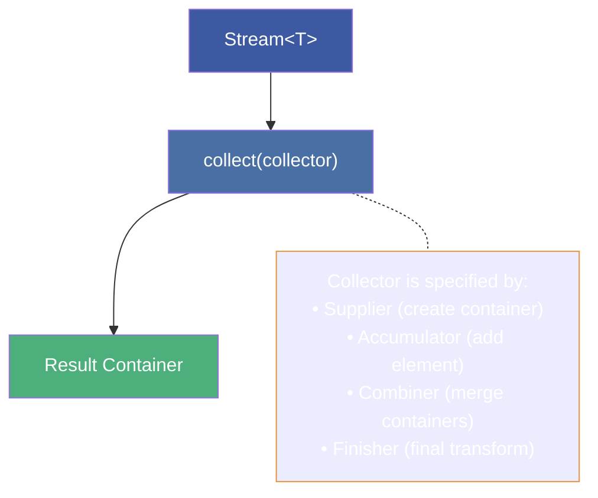
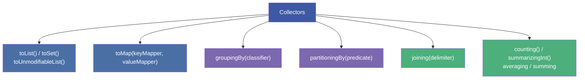
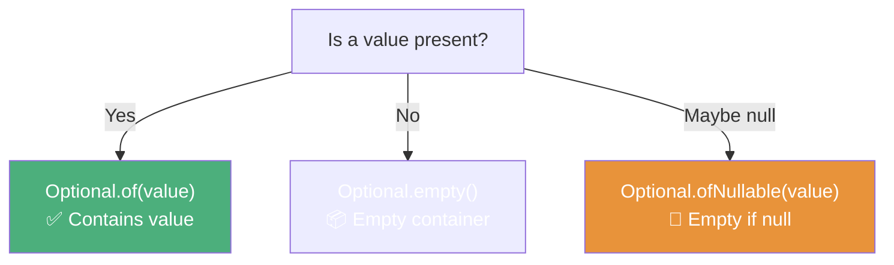
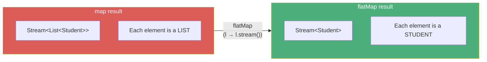

# :material-pencil: Topic Note Part 3: Collect, Reduce, Optional & flatMap

> **Course:** Java Programming Masterclass — Tim Buchalka (Udemy)
> **Section:** 17 — Comprehensive Java Streams Operations, Pipelines, and Sources
> **Lectures:** 13–20
> **Status:** :material-check-circle: Complete

---

## :material-target: Learning Objectives

By the end of this part, you should be able to:

- [x] Use `collect` with `Collectors` to gather stream results into Lists, Sets, Maps
- [x] Distinguish `toList()` (unmodifiable) from `Collectors.toList()` (mutable)
- [x] Use `toArray` with typed arrays via `IntFunction` / method reference
- [x] Apply `reduce` for custom aggregation operations
- [x] Use `groupingBy` and `partitioningBy` Collectors
- [x] Create and use `Optional` safely (`of`, `ofNullable`, `empty`, `orElse`, `orElseGet`)
- [x] Chain `map`, `filter`, `ifPresent`, `ifPresentOrElse` on Optional instances
- [x] Use `findFirst`, `findAny`, `min`, `max` terminal operations
- [x] Apply `flatMap` to flatten hierarchical/nested data structures
- [x] Combine all stream concepts in comprehensive data analysis

---

## :material-package-variant: 1. The `collect` Terminal Operation

### Collector Architecture



### `toList()` vs `Collectors.toList()` — Critical Difference

```java
// Stream's toList() → UNMODIFIABLE list
List<Student> unmodifiable = students.stream()
    .filter(s -> s.getYearsSinceEnrolled() >= 3)
    .limit(5)
    .toList();
// unmodifiable.add(student); → UnsupportedOperationException!

// Collectors.toList() → MUTABLE list
List<Student> mutable = students.stream()
    .filter(s -> s.getYearsSinceEnrolled() >= 3)
    .limit(5)
    .collect(Collectors.toList());
// mutable.add(student); → ✅ Works!
Collections.shuffle(mutable);  // ✅ Works!
```

| Method | Returns | Mutable? |
|--------|---------|:---:|
| `stream.toList()` | Unmodifiable `List` | ❌ |
| `stream.collect(Collectors.toList())` | Mutable `ArrayList` | ✅ |
| `stream.collect(Collectors.toUnmodifiableList())` | Unmodifiable `List` | ❌ |

### `toArray` — Getting Arrays from Streams

```java
// Untyped — returns Object[]
Object[] objects = students.stream()
    .limit(5)
    .toArray();

// Typed — returns Student[] using IntFunction
Student[] typed = students.stream()
    .limit(5)
    .toArray(Student[]::new);       // Array constructor reference!
```

!!! tip "Array Constructor as Method Reference"
    `Student[]::new` is an **unbounded receiver** method reference. It takes an `int` (the array size) and returns a `Student[]`. It's equivalent to `size -> new Student[size]`.

---

## :material-table: 2. Collectors — Grouping & Partitioning

### `groupingBy` — Group by Key

```java
Map<String, List<Student>> byCountry = students.stream()
    .collect(Collectors.groupingBy(Student::getCountryCode));
// {US=[...], CA=[...], IN=[...], ...}
```

### `partitioningBy` — Split into Two Groups

```java
Map<Boolean, List<Student>> byExperience = students.stream()
    .collect(Collectors.partitioningBy(Student::hasProgrammingExperience));
// {true=[experienced...], false=[beginners...]}
```

### Multi-Level Grouping

```java
Map<String, Map<String, List<Student>>> byCountryAndGender =
    students.stream()
        .collect(Collectors.groupingBy(
            Student::getCountryCode,
            Collectors.groupingBy(Student::getGender)
        ));
// {US={M=[...], F=[...], U=[...]}, CA={M=[...], ...}, ...}
```

### `joining` — String Concatenation

```java
String countryCodes = students.stream()
    .map(Student::getCountryCode)
    .distinct()
    .sorted()
    .collect(Collectors.joining(", "));
// "AU, CA, CN, GB, IN, UA, US"
```

### Collectors Summary



---

## :material-arrow-collapse-all: 3. The `reduce` Operation

### Concept

`reduce` combines all stream elements into a **single result** by repeatedly applying a binary operator:

```java
// Sum of all ages
int totalAge = students.stream()
    .map(Student::getAge)
    .reduce(0, Integer::sum);
// Identity (0) + first + second + ... = total

// Concatenation
String allNames = Stream.of("A", "B", "C")
    .reduce("", (a, b) -> a + b);
// "" + "A" + "B" + "C" = "ABC"
```

### Three-Parameter `reduce`

```java
// reduce(identity, accumulator, combiner)
// The combiner is used for parallel streams
int totalAge = students.parallelStream()
    .reduce(0,
        (subtotal, student) -> subtotal + student.getAge(),  // accumulator
        Integer::sum);                                        // combiner
```

---

## :material-help-box: 4. The `Optional` Class

### What Is Optional?

> *"A container object which may or may not contain a non-null value. Primarily intended for use as a method return type."*



### Creating Optionals

```java
// Contains a value — throws NPE if null!
Optional<Student> o1 = Optional.of(student);

// May be empty — safe for nullable values
Optional<Student> o2 = Optional.ofNullable(maybeNull);

// Always empty
Optional<Student> o3 = Optional.empty();
```

!!! danger "Rule #1: Methods returning Optional must NEVER return null"
    ```java
    // ❌ WRONG — defeats the entire purpose
    public Optional<Student> getStudent() { return null; }
    
    // ✅ CORRECT
    public Optional<Student> getStudent() { return Optional.empty(); }
    ```

### Accessing Values

```java
// ❌ Risky — throws NoSuchElementException if empty
Student s = optional.get();

// ✅ Check first
if (optional.isPresent()) {
    Student s = optional.get();
}

// ✅✅ Functional style (preferred)
optional.ifPresent(System.out::println);

// ✅✅✅ Handle both cases
optional.ifPresentOrElse(
    System.out::println,                    // Consumer — if present
    () -> System.out.println("Empty!")      // Runnable — if empty
);
```

### `orElse` vs `orElseGet` — Performance Trap

```java
// orElse: ALWAYS evaluates the fallback expression
Student s = optional.orElse(getDummyStudent());
// getDummyStudent() is called even when optional HAS a value!

// orElseGet: Only evaluates if empty (uses Supplier)
Student s = optional.orElseGet(() -> getDummyStudent());
// getDummyStudent() is called ONLY when optional is empty
```

!!! warning "Always Prefer `orElseGet` over `orElse` When the Fallback Is Expensive"
    `orElse` eagerly evaluates its argument. If the fallback involves database calls, network requests, or object creation, use `orElseGet` to defer evaluation.

### Optional Has Stream-Like Methods

```java
Optional.ofNullable(countryCodes)
    .map(list -> String.join(", ", list))   // Transform value
    .filter(s -> s.contains("FR"))          // Conditional check
    .ifPresentOrElse(
        System.out::println,
        () -> System.out.println("Missing FR")
    );
```

### When NOT to Use Optional

- ❌ As a **field** type (not serializable, adds memory overhead)
- ❌ As a **method parameter** (adds complexity, reduces readability)
- ❌ For **every getter** (overuse wrapping consumes memory)
- ✅ As a **method return type** when no result is valid

---

## :material-find-replace: 5. Advanced Terminal Operations

### `findFirst` & `findAny`

```java
// findFirst — deterministic, returns first matching element
Optional<Student> first = students.stream()
    .filter(Student::hasProgrammingExperience)
    .findFirst();

// findAny — non-deterministic (useful in parallel streams)
Optional<Student> any = students.parallelStream()
    .filter(Student::hasProgrammingExperience)
    .findAny();
```

### `min` & `max` with Comparator

```java
// Student who enrolled earliest
Optional<Student> earliest = students.stream()
    .min(Comparator.comparingInt(Student::getYearEnrolled));

// Student with highest completion
Optional<Student> topStudent = students.stream()
    .max(Comparator.comparingDouble(
        s -> s.getPercentComplete("JMC")
    ));
```

---

## :material-flatten: 6. The `flatMap` Intermediate Operation

### The Problem `flatMap` Solves

When you have **nested collections** (a Map of Lists, or a List of Lists), `map` gives you a `Stream<Stream<T>>` — not useful. `flatMap` **flattens** the hierarchy:



### `map` vs `flatMap`

| Operation | Input → Output | Use When |
|-----------|:-:|-----------|
| `map` | 1 element → 1 element | Transforming each element individually |
| `flatMap` | 1 element → 0..N elements (stream) | Flattening nested collections/structures |

### Practical Example — Counting Active Students in a Partitioned Map

```java
Map<Boolean, List<Student>> experienced = students.stream()
    .collect(Collectors.partitioningBy(Student::hasProgrammingExperience));

// ❌ Ugly approach with nested map + count
long count = experienced.values().stream()
    .map(l -> l.stream()
        .filter(s -> s.getMonthsSinceActive() < 3)
        .count())
    .mapToLong(l -> l)
    .sum();

// ✅ Clean approach with flatMap
long count = experienced.values().stream()
    .flatMap(Collection::stream)              // Flatten lists into one stream
    .filter(s -> s.getMonthsSinceActive() < 3)
    .count();
```

### Multi-Level Flattening

For deeply nested structures (Map of Maps of Lists):

```java
Map<String, Map<String, List<Student>>> multiLevel = /*...*/;

long activeCount = multiLevel.values().stream()
    .flatMap(map -> map.values().stream()     // Map<String,List<Student>> → Stream<List<Student>>
        .flatMap(Collection::stream))         // List<Student> → Stream<Student>
    .filter(s -> s.getMonthsSinceActive() < 3)
    .count();

// Cleaner with chained flatMap:
long activeCount = multiLevel.values().stream()
    .flatMap(map -> map.values().stream().flatMap(Collection::stream))
    .filter(s -> s.getMonthsSinceActive() < 3)
    .count();
```

---

## :material-trophy: 7. Comprehensive Final Challenge

### Challenge Tasks (Lectures 18, 20)

Combining all stream techniques on the Student Engagement dataset:

1. **Group** students by country code, sorted by country
2. **Partition** students by programming experience
3. **Create** a multi-level map: country → gender → students
4. **Count** active students across partitioned/multi-level maps using `flatMap`
5. **Find** average completion percentage per course using `Collectors.averagingDouble`
6. **Identify** top-performing students per country using `groupingBy` + `maxBy`
7. **Generate** enrollment trend data using `groupingBy(Student::getYearEnrolled, counting())`

---

## :material-alert: Common Pitfalls Recap

### 1. `toList()` Returns Unmodifiable

```java
var list = stream.toList();
list.add(element);  // ❌ UnsupportedOperationException!
```

### 2. Using `orElse` with Expensive Operations

```java
// ❌ getDummyStudent() runs ALWAYS
optional.orElse(getDummyStudent());

// ✅ Only runs when empty
optional.orElseGet(() -> getDummyStudent());
```

### 3. Don't Use Streams When Collections Suffice

```java
// ❌ Overcomplicated
long count = students.stream().count();

// ✅ Just use the collection method
int count = students.size();
```

### 4. `flatMap` Required for Nested Structures

```java
// ❌ map gives Stream<Stream<Student>>
mapOfLists.values().stream().map(Collection::stream)...

// ✅ flatMap gives Stream<Student>
mapOfLists.values().stream().flatMap(Collection::stream)...
```

---

## :material-help-circle: Questions Explored

- [x] What's the difference between `toList()` and `Collectors.toList()`?
- [x] How does the `Collector` interface work (supplier, accumulator, combiner, finisher)?
- [x] How do `groupingBy` and `partitioningBy` differ?
- [x] What is `Optional` and why was it created?
- [x] Why should methods returning Optional never return null?
- [x] What's the performance difference between `orElse` and `orElseGet`?
- [x] When should you NOT use Optional?
- [x] What does `flatMap` do and when is it needed?
- [x] How do you flatten multi-level nested data structures?

---

## :material-navigation: Related Notes

| Part | Topic | Link |
|:----:|-------|------|
| 1 | Core Concepts, Pipelines & Stream Sources | [← Part 1](topic-note.md) |
| 2 | Intermediate & Terminal Operations | [← Part 2](topic-note-part2.md) |
| 3 | Collect, Reduce, Optional & flatMap | **You are here** |

---

*Last Updated: 2026-04-29*
