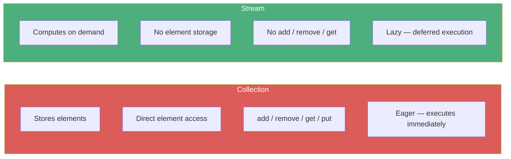
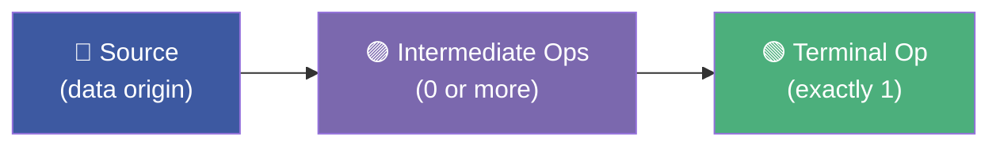
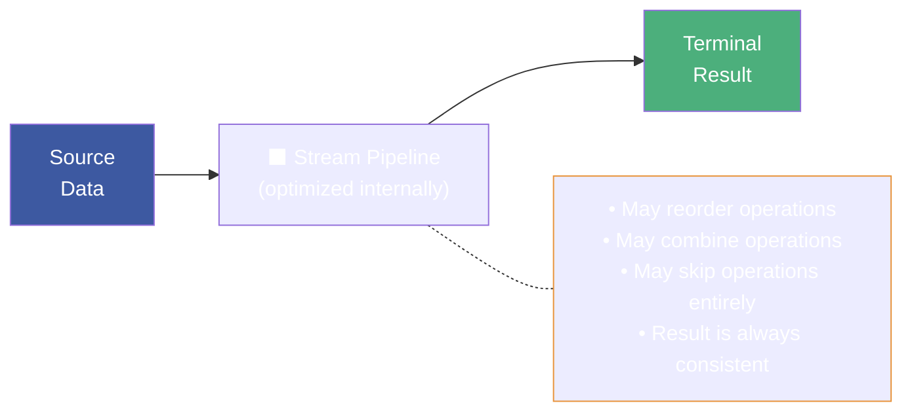
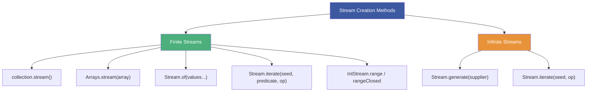

# :material-pencil: Topic Note Part 1: Core Concepts, Pipelines & Stream Sources

> **Course:** Java Programming Masterclass — Tim Buchalka (Udemy)
> **Section:** 17 — Comprehensive Java Streams Operations, Pipelines, and Sources
> **Lectures:** 1–5
> **Status:** :material-check-circle: Complete

---

## :material-target: Learning Objectives

By the end of this part, you should be able to:

- [x] Explain what a Java Stream is and how it differs from a Collection
- [x] Describe the stream pipeline architecture: source → intermediate → terminal
- [x] Understand lazy evaluation and why streams are "workflow suggestions"
- [x] Create streams from multiple sources (Collections, Arrays, `Stream.of`, `generate`, `iterate`)
- [x] Use `IntStream`, `DoubleStream`, and `LongStream` for primitive operations
- [x] Explain the difference between `range` and `rangeClosed`
- [x] Concatenate multiple streams using `Stream.concat`
- [x] Avoid side effects and understand stream reuse limitations

---

## :material-lightbulb: 1. What Is a Java Stream?

### Definition

> *"A sequence of elements supporting sequential and parallel aggregate operations."*
> — Oracle Java Documentation

Another way to think about it: **a stream is a set of computational steps against a data set, that are chained together.**

### Streams vs Collections



| Aspect | Collection | Stream |
|--------|:---:|:---:|
| **Purpose** | Store and manage elements | Process elements |
| **Element access** | Direct (add, get, remove) | No direct access |
| **Execution** | Eager — immediate | Lazy — deferred until terminal op |
| **Reuse** | ✅ Iterate multiple times | ❌ Single-use (consumed once) |
| **Modifies source** | ✅ Can modify underlying data | ❌ Does not modify source |
| **Benefits** | Data management | Declarative processing (like SQL) |

### Key Insight

> *"There's nothing you can do with a stream that you couldn't already do with a Collection. However, streams make the code to process data uniform, concise, and repeatable."*

Stream operations make heavy use of **lambda expressions** and **method references** — the four functional interface types (`Consumer`, `Predicate`, `Supplier`, `Function`) are essential prerequisites.

---

## :material-pipe: 2. The Stream Pipeline Architecture

### Pipeline Structure

Every stream pipeline has exactly **three components**:



| Component | Required? | Returns | Purpose |
|-----------|:---:|---------|---------|
| **Source** | ✅ | `Stream<T>` | Where data elements come from |
| **Intermediate** | ❌ | `Stream<T>` | Filter, transform, sort — always returns a stream |
| **Terminal** | ✅ | Result or void | Produces final result; triggers execution |

### The Bingo Ball Example

```java
// Collection approach — imperative, step-by-step
List<String> firstOnes = new ArrayList<>(bingoPool.subList(0, 15));
firstOnes.sort(Comparator.naturalOrder());
firstOnes.replaceAll(s -> {
    if (s.indexOf('G') == 0 || s.indexOf('O') == 0) {
        return s.charAt(0) + "-" + s.substring(1);
    }
    return s;
});

// Stream approach — declarative, reads like a query
bingoPool.stream()
    .limit(15)                                                  // Intermediate
    .filter(s -> s.indexOf('G') == 0 || s.indexOf('O') == 0)   // Intermediate
    .map(s -> s.charAt(0) + "-" + s.substring(1))              // Intermediate
    .sorted()                                                   // Intermediate
    .forEach(s -> System.out.print(s + " "));                  // Terminal
```

!!! tip "Key Differences in the Two Approaches"
    - The **collection** approach modifies the original data (subList is a view!)
    - The **stream** approach leaves the original `bingoPool` **untouched**
    - The stream code is more **concise**, **readable**, and **ordered**

---

## :material-sleep: 3. Lazy Evaluation & Optimization

### Streams Are Lazy

Intermediate operations **do not execute** until a terminal operation is invoked:

```java
// No terminal operation → NOTHING happens
var tempStream = bingoPool.stream()
    .limit(15)
    .filter(s -> s.indexOf('G') == 0 || s.indexOf('O') == 0)
    .map(s -> s.charAt(0) + "-" + s.substring(1))
    .sorted();
// Zero execution has occurred at this point!

// Terminal operation triggers everything:
tempStream.forEach(s -> System.out.print(s + " "));
```

### The Pipeline as a "Black Box"



!!! danger "Avoid Side Effects in Intermediate Operations"
    The stream processor may **optimize away** operations or change their order. If your lambda modifies external state (incrementing a counter, writing to a file), that code **may never execute** or execute in an unexpected order.

### Stream Reuse Rule

Once a terminal operation is invoked, the stream is **consumed and closed**. You cannot reuse it:

```java
var stream = list.stream().filter(x -> x > 5);
stream.forEach(System.out::println);    // ✅ Works
stream.forEach(System.out::println);    // ❌ IllegalStateException!
// "stream has already been operated upon or closed"
```

---

## :material-source-branch: 4. Stream Sources

### Overview of Creation Methods



### From Collections

```java
List<String> bingoPool = new ArrayList<>(75);
// ... populate ...
bingoPool.stream()          // Stream<String>
    .forEach(System.out::println);
```

All types implementing `Collection` (ArrayList, LinkedList, HashSet, TreeSet, etc.) have the `stream()` method.

### From Arrays

```java
String[] strings = {"One", "Two", "Three"};
Arrays.stream(strings)       // Stream<String>
    .sorted(Comparator.reverseOrder())
    .forEach(System.out::println);
```

### From `Stream.of` (Variable Arguments)

```java
Stream.of("Six", "Five", "Four")    // Stream<String>
    .map(String::toUpperCase)
    .forEach(System.out::println);
```

### From Maps (via Collection Views)

Maps don't have a direct `stream()` method, but you can stream their **views**:

```java
Map<Character, int[]> bingoMap = new LinkedHashMap<>();
// ... populate ...

bingoMap.entrySet().stream()           // Stream<Map.Entry<Character, int[]>>
    .map(e -> e.getKey() + " range: " + e.getValue()[0] + "-" + e.getValue()[14])
    .forEach(System.out::println);
```

!!! info "Map Operation Can Change Stream Type"
    The `map` operation takes a `Function<T, R>` — input and output types can differ. In the example above, `Stream<Map.Entry>` becomes `Stream<String>` after the `map` operation.

### Concatenating Streams

```java
var firstStream = Arrays.stream(strings).sorted(Comparator.reverseOrder());
var secondStream = Stream.of("Six", "Five", "Four").map(String::toUpperCase);

Stream.concat(secondStream, firstStream)   // Merged stream
    .map(s -> s.charAt(0) + " - " + s)
    .forEach(System.out::println);
```

Each stream retains its **own intermediate operations**; operations after `concat` apply to the **merged** result.

---

## :material-infinity: 5. Infinite Streams

### `Stream.generate` — Supplier-Based

Takes a `Supplier` (no args, returns a value). Produces an **infinite** stream:

```java
Random random = new Random();
Stream.generate(() -> random.nextInt(2))   // Infinite 0s and 1s
    .limit(10)                              // Make it finite!
    .forEach(s -> System.out.print(s + " "));
```

### `Stream.iterate` — Two-Argument (Infinite)

Takes a **seed** and a `UnaryOperator`:

```java
IntStream.iterate(1, n -> n + 1)           // 1, 2, 3, 4, ... (infinite!)
    .filter(Main::isPrime)
    .limit(20)                              // First 20 primes
    .forEach(s -> System.out.print(s + " "));
```

### `Stream.iterate` — Three-Argument (Finite)

Adds a **predicate** as the second parameter (like a for-loop condition):

```java
IntStream.iterate(1, n -> n <= 100, n -> n + 1)   // 1 to 100
    .filter(Main::isPrime)
    .forEach(s -> System.out.print(s + " "));
```

!!! tip "Three-Argument `iterate` Looks Like a For Loop"
    ```
    iterate(seed, condition, increment)
    // equivalent to:
    for (int i = seed; condition(i); i = increment(i))
    ```

### Order of Operations Matters

```java
// Pipeline A: Filter THEN limit → first 20 primes (unknown total iterations)
IntStream.iterate(1, n -> n + 1)
    .filter(Main::isPrime)
    .limit(20)

// Pipeline B: Limit THEN filter → primes within first 100 numbers
IntStream.iterate(1, n -> n + 1)
    .limit(100)
    .filter(Main::isPrime)
```

---

## :material-numeric: 6. Primitive Streams: `IntStream`, `LongStream`, `DoubleStream`

### Why Use Primitive Streams?

`Stream<Integer>` requires **autoboxing/unboxing** on every operation. `IntStream` uses raw `int` values — significantly more efficient for large datasets.

### `range` vs `rangeClosed`

```java
IntStream.range(1, 100)         // 1 to 99 (exclusive upper bound)
    .filter(Main::isPrime)
    .forEach(s -> System.out.print(s + " "));

IntStream.rangeClosed(1, 100)   // 1 to 100 (inclusive upper bound)
    .filter(Main::isPrime)
    .forEach(s -> System.out.print(s + " "));
```

| Method | Upper Bound | Available On |
|--------|:---:|:---:|
| `range(start, end)` | **Exclusive** | `IntStream`, `LongStream` |
| `rangeClosed(start, end)` | **Inclusive** | `IntStream`, `LongStream` |
| ❌ Not available | — | `DoubleStream` (infinite reals between any two doubles) |

---

## :material-trophy: 7. Stream Sources Challenge

### The Task

Generate bingo ball labels (B1–B15, I16–I30, N31–N45, G46–G60, O61–O75) using **5 different stream creation methods**, assign each to a variable, concatenate all 5, and print the result.

### Solution Strategy

```java
int seed = 1;

// 1. Stream.iterate (3-param, finite)
var streamB = Stream.iterate(seed, i -> i <= seed + 14, i -> i + 1)
    .map(i -> "B" + i);

seed += 15;
// 2. Stream.iterate (2-param, infinite) + limit
var streamI = Stream.iterate(seed, i -> i + 1)
    .limit(15)
    .map(i -> "I" + i);

seed += 15;
// 3. Arrays.stream
int nSeed = seed;
String[] nLabels = new String[15];
Arrays.setAll(nLabels, i -> "N" + (i + nSeed));
var streamN = Arrays.stream(nLabels);

seed += 15;
// 4. Stream.of (manual)
var streamG = Stream.of("G46","G47","G48",/*...*/,"G60");

seed += 15;
// 5. Stream.generate (with side effects — not recommended!)
int rSeed = seed;
var streamO = Stream.generate(Main::getCounter)
    .limit(15)
    .map(i -> "O" + (i + rSeed));

// Concatenation (binary — must chain)
var streamBI = Stream.concat(streamB, streamI);
var streamNG = Stream.concat(streamN, streamG);
var streamBING = Stream.concat(streamBI, streamNG);
Stream.concat(streamBING, streamO)
    .forEach(s -> System.out.print(s + " "));
```

### Better `generate` Alternative — Using `distinct`

```java
Stream.generate(() -> new Random().nextInt(rSeed, rSeed + 15))
    .distinct()                    // Only unique values pass through
    .limit(15)
    .map(i -> "O" + i)
    .sorted()
    .forEach(s -> System.out.print(s + " "));
```

!!! warning "Infinite Loop Trap with `generate` + `distinct` + `limit`"
    If the random range can only produce **14** distinct values but `limit` expects **15**, the stream will never terminate. Always ensure the range of possible values ≥ the limit count.

---

## :material-alert: Key Pitfalls Covered

### 1. `subList` Returns a View

```java
List<String> subview = bingoPool.subList(0, 15);
subview.sort(/*...*/);
// ⚠️ This sorts the ORIGINAL bingoPool too!
// Fix: wrap in new ArrayList
List<String> copy = new ArrayList<>(bingoPool.subList(0, 15));
```

### 2. Side Effects in `generate`

```java
static int counter = 0;
static int getCounter() { return counter++; }   // ⚠️ Side effect!

// This works but violates stream best practices —
// optimization may reorder or skip calls
Stream.generate(Main::getCounter).limit(15)...
```

### 3. `concat` Is Binary

`Stream.concat` only takes **two** streams. To merge 5, you must chain:

```java
var merged = Stream.concat(
    Stream.concat(streamA, streamB),
    Stream.concat(streamC, streamD)
);
```

---

## :material-help-circle: Questions Explored

- [x] How does a stream differ from a collection?
- [x] What are the three parts of a stream pipeline?
- [x] Why are streams lazy, and what triggers execution?
- [x] Can you reuse a stream after a terminal operation?
- [x] What are the 8 main methods to create a stream?
- [x] What's the difference between `range` and `rangeClosed`?
- [x] Why is `generate` with side effects problematic?
- [x] How does `Stream.concat` work with more than two streams?

---

## :material-navigation: Related Notes

| Part | Topic | Link |
|:----:|-------|------|
| 1 | Core Concepts, Pipelines & Stream Sources | **You are here** |
| 2 | Intermediate & Terminal Operations | [Part 2 →](topic-note-part2.md) |
| 3 | Collect, Reduce, Optional & flatMap | [Part 3 →](topic-note-part3.md) |

---

*Last Updated: 2026-04-29*