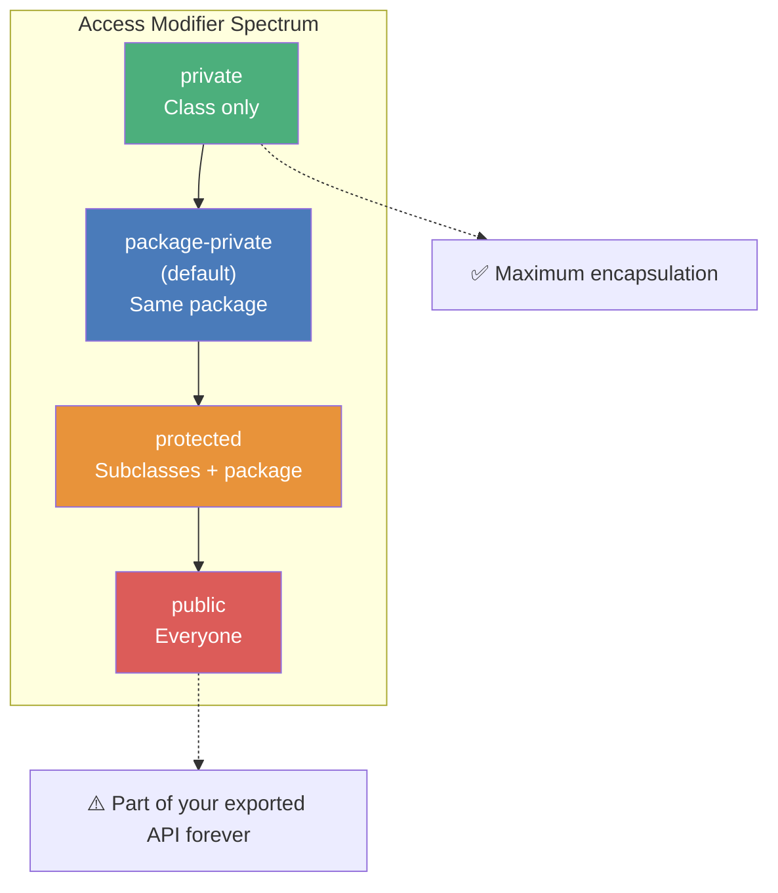
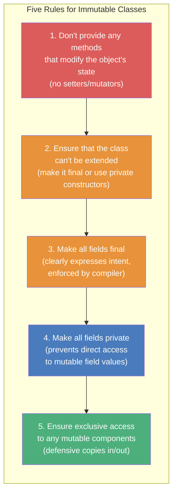
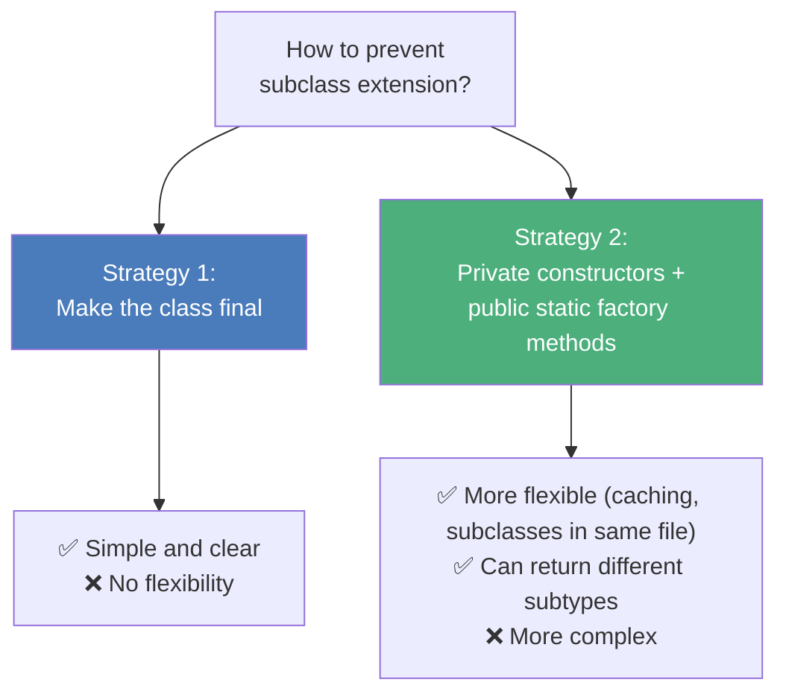
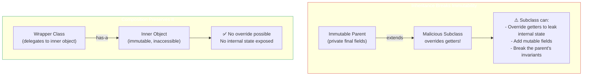
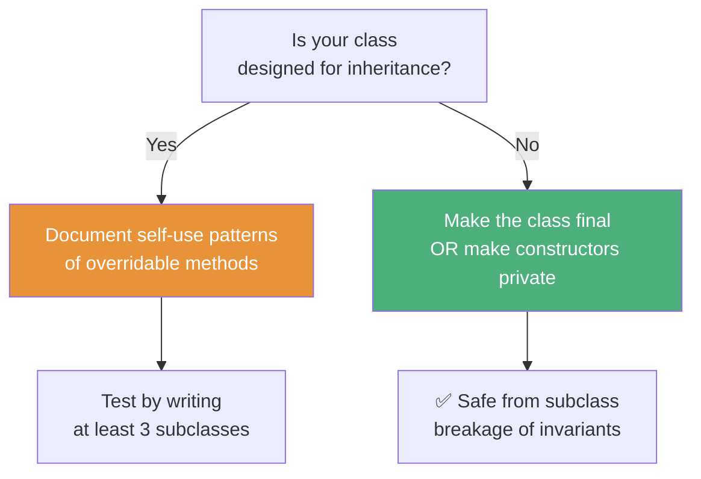

# :material-book-open-page-variant: Book Reading: Mutability, Immutability & the Final Keyword

> **Book:** Effective Java (3rd Edition) by Joshua Bloch
> **Relevant Items:** 15, 17, 18, 19 (Chapters 3–4)
> **Status:** :material-check-circle: Complete

---

## :material-target: Reading Goals

- [x] Understand why accessibility should always be minimized and how it protects immutability
- [x] Memorize the five rules for designing immutable classes
- [x] Know when immutability is impractical and how to limit mutability instead
- [x] Understand why composition is safer than inheritance for maintaining invariants
- [x] Learn the design-for-inheritance-or-prohibit-it principle and its connection to `final` classes

---

## :material-book-open-variant: Chapter 4: Classes and Interfaces

### Item 15: Minimize the Accessibility of Classes and Members

#### The Core Principle

The single most important factor that distinguishes a well-designed component from a poorly designed one is **the degree to which it hides its internal data and implementation details** from other components.

> _"Make each class or member as inaccessible as possible."_

#### Access Control as the First Defense



#### Key Rules from the Item

| Rule | Why It Matters for Immutability |
|------|-------------------------------|
| Instance fields should **never** be public | Public mutable fields mean anyone can break invariants |
| `public static final` fields should only contain **immutable** values | A `public static final` array is mutable — its contents can be changed |
| If a class has public mutable fields, it is **neither thread-safe nor immutable** | No way to enforce constraints on field values |
| Top-level classes should be package-private unless they are part of the API | Fewer exposed classes = fewer extensibility risks |

#### The Mutable Array Trap

```java
// ❌ DANGEROUS: Public array — anyone can modify elements
public static final Thing[] VALUES = { ... };

// ✅ Fix 1: Return unmodifiable list
private static final Thing[] PRIVATE_VALUES = { ... };
public static final List<Thing> VALUES =
    Collections.unmodifiableList(Arrays.asList(PRIVATE_VALUES));

// ✅ Fix 2: Return defensive copy
public static final Thing[] values() {
    return PRIVATE_VALUES.clone();
}
```

!!! info "Connection to Course Material"
    Tim demonstrated this exact pattern in Lecture 5 — making all fields `private final` and returning defensive copies from getters. The `PersonImmutable` class followed Bloch's rules precisely.

#### Quote to Remember

> _"If a class is accessible outside its package, provide accessor methods...if a class is package-private or is a private nested class, there is nothing inherently wrong with exposing its data fields."_

---

### Item 17: Minimize Mutability

#### The Central Rule

**Classes should be immutable unless there's a very good reason to make them mutable.** If a class cannot be made immutable, limit its mutability as much as possible.

#### The Five Rules (Bloch's Canonical Version)



#### Advantages of Immutable Objects

| Advantage | Explanation |
|-----------|-------------|
| **Simple** | An immutable object has exactly one state — the state in which it was created |
| **Inherently thread-safe** | No synchronization required; can be shared freely between threads |
| **Safe as map keys/set elements** | Hash code and equals never change after construction |
| **Failure atomicity** | If an operation fails, the object is still in a valid state (it hasn't changed) |
| **Great building blocks** | Can be used as components of other objects without defensive copying |

#### The Functional Approach Pattern

Bloch highlights **the functional approach**: methods that appear to modify an object instead return a **new object** with the desired state:

```java
// Functional approach — returns new object, original unchanged
public final class Complex {
    private final double re;
    private final double im;

    public Complex(double re, double im) {
        this.re = re;
        this.im = im;
    }

    // Returns a NEW Complex — doesn't modify 'this'
    public Complex plus(Complex c) {
        return new Complex(re + c.re, im + c.im);
    }

    public Complex minus(Complex c) {
        return new Complex(re - c.re, im - c.im);
    }
}
```

!!! tip "Method Naming Convention"
    Bloch notes that the methods are named `plus` and `minus` (prepositions) rather than `add` and `subtract` (verbs). This emphasizes that they do **not** mutate the object — they return a new one. This is the same pattern used by `BigInteger` and `BigDecimal`.

#### Preventing Extension: Two Strategies



```java
// Strategy 2: Private constructor + static factory
public class Complex {
    private final double re;
    private final double im;

    private Complex(double re, double im) {
        this.re = re;
        this.im = im;
    }

    // Static factory — controls creation
    public static Complex valueOf(double re, double im) {
        return new Complex(re, im);
    }
    // Can also cache common values, return subtypes, etc.
}
```

#### The Performance Argument: Mutable Companion Classes

For cases where immutability causes excessive object creation:

```java
// String (immutable) ←→ StringBuilder (mutable companion)
String result = new StringBuilder()
    .append("Hello")
    .append(" ")
    .append("World")
    .toString();  // Build mutably, then freeze into immutable
```

Bloch says: **provide a mutable companion class** when you've determined (through profiling, not guessing) that immutability causes a genuine performance problem.

#### Connection to Course Material

Tim's Lectures 5–7 implemented all five rules explicitly:

| Bloch's Rule | Tim's Implementation |
|:---|:---|
| No mutators | No setters on `PersonImmutable` |
| Class can't be extended | `final` class on `BankAccount` and `BankCustomer` |
| All fields final | `private final` on every field |
| All fields private | `private` access modifier everywhere |
| Exclusive access to mutables | Defensive copies in constructor and `getKids()` |

#### Quotes to Remember

> _"Classes should be immutable unless there's a very good reason to make them mutable."_

> _"If a class cannot be made immutable, limit its mutability as much as possible."_

> _"Declare every field private final unless there's a good reason to do otherwise."_

---

### Item 18: Favor Composition Over Inheritance

#### Core Message

**Inheritance violates encapsulation.** A subclass depends on the implementation details of its superclass, which can change across releases. Composition is safer because it doesn't expose internal details.

#### Why This Matters for Immutability



#### The Decorator / Wrapper Pattern

```java
// Forwarding class — delegates everything
public class ForwardingSet<E> implements Set<E> {
    private final Set<E> s;  // Composition, not inheritance

    public ForwardingSet(Set<E> s) { this.s = s; }

    public int size()             { return s.size(); }
    public boolean add(E e)       { return s.add(e); }
    public boolean contains(Object o) { return s.contains(o); }
    // ... delegate all methods ...
}

// Instrumented set — adds behavior via composition
public class InstrumentedSet<E> extends ForwardingSet<E> {
    private int addCount = 0;

    @Override
    public boolean add(E e) {
        addCount++;
        return super.add(e);
    }
}
```

#### Connection to Course Material

Tim's Lecture 6 showed exactly how a subclass (`PersonOfInterest`) can break an immutable parent by overriding getters — which is why `final` on the class (or at minimum on the methods) is necessary.

---

### Item 19: Design and Document for Inheritance, or Else Prohibit It

#### Core Message

A class that is designed for inheritance must document precisely how it uses overridable methods. **If you don't design and document for inheritance, make the class `final`.**



#### Rules for Classes Designed for Inheritance

1. **Document self-use of overridable methods** — if a public method calls an overridable method, document this internally
2. **Provide hooks via protected methods** — give subclasses controlled extension points
3. **Constructors must not invoke overridable methods** — the subclass constructor hasn't run yet, leading to initialization-order bugs
4. **Test by writing subclasses** — three is a good minimum; if you find yourself unable to write reasonable subclasses, the design needs work

#### The Constructor Danger

```java
public class Super {
    public Super() {
        overrideMe();  // ⚠️ Calls overridable method in constructor!
    }

    public void overrideMe() { }
}

public final class Sub extends Super {
    private final Instant instant;

    Sub() {
        instant = Instant.now();
    }

    @Override
    public void overrideMe() {
        System.out.println(instant);  // 💥 Prints null! Parent constructor runs first
    }
}

// new Sub() → Super() → overrideMe() → instant is null!
```

#### Connection to Course Material

This connects directly to Tim's Lecture 19 on final classes:
- Tim showed that making `GameConsole` `final` prevents extension
- Constructor access modifiers (`private`, `protected`) provide alternative extension control
- The combination with sealed classes (Lecture 20) provides **middle-ground** — some classes can extend, others cannot

---

## :material-thought-bubble: Reflections & Connections

### How the Book Complements the Course

| Course Content (Tim) | Book Insight (Bloch) | Synthesis |
|:-----|:-----|:-----|
| Five rules for immutable classes (Lectures 5–7) | Item 17's five canonical rules | Tim's practical implementation validates Bloch's theoretical rules — especially defensive copies and final classes |
| Private final fields + no setters | Item 15's minimize-accessibility principle | Access control is the foundation — immutability is built on top of proper encapsulation |
| `final` classes on `BankAccount`/`BankCustomer` | Item 19's "prohibit inheritance" principle | Making classes `final` is the simplest way to guarantee invariants are never broken by subclasses |
| `PersonOfInterest` subclass breaking immutability | Item 18's inheritance-violates-encapsulation | Composition (wrapper/decorator) avoids the problem entirely; `final` methods/classes solve it for inheritance |
| Sealed classes (JDK 17) | Item 19's controlled extension | Sealed types are the modern solution to "design for inheritance" — you explicitly choose who can extend |
| Unmodifiable collections (Lectures 9–11) | Item 17's exclusive access to mutables | Returning unmodifiable views/copies addresses Rule 5 of immutability |

### New Perspectives Gained

1. **Immutability is not just about `final` fields** — it's a four-layer defense: access modifiers, final keyword, defensive copies, and extension control.

2. **The static factory method alternative** to `final` classes is more flexible — you can cache common instances, return subtypes, and hide the concrete implementation.

3. **Constructors must never call overridable methods** — this is a critical rule that Tim hinted at in the constructor lectures but Bloch explains the precise reason (the subclass's fields haven't been initialized yet).

4. **Mutable companion classes** (`StringBuilder` for `String`) are the sanctioned escape hatch for performance-critical immutability scenarios.

---

## :material-format-list-checks: Summary Points

1. **Minimize accessibility first** (Item 15) — private fields are the foundation of immutability; public mutable fields destroy all guarantees
2. **Immutability should be the default** (Item 17) — follow the five rules; use the functional approach (return new objects), not mutators
3. **Composition over inheritance** (Item 18) — inheritance breaks encapsulation and can break immutability through subclass overrides
4. **Design for inheritance or prohibit it** (Item 19) — if you don't want subclasses breaking invariants, make the class `final`; sealed classes (JDK 17) offer a middle ground
5. **Defensive copies are Rule 5** (Item 17) — never return or accept direct references to mutable internal state
6. **Static factory methods** are a flexible alternative to `final` for preventing extension while enabling caching and subtype control

---

## :material-pin: Bookmarks & Page References

| Topic | Item | Key Insight |
|-------|:----:|-------------|
| Minimize accessibility | Item 15 | Make everything as private as possible; public static final arrays are dangerous |
| Five rules for immutable classes | Item 17 | No mutators, can't extend, final fields, private fields, exclusive access to mutables |
| Mutable companion pattern | Item 17 | `StringBuilder` for `String`; build mutably, freeze into immutable |
| Inheritance breaks encapsulation | Item 18 | Subclasses depend on superclass implementation details; composition is safer |
| Design for inheritance or prohibit | Item 19 | Document self-use of overridable methods; never call overridable methods in constructors |

---

## :material-code-tags: Practical Checklist

**Before designing a class:**

- [ ] Can this class be immutable? If yes → follow the five rules
- [ ] Are all fields `private final`?
- [ ] Are there any setter methods? If yes → do they need to exist?
- [ ] Does any getter return a reference to a mutable internal field? If yes → defensive copy
- [ ] Does the constructor accept mutable objects? If yes → defensive copy on input

**Before allowing inheritance:**

- [ ] Have you documented all self-use of overridable methods?
- [ ] Does the constructor call any overridable methods? If yes → **fix this immediately**
- [ ] Have you tested with at least 3 subclasses?
- [ ] If you can't justify inheritance → make the class `final` or use sealed types

**Before returning collections:**

- [ ] Are you returning the internal collection directly? If yes → return `List.copyOf()` or `Collections.unmodifiableList()`
- [ ] Are the elements themselves immutable? If not → return immutable representations (e.g., `String` instead of mutable DTO)

---

*Last Updated: 2026-04-23*
