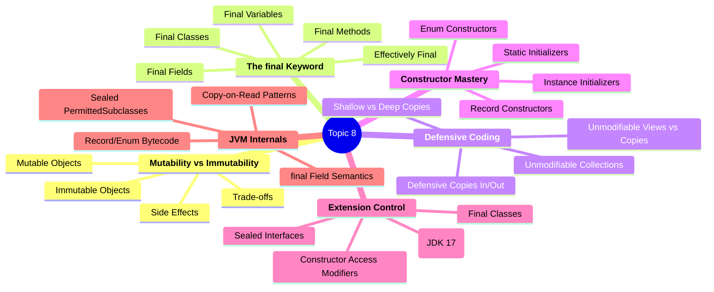
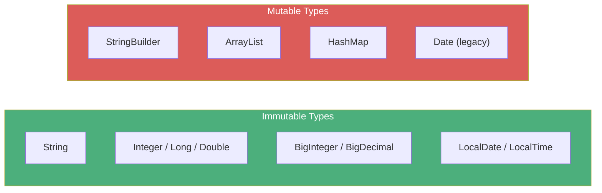
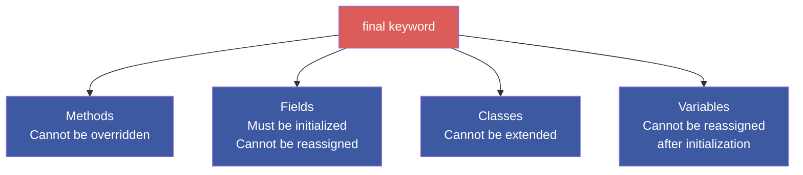
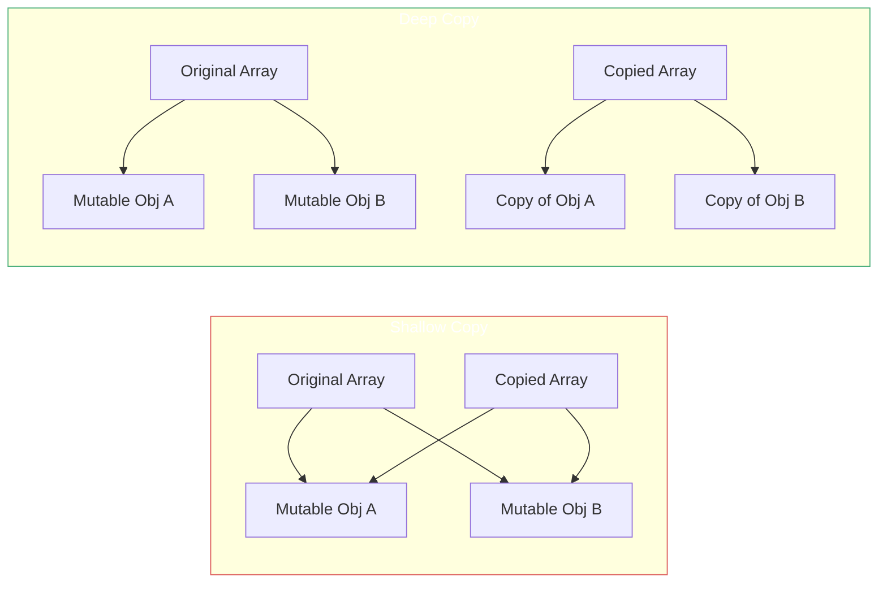
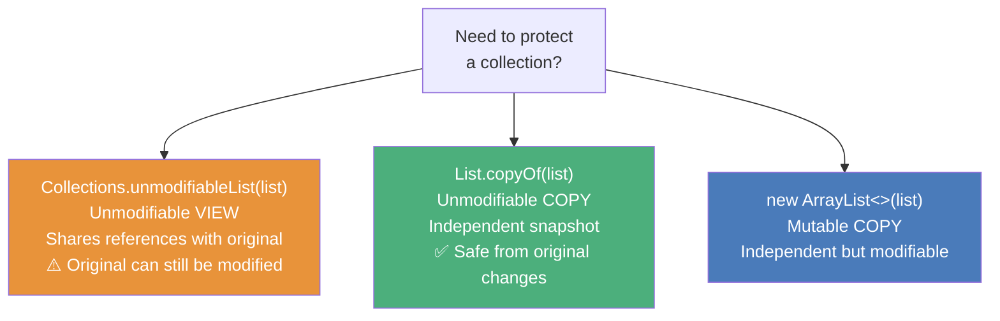
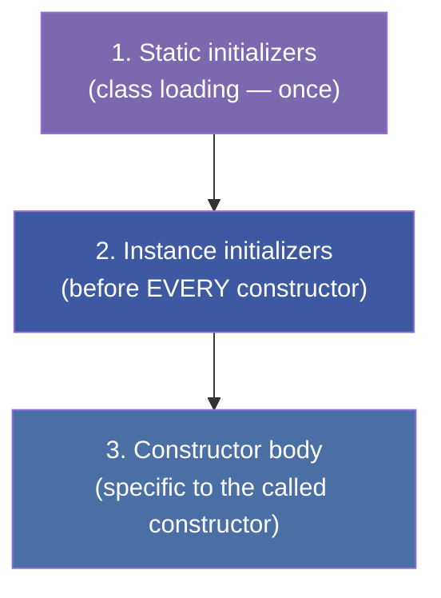
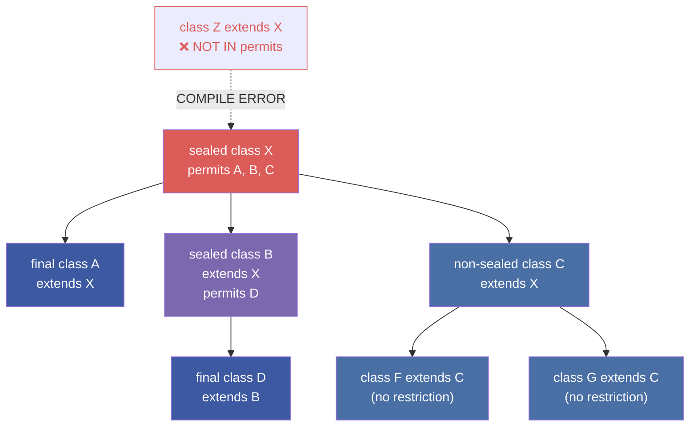
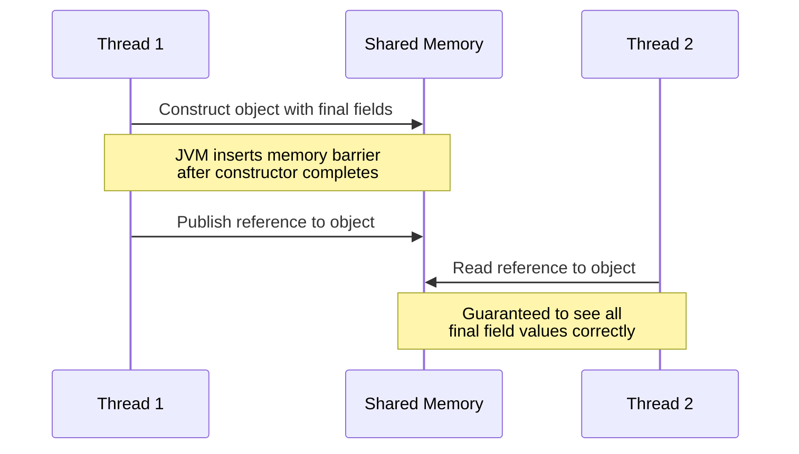
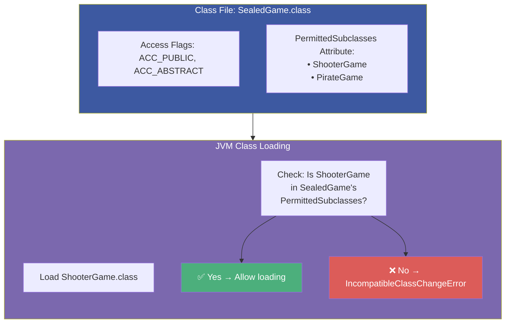
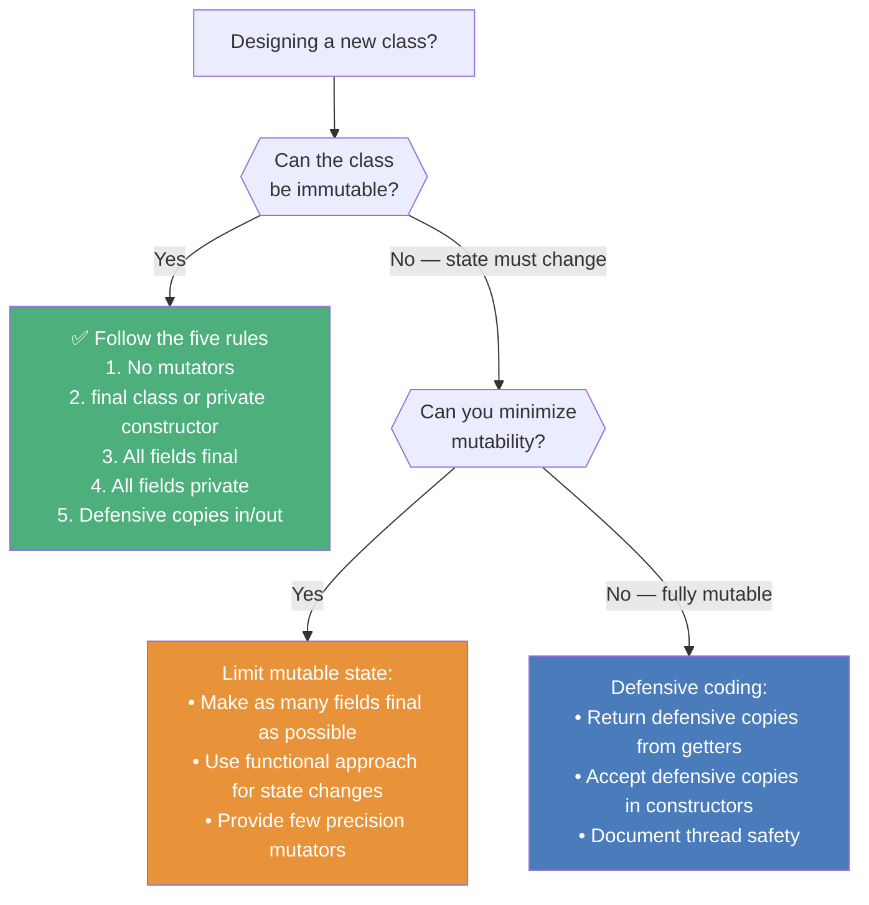

# :material-school: Summary: Mastering Mutability, Immutability & the Final Keyword

> **Combined Knowledge from:** Tim Buchalka's Course (Section 16) + Effective Java (Items 15, 17, 18, 19)
> **Mastery Level:** :material-star::material-star::material-star::material-star::material-star:

---

## :material-star-shooting: Topic Overview

This topic is about **controlling change** in Java programs. Mutability — the ability of objects to change state after creation — is the root cause of an enormous class of bugs: data races, inconsistent state, broken hash maps, security exploits through subclass manipulation, and subtle side effects across method boundaries. Java provides a layered toolkit to control change: the `final` keyword (methods, fields, classes, variables), defensive copying, unmodifiable collections, constructor mechanics (records, enums, initializers), extension control (`final`, sealed, constructor access), and immutable class design patterns. Understanding the full spectrum — from fully mutable through defensively coded to deeply immutable — is essential for writing correct, thread-safe, maintainable Java.



---

## :material-key: Core Concepts

### 1. Mutable vs Immutable Objects

**Definition:** A mutable object can change state after creation; an immutable object cannot. The distinction is foundational to understanding thread safety, API design, and defensive coding.



| Aspect | Mutable | Immutable |
|--------|:---:|:---:|
| **Thread safety** | ❌ Requires synchronization | ✅ Inherently thread-safe |
| **Defensive coding** | ❌ Must copy defensively | ✅ No copies needed |
| **Side effects** | ❌ Callers can alter state | ✅ No unexpected mutations |
| **Identity stability** | ❌ Hash/equals may change | ✅ Safe as Map keys / Set elements |
| **Performance** | ✅ Modify in-place | ❌ New object for each change |
| **Memory** | ✅ Single object reused | ❌ May create many copies |

---

### 2. The `final` Keyword

The `final` keyword is Java's primary tool for restricting modification. It applies in four contexts with distinct semantics:



**Critical distinction:** `final` on a reference means the **reference** cannot be reassigned, but the **object it points to** can still be mutated. `final List<String> list` prevents `list = newList` but allows `list.add("item")`.

| Concept | Meaning |
|---------|---------|
| **`final` variable** | Explicitly marked — compiler enforces no reassignment |
| **Effectively final** | Not marked `final`, but never reassigned — compiler treats as final; required for lambda captures |
| **Overriding** | Instance methods — runtime dispatch (actual type determines method) |
| **Hiding** | Static methods — compile-time binding (declared type determines method) |

---

### 3. The Five Rules of Immutable Class Design

From Bloch's Item 17, validated by Tim's Lectures 5–7:

| # | Rule | Implementation |
|:-:|------|---------------|
| 1 | No mutator methods (no setters) | Don't provide any method that modifies state |
| 2 | Class can't be extended | Use `final class` or private constructors + static factories |
| 3 | Make all fields `final` | Compiler enforces single-assignment semantics |
| 4 | Make all fields `private` | Prevents direct access to mutable internals |
| 5 | Exclusive access to mutable components | Defensive copies in constructors AND getters |

```java
// All five rules applied:
public final class PersonImmutable {                    // Rule 2: final class
    private final String name;                          // Rules 3 & 4: private final
    private final PersonImmutable[] kids;               // Rules 3 & 4

    public PersonImmutable(String name, PersonImmutable[] kids) {
        this.name = name;
        this.kids = kids == null ? null :
            Arrays.copyOf(kids, kids.length);            // Rule 5: defensive copy in
    }

    public String getName() { return name; }             // Rule 1: no setters
    public PersonImmutable[] getKids() {
        return kids == null ? null :
            Arrays.copyOf(kids, kids.length);            // Rule 5: defensive copy out
    }
}
```

---

### 4. Shallow vs Deep Copies

| Type | What Gets Copied | When Sufficient |
|------|-----------------|----------------|
| **Shallow copy** | Top-level container only (references are shared) | Elements are immutable (e.g., `String`, `Integer`) |
| **Deep copy** | Container AND all elements (recursively) | Elements are mutable objects |



**Deep copy strategies:**

- **Copy constructor:** `new Person(original.getName(), original.getAge())`
- **`Arrays.setAll`:** `Arrays.setAll(copy, i -> new Person(original[i]))`
- **Manual loop:** Iterate and construct each element individually

---

### 5. Unmodifiable Collections



!!! danger "Unmodifiable ≠ Immutable"
    If the elements themselves are mutable, an "unmodifiable" collection is **not truly immutable**. The collection prevents `add`/`remove`, but doesn't prevent `element.setSomething()`.

---

### 6. Constructor Mechanics

#### Execution Order



#### Record Constructors

| Type | Purpose | Can Assign Fields? |
|------|---------|:---:|
| **Canonical** (implicit/explicit) | Takes all components, assigns fields | ✅ (implicit does it) |
| **Compact** | Validation/transformation before implicit assignment | ❌ (runs before assignment) |
| **Custom** (overloaded) | Alternative signatures | Must chain to canonical |

#### Enum Constructors

- Always **implicitly `private`** — you cannot make them `public`/`protected`
- Called **automatically** for each constant during class loading
- Can accept parameters to associate data with constants

---

### 7. Extension Control Spectrum

```
┌────────────────────────────────────────────────────┐
│       CLASS EXTENSION CONTROL SPECTRUM             │
│                                                    │
│  ← Most Restrictive         Most Open →            │
│                                                    │
│  final class    sealed class    non-sealed  default│
│  ┌──────────┐  ┌────────────┐  ┌─────────┐ ┌─────┐ │
│  │ No        │ │ Only       │  │ Open    │ │ Any │ │
│  │ extension │ │ permitted  │  │ after   │ │ can │ │
│  │ at all    │ │ subclasses │  │ sealed  │ │ ext │ │
│  └──────────┘  └────────────┘  └─────────┘ └─────┘ │
└────────────────────────────────────────────────────┘
```

| Modifier | Effect | Can Instantiate? | Can Extend? |
|----------|--------|:---:|:---:|
| `final` | Complete — no subclasses | ✅ | ❌ |
| `sealed permits A, B` | Only listed classes may extend | ✅ | Permitted only |
| `non-sealed` | Reopens a sealed branch | ✅ | ✅ |
| `abstract` | Incomplete — must be extended | ❌ | ✅ |
| `final abstract` | **ILLEGAL** — contradictory | — | — |

#### Sealed Classes (JDK 17+)



---

## :material-head-cog: Key Internals to Understand

### 1. `final` Field Semantics in the JVM

At the JVM level, `final` fields have special **memory visibility guarantees** that go beyond just preventing reassignment.

#### The Java Memory Model Guarantee

When an object with `final` fields is properly constructed (i.e., `this` does not escape the constructor), the JVM guarantees that **any thread** that obtains a reference to the object will see the correctly initialized values of all `final` fields — even without synchronization.



This is specified in [JLS §17.5 — final Field Semantics](https://docs.oracle.com/javase/specs/jls/se17/html/jls-17.html#jls-17.5) and is one of the primary reasons `final` fields are important for thread safety — they enable **safe publication** without explicit synchronization.

#### The `ACC_FINAL` Flag

In bytecode, `final` fields are marked with the `ACC_FINAL` access flag (`0x0010`). The JVM verifier checks this flag at class loading time and will throw a `java.lang.VerifyError` if any bytecode attempts to modify a `final` field after construction.

```
// Bytecode output from javap -v:
private final java.lang.String name;
    descriptor: Ljava/lang/String;
    flags: ACC_PRIVATE, ACC_FINAL
```

The JIT compiler also uses this flag to apply **constant folding** — if a `final` field is initialized with a compile-time constant, the JIT can inline the value directly, eliminating the field access entirely.

---

### 2. Record and Enum Bytecode — Implicit `final` Nature

Records and enums are **implicitly `final`** at the bytecode level. Using `javap -p`, you can verify this:

```
// javap -p PersonRecord.class
public final class PersonRecord extends java.lang.Record {
    private final java.lang.String name;
    private final int age;

    // Implicit canonical constructor
    public PersonRecord(java.lang.String, int);

    // Implicit accessors
    public java.lang.String name();
    public int age();

    // Implicit: equals(), hashCode(), toString()
}
```

```
// javap -p Direction.class
public final class Direction extends java.lang.Enum<Direction> {
    public static final Direction NORTH;
    public static final Direction SOUTH;
    public static final Direction EAST;
    public static final Direction WEST;

    private static final Direction[] $VALUES;

    private Direction();  // Always private!
}
```

**Key observation:** Both records and enums extend their respective supertypes (`java.lang.Record` and `java.lang.Enum`). The `final` modifier on the generated class means no further extension is possible — the hierarchy ends at the concrete type.

#### Compact Constructor Transformation

When you write a compact constructor in a record:

```java
public record Person(String name, int age) {
    public Person {  // Compact constructor
        if (age < 0) throw new IllegalArgumentException("Age cannot be negative");
        name = name.trim();  // Transforms the parameter, NOT the field
    }
}
```

The compiler transforms this into:

```java
// What the compiler actually generates:
public Person(String name, int age) {
    // Compact constructor body runs FIRST:
    if (age < 0) throw new IllegalArgumentException("Age cannot be negative");
    name = name.trim();  // Modifies the PARAMETER

    // Then implicit field assignment:
    this.name = name;    // Uses the (potentially modified) parameter
    this.age = age;
}
```

This is why you **cannot** assign to `this.name` in a compact constructor — it would conflict with the implicit assignment that happens afterwards.

---

### 3. Sealed Classes: The `PermittedSubclasses` Attribute

Unlike `final` (which uses the `ACC_FINAL` flag), sealed classes use a **class file attribute** called `PermittedSubclasses`, introduced in the class file format for JDK 17.



#### How Enforcement Works

1. **At compile time:** `javac` checks that all subclasses of a sealed class are listed in the `permits` clause and that each subclass declares `final`, `sealed`, or `non-sealed`
2. **At runtime (JVM):** When loading a class that `extends` a sealed parent, the JVM reads the parent's `PermittedSubclasses` attribute and verifies the child is listed. If not → `IncompatibleClassChangeError`
3. **Via reflection:** `Class.isSealed()` and `Class.getPermittedSubclasses()` provide runtime introspection

#### Why JVM-Level Enforcement Matters

If sealing were enforced only by the compiler, separately compiled code could bypass it. JVM-level enforcement ensures that **even bytecode generated dynamically** (e.g., by frameworks, bytecode manipulation libraries, or malicious code) cannot violate the sealed hierarchy.

#### Exhaustiveness in Pattern Matching

Sealed types enable **exhaustive `switch` expressions** without a `default` case:

```java
sealed interface Shape permits Circle, Rectangle, Triangle {}

// The compiler KNOWS all possible subtypes
String describe(Shape shape) {
    return switch (shape) {
        case Circle c    -> "Circle with radius " + c.radius();
        case Rectangle r -> "Rectangle " + r.width() + "x" + r.height();
        case Triangle t  -> "Triangle with base " + t.base();
        // No default needed — compiler verifies exhaustiveness
    };
}
```

---

### 4. Defensive Copy Patterns and JVM Optimization

#### Copy-on-Read vs Copy-on-Write

| Pattern | When to Copy | Use Case |
|---------|:---:|---------|
| **Copy-on-read** | When a getter is called | Immutable objects returning mutable internals |
| **Copy-on-write** | When mutation is attempted | Copy-on-write collections (e.g., `CopyOnWriteArrayList`) |
| **Copy-on-construct** | When the constructor receives mutable args | Defensive copies in constructors |

#### JVM Optimizations for Defensive Copies

The JIT compiler can apply **escape analysis** to defensive copies. If the JIT determines that the copy doesn't escape the calling method (i.e., it's used locally and then discarded), it can:

1. **Eliminate the copy entirely** (scalar replacement)
2. **Allocate the copy on the stack** instead of the heap
3. **Inline the copy operation** to remove method call overhead

This means defensive copies are often **cheaper than you think** in practice — the JVM optimizes away unnecessary allocations in hot paths.

---

### 5. Unmodifiable Collections: How They Work Internally

#### `Collections.unmodifiableList()` — The View Approach

This wraps the original list in a decorator that **delegates all read operations** to the original but **throws `UnsupportedOperationException`** for all mutation operations:

```java
// Simplified internal implementation:
static class UnmodifiableList<E> implements List<E> {
    final List<? extends E> list;

    UnmodifiableList(List<? extends E> list) {
        this.list = list;  // Stores the ORIGINAL reference — NOT a copy
    }

    public E get(int index) { return list.get(index); }   // ✅ Delegate
    public int size() { return list.size(); }                // ✅ Delegate
    public E set(int i, E e) { throw new UnsupportedOperationException(); }  // ❌ Block
    public boolean add(E e) { throw new UnsupportedOperationException(); }   // ❌ Block
}
```

**Key:** Changes to the original list **are visible** through the unmodifiable view. It's a live wrapper, not a snapshot.

#### `List.copyOf()` — The Snapshot Approach

This creates a **new, independent, unmodifiable collection**:

1. If the input is already an unmodifiable list of the same type → returns it directly (no copy)
2. Otherwise → copies all elements into a new internal array and wraps it

This means changes to the original collection are **not visible** through the copy.

---

## :material-lightning-bolt: Design Patterns & Best Practices

### The Immutability Decision Tree



### Effective Java Best Practices Applied

| Practice | Item | Why It Matters |
|----------|:----:|---------------|
| Minimize accessibility | 15 | Private fields are the foundation of immutability |
| Follow five immutability rules | 17 | The canonical checklist for truly immutable classes |
| Use functional approach | 17 | Return new objects instead of mutating; use verb naming (`plus`, not `add`) |
| Static factory over `final` | 17 | More flexible: caching, subtype control, implementation hiding |
| Composition over inheritance | 18 | Inheritance breaks encapsulation; composition preserves invariants |
| Design for inheritance or prohibit | 19 | If not designing for extension → `final` class or sealed types |
| Never call overridable methods in constructors | 19 | Subclass fields not yet initialized → null pointer risk |

---

## :material-alert: Common Pitfalls

### 1. `final` ≠ Immutable for References

```java
final List<String> list = new ArrayList<>();
list.add("Hello");  // ✅ The LIST is mutated — only the REFERENCE is final
// list = new ArrayList<>();  // ❌ Reassignment blocked
```

### 2. Shallow Copies of Mutable Elements

```java
Person[] original = { new Person("Alice") };
Person[] copy = Arrays.copyOf(original, 1);  // Shallow!
copy[0].setName("Bob");  // ⚠️ Also changes original[0]!
```

### 3. Unmodifiable View Reflects Changes

```java
List<String> original = new ArrayList<>(List.of("a", "b"));
List<String> view = Collections.unmodifiableList(original);
original.add("c");
System.out.println(view.size());  // 3! View is live
```

### 4. Mutable Objects as Map Keys

```java
StringBuilder key = new StringBuilder("KEY");
Map<StringBuilder, String> map = new HashMap<>();
map.put(key, "value");
key.append("_MODIFIED");
map.get(key);  // null! Hash changed, entry lost forever
```

### 5. Compact Constructors Can't Assign Fields

```java
public record Person(String name) {
    public Person {
        this.name = name.trim();  // ❌ COMPILE ERROR
        name = name.trim();       // ✅ Modifies the parameter, not the field
    }
}
```

### 6. Enum Constructors Can't Be Public

```java
public enum Color {
    RED;
    public Color() { }  // ❌ COMPILE ERROR — always implicitly private
}
```

### 7. `final` + `abstract` = Illegal

```java
public final abstract class Game { }  // ❌ Contradictory modifiers
```

---

## :material-lightbulb-on: Best Practices Checklist

**Immutable Class Design:**

- [x] All fields are `private final`
- [x] No setter methods (no mutators)
- [x] Class is `final` (or uses private constructors + static factories)
- [x] Constructor defensively copies mutable arguments
- [x] Getters defensively copy mutable fields before returning
- [x] Collections returned as `List.copyOf()` or `Collections.unmodifiableList()`

**The `final` Keyword:**

- [x] Use `final` on methods that define "non-negotiable" behavior (Template Method pattern)
- [x] Use `final` on fields to express single-assignment intent
- [x] Use `final` on classes when no extension is needed
- [x] Understand that `final` on a reference ≠ immutability of the referenced object

**Extension Control:**

- [x] Default to `final` classes unless extension is explicitly designed for
- [x] Use sealed classes when you want to permit specific subclasses only
- [x] Choose between `final`/`sealed`/`non-sealed` for each branch of a sealed hierarchy
- [x] Never call overridable methods in constructors

**Constructor Best Practices:**

- [x] Understand execution order: static initializers → instance initializers → constructor
- [x] Use compact constructors in records for validation only
- [x] Remember enum constructors are always private
- [x] Use `javap -p` to verify implicit code generation

---

## :material-bookmark: Learning Resources

### Core Documentation

- [JLS §17.5 — final Field Semantics](https://docs.oracle.com/javase/specs/jls/se17/html/jls-17.html#jls-17.5) — Memory model guarantees for final fields
- [JLS §8.10 — Record Classes](https://docs.oracle.com/javase/specs/jls/se17/html/jls-8.html#jls-8.10) — Canonical constructor, compact constructor rules
- [JLS §8.9 — Enum Classes](https://docs.oracle.com/javase/specs/jls/se17/html/jls-8.html#jls-8.9) — Enum constructor semantics
- [JLS §8.1.1.2 — sealed Classes](https://docs.oracle.com/javase/specs/jls/se17/html/jls-8.html#jls-8.1.1.2) — Sealed class specification

### JEPs (Java Enhancement Proposals)

- [JEP 395 — Records (Java 16)](https://openjdk.org/jeps/395) — Final feature; transparent carriers for immutable data
- [JEP 409 — Sealed Classes (Java 17)](https://openjdk.org/jeps/409) — Final feature; restricting which classes can extend a type

### Tutorials & Articles

- [Oracle — Immutable Objects Tutorial](https://docs.oracle.com/javase/tutorial/essential/concurrency/immutable.html) — Official strategy for defining immutable objects
- [Baeldung — Immutable Objects in Java](https://www.baeldung.com/java-immutable-object) — Practical guide with code examples
- [Baeldung — Sealed Classes in Java](https://www.baeldung.com/java-sealed-classes-interfaces) — Comprehensive sealed classes tutorial
- [Baeldung — Java Records](https://www.baeldung.com/java-record-keyword) — Records as immutable data carriers
- [Baeldung — Deep Copy in Java](https://www.baeldung.com/java-deep-copy) — Deep copy techniques

### JVM Internals

- [Oracle — JVMS §4.7.31 — The PermittedSubclasses Attribute](https://docs.oracle.com/javase/specs/jvms/se17/html/jvms-4.html#jvms-4.7.31) — How sealed classes are represented in bytecode
- [Shipilev — Safe Publication and Safe Initialization in Java](https://shipilev.net/blog/2014/safe-public-construction/) ⭐ Deep dive into final field memory guarantees
- [Oracle — Understanding Memory Barriers and Final Fields](https://docs.oracle.com/javase/specs/jls/se17/html/jls-17.html#jls-17.5.1) — Happens-before for final fields

### Effective Java

- [Effective Java 3rd Edition](https://www.oreilly.com/library/view/effective-java-3rd/9780134686097/) — Items 15, 17, 18, 19 (Chapter 4: Classes and Interfaces)
- [GitHub — Effective Java Summary](https://github.com/HugoMatilla/Effective-JAVA-Summary) — Community-maintained summary

---

## :material-link-variant: Related Topics

- [OOP & Class Design](../topic-2-oop-class-design/summary.md) _(inheritance, polymorphism — the foundation of extension control)_
- [Abstraction, Interfaces & Generics](../topic-4-abstraction-generics/summary.md) _(abstract classes, interfaces — what sealed types control)_
- [Lambda Expressions & Functional Programming](../topic-5-lambdas-method-references/summary.md) _(effectively final variables are required for lambda captures)_
- [Collections Framework](../topic-6-collections-framework/summary.md) _(unmodifiable collections, defensive copies in collection APIs)_

---

## :material-bookshelf: References

- **Course:** Tim Buchalka — Java Programming Masterclass (Section 16, Lectures 1–22)
- **Book:** Effective Java (3rd Edition) — Joshua Bloch (Items 15, 17, 18, 19)
- **JEP:** [JEP 395 — Records](https://openjdk.org/jeps/395) | [JEP 409 — Sealed Classes](https://openjdk.org/jeps/409)
- **Spec:** [JLS §17.5 — final Field Semantics](https://docs.oracle.com/javase/specs/jls/se17/html/jls-17.html#jls-17.5) | [JLS §8.10 — Records](https://docs.oracle.com/javase/specs/jls/se17/html/jls-8.html#jls-8.10) | [JLS §8.1.1.2 — Sealed](https://docs.oracle.com/javase/specs/jls/se17/html/jls-8.html#jls-8.1.1.2)
- **API:** [java.util.Collections](https://docs.oracle.com/en/java/javase/17/docs/api/java.base/java/util/Collections.html)

---

*Completed: 2026-04-23 | Confidence: 9/10*
