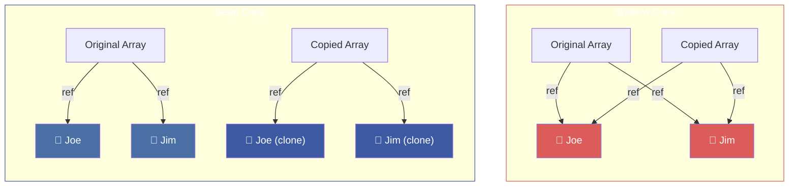
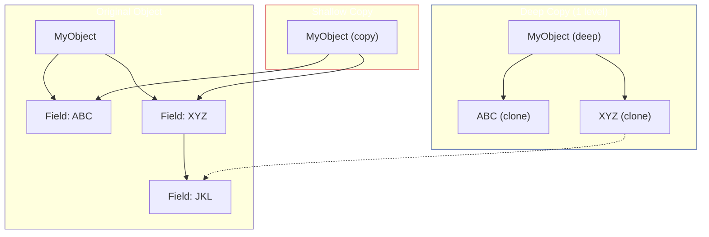
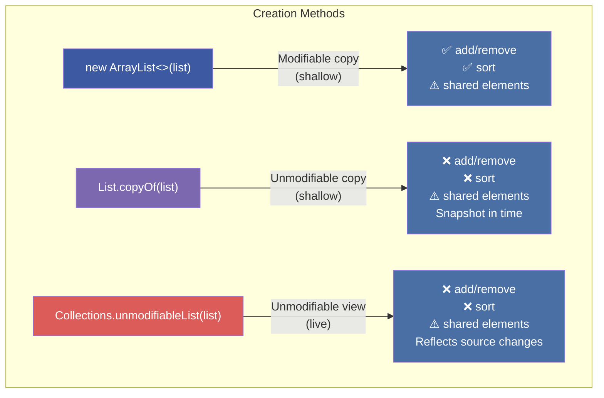
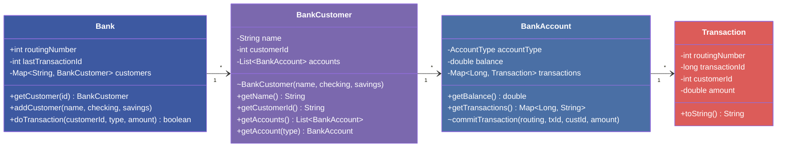
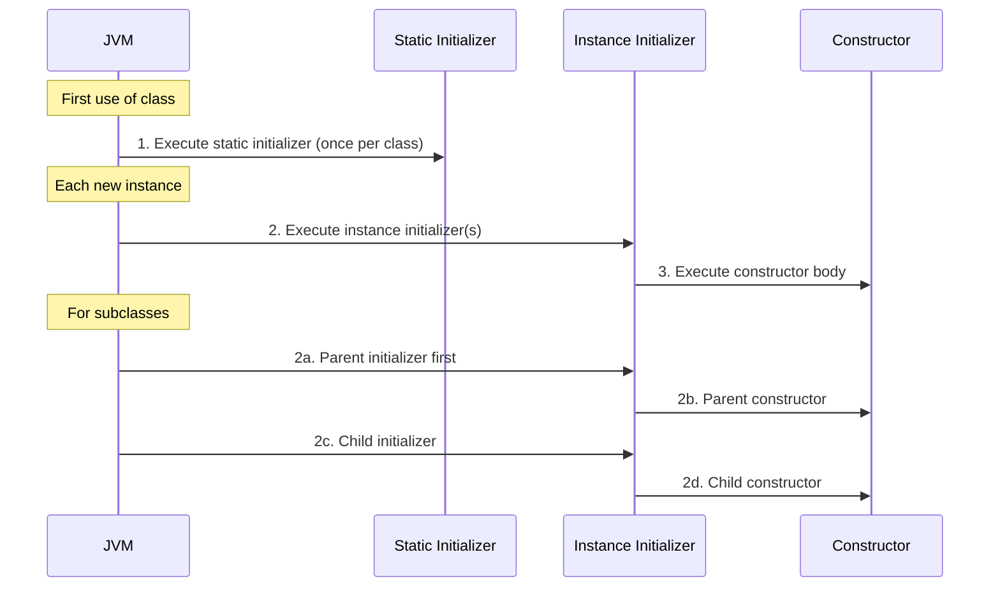
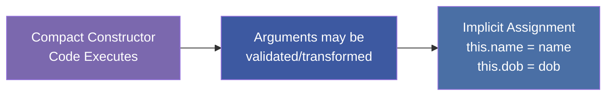
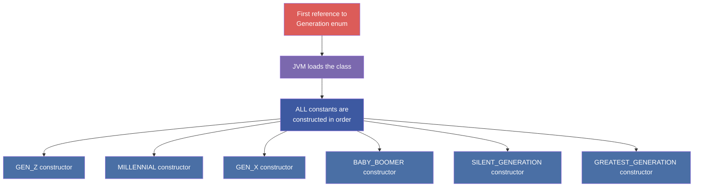

# :material-pencil: Topic Note Part 2: Deep Copies, Unmodifiable Collections & Constructor Mastery

> **Course:** Java Programming Masterclass — Tim Buchalka (Udemy)
> **Section:** 16 — Mastering Mutability, Immutability and Final Keyword in Java OOP
> **Lectures:** 8–14
> **Status:** :material-check-circle: Complete

---

## :material-target: Learning Objectives

By the end of this part, you should be able to:

- [x] Distinguish shallow copies from deep copies and know when each is needed
- [x] Implement deep copies manually, via copy constructors, and with `Arrays.setAll`
- [x] Understand why `clone()` on arrays only produces shallow copies
- [x] Use `List.copyOf()`, `Map.copyOf()`, `Set.copyOf()` for unmodifiable copies
- [x] Use `Collections.unmodifiableList()` for unmodifiable **views** (not copies)
- [x] Recognize that unmodifiable ≠ immutable when elements are mutable
- [x] Secure a banking application using unmodifiable collections + immutable return types
- [x] Initialize final fields using constructors, instance initializers, and static initializers
- [x] Master record constructors: canonical, compact, and custom
- [x] Understand enum constructors: always private, all constants constructed at class initialization

---

## :material-content-copy: 1. Shallow vs. Deep Copies

### The Core Difference

When you copy an array or collection, Java provides two fundamentally different depths of copying:



| Aspect | Shallow Copy | Deep Copy |
|--------|-------------|-----------|
| **Structure** | New array/collection created | New array/collection created |
| **Elements** | Same references (shared objects) | New instances (independent objects) |
| **Side effects** | Modifying an element affects both | Modifications are isolated |
| **Performance** | Fast — no element cloning | Slower — must clone every element |
| **When safe** | Elements are immutable (e.g., `String`, records w/o mutable fields) | Elements are mutable |

!!! warning "Key Insight"
    Most Java copy methods (`Arrays.copyOf()`, `List.copyOf()`, passing to `new ArrayList<>(list)`, `clone()`) produce **shallow copies**. You almost always need to implement deep copies manually.

---

### Shallow Copy Demonstration

```java
record Person(String name, String dob, Person[] kids) {
    @Override
    public String toString() {
        return "Person{name='%s', kids=%s}".formatted(name, Arrays.toString(kids));
    }
}

// Create persons with kids
Person joe = new Person("Joe", "01/01/1961", null);
Person jim = new Person("Jim", "02/02/1962", null);
Person jack = new Person("Jack", "03/03/1963", new Person[]{joe, jim});
Person jill = new Person("Jill", "05/05/1965", new Person[]{joe, jim});

Person[] persons = {joe, jim, jack, jill};
Person[] personsCopy = Arrays.copyOf(persons, persons.length); // SHALLOW!

// Modify a kid in the copy — affects the original too!
personsCopy[3].kids()[1] = new Person("Jane", "04/04/1964", null);

// Original Jill's kids are ALSO changed — both arrays share the same objects
System.out.println(persons[3]);  // Jill's 2nd kid is now Jane!
```

!!! danger "The Problem"
    With a shallow copy, changing Jill's kids array through the copy **also changes the original**. Both array entries point to the **same** `Person` object, and that object's `kids` array is **shared**.

---

### Deep Copy: Manual Approach

```java
Person[] personsCopy = new Person[persons.length];
for (int i = 0; i < persons.length; i++) {
    Person current = persons[i];
    Person[] kids = current.kids();
    // Deep copy: clone the kids array so it's independent
    kids = (kids == null) ? null : Arrays.copyOf(kids, kids.length);
    personsCopy[i] = new Person(current.name(), current.dob(), kids);
}
```

### Deep Copy: Copy Constructor

A more elegant approach is to add a **copy constructor** to your type:

```java
record Person(String name, String dob, Person[] kids) {
    // Copy constructor — delegates to canonical constructor
    Person(Person p) {
        this(p.name(), p.dob(),
             p.kids() == null ? null : Arrays.copyOf(p.kids(), p.kids().length));
    }
}

// Now deep copying is clean:
Person[] personsCopy = new Person[persons.length];
Arrays.setAll(personsCopy, i -> new Person(persons[i]));
```

### Deep Copy: Using `Arrays.setAll`

```java
Person[] personsCopy = new Person[persons.length];
Arrays.setAll(personsCopy, i -> new Person(persons[i]));
```

!!! tip "`Arrays.setAll` Explained"
    `Arrays.setAll(array, generator)` populates each element by calling the generator function with the index. Combined with a copy constructor, this is the cleanest way to deep-copy an array.

### What About `clone()`?

```java
Person[] cloned = persons.clone();  // SHALLOW copy only!
```

The `clone()` method on arrays **always** performs a shallow copy. Each index in the new array references the **same** object as the original.

---

### The Nesting Problem

Deep copies can be **recursive**. Consider a composite class:



!!! warning "Multi-Level Nesting"
    If `XYZ` itself contains mutable fields (like `JKL`), you must **recursively** deep-copy. A "one-level" deep copy may still share nested objects. Always ask: **"How deep does mutable nesting go?"**

---

## :material-shield-lock: 2. Unmodifiable Collections

### Three Kinds of "Read-Only" Collections

Java provides several ways to create collections that cannot be structurally modified:



| Method | Returns | Structural Mods | Reflects Original Changes |
|--------|---------|:-:|:-:|
| `new ArrayList<>(list)` | Modifiable shallow copy | ✅ | ❌ |
| `List.copyOf(list)` | Unmodifiable copy | ❌ (throws `UnsupportedOperationException`) | ❌ |
| `Collections.unmodifiableList(list)` | Unmodifiable **view** | ❌ (throws `UnsupportedOperationException`) | ✅ |

---

### Demonstration: Copy vs. View

```java
List<Student> students = new ArrayList<>(List.of(bob, bill));

// === Method 1: Modifiable shallow copy ===
List<Student> firstCopy = new ArrayList<>(students);
firstCopy.add(new Student("Bonnie", new StringBuilder()));  // ✅ Works

// === Method 2: Unmodifiable COPY (snapshot) ===
List<Student> secondCopy = List.copyOf(students);
// secondCopy.add(bonnie);  // ❌ UnsupportedOperationException
// secondCopy.sort(...);    // ❌ UnsupportedOperationException

// === Method 3: Unmodifiable VIEW (live) ===
List<Student> thirdCopy = Collections.unmodifiableList(students);
// thirdCopy.add(bonnie);   // ❌ UnsupportedOperationException

// But adding to the ORIGINAL affects the view:
students.add(new Student("Bonnie", new StringBuilder()));
System.out.println(thirdCopy.size());  // 3! Bonnie is visible in the view
System.out.println(secondCopy.size()); // 2! Bonnie is NOT in the copy
```

---

### Unmodifiable ≠ Immutable

!!! danger "Critical Distinction"
    An **unmodifiable** collection prevents structural changes (add, remove, sort, clear). But if the **elements themselves** are mutable, their internal state can still be changed!

```java
class Student {
    private final String name;
    private final StringBuilder studentNotes;  // MUTABLE!
    // constructor, getters...
}

List<Student> unmodifiable = List.copyOf(students);
// Can't add/remove students, BUT:
unmodifiable.get(0).getStudentNotes().append("Modified!");  // ✅ This works!
```

**The fix:** Make your elements **immutable**, or return only immutable representations (e.g., `String` instead of `StringBuilder`).

---

### Available Unmodifiable Collection Methods

| Interface | Unmodifiable **Copy** | Unmodifiable **View** |
|-----------|----------------------|----------------------|
| `List` | `List.copyOf(collection)` | `Collections.unmodifiableList(list)` |
| `Set` | `Set.copyOf(collection)` | `Collections.unmodifiableSet(set)` |
| `Map` | `Map.copyOf(map)` | `Collections.unmodifiableMap(map)` |

---

## :material-bank: 3. Banking Application: Secure Transaction Handling

### Architecture Overview



---

### Key Design Decisions

#### 1. Package-Private Constructor on `BankCustomer`

```java
// No access modifier = package-private
BankCustomer(String name, double checkingDeposit, double savingsDeposit) {
    // Only classes in dev.bank package can create customers
}
```

This prevents external code from creating customers directly — they must go through `Bank.addCustomer()`.

#### 2. Returning Unmodifiable Collections

```java
// In BankAccount
public Map<Long, Transaction> getTransactions() {
    return Map.copyOf(transactions);  // Unmodifiable copy
}

// In BankCustomer
public List<BankAccount> getAccounts() {
    return List.copyOf(accounts);  // Unmodifiable copy
}
```

#### 3. The Hidden Vulnerability

Even with `Map.copyOf()`, if `Transaction` is a **mutable DTO** (with setters), clients can modify transaction data:

```java
var transactions = checking.getTransactions();
// Can't add/remove from the map, BUT:
for (var tx : transactions.values()) {
    tx.setCustomerId(2);           // ⚠️ Mutated!
    tx.setAmount(10_000.00);       // ⚠️ Mutated!
}
// These changes affect the ORIGINAL Transaction objects!
```

#### 4. The Fix: Return Immutable Representations

Instead of returning `Map<Long, Transaction>` (mutable DTOs), return `Map<Long, String>`:

```java
public Map<Long, String> getTransactions() {
    Map<Long, String> txMap = new LinkedHashMap<>();
    for (var entry : transactions.entrySet()) {
        txMap.put(entry.getKey(), entry.getValue().toString());
    }
    return txMap;  // Strings are immutable — no tampering possible
}
```

!!! success "Best Practice"
    **Combine immutable elements with unmodifiable collections** for maximum data protection. Returning `String` representations instead of mutable DTOs is often more secure than deep-copying every object.

---

### Transaction Validation Flow

```java
// In Bank.doTransaction()
public boolean doTransaction(String customerId, AccountType type, double amount) {
    BankCustomer customer = customers.get(customerId);
    if (customer != null) {
        BankAccount account = customer.getAccount(type);
        if (account != null) {
            if ((account.getBalance() + amount) < 0) {
                System.out.println("Insufficient funds");
            } else {
                account.commitTransaction(routingNumber,
                    ++lastTransactionId, /* ... */ amount);
                return true;
            }
        }
    } else {
        System.out.println("Invalid customer id");
    }
    return false;
}
```

---

## :material-hammer-wrench: 4. Java Constructors: Advanced Initialization

### The Implicit No-Args Constructor

When you write a class with **no explicit constructor**, Java creates an invisible no-args constructor:

```java
public class Parent {
    private String name;
    private String dob;
    // Java creates: public Parent() { } — implicitly
}

Parent p = new Parent();  // ✅ Works because of implicit constructor
```

!!! warning "Once You Add Any Constructor"
    The implicit no-args constructor **disappears** the moment you declare any explicit constructor. If you still need a no-args constructor, you must write it yourself.

---

### Instance Initializers

An **instance initializer** is a bare code block (`{ }`) at the class level:

```java
public class Parent {
    private final String name;
    private final String dob;

    // Instance initializer — runs BEFORE every constructor
    {
        name = "John Doe";
        dob = "01/01/1900";
        System.out.println("In Parent Initializer");
    }

    // This constructor can't reassign name/dob — they're final
    // and already set in the initializer!
    public Parent(String name, String dob) {
        // this.name = name;  ❌ ERROR: might already have been assigned
    }
}
```

#### Execution Order



| Execution Order | What Runs | When |
|:-:|---|---|
| 1 | Static initializer | Once, on first class reference |
| 2 | Instance initializer | Before each constructor call |
| 3 | Constructor body | After initializer(s) |

---

### Final Fields + Initialization Rules

When fields are `final`, the compiler enforces strict initialization:

```java
public class Child extends Parent {
    private final int birthOrder = getBirthOrder();  // ✅ Initialized at declaration
    private final String birthOrderString;            // Must be set elsewhere

    // Instance initializer — must cover ALL branches for final fields
    {
        if (siblings == 0) {
            birthOrderString = "Only";
        } else if (birthOrder == 1) {
            birthOrderString = "First";
        } else if (birthOrder == siblings + 1) {
            birthOrderString = "Last";
        } else {
            birthOrderString = "Middle";  // Without this else, compiler ERROR!
        }
    }
}
```

!!! info "Final Field Initialization"
    A `final` instance field must be initialized in **exactly one** of:

    1. At the **declaration** (`private final int x = 5;`)
    2. In an **instance initializer** block
    3. In **every** constructor

    The compiler verifies all code paths lead to initialization.

---

### Static Initializers

A **static initializer** uses the `static` keyword before the block and runs **once per class**:

```java
public class Parent {
    static {
        System.out.println("Parent class is being constructed");
        // Initialize static fields, load resources, etc.
    }
}
```

| Feature | Instance Initializer | Static Initializer |
|---------|---------------------|-------------------|
| **Syntax** | `{ code }` | `static { code }` |
| **Runs** | Every instance creation | Once per class loading |
| **Access** | Instance + static fields | Static fields only |
| **Purpose** | Default instance values | Environment setup, resource loading |

---

## :material-record-circle: 5. Record Constructors

Records have **three flavors** of constructors:

### 5.1 Canonical (Long) Constructor

The implicit constructor that takes all record components in order:

```java
record Person(String name, String dob) {
    // Implicitly generated:
    // public Person(String name, String dob) {
    //     this.name = name;
    //     this.dob = dob;
    // }
}
```

You can explicitly declare it to add validation or transformation:

```java
record Person(String name, String dob) {
    public Person(String name, String dob) {
        this.name = name;
        this.dob = dob.replace("-", "/");  // Transform before assignment
    }
}
```

---

### 5.2 Compact Constructor

A special, parenthesis-less constructor unique to records:

```java
record Person(String name, String dob) {
    // Compact constructor — no parentheses!
    Person {
        if (dob == null) throw new IllegalArgumentException("DOB required");
        dob = dob.replace("-", "/");  // Modifies the ARGUMENT, not the field
        // Fields are auto-assigned AFTER this block executes
    }
}
```



#### Compact Constructor Rules

| Rule | Detail |
|------|--------|
| No parentheses | Declared as `Person { }` not `Person() { }` |
| Access to arguments | Can read/modify constructor arguments by name |
| Cannot assign fields | `this.dob = ...` is a compile error — fields are final and not yet assigned |
| Cannot reference fields | `this.dob.replace(...)` errors — field not initialized yet |
| Auto-assignment | After compact body runs, arguments are automatically assigned to fields |
| Mutual exclusion | Cannot coexist with an explicit canonical constructor |

---

### 5.3 Custom Constructor

An overloaded constructor that **must delegate** to the canonical constructor:

```java
record Person(String name, String dob) {
    // Copy constructor — must call canonical constructor as first statement
    Person(Person p) {
        this(p.name(), p.dob());  // Delegates to canonical
    }
}
```

!!! info "Record Restrictions"
    - **No instance initializers** allowed in records
    - All fields are implicitly `private final`
    - Non-canonical constructors must call another constructor (chain to canonical)

---

### Examining Implicit Code with `javap`

Use the `javap` command-line tool to see what the compiler generates:

```bash
javap -p out/production/Project/dev/lpa/Person.class
```

Output reveals:
```
final class dev.lpa.Person extends java.lang.Record {
    private final java.lang.String name;
    private final java.lang.String dob;
    dev.lpa.Person(dev.lpa.Person);           // Custom constructor
    public dev.lpa.Person(String, String);    // Canonical constructor
    public java.lang.String toString();
    public final int hashCode();
    public final boolean equals(Object);
    public java.lang.String name();           // Accessor
    public java.lang.String dob();            // Accessor
}
```

---

## :material-format-list-numbered: 6. Enum Constructors

### Enums Under the Hood

Every enum is a `final class` extending `java.lang.Enum`. Each constant is a `public static final` instance:

```java
public enum Generation {
    GEN_Z(2001, 2025),
    MILLENNIAL(1981, 2000),
    GEN_X(1965, 1980),
    BABY_BOOMER(1946, 1964),
    SILENT_GENERATION(1927, 1945),
    GREATEST_GENERATION(1901, 1926);

    private final int startYear;
    private final int endYear;

    // Constructor — always private (even without the keyword)
    Generation(int startYear, int endYear) {
        this.startYear = startYear;
        this.endYear = endYear;
        System.out.println(this + " " + startYear + "-" + endYear);
    }

    @Override
    public String toString() {
        return this.name() + " " + startYear + "-" + endYear;
    }
}
```

---

### Key Enum Constructor Facts



| Rule | Detail |
|------|--------|
| **Always private** | Even without `private` keyword, enum constructors are private |
| **No `public`/`protected`** | Compile error if you try |
| **All constants constructed** | When enum is first used, ALL constants are initialized |
| **Cannot `new`** | `new Generation(...)` is illegal |
| **Multiple constructors** | Allowed — different constants can use different constructors |
| **Instance fields** | Enums can have `final` (or non-final) instance fields |
| **Constant class bodies** | Each constant can have its own instance initializer or methods |

---

### Multiple Constructors + Constant Class Bodies

```java
public enum Generation {
    GEN_Z {  // No args → uses no-args constructor
        {
            System.out.println("Special for Gen Z");  // Instance initializer
        }
    },
    MILLENNIAL(1981, 2000),
    // ...

    Generation() {
        this(2001, LocalDate.now().getYear());  // Chain to 2-arg constructor
    }

    Generation(int startYear, int endYear) {
        this.startYear = startYear;
        this.endYear = endYear;
    }
}
```

!!! tip "Don't Overdo It"
    While enum constants can have their own class bodies and methods, excessive complexity is a code smell. If you need that much behavior per constant, consider a class hierarchy instead.

---

## :material-check-all: Quick Reference: Copy & Collection Safety

```
┌─────────────────────────────────────────────────────────────────────────┐
│                     DEFENSIVE CODING DECISION TREE                     │
│                                                                         │
│  Returning a collection or array from a getter?                        │
│  ├── Are elements immutable (String, Integer, records w/o mutable)?    │
│  │   ├── YES → Use List.copyOf() / Map.copyOf()    ✅                  │
│  │   └── NO  → Elements are mutable DTOs?                              │
│  │       ├── Return immutable representations (Strings)    ✅          │
│  │       └── Or deep-copy every element                    ✅          │
│  │                                                                      │
│  Need a live read-only window to the data?                             │
│  └── Use Collections.unmodifiableList()    ✅                          │
│                                                                         │
│  NEVER return the raw internal collection!    ❌                        │
└─────────────────────────────────────────────────────────────────────────┘
```

---

## :material-help-circle: Questions Explored

- [x] What is the difference between a shallow and deep copy?
- [x] When is a shallow copy sufficient?
- [x] How do I make a deep copy of an array manually and with a copy constructor?
- [x] What's the difference between `List.copyOf()` and `Collections.unmodifiableList()`?
- [x] Why are unmodifiable collections not truly immutable?
- [x] How do I protect mutable DTOs from external tampering?
- [x] What is an instance initializer and when does it execute?
- [x] What is a compact constructor and how does it differ from a canonical one?
- [x] Why are enum constructors always private?
- [x] What happens when an enum is first referenced?

---

## :material-navigation: Related Notes

| Part | Topic | Link |
|:----:|-------|------|
| 1 | Mutability Fundamentals, `final` Modifier & Immutable Classes | [← Part 1](topic-note.md) |
| 2 | Deep Copies, Unmodifiable Collections & Constructor Mastery | **You are here** |
| 3 | Game Console Framework, Final Classes & Sealed Types | [Part 3 →](topic-note-part3.md) |

---

*Last Updated: 2026-04-16*
