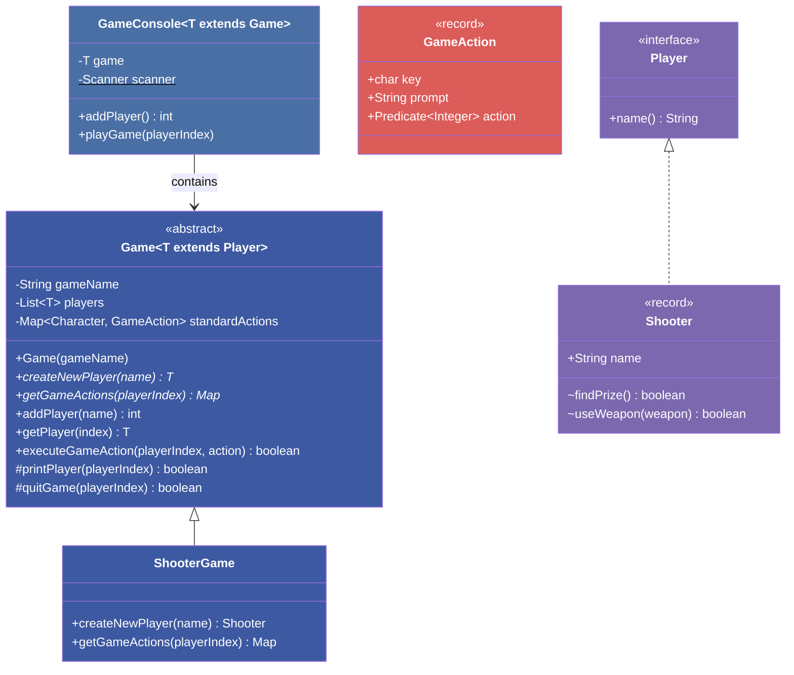
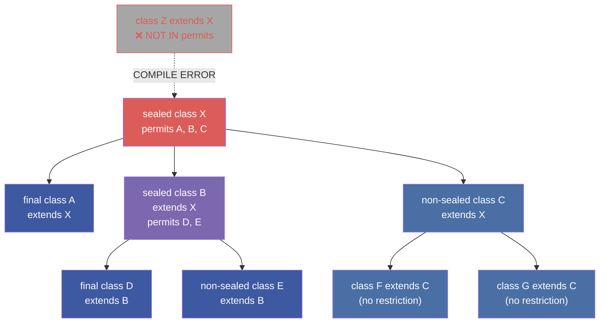

# :material-pencil: Topic Note Part 3: Game Console Framework, Final Classes & Sealed Types

> **Course:** Java Programming Masterclass — Tim Buchalka (Udemy)
> **Section:** 16 — Mastering Mutability, Immutability and Final Keyword in Java OOP
> **Lectures:** 15–22
> **Status:** :material-check-circle: Complete

---

## :material-target: Learning Objectives

By the end of this part, you should be able to:

- [x] Build a generic, extensible Game Console framework using abstract classes and generics
- [x] Implement the Player interface, GameAction record, and abstract Game class
- [x] Create concrete game implementations (ShooterGame, PirateGame) with custom actions
- [x] Apply enum constructors and static/instance initializers in a practical game context
- [x] Understand `final` classes: purpose, restrictions, and best practices
- [x] Explain why `final` + `abstract` is an illegal combination
- [x] Control instantiation with constructor access modifiers (private, protected, package-private)
- [x] Use sealed classes and interfaces (JDK 17+) with `permits`, `non-sealed`, and `final`
- [x] Understand sealed interfaces and how they differ from sealed classes

---

## :material-gamepad: 1. Game Console Framework Architecture

### System Overview

The Game Console framework demonstrates how to combine **generics**, **abstract classes**, **records**, **interfaces**, and **final methods** into a cohesive, extensible system.



---

### Key Components

#### Player Interface

```java
public interface Player {
    String name();  // Matches record accessor — any record with 'name' field can implement
}
```

#### GameAction Record

```java
public record GameAction(char key, String prompt, Predicate<Integer> action) { }
```

The `Predicate<Integer>` holds a lambda/method reference. The `Integer` is the player index. Returning `true` from the predicate ends the game.

#### Abstract Game Class

```java
public abstract class Game<T extends Player> {
    private final String gameName;
    private final List<T> players = new ArrayList<>();
    private Map<Character, GameAction> standardActions = null;

    public Game(String gameName) {
        this.gameName = gameName;
    }

    // Subclasses MUST implement these:
    public abstract T createNewPlayer(String name);
    public abstract Map<Character, GameAction> getGameActions(int playerIndex);

    // Final — subclasses cannot change player management
    final int addPlayer(String name) {
        T player = createNewPlayer(name);
        if (player != null) {
            players.add(player);
            return players.size() - 1;
        }
        return -1;
    }

    protected final T getPlayer(int playerIndex) {
        return players.get(playerIndex);
    }

    // Standard actions available to all games
    public Map<Character, GameAction> getStandardActions() {
        if (standardActions == null) {
            standardActions = new LinkedHashMap<>(Map.of(
                'I', new GameAction('I', "Print Player Info", this::printPlayer),
                'Q', new GameAction('Q', "Quit Game", this::quitGame)
            ));
        }
        return standardActions;
    }

    // Actionable methods (match Predicate<Integer> signature)
    protected boolean printPlayer(int playerIndex) {
        Player player = players.get(playerIndex);
        System.out.println(player);
        return false;  // Don't end the game
    }

    protected boolean quitGame(int playerIndex) {
        Player player = players.get(playerIndex);
        System.out.printf("Sorry to see you go, %s!%n", player.name());
        return true;   // End the game
    }
}
```

!!! tip "Design Decisions"
    - **`addPlayer` is `final`** — ensures player management logic can't be tampered with
    - **`getPlayer` is `protected final`** — subclasses can read players but not override retrieval
    - **`printPlayer`/`quitGame` are not final** — subclasses may want custom behavior
    - **Standard actions use lazy initialization** — created only when first needed

---

#### GameConsole Class

```java
public final class GameConsole<T extends Game<? extends Player>> {
    private final T game;
    private static final Scanner scanner = new Scanner(System.in);

    public GameConsole(T game) {
        this.game = game;
    }

    public int addPlayer() {
        System.out.print("Enter your playing name: ");
        String name = scanner.nextLine();
        System.out.printf("Welcome %s to the %s!%n", name, game.getGameName());
        return game.addPlayer(name);
    }

    public void playGame(int playerIndex) {
        boolean done = false;
        while (!done) {
            var gameActions = game.getGameActions(playerIndex);
            System.out.println("Select from these actions:");
            for (var action : gameActions.values()) {
                System.out.printf("  %c - %s%n", action.key(), action.prompt());
            }
            System.out.print("Enter selection: ");
            char input = scanner.nextLine().toUpperCase().charAt(0);
            GameAction action = gameActions.get(input);
            if (action != null) {
                System.out.println("-".repeat(40));
                done = game.executeGameAction(playerIndex, action);
                if (!done) System.out.println("-".repeat(40));
            }
        }
    }
}
```

---

### Testing with ShooterGame

```java
// Shooter record implements Player
record Shooter(String name) implements Player {
    boolean findPrize() {
        System.out.println("Prize found! Score adjusted.");
        return false;
    }
    boolean useWeapon(String weapon) {
        System.out.println("You shot your " + weapon);
        return false;
    }
}

// ShooterGame extends Game<Shooter>
public final class ShooterGame extends Game<Shooter> {
    public ShooterGame(String gameName) {
        super(gameName);
    }

    @Override
    public Shooter createNewPlayer(String name) {
        return new Shooter(name);
    }

    @Override
    public Map<Character, GameAction> getGameActions(int playerIndex) {
        var map = new LinkedHashMap<>(Map.of(
            'F', new GameAction('F', "Find Prize", i -> findPrize(i)),
            'S', new GameAction('S', "Use Weapon", i -> useWeapon(i))
        ));
        map.putAll(getStandardActions());
        return map;
    }

    private boolean findPrize(int playerIndex) {
        return getPlayer(playerIndex).findPrize();
    }

    private boolean useWeapon(int playerIndex) {
        return getPlayer(playerIndex).useWeapon("pistol");
    }
}

// Main
var console = new GameConsole<>(new ShooterGame("Shooter Challenge"));
int playerIndex = console.addPlayer();
console.playGame(playerIndex);
```

---

## :material-pirate: 2. Pirate Game Challenge — Constructors & Initializers in Practice

The Pirate Game challenge uses **enum constructors**, **instance initializers**, and **static initializers** to load game data during initialization.

### Enums with Constructors + Instance Initializers

```java
public enum Weapon {
    KNIFE(0, 10),
    AXE(0, 30),
    MACHETE(0, 40),
    PISTOL(3, 50);

    private final int minLevel;
    private final int hitPoints;

    Weapon(int minLevel, int hitPoints) {
        this.minLevel = minLevel;
        this.hitPoints = hitPoints;
    }
}

public enum Feature {
    POINTS("points", 50),
    HEALTH("health", 50);

    private final String name;
    private final int value;

    Feature(String name, int value) {
        this.name = name;
        this.value = value;
    }
}
```

### Static Initializers for Data Loading

```java
public class Town {
    private final String name;
    private static final List<Town> towns = new ArrayList<>();

    // Static initializer — loads town data when the class is first used
    static {
        System.out.println("Loading town data...");
        towns.addAll(List.of(
            new Town("Port Royal"),
            new Town("Tortuga"),
            new Town("Nassau")
        ));
        System.out.println("Finished loading town data.");
    }

    private Town(String name) {
        this.name = name;
    }

    public static Town getRandomTown() {
        return towns.get(new Random().nextInt(towns.size()));
    }
}
```

---

## :material-lock-check: 3. Final Classes

### What `final` on a Class Means

```java
public final class GameConsole<T extends Game<? extends Player>> {
    // No class can ever extend GameConsole
}
```

| Modifier | Effect | Can Instantiate? | Can Extend? |
|----------|--------|:---:|:---:|
| `final` | Class is complete — no subclasses | ✅ | ❌ |
| `abstract` | Class is incomplete — must be extended | ❌ | ✅ |
| `final abstract` | **ILLEGAL** — contradictory | — | — |

!!! danger "`final` + `abstract` = Compile Error"
    A `final` class says "I'm complete, don't extend me." An `abstract` class says "I'm incomplete, you must extend me." These are **mutually exclusive**.

---

### Implicitly Final Types

| Type | Implicitly Final? |
|------|:---:|
| `record` | ✅ |
| `enum` | ✅ |
| `class` | ❌ (must add `final` explicitly) |

```java
// Cannot extend records:
class ExtendedGameAction extends GameAction { }  // ❌ Cannot inherit from final

// Cannot extend enums:
class ExtendedWeapon extends Weapon { }  // ❌ Cannot inherit from final
```

---

### Constructor Access as Extension Control

| Constructor Access | New Instance? | New Subclass? |
|---|:---:|:---:|
| `public` | ✅ Anywhere | ✅ Anywhere |
| `protected` | ✅ Package + subclass | ✅ Anywhere |
| Package-private (default) | ✅ Same package | ✅ Same package only |
| `private` | ❌ (except inner/factory) | ❌ |

!!! info "Private Constructors = Effectively Final"
    Making all constructors `private` has the same extension-blocking effect as `final`, plus it also prevents external instantiation. This is the strategy behind **utility classes** and **singleton patterns**.

---

## :material-seal: 4. Sealed Classes & Interfaces (JDK 17+)

### The Problem Sealed Types Solve

Sometimes you want to **allow some subclasses but not all**. Neither `final` (no subclasses) nor default (unlimited subclasses) gives that control.

### Sealed Class Syntax

```java
public abstract sealed class Game<T extends Player>
    permits ShooterGame, PirateGame {
    // Only ShooterGame and PirateGame can extend this class
}
```

### Subclass Requirements

Every class in the `permits` clause **must** declare one of three modifiers:



| Subclass Modifier | Meaning |
|---|---|
| `final` | **Stops here** — no further subclasses |
| `sealed` | **Controlled extension** — must declare its own `permits` clause |
| `non-sealed` | **Open extension** — any class can extend freely |

---

### Sealed Class Rules

| Rule | Detail |
|------|--------|
| `permits` clause required | Unless all subclasses are nested classes in the same file |
| Same package (or module) | Permitted subclasses must be in the same package (or same module) |
| Only direct subclasses | Only direct children listed; grandchildren don't need listing |
| Three valid modifiers | Subclasses must be `final`, `sealed`, or `non-sealed` |
| Circular reference | Sealed class knows its children; children know their parent |

---

### Sealed Interfaces

Interfaces can also be sealed, but with a key difference:

```java
public sealed interface SealedInterface
    permits StringChecker, BetterInterface {

    boolean testString(Predicate<String> predicate, String... strings);
}

// Implementing class — can be final, sealed, or non-sealed
public final class StringChecker implements SealedInterface {
    @Override
    public boolean testString(Predicate<String> predicate, String... strings) {
        // implementation
    }
}

// Extending interface — can be sealed or non-sealed (NOT final)
public non-sealed interface BetterInterface extends SealedInterface { }
```

!!! info "Interfaces Cannot Be `final`"
    Since interfaces are contracts of abstract methods, making them `final` would make no sense — an interface with no implementors is useless. Sealed interfaces can use `sealed` or `non-sealed` for sub-interfaces.

---

### When to Use Each

| You Want... | Use... |
|---|---|
| No subclasses at all | `final class` |
| Only specific subclasses | `sealed class permits A, B, C` |
| Mostly restricted, one open branch | `sealed` + `non-sealed` on one child |
| Unrestricted extension | Default (no modifier) |
| Method that can't be overridden | `final` method |
| Total immutability guarantee | `final class` + all immutable patterns |

---

## :material-check-all: Quick Reference: Extension Control

```
┌────────────────────────────────────────────────────────────────┐
│             CLASS EXTENSION CONTROL SPECTRUM                   │
│                                                                │
│  ← Most Restrictive               Most Open →                  │
│                                                                │
│  final class     sealed class     non-sealed     (default)     │
│  ┌─────────┐    ┌────────────┐   ┌───────────┐  ┌──────────┐   │
│  │ No       │   │ Only       │   │ Open after│  │ Anyone   │   │
│  │ extension│   │ permitted  │   │ sealed    │  │ can      │   │
│  │ at all   │   │ subclasses │   │ parent    │  │ extend   │   │
│  └─────────┘    └────────────┘   └───────────┘  └──────────┘   │
│                                                                │
│  Record ✅       Class ✅          Class ✅       Class ✅     │
│  Enum ✅         Interface ✅      Interface ✅   Interface ✅ │
└────────────────────────────────────────────────────────────────┘
```

---

## :material-help-circle: Questions Explored

- [x] How do you build a generic game framework with extensible actions?
- [x] What is the purpose of using `final` on a method in the Game class?
- [x] How do enum constructors and static initializers support data loading?
- [x] What does making a class `final` prevent?
- [x] Why can't a class be both `final` and `abstract`?
- [x] How do constructor access modifiers control class extension?
- [x] What problem do sealed classes solve?
- [x] What are the three valid modifiers for a sealed class's subclasses?
- [x] How do sealed interfaces differ from sealed classes?
- [x] When should you use `non-sealed` on a permitted subclass?

---

## :material-navigation: Related Notes

| Part | Topic | Link |
|:----:|-------|------|
| 1 | Mutability Fundamentals, `final` Modifier & Immutable Classes | [← Part 1](topic-note.md) |
| 2 | Deep Copies, Unmodifiable Collections & Constructor Mastery | [← Part 2](topic-note-part2.md) |
| 3 | Game Console Framework, Final Classes & Sealed Types | **You are here** |

---

*Last Updated: 2026-04-16*
