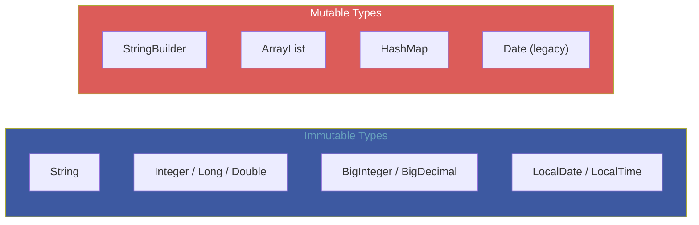
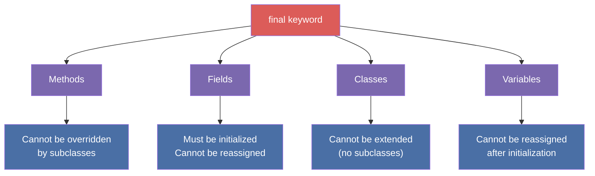
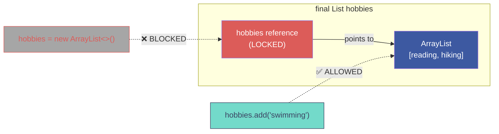

# :material-pencil: Topic Note Part 1: Mutability Fundamentals, the `final` Modifier & Immutable Class Design

> **Course:** Java Programming Masterclass — Tim Buchalka (Udemy)
> **Section:** 16 — Mastering Mutability, Immutability and Final Keyword in Java OOP
> **Lectures:** 1–7
> **Status:** :material-check-circle: Complete

---

## :material-target: Learning Objectives

By the end of this part, you should be able to:

- [x] Define mutable and immutable objects and explain their trade-offs
- [x] Apply the `final` modifier to methods, fields, classes, and local variables
- [x] Distinguish overriding (instance methods) from hiding (static methods)
- [x] Understand effectively final variables and their role with lambdas
- [x] Recognize dangerous side effects of mutability in real-world code
- [x] Design immutable classes using private final fields and defensive copies
- [x] Prevent subclass modification of immutable classes
- [x] Implement immutable `BankAccount` and `BankCustomer` classes

---

## :material-swap-horizontal: 1. Mutable vs. Immutable Objects

### Definitions

| Concept | Definition |
|---------|-----------|
| **Mutable** | An object whose state (field values) can be changed after creation |
| **Immutable** | An object whose state cannot be changed after creation |

### Examples from Java's Standard Library



---

### Advantages and Disadvantages

| Aspect | Mutable Objects | Immutable Objects |
|--------|:-:|:-:|
| **Thread safety** | ❌ Requires synchronization | ✅ Inherently thread-safe |
| **Defensive coding** | ❌ Must copy defensively | ✅ No defensive copies needed |
| **Side effects** | ❌ Callers can alter state | ✅ No unexpected mutations |
| **Identity stability** | ❌ Hash/equals may change | ✅ Safe as Map keys / Set elements |
| **Performance** | ✅ Modify in-place | ❌ Must create new object for each change |
| **Memory** | ✅ Single object reused | ❌ May create many short-lived copies |

!!! info "Key Principle"
    **Favor immutability unless you have a compelling reason for mutability.** Immutable objects are simpler, safer, and easier to reason about — especially in concurrent code.

---

## :material-lock: 2. The `final` Modifier — Deep Dive

The `final` keyword is Java's primary tool for restricting modification. It applies to four contexts:



---

### 2.1 Final Methods

A `final` method **cannot be overridden** by subclasses. This is useful for "non-negotiable" logic:

```java
public class BaseClass {
    // This method's behavior is locked — subclasses CANNOT change it
    public final void recommendedMethod() {
        System.out.println("Recommended method called - BaseClass");
        optionalMethod();  // Subclasses CAN customize this part
    }

    // Subclasses are free to override this
    protected void optionalMethod() {
        System.out.println("Optional method - BaseClass default");
    }
}

public class ChildClass extends BaseClass {
    // @Override recommendedMethod() → COMPILE ERROR!

    @Override
    protected void optionalMethod() {
        System.out.println("Optional method - ChildClass custom");
    }
}
```

!!! tip "Template Method Pattern"
    Using `final` on a method that calls overridable methods is the **Template Method** design pattern. The overall workflow is locked, but specific steps can be customized by subclasses.

---

### 2.2 Final Fields

A `final` field must be initialized **exactly once** and can never be reassigned:

```java
public class Person {
    private final String name;          // Must be set in constructor
    private final int age;              // Must be set in constructor
    private final List<String> hobbies; // Reference is final, but list contents are NOT

    public Person(String name, int age, List<String> hobbies) {
        this.name = name;
        this.age = age;
        this.hobbies = hobbies;
    }
}
```

!!! danger "`final` ≠ Immutable for Reference Types"
    `final` on a reference field means the **reference cannot be reassigned** (`this.hobbies = newList` is illegal). But the **object itself** can still be mutated (`this.hobbies.add("swimming")` works fine). This is a critical distinction!



---

### 2.3 Final Variables (Local Variables & Parameters)

```java
public void processData(final int maxSize) {
    // maxSize = 100;  // ❌ COMPILE ERROR — final parameter

    final String label = "Processing";
    // label = "Done";  // ❌ COMPILE ERROR — final local variable

    // Effectively final — never reassigned, so treated like final
    int threshold = 50;
    // threshold = 60;  // If uncommented, 'threshold' is NO LONGER effectively final

    // Lambda expressions can only capture effectively final variables
    Runnable r = () -> System.out.println(threshold);  // ✅ OK — effectively final
}
```

| Term | Meaning |
|------|---------|
| **`final` variable** | Explicitly marked with `final`, compiler enforces no reassignment |
| **Effectively final** | Not marked `final`, but never reassigned after initialization — compiler treats it as final |

!!! info "Why Effectively Final Matters"
    Lambda expressions and anonymous inner classes can only capture local variables that are **final or effectively final**. This ensures thread safety when lambdas execute on different threads.

---

### 2.4 Overriding vs. Hiding (Static Methods)

| Mechanism | Applies To | How It Works |
|-----------|-----------|-------------|
| **Overriding** | Instance methods | Runtime dispatch — actual object type determines which method runs |
| **Hiding** | Static methods | Compile-time binding — declared reference type determines which method runs |

```java
class BaseClass {
    static void staticMethod() {
        System.out.println("BaseClass static");
    }

    void instanceMethod() {
        System.out.println("BaseClass instance");
    }
}

class ChildClass extends BaseClass {
    static void staticMethod() {       // HIDES parent's static method
        System.out.println("ChildClass static");
    }

    @Override
    void instanceMethod() {            // OVERRIDES parent's instance method
        System.out.println("ChildClass instance");
    }
}

// In main:
BaseClass obj = new ChildClass();
obj.staticMethod();    // "BaseClass static"    ← Hiding: uses DECLARED type
obj.instanceMethod();  // "ChildClass instance" ← Overriding: uses ACTUAL type
```

!!! warning "`final` and Static Methods"
    Marking a static method as `final` prevents subclasses from **hiding** it (declaring the same signature). This is rarely needed but can be useful in library design.

---

## :material-alert: 3. Side Effects of Mutability

### The Logger Trap

```java
public class Logger {
    private StringBuilder log = new StringBuilder("Logger started\n");

    public void log(StringBuilder message) {
        log.append(message);    // Appends the reference, not a copy!
        log.append("\n");
    }

    @Override
    public String toString() {
        return log.toString();
    }
}

// Client code:
StringBuilder msg = new StringBuilder("User logged in");
logger.log(msg);

msg.append(" and logged out");     // ⚠️ Also modifies the logger's internal state!
msg.delete(0, msg.length());       // ⚠️ Clears the message in the logger too!
```

The logger stored a **reference** to the mutable `StringBuilder`, not a copy. Any external modification propagates into the logger's internal data.

---

### Mutable Map Keys

```java
StringBuilder key = new StringBuilder("KEY");
Map<StringBuilder, String> map = new HashMap<>();
map.put(key, "value");

System.out.println(map.get(key));   // "value" ✅

key.append("_MODIFIED");           // Mutate the key!
System.out.println(map.get(key));   // null ❌ — hash changed, can't find it

// The entry is still there, but unreachable because its hash doesn't match anymore
```

!!! danger "Golden Rule"
    **Never use mutable objects as keys** in `HashMap`, `HashSet`, or any hash-based collection. When the key mutates, its hash changes, making the entry permanently lost.

---

## :material-shield-check: 4. Designing Immutable Classes

### The Five Rules of Immutability

```
┌────────────────────────────────────────────────────────────────────┐
│              FIVE RULES FOR IMMUTABLE CLASSES                      │
│                                                                    │
│  1. Make all fields PRIVATE and FINAL                              │
│  2. Provide NO setter methods (no mutators)                        │
│  3. Return DEFENSIVE COPIES from getters (for mutable fields)      │
│  4. Accept DEFENSIVE COPIES in constructors (for mutable args)     │
│  5. Prevent subclassing (use final class, or private constructors) │
└────────────────────────────────────────────────────────────────────┘
```

---

### Step-by-Step: Building an Immutable Class

#### Step 1: Private Final Fields + No Setters

```java
public class PersonImmutable {
    private final String name;
    private final String dob;
    private final PersonImmutable[] kids;

    public PersonImmutable(String name, String dob, PersonImmutable[] kids) {
        this.name = name;
        this.dob = dob;
        this.kids = kids;  // ⚠️ Not yet safe — see Step 2
    }

    public String getName() { return name; }      // ✅ String is immutable
    public String getDob()  { return dob; }       // ✅ String is immutable
    public PersonImmutable[] getKids() { return kids; }  // ⚠️ Leaks internal array!
}
```

#### Step 2: Defensive Copies in Getters

```java
public PersonImmutable[] getKids() {
    return kids == null ? null : Arrays.copyOf(kids, kids.length);
}
```

Now callers get a **copy** of the array. Modifying it won't affect the internal state.

#### Step 3: Defensive Copies in Constructors

```java
public PersonImmutable(String name, String dob, PersonImmutable[] kids) {
    this.name = name;
    this.dob = dob;
    this.kids = kids == null ? null : Arrays.copyOf(kids, kids.length);
}
```

Now even the caller who passed the array can't modify the internal copy.

---

### Preventing Subclass Modification

Without protection, a subclass can break immutability:

```java
public class PersonOfInterest extends PersonImmutable {
    // Override the getter to return the ACTUAL internal array!
    @Override
    public PersonImmutable[] getKids() {
        // Bypasses defensive copy — exposes internal state
        return super.kids;  // If kids were protected, this would work
    }
}
```

**Solutions:**

| Strategy | How |
|----------|-----|
| **`final` class** | `public final class PersonImmutable` — prevents all subclassing |
| **`final` methods** | `public final PersonImmutable[] getKids()` — prevents getter override |
| **Private constructor** | Forces factory method pattern, prevents `extends` from external packages |
| **Package-private constructor** | Allows subclasses only within the same package |

---

## :material-bank: 5. Implementation Challenge: Banking Classes

### Immutable `BankAccount`

```java
public final class BankAccount {
    private final AccountType accountType;
    private final double balance;

    BankAccount(AccountType accountType, double balance) {
        this.accountType = accountType;
        this.balance = balance;
    }

    public AccountType getAccountType() { return accountType; }
    public double getBalance() { return balance; }

    @Override
    public String toString() {
        return "%s: $%.2f".formatted(accountType, balance);
    }
}

enum AccountType { CHECKING, SAVINGS }
```

### Immutable `BankCustomer`

```java
public final class BankCustomer {
    private final String name;
    private final int customerId;
    private final List<BankAccount> accounts;
    private static int lastId = 10_000_000;

    BankCustomer(String name, double checkingDeposit, double savingsDeposit) {
        this.name = name;
        this.customerId = ++lastId;
        this.accounts = List.of(
            new BankAccount(AccountType.CHECKING, checkingDeposit),
            new BankAccount(AccountType.SAVINGS, savingsDeposit)
        );
    }

    public String getName() { return name; }
    public int getCustomerId() { return customerId; }

    // Defensive copy — caller can't modify our account list
    public List<BankAccount> getAccounts() {
        return new ArrayList<>(accounts);  // or List.copyOf(accounts)
    }

    @Override
    public String toString() {
        return "Customer: %s (ID: %d)%n%s".formatted(name, customerId, accounts);
    }
}
```

### Key Design Decisions

| Decision | Rationale |
|----------|-----------|
| `final` class | Prevents subclasses from overriding getters or accessing fields |
| Package-private constructor | Only classes in `dev.bank` can create customers |
| `List.of()` for accounts | Creates an unmodifiable list internally |
| Defensive copy in `getAccounts()` | Returns a new list so callers can't modify the internal one |

---

## :material-help-circle: Questions Explored

- [x] What makes an object mutable vs. immutable?
- [x] What are the advantages and disadvantages of immutability?
- [x] How does the `final` keyword work on methods, fields, classes, and variables?
- [x] What is the difference between overriding and hiding?
- [x] What are effectively final variables and why do they matter?
- [x] How can mutability cause side effects in loggers and map keys?
- [x] What are the five rules for designing immutable classes?
- [x] How do defensive copies in constructors and getters protect immutability?
- [x] How can subclasses break immutability, and how do we prevent it?

---

## :material-navigation: Related Notes

| Part | Topic | Link |
|:----:|-------|------|
| 1 | Mutability Fundamentals, `final` Modifier & Immutable Classes | **You are here** |
| 2 | Deep Copies, Unmodifiable Collections & Constructor Mastery | [Part 2 →](topic-note-part2.md) |
| 3 | Game Console Framework, Final Classes & Sealed Types | [Part 3 →](topic-note-part3.md) |

---

*Last Updated: 2026-04-16*
