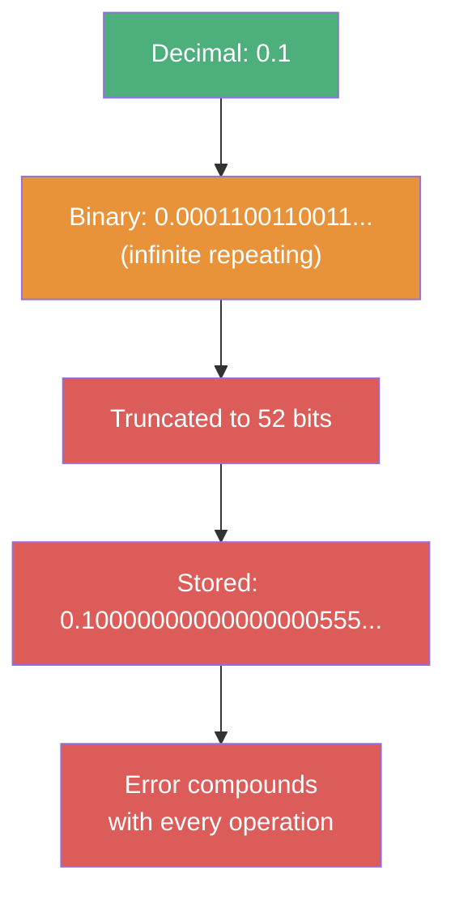
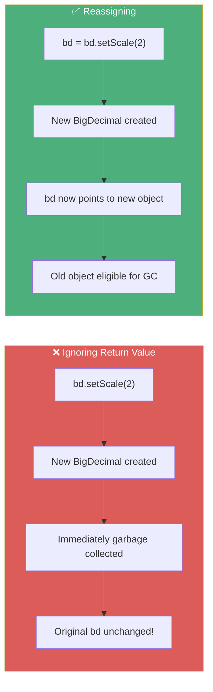
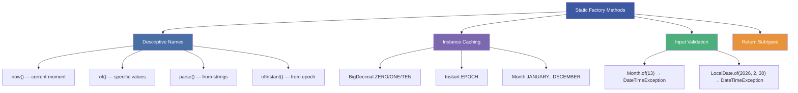
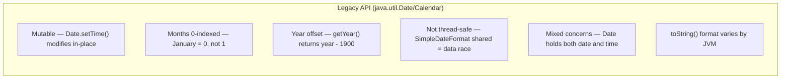
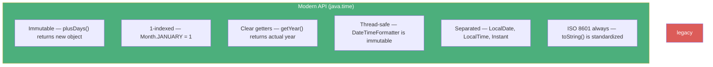

# :material-book-open-page-variant: Book Reading: Math, BigDecimal & Date/Time Best Practices

> **Book:** Effective Java (3rd Edition) by Joshua Bloch
> **Supplementary:** Core Java Volume I by Cay S. Horstmann
> **Relevant Items:** 60, 17, 1, 55 + Core Java Chapters on BigDecimal, java.time, and Localization
> **Status:** :material-check-circle: Complete

---

## :material-target: Reading Goals

- [x] Understand why float/double fail for monetary calculations and what alternatives exist
- [x] Recognize immutability patterns in BigDecimal and java.time — and the common "ignored return value" trap
- [x] Master static factory methods as the canonical creation pattern for java.time
- [x] Know the BigDecimal equals/compareTo asymmetry and its impact on collections
- [x] Understand the legacy date/time pitfalls and why java.time supersedes them
- [x] Know when to use ResourceBundle vs hardcoded strings for i18n

---

## :material-book-open-variant: Item 60: Avoid `float` and `double` if Exact Answers Are Required

### The Core Principle

`float` and `double` types perform **binary floating-point arithmetic** (IEEE 754). They are designed for scientific computation where small approximation errors are acceptable — but they are fundamentally broken for any domain where exactness matters (money, tax, insurance, billing).

### Why Binary Can't Represent Decimal Fractions

The number `0.1` in binary is `0.0001100110011...` — an infinitely repeating sequence. When truncated to 52 bits (double precision), it becomes `0.1000000000000000055511151231257827021181583404541015625`. Every arithmetic operation compounds these tiny errors:

```java
System.out.println(1.03 - 0.42);          // 0.6100000000000001 (not 0.61!)
System.out.println(1.00 - 9 * 0.10);      // 0.09999999999999998 (not 0.10!)
System.out.println(0.1 + 0.2);            // 0.30000000000000004 (not 0.3!)
```



### Bloch's Three Alternatives

| Approach | When To Use | Pros | Cons |
|----------|-------------|------|------|
| `BigDecimal` | Arbitrary precision; math context control needed | Exact; controllable rounding | Verbose; slower than primitives |
| `int` (cents) | ≤ 9 digits; performance-critical | Fast; exact | Can't exceed 2.1 billion cents (~$21M) |
| `long` (cents) | ≤ 18 digits; performance-critical | Fast; exact; large range | Manual scale tracking |

### Connection to Course Material

Tim's life insurance example (Lecture 6) is a textbook demonstration of Bloch's warning. A $100M policy divided among 3 beneficiaries using `float` overpays each check by $1 — a $3 loss per transaction. Over thousands of transactions, these errors accumulate catastrophically. Tim shows that even `double` arithmetic silently loses a penny, which only becomes visible when you reconcile the sum of distributions against the original payout. BigDecimal with `setScale(2, RoundingMode.HALF_UP)` correctly tracks the remaining penny.

### Quote to Remember

> *"The float and double types are particularly ill-suited for monetary calculations because it is impossible to represent 0.1 (or any other negative power of ten) as a float or double exactly."*

---

## :material-book-open-variant: Item 17: Minimize Mutability

### The Core Principle

**Immutable objects are simpler, safer, and more composable.** They can be shared freely between threads without synchronization, used as map keys without corruption risk, and their state is guaranteed at construction time.

### Applied to BigDecimal and java.time

Both `BigDecimal` and all `java.time` classes are designed as immutable objects. Bloch's five rules for immutable classes map directly to their implementations:

| Rule | BigDecimal | java.time |
|------|:---:|:---:|
| No mutator methods | ✅ `add()`, `setScale()` return new | ✅ `plusDays()`, `with()` return new |
| Class cannot be extended | ❌ (not final, but discouraged) | ✅ (final classes) |
| All fields private & final | ✅ | ✅ |
| No access to mutable components | ✅ | ✅ |
| Defensive copies on construction | ✅ (String parsed) | ✅ (factory methods validate) |

### The Immutability Trap — The Most Common Bug

This is the single most common mistake developers make with both BigDecimal and java.time classes. **Every mutation method returns a new object** — the original is never modified:

```java
// ❌ BigDecimal — return value ignored
BigDecimal bd = new BigDecimal("15.456");
bd.setScale(2, RoundingMode.HALF_UP);       // This creates a NEW BigDecimal and throws it away!
System.out.println(bd);                       // Still 15.456!

// ✅ Correct — must reassign
bd = bd.setScale(2, RoundingMode.HALF_UP);   // Now bd = 15.46
```

```java
// ❌ LocalDate — return value ignored
LocalDate date = LocalDate.of(2026, 5, 7);
date.plusDays(1);                              // Creates 2026-05-08 but discards it!
System.out.println(date);                      // Still 2026-05-07!

// ✅ Correct — must reassign
date = date.plusDays(1);                       // Now date = 2026-05-08
```



### Connection to Course Material

Tim catches this trap live in Lecture 7. He calls `bd.setScale(2, RoundingMode.HALF_UP)` without reassigning — the output doesn't change. He then shows that IntelliJ warns about the ignored return value. This is the same principle Bloch emphasizes: **immutable objects require functional-style programming** where every transformation produces a new value.

### Functional Object Pattern

Bloch names this the **functional object pattern** — methods that appear to modify an object instead return a new instance with the requested state. The original object remains unchanged:

```java
// BigDecimal's "functional" multiply
BigDecimal price = new BigDecimal("19.99");
BigDecimal tax = new BigDecimal("0.08");
BigDecimal total = price.add(price.multiply(tax));  // Chain returns new objects

// java.time's "functional" date arithmetic  
LocalDate start = LocalDate.of(2026, 1, 1);
LocalDate end = start.plusMonths(6).plusDays(15);    // Chain returns new objects
```

---

## :material-book-open-variant: Item 1: Consider Static Factory Methods Instead of Constructors

### The Core Principle

Static factory methods provide **named, flexible, and cacheable** alternatives to constructors. They communicate intent more clearly and can return cached instances, subtypes, or pre-validated objects.

### Applied to java.time (Exclusively)

All `java.time` classes use static factories exclusively — there are **no public constructors**. This is the most disciplined application of Item 1 in the entire JDK:

```java
// Factory: now() — current moment
LocalDate.now()                          // Today's date
Instant.now()                            // Current UTC timestamp
ZonedDateTime.now(ZoneId.of("UTC"))      // Now in a specific zone

// Factory: of() — specific values
LocalDate.of(2026, 5, 7)                 // From year/month/day
LocalTime.of(14, 30)                     // From hour/minute
LocalDateTime.of(2026, 5, 7, 14, 30)    // From date + time

// Factory: parse() — from strings
LocalDate.parse("2026-05-07")           // ISO format
Instant.parse("2026-05-07T14:30:00Z")   // ISO with timezone

// Factory: ofYearDay() — alternate semantics
LocalDate.ofYearDay(2026, 127)           // Day 127 of 2026

// Static constants
BigDecimal.ZERO                          // Pre-allocated zero
BigDecimal.ONE                           // Pre-allocated one
BigDecimal.TEN                           // Pre-allocated ten
Instant.EPOCH                            // 1970-01-01T00:00:00Z
```



### Connection to Course Material

Tim demonstrates all three factory patterns in Lectures 9–10. He creates `LocalDate` instances via `now()`, `of()`, `parse()`, and `ofYearDay()`, showing how each factory communicates different intent. This is exactly what Bloch advocates — factories make the API self-documenting.

### BigDecimal's Mixed Pattern

BigDecimal uses **both** constructors and static factories, which creates confusion:

```java
new BigDecimal("15.456")        // ✅ Constructor (String) — exact
new BigDecimal(15.456)          // ❌ Constructor (double) — binary approximation!
BigDecimal.valueOf(15.456)      // ✅ Static factory — uses Double.toString internally
```

Bloch would argue that having both is a design flaw — the double constructor is a known trap that should have been a factory method with clear naming (e.g., `BigDecimal.ofApproximate()`).

---

## :material-book-open-variant: Item 55: Return Optionals Judiciously (Applied to java.time)

### The Core Principle

Return `Optional<T>` when a method might legitimately have no value to return. Never use Optional for fields, method parameters, or collection elements.

### Connection to Date/Time APIs

The java.time API uses Optional-adjacent patterns throughout — many methods that could fail return sensible defaults or throw descriptive exceptions rather than returning null:

```java
// ZoneId.of("Invalid") → ZoneRulesException (not null!)
// LocalDate.parse("bad-date") → DateTimeParseException (not null!)
// ChronoUnit.HOURS.between(localDate1, localDate2) → UnsupportedTemporalTypeException
```

The `query` method on temporal objects returns nullable values, where Optional would have been more appropriate. This is a known area where the java.time API predates Bloch's stronger Optional advocacy.

---

## :material-book-open-variant: Core Java: The Legacy Date/Time API vs java.time

### What to Avoid and Why

| Legacy Class | Replacement | Specific Problem |
|-------------|-------------|------------------|
| `java.util.Date` | `Instant` | Mutable; `getYear()` returns year minus 1900; months are 0-indexed |
| `java.util.Calendar` | `LocalDate` / `ZonedDateTime` | Mutable; months 0-indexed (January = 0); confusing field constants |
| `java.text.SimpleDateFormat` | `DateTimeFormatter` | **Not thread-safe** — shared instances cause data races |
| `java.util.TimeZone` | `ZoneId` / `ZoneOffset` | Less precise; legacy zone names (PST, EST) are ambiguous |

### Why java.time Is Superior — Six Design Improvements





### Connection to Course Material

Tim explicitly addresses this in Lecture 8, noting that `java.util.Date` and `Calendar` exist but should be avoided. He shows the legacy `TimeZone.getAvailableIDs()` in Lecture 12 and demonstrates that the legacy IDs include deprecated 3-letter abbreviations (like "BET", "PST") that don't exist in `ZoneId.getAvailableZoneIds()`.

---

## :material-book-open-variant: Core Java: The BigDecimal Contract

### Essential Rules That Trip Up Developers

#### Rule 1: equals() vs compareTo() Asymmetry

This is the most surprising behavior in BigDecimal. Two BigDecimal values that are **mathematically identical** can be **unequal** according to `equals()`:

```java
BigDecimal a = new BigDecimal("1.0");   // scale = 1
BigDecimal b = new BigDecimal("1.00");  // scale = 2

a.equals(b);        // false! (different scales: 1 vs 2)
a.compareTo(b);     // 0 (mathematically equal)
```

This creates a dangerous inconsistency with collections:

```java
// HashSet uses equals() → treats them as different!
Set<BigDecimal> hashSet = new HashSet<>();
hashSet.add(new BigDecimal("1.0"));
hashSet.add(new BigDecimal("1.00"));
hashSet.size();      // 2 — duplicates!

// TreeSet uses compareTo() → treats them as same
Set<BigDecimal> treeSet = new TreeSet<>();
treeSet.add(new BigDecimal("1.0"));
treeSet.add(new BigDecimal("1.00"));
treeSet.size();      // 1 — correct!
```

!!! warning "Bloch's Item 14 Connection"
    The BigDecimal `equals`/`compareTo` inconsistency violates the recommendation in Item 14 ("Consider implementing Comparable") which states that `compareTo` should be consistent with `equals`. BigDecimal is a **documented exception** to this rule.

#### Rule 2: Division Always Requires Rounding Specification

```java
BigDecimal one = BigDecimal.ONE;
BigDecimal three = BigDecimal.valueOf(3);

one.divide(three);   // ❌ ArithmeticException: Non-terminating decimal expansion
one.divide(three, new MathContext(10, RoundingMode.HALF_UP)); // ✅ 0.3333333333
```

Tim demonstrates this in Lecture 7 — dividing 1 by 3 without a `MathContext` throws an exception because 0.333... cannot be represented exactly.

#### Rule 3: Scale Propagates Predictably

| Operation | Result Scale | Example |
|-----------|:---:|---|
| `add` / `subtract` | `max(scale1, scale2)` | 1.0 + 1.00 → scale 2 |
| `multiply` | `scale1 + scale2` | scale 2 × scale 60 → scale 62 |
| `divide` | Must specify | Always set via MathContext |

Tim's insurance example shows this: multiplying a scale-2 payout by a scale-60 percentage gives a scale-62 result. Without calling `setScale(2, ...)`, the number appears correct when formatted but has hidden precision that doesn't match real-world cents.

---

## :material-book-open-variant: Core Java: Locale Best Practices

### Key Principles

1. **Never hardcode locale-specific formats** — Date order (MM/DD vs DD/MM), decimal separator (. vs ,), and currency symbol ($, €, ¥) all vary
2. **Use `ResourceBundle` for user-facing strings** — Enables translation without code changes
3. **Test with at least 3 locales** — One with period decimals (US), one with comma decimals (Italy), one with logographic script (Japan)
4. **Scanner is locale-sensitive** — `scanner.nextBigDecimal()` with `Locale.ITALY` expects `1.234,56` not `1,234.56`

### Connection to Course Material

Tim's Locale example (Lecture 15) formats `123456789.123456` across six locales, showing how the same number looks completely different in each. The Italian scanner example drives home that parsing is also locale-dependent — if you don't call `scanner.useLocale()`, the default locale may reject valid input.

---

## :material-thought-bubble: Reflections & Connections

### How the Book Complements the Course

| Course Content (Tim) | Book Insight (Bloch) | Synthesis |
|:-----|:-----|:-----|
| $100M insurance float/double error (L6) | Item 60: float/double for money = bugs | Never use floating-point for financial; BigDecimal or integer cents |
| `bd.setScale()` return value ignored (L7) | Item 17: immutable functional pattern | Every mutation returns a new object; always reassign |
| `LocalDate.of()`, `now()`, `parse()` (L9) | Item 1: static factory superiority | Factories are self-documenting and validate inputs |
| BigDecimal double constructor warning (L6) | Item 1: naming communicates intent | `new BigDecimal(double)` should have been a named factory |
| `datesUntil` + flatMap schedule (L16) | Item 45: streams for pipelines | Complex scheduling is a perfect use case for streams |
| `TimeZone.getAvailableIDs()` vs `ZoneId` (L12) | Core Java: legacy avoidance | Always prefer java.time; legacy APIs have 0-indexed months |
| ResourceBundle fallback chain (L17–18) | Core Java: i18n best practices | Property files enable translation without code changes |

### New Perspectives Gained

1. **BigDecimal's `equals()` doesn't mean what you think** — `"1.0".equals("1.00")` is false for BigDecimal. Use `compareTo` for mathematical equality, and prefer `TreeSet`/`TreeMap` over `HashSet`/`HashMap` for BigDecimal keys.

2. **The "functional object" mental model** applies to both BigDecimal and java.time — think of `bd.setScale(2)` like `str.toUpperCase()`: it returns a new string, the original is unchanged.

3. **Static factory methods are a DESIGN CONTRACT** in java.time — the absence of public constructors is intentional, enforcing validation and naming conventions.

4. **Legacy date/time APIs are more dangerous than they appear** — `SimpleDateFormat` is not thread-safe, meaning a shared instance in a web server will produce corrupted dates under load.

5. **IEEE 754 limitations are permanent** — no amount of careful coding fixes the fundamental binary approximation problem. BigDecimal is the only correct answer for financial arithmetic.

---

## :material-format-list-checks: Summary Points

1. **Never use float/double for money** (Item 60) — use BigDecimal with String constructor or integer cents
2. **Immutable APIs require reassignment** (Item 17) — `bd.setScale()` and `date.plusDays()` both return new objects
3. **Static factories communicate intent** (Item 1) — `now()`, `of()`, `parse()`, `valueOf()` are self-documenting
4. **BigDecimal equals ≠ mathematical equality** — use `compareTo()` for value comparison, `TreeSet` for deduplication
5. **Division requires explicit rounding** — `MathContext` or `setScale` with `RoundingMode` is mandatory for non-terminating decimals
6. **Legacy date/time = mutable + broken** — `SimpleDateFormat` not thread-safe, `Calendar` months 0-indexed
7. **Locale affects parsing AND formatting** — `Scanner.useLocale()` must match input format

---

## :material-pin: Bookmarks & Page References

| Topic | Item | Key Insight |
|-------|:----:|-------------|
| Float/double for money | Item 60 | Binary can't represent 0.1 exactly; errors compound |
| Immutability pattern | Item 17 | BigDecimal + java.time = functional objects; must reassign |
| Static factories | Item 1 | java.time uses factories exclusively; BigDecimal should have |
| equals/compareTo | Item 14 | BigDecimal violates consistency — documented exception |
| Optional returns | Item 55 | java.time prefers exceptions over null/Optional |

---

## :material-code-tags: Practical Checklist

**Before doing financial math:**

- [ ] Am I using `BigDecimal` with the **String constructor**? (never `new BigDecimal(double)`)
- [ ] Am I capturing the return value of `setScale()`, `add()`, `multiply()`?
- [ ] Have I specified `RoundingMode` for every `setScale` and `divide` call?
- [ ] Am I using `compareTo()` (not `equals()`) for value comparison?

**Before working with dates/times:**

- [ ] Am I using `java.time` classes (not `java.util.Date` or `Calendar`)?
- [ ] Am I capturing return values from `plusDays()`, `with()`, `minus()`?
- [ ] Do I need timezone awareness? → `ZonedDateTime`. Don't need it? → `LocalDate`/`LocalDateTime`
- [ ] Am I using `DateTimeFormatter` (not `SimpleDateFormat`)?

**Before localizing:**

- [ ] Am I using `DateTimeFormatter.withLocale()` for date display?
- [ ] Am I using `NumberFormat.getCurrencyInstance(locale)` for money display?
- [ ] Are user-facing strings in `ResourceBundle` property files?
- [ ] Does my `Scanner` use the correct locale for parsing?

---

*Last Updated: 2026-05-07*
