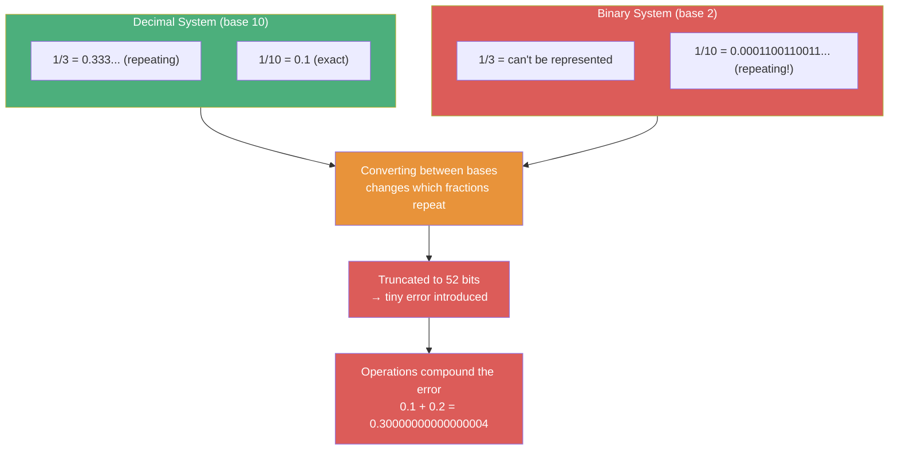
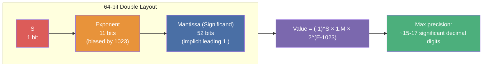
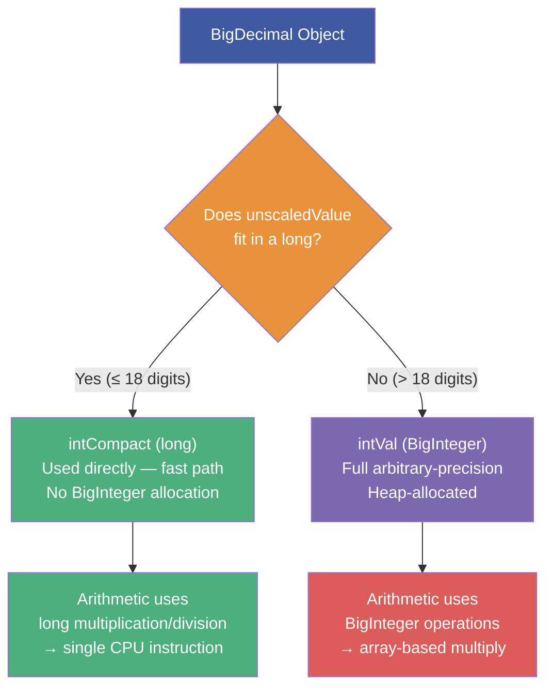
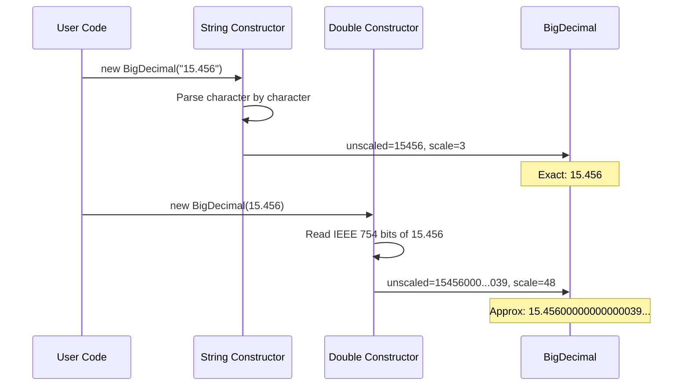
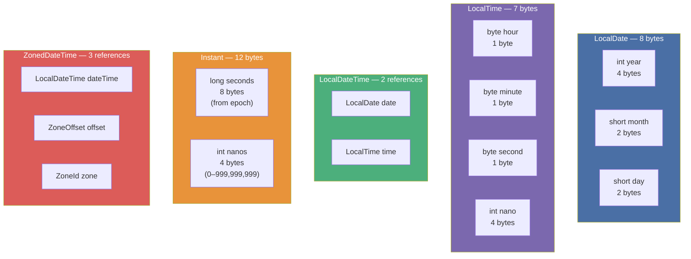
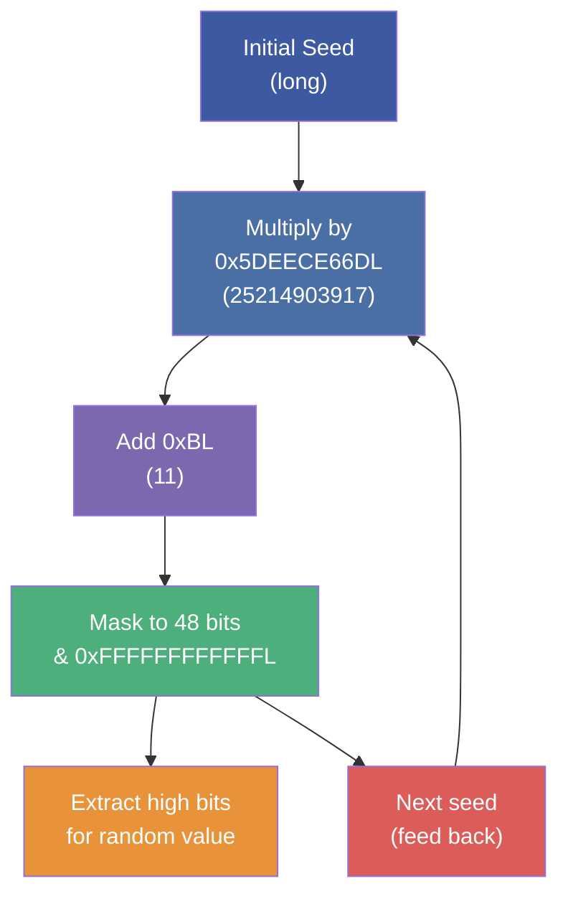
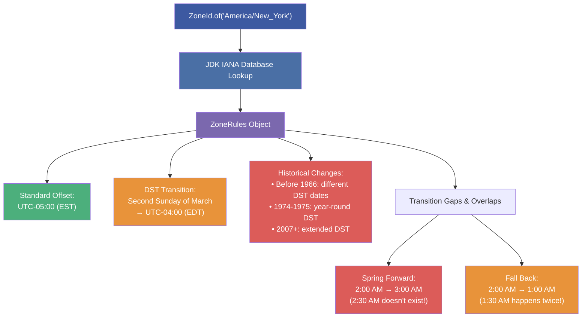

# :material-school: Summary: Java Core Fundamentals — Math, Randomization, BigDecimal & DateTime

> **Status:** :material-check-circle: Complete

---

## :material-lightning-bolt: Key Takeaways

### 1. The Math Class Is Your Safety Net — Not Just a Calculator

The `Math` class provides the standard arithmetic toolkit (abs, min, max, round, floor, ceil, sqrt, pow), but its most critical contribution is **overflow protection**. Java integers overflow silently — `Integer.MAX_VALUE + 1` wraps to `Integer.MIN_VALUE` without any warning. The `*Exact` methods (`incrementExact`, `addExact`, `subtractExact`, `absExact`) throw `ArithmeticException` when overflow occurs, turning a silent data corruption bug into a catchable error. The `abs(Integer.MIN_VALUE)` trap is particularly nasty: it returns `-2,147,483,648` because the positive representation can't fit in an `int`.

### 2. Randomization Has Three Layers of Control

- **`Math.random()`** — Returns a `double` in `[0.0, 1.0)`. Internally uses a single shared `Random` instance. Simple but limited.
- **`java.util.Random`** — Full control with `nextInt(bound)`, `nextInt(origin, bound)` (JDK 17+), `nextDouble()`, `nextBoolean()`. Supports seeds for deterministic sequences.
- **`Random.ints()` / `doubles()` / `longs()`** — Stream-based generation. `ints(size, origin, bound)` — first arg is stream size, not the bound. Single-arg `ints(10)` produces 10 full-range random ints.
- **Seeds** make output deterministic: same seed → identical sequence. Useful for testing, dangerous for security. The no-arg constructor uses `System.nanoTime()` XOR'd with a thread-unique incrementer to ensure distinct seeds across threads.

### 3. BigDecimal Exists Because Binary Can't Represent Decimal

`float` and `double` use IEEE 754 binary representation where `0.1` is an infinite repeating fraction. This means `0.1 + 0.2 ≠ 0.3` in Java. BigDecimal stores numbers as an `(unscaledValue: BigInteger, scale: int)` pair — no binary approximation. The value equals `unscaledValue × 10^(-scale)`.

**Critical rules:**
- Always use `new BigDecimal("10.50")` (String constructor) — never `new BigDecimal(10.50)` (double constructor captures approximation)
- BigDecimal is **immutable** — `setScale()`, `add()`, `multiply()` all return **new** instances
- `equals()` checks value AND scale (`"1.0".equals("1.00")` is false!); use `compareTo()` for mathematical equality
- Division of repeating decimals requires `MathContext` or explicit `RoundingMode` — otherwise throws `ArithmeticException`
- Scale propagation: multiply adds scales, add/subtract takes the max

### 4. java.time Replaces Everything Before It

JDK 8's `java.time` package is a ground-up redesign that fixes every problem with `java.util.Date` and `Calendar`. All classes are **immutable and thread-safe**. There are no public constructors — only static factories (`now()`, `of()`, `parse()`). The package separates concerns clearly:

| Class | Represents | Internal Fields |
|-------|-----------|----------------|
| `LocalDate` | Date only (no time, no zone) | `int year`, `short month`, `short day` |
| `LocalTime` | Time only (no date, no zone) | `byte hour/min/sec`, `int nano` |
| `LocalDateTime` | Date + time (no zone) | `LocalDate` + `LocalTime` |
| `ZonedDateTime` | Date + time + timezone | `LocalDateTime` + `ZoneOffset` + `ZoneId` |
| `Instant` | Machine timestamp (UTC) | `long seconds`, `int nanos` (from epoch) |

### 5. Period vs Duration vs ChronoUnit — Three Ways to Measure Time

- **`Period`** — Human units: years, months, days. Between two `LocalDate` instances. Output: `P2Y4M15D`.
- **`Duration`** — Machine units: hours, minutes, seconds, nanos. Between two `Instant`/`LocalDateTime` instances. Output: `PT439559H14M37S`.
- **`ChronoUnit.between()`** — Single-unit answer: "How many DAYS between A and B?" Returns a `long`.

### 6. Timezones Are a Database Problem, Not Just an Offset

`ZoneId.getAvailableZoneIds()` returns ~600 zones from the IANA Time Zone Database. Each zone ID maps to a history of UTC offset changes (political decisions, DST rules). `ZoneRules` encodes this history — `isDaylightSavings(Instant)` and `getDaylightSavings(Instant)` tell you the current DST state and offset delta. `withZoneSameInstant()` converts between zones while preserving the same physical moment.

### 7. Localization Is More Than Translation

A `Locale` (language + region) affects **everything**: date format order (MM/DD vs DD/MM), day/month names, decimal separator (. vs ,), thousands separator, currency symbol and position ($555.56 vs 555,56 €), and number grouping. `DateTimeFormatter.withLocale()`, `NumberFormat.getCurrencyInstance(locale)`, and `ResourceBundle.getBundle()` all respond to the active locale.

### 8. ResourceBundle Enables i18n Without Code Changes

Property files (`BasicText_fr.properties`, `BasicText_ja_JP.properties`) store locale-specific strings. The fallback chain (`fr_FR` → `fr` → default) ensures graceful degradation. `ListResourceBundle` allows storing non-string objects. **Never hardcode user-facing strings** — always externalize to resource bundles.

---

## :material-brain: Key Internals & Deep-Dive Performance Notes

### Internal 1: IEEE 754 Binary Floating-Point Representation

Understanding _why_ floats fail for money requires understanding how IEEE 754 represents decimals in binary. A `double` uses 64 bits: 1 sign bit, 11 exponent bits, and 52 mantissa (significand) bits. The value is `(-1)^sign × 1.mantissa × 2^(exponent - 1023)`.

#### The Fundamental Problem

Decimal fractions like `0.1`, `0.2`, `0.3` have **no exact binary representation**. They become infinite repeating fractions in binary, just as `1/3 = 0.333...` repeats in decimal:



#### IEEE 754 Double Memory Layout



#### Practical Consequence — The Penny Problem

```java
double policyAmount = 100_000_000.0;
float percentageFloat = 1.0f / 3;    // 0.33333334 (7 digits)
double percentage = 1.0 / 3;          // 0.3333333333333333 (16 digits)

// Float: 100M × 0.33333334 = 33,333,334.00 → $1 OVER per check!
// Double: 100M × 0.3333333333333333 = 33,333,333.33 → looks right, but 33.33 × 3 = 99.99
// Where's the missing penny? Absorbed into the repeating decimal's truncation.
```

The penny doesn't disappear — it gets hidden in the insignificant digits beyond the 2-decimal-place display. BigDecimal with `setScale(2, RoundingMode.HALF_UP)` makes it explicit: `33,333,333.34 × 3 = 100,000,000.02`, and the remaining `-$0.02` is tracked, not lost.

> **Resource:** [IEEE 754-2019 Standard](https://en.wikipedia.org/wiki/IEEE_754) — The universal floating-point specification
> **Resource:** [What Every Programmer Should Know About Floating-Point Arithmetic](https://floating-point-gui.de/) — Visual explanation of binary float representation

---

### Internal 2: BigDecimal Internal Storage & `intCompact` Optimization

BigDecimal's public API exposes two fields — `unscaledValue` (BigInteger) and `scale` (int). But internally, the OpenJDK implementation adds a critical optimization: `intCompact`.

#### The Dual Representation



For most financial applications (amounts under $9.2 quintillion), the unscaled value fits in a `long`. BigDecimal stores it in `intCompact` and avoids creating a `BigInteger` object entirely. This optimization makes common BigDecimal operations nearly as fast as long arithmetic, with only the method-call overhead.

#### Scale & Value Relationship

| String Representation | Unscaled Value | Scale | Precision | Internal Formula |
|:---:|:---:|:---:|:---:|---|
| `"15.456"` | 15456 | 3 | 5 | `15456 × 10⁻³` |
| `"8"` | 8 | 0 | 1 | `8 × 10⁰` |
| `"8.00"` | 800 | 2 | 3 | `800 × 10⁻²` |
| `"100E6"` | 100 | -6 | 3 | `100 × 10⁶` |
| `"0.125"` | 125 | 3 | 3 | `125 × 10⁻³` |

Note that `"8"` and `"8.00"` have **different** unscaled values, scales, and precisions — which is why `equals()` returns `false` even though they represent the same number. The `compareTo()` method normalizes for mathematical comparison.

#### Why String Constructor > Double Constructor



The String constructor parses digits directly into the unscaled value — no binary approximation ever occurs. The double constructor reads the IEEE 754 representation of `15.456`, which is already an approximation, and faithfully captures that approximation. `BigDecimal.valueOf(double)` mitigates this by calling `Double.toString(15.456)` first (which rounds to "15.456") and then using the String constructor.

> **Resource:** [OpenJDK `BigDecimal.java`](https://github.com/openjdk/jdk/blob/master/src/java.base/share/classes/java/math/BigDecimal.java) — The `intCompact` field and `inflate()` method
> **Resource:** [OpenJDK `BigInteger.java`](https://github.com/openjdk/jdk/blob/master/src/java.base/share/classes/java/math/BigInteger.java) — Array-based arithmetic for numbers exceeding long range

---

### Internal 3: java.time Internal Representation & Epoch Model

The java.time API uses a carefully chosen internal representation for each temporal class, optimized for both memory and computation speed.

#### Field Layout Across Temporal Classes



#### The Two Time Models

Java's temporal classes operate on two fundamentally different time models:


**Human time** (LocalDate/LocalTime) represents what you'd read on a wall clock — it has no concept of timezone, so "3 PM" means different physical moments in Tokyo vs London. **Machine time** (Instant) is a point on the universal timeline, measured in seconds from the Unix epoch (1970-01-01T00:00:00Z). `ZonedDateTime` bridges both by pairing a human-readable representation with a specific timezone.

#### Why LocalTime Wraps at Midnight

`LocalTime` represents hours 0–23. Adding 24 hours to `19:00` returns `19:00` — it wraps around because LocalTime has no concept of "tomorrow." This is by design: a time without a date cannot span multiple days. If you need cross-day time arithmetic, use `LocalDateTime` or `Duration`.

```java
LocalTime sevenPM = LocalTime.parse("19:00");
sevenPM.plus(24, ChronoUnit.HOURS);   // 19:00 (wraps!)
sevenPM.plus(5, ChronoUnit.HOURS);    // 00:00 (midnight wrap)
```

> **Resource:** [OpenJDK `LocalDate.java`](https://github.com/openjdk/jdk/blob/master/src/java.base/share/classes/java/time/LocalDate.java) — Internal `int year`, `short month`, `short day` fields
> **Resource:** [OpenJDK `Instant.java`](https://github.com/openjdk/jdk/blob/master/src/java.base/share/classes/java/time/Instant.java) — Epoch-based `long seconds` + `int nanos` storage
> **Resource:** [JSR 310: Date and Time API](https://jcp.org/en/jsr/detail?id=310) — The original specification led by Stephen Colebourne

---

### Internal 4: Pseudorandom Number Generation (PRNG) — Linear Congruential Generator

Java's `Random` class uses a **Linear Congruential Generator (LCG)** — one of the oldest and simplest PRNG algorithms. Understanding it explains why seeds produce deterministic sequences and why `Random` is unsuitable for cryptography.

#### The LCG Formula

The algorithm computes each random number from the previous one using:

```
nextSeed = (currentSeed × 0x5DEECE66DL + 0xBL) & ((1L << 48) - 1)
```

This is a fixed mathematical formula — given the same input, it always produces the same output.



#### Why Same Seed = Same Sequence

```java
Random r1 = new Random(42);
Random r2 = new Random(42);

r1.nextInt(100);  // 0   (always, for seed 42)
r2.nextInt(100);  // 0   (identical — same seed, same formula)

r1.nextInt(100);  // 68  (always the second value for seed 42)
r2.nextInt(100);  // 68  (identical)
```

The LCG is a **deterministic function** — same input → same output. Two `Random` instances with the same seed will always produce identical sequences, in the same order, forever. This is invaluable for testing (reproducible "random" behavior) but dangerous for security (an attacker who discovers the seed can predict all future values).

#### Seed Generation for No-Arg Constructor

When you create `new Random()` without a seed, Java generates one internally:

```java
// OpenJDK implementation (simplified)
private static final AtomicLong seedUniquifier = new AtomicLong(8682522807148012L);

private static long initialScramble(long seed) {
    return seed ^ 0x5DEECE66DL;  // XOR with the multiplier
}

// Each new Random() gets a unique seed:
// seed = seedUniquifier.updateAndGet(s -> s * 1181783497276652981L) ^ System.nanoTime()
```

The `seedUniquifier` is a thread-safe atomic counter that ensures even two `Random()` calls on the same nanosecond produce different seeds.

#### JDK 17 Evolution — RandomGenerator Interface

JDK 17 (JEP 356) introduced the `RandomGenerator` interface and several improved algorithms:

| Algorithm | Period | Statistical Quality | Use Case |
|-----------|--------|:---:|---|
| `Random` (LCG) | 2⁴⁸ | Basic | Legacy, simple games |
| `SplittableRandom` | 2⁶⁴ | Good | Parallel streams |
| `ThreadLocalRandom` | 2⁶⁴ | Good | Multi-threaded apps |
| `L128X256MixRandom` | ~2³⁸⁴ | Excellent | Simulation, statistics |
| `SecureRandom` | Unpredictable | Cryptographic | Security, tokens |

> **Resource:** [OpenJDK `Random.java`](https://github.com/openjdk/jdk/blob/master/src/java.base/share/classes/java/util/Random.java) — The LCG implementation: `next()` method
> **Resource:** [JEP 356: Enhanced Pseudo-Random Number Generators](https://openjdk.org/jeps/356) — New `RandomGenerator` interface and algorithms in JDK 17
> **Resource:** [Knuth, The Art of Computer Programming, Vol. 2](https://en.wikipedia.org/wiki/The_Art_of_Computer_Programming) — Theoretical foundation for LCG analysis

---

### Internal 5: Timezone Resolution & the IANA Time Zone Database

Timezone handling is deceptively complex because timezones are **political constructs** that change with legislation. Java's timezone support is powered by the IANA Time Zone Database (also called `tzdata` or the Olson database).

#### How Zone IDs Map to Rules



#### Key Timezone Concepts

1. **Zone ID ≠ Fixed Offset** — `"America/New_York"` alternates between UTC-5 (winter) and UTC-4 (summer)
2. **IANA Database Updates** — Updated several times per year as countries change DST rules (e.g., Turkey abolished DST in 2016, Morocco changes DST dates frequently)
3. **`withZoneSameInstant()` vs `withZoneSameLocal()`**:
   - `withZoneSameInstant()` — Same physical moment, different wall clock time
   - `withZoneSameLocal()` — Same wall clock time, different physical moment

```java
ZonedDateTime nyTime = ZonedDateTime.of(
    2026, 5, 7, 14, 0, 0, 0, ZoneId.of("America/New_York"));

// Same instant, different zone → clock shifts
ZonedDateTime sydTime = nyTime.withZoneSameInstant(ZoneId.of("Australia/Sydney"));
// Sydney = May 8, 04:00 (next day!) — same moment on the timeline

// Same local time, different zone → different instant!
ZonedDateTime sydLocal = nyTime.withZoneSameLocal(ZoneId.of("Australia/Sydney"));
// Sydney = May 7, 14:00 — same clock reading, different moment
```

#### Legacy Zone ID Mapping

Tim shows in Lecture 12 that `TimeZone.getAvailableIDs()` includes deprecated 3-letter codes (PST, EST, BET) that `ZoneId.getAvailableZoneIds()` does not:

```java
ZoneId bet = ZoneId.of("BET", ZoneId.SHORT_IDS);
// BET → America/Sao_Paulo
// These 3-letter IDs are ambiguous (CST = US Central? China? Cuba?)
```

> **Resource:** [IANA Time Zone Database](https://www.iana.org/time-zones) — Updated tzdata releases
> **Resource:** [OpenJDK `ZoneId.java`](https://github.com/openjdk/jdk/blob/master/src/java.base/share/classes/java/time/ZoneId.java) — `SHORT_IDS` mapping table for legacy compatibility
> **Resource:** [OpenJDK `ZoneRules.java`](https://github.com/openjdk/jdk/blob/master/src/java.base/share/classes/java/time/zone/ZoneRules.java) — Transition rules, gap/overlap detection

---

## :material-compass: Quick Decision Guides

### When to Use Each Numeric Type

```
int / long        → Counting, indexing, integer arithmetic (no fractions)
float / double    → Scientific computation, graphics, game physics (approximations OK)
BigDecimal        → Financial calculations, exact decimal arithmetic (money, taxes, insurance)
int/long (cents)  → High-performance financial (amounts < $92 quadrillion for long)
```

### When to Use Each Temporal Class

```
LocalDate         → Birthdays, holidays, deadlines (no time component needed)
LocalTime         → Alarms, store hours, daily schedules (no date needed)
LocalDateTime     → Appointments, logs within one timezone (no zone needed)
ZonedDateTime     → Global meetings, cross-timezone scheduling, flight times
Instant           → Machine timestamps, event logging, elapsed time measurement
OffsetDateTime    → Database storage, API communication (fixed offset, no DST rules)
```

### When to Use Period vs Duration vs ChronoUnit

```
Period            → "3 years, 2 months, 5 days" (date-based, human-readable units)
Duration          → "PT48H30M" (time-based, nanosecond precision)
ChronoUnit        → "How many DAYS between A and B?" (single-unit long answer)
```

### BigDecimal Construction Guide

```
new BigDecimal("10.50")           → ✅ Exact representation (ALWAYS prefer this)
BigDecimal.valueOf(10.50)         → ✅ Predictable (Double.toString → String constructor)
new BigDecimal(10.50)             → ❌ NEVER USE — inherits binary approximation
BigDecimal.ONE / .ZERO / .TEN    → ✅ Use static constants when available
```

### RoundingMode Selection

```
HALF_UP           → Standard rounding (≥0.5 → up) — most financial apps
HALF_EVEN         → Banker's rounding (nearest even) — statistics, banking
DOWN / UP         → Always toward/away from zero — truncation or conservative estimates
FLOOR / CEILING   → Always toward −∞/+∞ — tax calculations, pricing
UNNECESSARY       → Assert no rounding needed — throw if rounding occurs
```

### Locale Formatting Pattern

```
Date display      → DateTimeFormatter.ofLocalizedDate(style).withLocale(locale)
DateTime display  → DateTimeFormatter.ofLocalizedDateTime(style).withLocale(locale)
Number display    → NumberFormat.getNumberInstance(locale)
Currency display  → NumberFormat.getCurrencyInstance(locale)
User strings      → ResourceBundle.getBundle("name", locale).getString("key")
Input parsing     → scanner.useLocale(locale) before scanner.nextBigDecimal()
```

---

*Last Updated: 2026-05-07*
