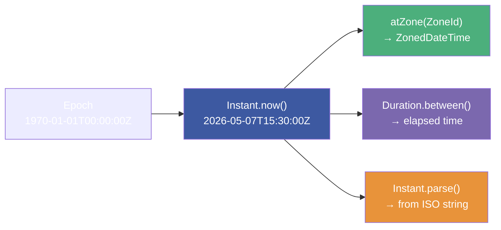
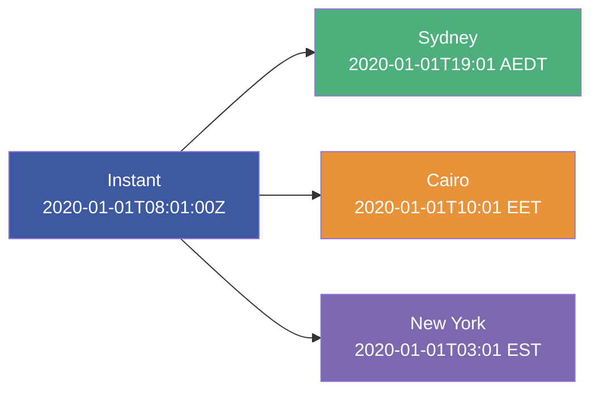
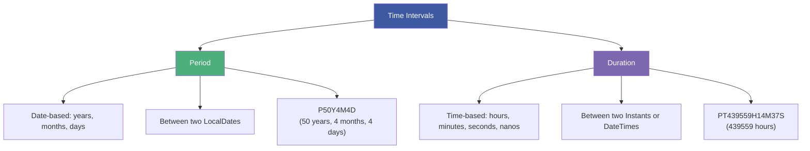
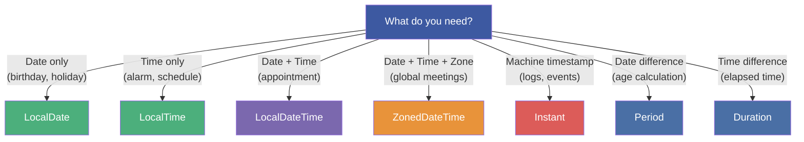

# :material-pencil: Topic Note Part 2: Java Date & Time API (`java.time`)

> **Course:** Java Programming Masterclass — Tim Buchalka (Udemy)
> **Section:** 18 — Java Core Fundamentals: Math, Randomization, BigDecimal, and DateTime
> **Lectures:** 8–13
> **Status:** :material-check-circle: Complete

---

## :material-target: Learning Objectives

By the end of this part, you should be able to:

- [x] Navigate the `java.time` package hierarchy and understand the Temporal/TemporalAccessor interfaces
- [x] Create and manipulate `LocalDate` instances (now, of, parse, with, plus, minus)
- [x] Use `LocalTime` with `ChronoField` for precise time queries
- [x] Combine date and time using `LocalDateTime`
- [x] Format date/time with `DateTimeFormatter` and `FormatStyle`
- [x] Work with `Instant` for machine timestamps (epoch-based)
- [x] Use `ZonedDateTime` and `ZoneId` for timezone-aware operations
- [x] Calculate differences with `Duration`, `Period`, and `ChronoUnit`
- [x] Detect daylight savings transitions via `ZoneRules`
- [x] Use `TemporalAdjusters` for common date calculations

---

## :material-clock: 1. The `java.time` Package Hierarchy

### Package Overview

```mermaid
flowchart TD
    JT["java.time"] --> CORE["Core Classes"]
    JT --> TEMPORAL["java.time.temporal"]
    JT --> FORMAT["java.time.format"]
    JT --> ZONE["java.time.zone"]
    JT --> CHRONO["java.time.chrono"]

    CORE --> LD["LocalDate"]
    CORE --> LT["LocalTime"]
    CORE --> LDT["LocalDateTime"]
    CORE --> ZDT["ZonedDateTime"]
    CORE --> ODT["OffsetDateTime"]
    CORE --> INST["Instant"]
    CORE --> DUR["Duration"]
    CORE --> PER["Period"]
    CORE --> ENUMS["DayOfWeek, Month"]

    TEMPORAL --> TA["Temporal / TemporalAccessor"]
    TEMPORAL --> CF["ChronoField (enum)"]
    TEMPORAL --> CU["ChronoUnit (enum)"]
    TEMPORAL --> ADJ["TemporalAdjusters"]

    FORMAT --> DTF["DateTimeFormatter"]
    FORMAT --> FS["FormatStyle (enum)"]

    style JT fill:#3d59a1,color:#fff
    style CORE fill:#4a6fa5,color:#fff
    style TEMPORAL fill:#7b68ae,color:#fff
    style FORMAT fill:#4caf7c,color:#fff
    style ZONE fill:#e8933a,color:#fff
    style CHRONO fill:#3b4261,color:#fff
```



### Key Design Principles

1. **All temporal instances are IMMUTABLE and thread-safe** — `plus()`, `minus()`, `with()` return new objects
2. **Factory methods** — Use `now()`, `of()`, `parse()` — no `new` constructors
3. **Fluent API** — Methods chain: `date.plusDays(7).withMonth(3).format(dtf)`
4. **Separation of concerns** — Date-only (`LocalDate`), time-only (`LocalTime`), combined (`LocalDateTime`), zone-aware (`ZonedDateTime`)

---

## :material-calendar: 2. `LocalDate` — Date Without Time or Timezone

### Creation Methods

```java
// Current date
LocalDate today = LocalDate.now();             // 2026-05-07

// Specific date
LocalDate may5 = LocalDate.of(2026, 5, 6);     // Using int month
LocalDate may5b = LocalDate.of(2026, Month.MAY, 6);  // Using Month enum

// By day-of-year
LocalDate day12 = LocalDate.ofYearDay(2026, 12);   // 2026-01-12

// Parse from String (ISO format: yyyy-MM-dd)
LocalDate parsed = LocalDate.parse("2026-05-06");
```

### Getters — Extracting Fields

```java
may5.getYear();           // 2026
may5.getMonth();          // MAY (Month enum)
may5.getMonthValue();     // 5 (int)
may5.getDayOfMonth();     // 6
may5.getDayOfYear();      // 126
may5.getDayOfWeek();      // WEDNESDAY (DayOfWeek enum)

// Using ChronoField (generic approach)
may5.get(ChronoField.YEAR);           // 2026
may5.get(ChronoField.MONTH_OF_YEAR);  // 5
may5.get(ChronoField.DAY_OF_YEAR);    // 126
```

### Mutation — `with*()`, `plus*()`, `minus*()`

All return **new** instances — the original is never modified:

```java
may5.withYear(2000);                    // 2000-05-06
may5.withMonth(3);                      // 2026-03-06
may5.withDayOfMonth(4);                 // 2026-05-04
may5.with(ChronoField.DAY_OF_YEAR, 126); // 2026-05-06

may5.plusYears(1);                      // 2027-05-06
may5.plusMonths(12);                    // 2027-05-06
may5.plusDays(365);                     // 2027-05-06
may5.plusWeeks(52);                     // 2027-05-05 (52 weeks ≠ 1 year!)
may5.plus(365, ChronoUnit.DAYS);       // 2027-05-06

System.out.println(may5);              // 2026-05-06 (UNCHANGED!)
```

!!! warning "52 Weeks ≠ 1 Year"
    52 × 7 = 364 days, not 365. `plusWeeks(52)` will be one day short in a non-leap year.

### Comparison

```java
may5.isAfter(today);         // true if May 6 is in the future
may5.isBefore(today);        // true if May 6 is in the past
may5.compareTo(today);       // negative, zero, or positive
may5.equals(LocalDate.now()); // true only if same date
may5.isLeapYear();           // false for 2026
```

### Date Ranges with `datesUntil`

```java
// Stream of dates: May 6 → May 12 (exclusive)
may5.datesUntil(may5.plusDays(7))
    .forEach(System.out::println);

// Every 7 days for a year
may5.datesUntil(may5.plusYears(1), Period.ofDays(7))
    .forEach(System.out::println);
```

---

## :material-clock-time-four: 3. `LocalTime` — Time Without Date or Timezone

### Creation and Parsing

```java
LocalTime now = LocalTime.now();               // 14:30:15.123456789
LocalTime sevenAM = LocalTime.of(7, 0);        // 07:00
LocalTime sevenThirty = LocalTime.of(7, 30, 15); // 07:30:15

LocalTime sevenPM = LocalTime.parse("19:00");
LocalTime precise = LocalTime.parse("19:30:15.1000");
```

### ChronoField Queries

```java
precise.getHour();                              // 19
precise.get(ChronoField.HOUR_OF_DAY);           // 19
precise.get(ChronoField.AMPM_OF_DAY);           // 1 (PM)

// Value ranges
sevenPM.range(ChronoField.HOUR_OF_DAY);         // 0 - 23
sevenPM.range(ChronoField.MINUTE_OF_HOUR);       // 0 - 59
sevenPM.range(ChronoField.MINUTE_OF_DAY);         // 0 - 1439
sevenPM.range(ChronoField.SECOND_OF_DAY);          // 0 - 86399
```

### Time Arithmetic (Wraps Around 24h)

```java
sevenPM.plus(24, ChronoUnit.HOURS);             // 19:00 (wraps!)
// LocalTime has no concept of "tomorrow" — it wraps within 0-23
```

---

## :material-clock-check: 4. `LocalDateTime` — Date + Time

### Creation and Formatting

```java
LocalDateTime todayAndNow = LocalDateTime.now();
LocalDateTime may5Noon = LocalDateTime.of(2026, 5, 6, 12, 15);

// Using printf format specifiers
System.out.printf("%tD %tr %n", may5Noon, may5Noon);      // 05/06/26 12:15:00 PM
System.out.printf("%1$tF %1$tT %n", may5Noon);            // 2026-05-06 12:15:00

// Using DateTimeFormatter
todayAndNow.format(DateTimeFormatter.ISO_WEEK_DATE);       // 2026-W19-4

// Localized styles
DateTimeFormatter dtf = DateTimeFormatter.ofLocalizedDate(FormatStyle.FULL);
may5Noon.format(dtf);   // Wednesday, May 6, 2026

DateTimeFormatter medium = DateTimeFormatter.ofLocalizedDateTime(FormatStyle.MEDIUM);
may5Noon.format(medium);  // May 6, 2026, 12:15:00 PM
```

### FormatStyle Options

| Style | Date Example | DateTime Example |
|-------|-------------|------------------|
| `FULL` | Wednesday, May 6, 2026 | Wednesday, May 6, 2026 at 12:15:00 PM EDT |
| `LONG` | May 6, 2026 | May 6, 2026 at 12:15:00 PM EDT |
| `MEDIUM` | May 6, 2026 | May 6, 2026, 12:15:00 PM |
| `SHORT` | 5/6/26 | 5/6/26, 12:15 PM |

---

## :material-earth: 5. Time Zones, `ZoneId`, and `ZonedDateTime`

### The Zone Landscape

```java
System.out.println(ZoneId.systemDefault());                 // Africa/Cairo
System.out.println(ZoneId.getAvailableZoneIds().size());    // ~600 zones

// Filter European zones
ZoneId.getAvailableZoneIds().stream()
    .filter(s -> s.startsWith("Europe"))
    .sorted()
    .map(ZoneId::of)
    .forEach(z -> System.out.println(z.getId() + ": " + z.getRules()));
```

### Legacy Compatibility

```java
Set<String> jdk8Zones = ZoneId.getAvailableZoneIds();           // java.time
String[] alternate = TimeZone.getAvailableIDs();                 // java.util (legacy)
Set<String> oldWay = new HashSet<>(Set.of(alternate));

oldWay.removeAll(jdk8Zones);
// Shows deprecated zone IDs like "BET", "PST", etc.

ZoneId bet = ZoneId.of("BET", ZoneId.SHORT_IDS);
// BET → America/Sao_Paulo (short ID mapping)
```

### `Instant` — Machine Timestamp



```java
Instant instantNow = Instant.now();
System.out.println(instantNow);        // 2026-05-07T15:30:00.123456Z (UTC always)

// Convert Instant to a specific time zone
Instant dobInstant = Instant.parse("2020-01-01T08:01:00Z");
LocalDateTime dob = LocalDateTime.ofInstant(dobInstant, ZoneId.systemDefault());
// Shows in local timezone (Africa/Cairo)
```

### `ZonedDateTime` — Full Zone Awareness

```java
// From Instant to zone-specific
ZonedDateTime dobSydney = ZonedDateTime.ofInstant(
    dobInstant, ZoneId.of("Australia/Sydney"));

// Convert between zones (same instant, different display)
ZonedDateTime dobLocal = dobSydney.withZoneSameInstant(ZoneId.systemDefault());
```



### Daylight Savings Detection

```java
for (ZoneId z : List.of(
        ZoneId.of("Australia/Sydney"),
        ZoneId.of("Europe/Paris"),
        ZoneId.of("America/New_York"))) {

    DateTimeFormatter zoneFormat = DateTimeFormatter.ofPattern("z:zzzz");
    System.out.println(z);
    System.out.println("\t" + instantNow.atZone(z).format(zoneFormat));
    System.out.println("\t" + z.getRules().getDaylightSavings(instantNow));
    System.out.println("\t" + z.getRules().isDaylightSavings(instantNow));
}
```

---

## :material-timer-sand: 6. Measuring Time: Duration, Period & ChronoUnit

### Period vs Duration



```java
LocalDateTime dob = LocalDateTime.of(2020, 1, 1, 8, 1, 0);

// Period — date-based (years, months, days)
Period timePast = Period.between(LocalDate.EPOCH, dob.toLocalDate());
System.out.println(timePast);  // P50Y0M1D (50 years, 0 months, 1 day from epoch)

// Duration — time-based (hours, minutes, seconds)
Duration timeSince = Duration.between(
    Instant.EPOCH, dob.toInstant(ZoneOffset.UTC));
System.out.println(timeSince); // PT438289H1M (438,289 hours, 1 minute)
```

### ChronoUnit — Measuring Specific Units

```java
LocalDateTime dob2 = dob.plusYears(2).plusMonths(4)
    .plusDays(4).plusHours(7).plusMinutes(14).plusSeconds(37);

for (ChronoUnit u : ChronoUnit.values()) {
    if (u.isSupportedBy(LocalDate.EPOCH)) {
        long val = u.between(LocalDate.EPOCH, dob2.toLocalDate());
        System.out.println(u + " past = " + val);
    }
}
// DAYS past = 19179
// WEEKS past = 2739
// MONTHS past = 630
// YEARS past = 52
// DECADES past = 5
// CENTURIES past = 0
```

!!! info "`ChronoUnit` Support Depends on the Temporal Type"
    `LocalDate` supports DAYS through ERAS, but not HOURS/MINUTES/SECONDS. Use `LocalDateTime` for time-based units.

### `TemporalAdjusters` — Smart Date Calculations

```java
ZonedDateTime firstOfMonth = ZonedDateTime.now()
    .with(TemporalAdjusters.firstDayOfNextMonth());
System.out.printf("First of next month = %tD%n", firstOfMonth);

// Other useful adjusters:
TemporalAdjusters.lastDayOfMonth()
TemporalAdjusters.firstDayOfYear()
TemporalAdjusters.next(DayOfWeek.MONDAY)
TemporalAdjusters.previousOrSame(DayOfWeek.FRIDAY)
```

---

## :material-compare: 7. Choosing the Right Temporal Class



---

## :material-help-circle: Questions Explored

- [x] What are the four core temporal classes and when to use each?
- [x] Why are all `java.time` classes immutable?
- [x] How does `datesUntil` generate a stream of dates?
- [x] What's the difference between `getMonth()` and `getMonthValue()`?
- [x] How does `LocalTime` handle arithmetic past midnight?
- [x] What's the difference between `Instant` and `ZonedDateTime`?
- [x] How do you convert between time zones using `withZoneSameInstant`?
- [x] What's the difference between `Period` and `Duration`?
- [x] How do you check for daylight savings with `ZoneRules`?

---

## :material-navigation: Related Notes

| Part | Topic | Link |
|:----:|-------|------|
| 1 | Math, Randomization & BigDecimal | [← Part 1](topic-note.md) |
| 2 | Date & Time API | **You are here** |
| 3 | Localization, Internationalization & Challenge | [Part 3 →](topic-note-part3.md) |

---

*Last Updated: 2026-05-07*
