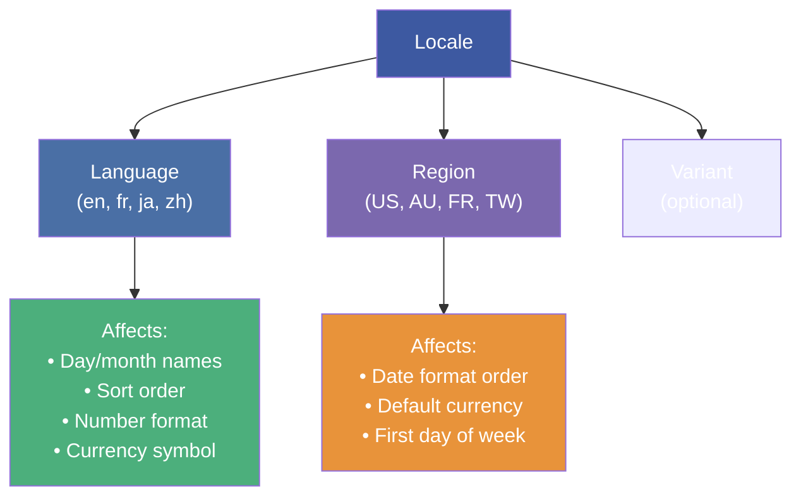
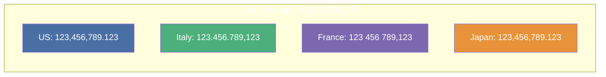
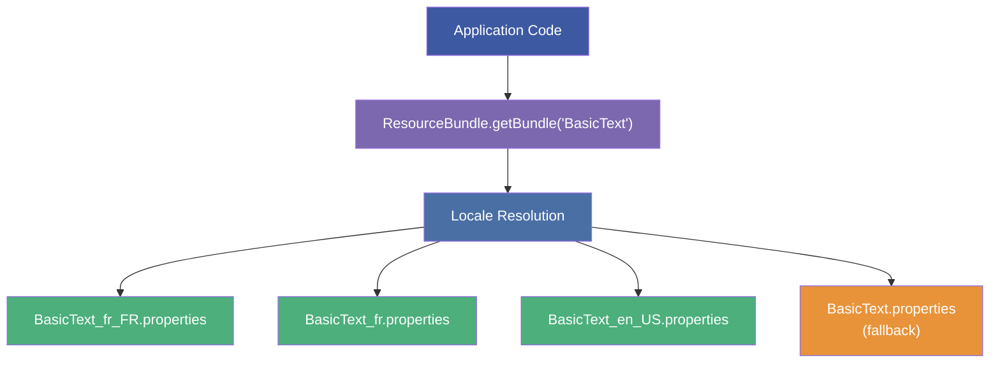
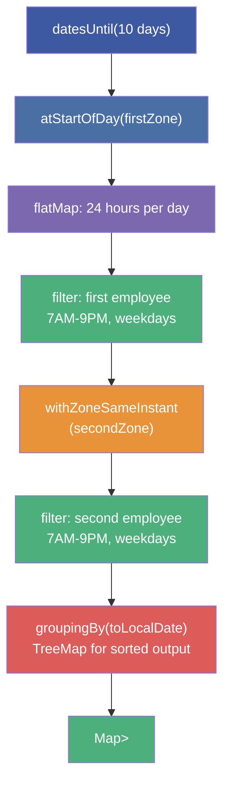

# :material-pencil: Topic Note Part 3: Localization, Internationalization & Cross-Timezone Challenge

> **Course:** Java Programming Masterclass — Tim Buchalka (Udemy)
> **Section:** 18 — Java Core Fundamentals: Math, Randomization, BigDecimal, and DateTime
> **Lectures:** 14–18
> **Status:** :material-check-circle: Complete

---

## :material-target: Learning Objectives

By the end of this part, you should be able to:

- [x] Create `Locale` objects using constructors, `Locale.Builder`, and factory methods
- [x] Format dates with locale-specific patterns using `DateTimeFormatter.withLocale()`
- [x] Format numbers and currencies using `NumberFormat` and `Currency`
- [x] Understand locale resolution and the `Locale.getDisplayName()` method
- [x] Use `ResourceBundle` for multi-language application support
- [x] Understand the property file naming convention and fallback chain
- [x] Build a cross-timezone meeting scheduler using streams and zone-aware date/time

---

## :material-translate: 1. The `Locale` Class — Language & Region

### What Is a Locale?

A `Locale` object represents a specific geographical, political, or cultural region. It primarily consists of:

- **Language code** — ISO 639-1 (e.g., `en`, `fr`, `ja`)
- **Country/region code** — ISO 3166-1 alpha-2 (e.g., `US`, `AU`, `FR`)



### Creating Locales

```java
// Using constructors (deprecated in newer JDKs but common)
Locale en = new Locale("en");                    // Language only
Locale enAU = new Locale("en", "AU");            // English - Australia
Locale enCA = new Locale("en", "CA");            // English - Canada

// Using Locale.Builder (recommended)
Locale enIN = new Locale.Builder()
    .setLanguage("en")
    .setRegion("IN")
    .build();

// Using predefined constants
Locale us = Locale.US;                           // en_US
Locale uk = Locale.UK;                           // en_GB
Locale france = Locale.FRANCE;                   // fr_FR
Locale japan = Locale.JAPAN;                     // ja_JP

// From language tag (IETF BCP 47)
Locale fromTag = Locale.forLanguageTag("en-AU"); // English - Australia

// Set system default
Locale.setDefault(Locale.US);
```

### Display Names

```java
Locale.FRANCE.getDisplayName();                  // "French (France)"  — in default locale
Locale.FRANCE.getDisplayName(Locale.FRANCE);     // "français (France)" — in French!

Locale.JAPAN.getDisplayName();                   // "Japanese (Japan)"
Locale.JAPAN.getDisplayName(Locale.JAPAN);       // "日本語 (日本)"
```

---

## :material-calendar-clock: 2. Locale-Aware Date Formatting

### Using `DateTimeFormatter.withLocale()`

```java
var dtf = DateTimeFormatter.ofLocalizedDateTime(FormatStyle.MEDIUM);

for (var locale : List.of(Locale.US, Locale.UK, Locale.FRANCE, Locale.JAPAN)) {
    System.out.println(locale.getDisplayName() + " = " +
        LocalDateTime.now().format(dtf.withLocale(locale)));
}
// English (United States) = May 7, 2026, 6:15:00 PM
// English (United Kingdom) = 7 May 2026, 18:15:00
// French (France) = 7 mai 2026, 18:15:00
// Japanese (Japan) = 2026/05/07 18:15:00
```

### Custom Pattern with Localized Names

```java
DateTimeFormatter wDayMonth = DateTimeFormatter.ofPattern("EEEE, MMMM, d, yyyy");
LocalDate may5 = LocalDate.of(2026, 5, 6);

for (var locale : List.of(Locale.CANADA, Locale.CANADA_FRENCH,
        Locale.FRANCE, Locale.TAIWAN, Locale.JAPAN, Locale.ITALY)) {
    System.out.println(locale.getDisplayName(locale) + " = " +
        may5.format(wDayMonth.withLocale(locale)));
}
// English (Canada) = Wednesday, May, 6, 2026
// français (Canada) = mercredi, mai, 6, 2026
// français (France) = mercredi, mai, 6, 2026
// 中文 (台灣) = 星期三, 五月, 6, 2026
// 日本語 (日本) = 水曜日, 5月, 6, 2026
// italiano (Italia) = mercoledì, maggio, 6, 2026
```

### Printf with Locale

```java
System.out.print(String.format(
    Locale.FRANCE,
    "\t%1$tA, %1$tB, %1$te, %1$tY %n",
    may5
));
// mercredi, mai, 6, 2026
```

---

## :material-currency-usd: 3. Locale-Aware Number & Currency Formatting

### `NumberFormat` — Decimal Formatting

```java
NumberFormat decimalInfo = NumberFormat.getNumberInstance(Locale.ITALY);
decimalInfo.setMaximumFractionDigits(6);
System.out.println(decimalInfo.format(123456789.123456));
// 123.456.789,123456  (Italian uses . for thousands, , for decimal)
```

### `Currency` — Currency Formatting

```java
for (var locale : List.of(Locale.CANADA, Locale.FRANCE, Locale.JAPAN, Locale.ITALY)) {
    NumberFormat currency = NumberFormat.getCurrencyInstance(locale);
    Currency localCurrency = Currency.getInstance(locale);

    System.out.println(
        currency.format(555.555) + " [" +
        localCurrency.getCurrencyCode() + "] " +
        localCurrency.getDisplayName(locale) + " / " +
        localCurrency.getDisplayName()
    );
}
// CA$555.56 [CAD] dollar canadien / Canadian Dollar
// 555,56 € [EUR] euro / Euro
// ￥556 [JPY] 日本円 / Japanese Yen
// € 555,56 [EUR] euro / Euro
```



### Scanner with Locale

```java
Scanner scanner = new Scanner(System.in);
scanner.useLocale(Locale.ITALY);            // Expect comma as decimal separator

System.out.println("Enter the loan amount: ");
BigDecimal myLoan = scanner.nextBigDecimal(); // User enters "1.234,56"

NumberFormat italian = NumberFormat.getNumberInstance(Locale.ITALY);
System.out.println("My Loan: " + italian.format(myLoan));
// My Loan: 1.234,56
```

---

## :material-book-multiple: 4. `ResourceBundle` — Internationalization (i18n)

### What Is a ResourceBundle?

A `ResourceBundle` is a mechanism to store **locale-specific data** (strings, messages) in separate files, enabling multi-language applications without code changes.



### Property File Convention

```
BasicText.properties              ← Default fallback
BasicText_en.properties           ← English (any region)
BasicText_en_US.properties        ← English (US)
BasicText_fr.properties           ← French (any region)
BasicText_fr_FR.properties        ← French (France)
BasicText_ja_JP.properties        ← Japanese (Japan)
```

**Example `BasicText.properties`:**
```properties
hello=Hello
world=World
goodbye=Goodbye
```

**Example `BasicText_fr.properties`:**
```properties
hello=Bonjour
world=Monde
goodbye=Au revoir
```

### Using ResourceBundle

```java
ResourceBundle rb = ResourceBundle.getBundle("BasicText");
System.out.println(rb.getClass().getName());     // java.util.PropertyResourceBundle
System.out.println(rb.getBaseBundleName());       // BasicText
System.out.println(rb.keySet());                  // [hello, world, goodbye]

System.out.printf("%s %s!%n",
    rb.getString("hello"), rb.getString("world"));
// Hello World!
```

### Fallback Chain

When resolving a bundle for `Locale("fr", "FR")`:

1. Look for `BasicText_fr_FR.properties`
2. If not found → `BasicText_fr.properties`
3. If not found → `BasicText.properties` (default)
4. If not found → `MissingResourceException`

### ListResourceBundle (Programmatic Alternative)

Instead of property files, you can extend `ListResourceBundle` in Java code:

```java
public class BasicText_fr extends ListResourceBundle {
    @Override
    protected Object[][] getContents() {
        return new Object[][] {
            {"hello", "Bonjour"},
            {"world", "Monde"},
            {"goodbye", "Au revoir"}
        };
    }
}
```

!!! tip "ListResourceBundle vs Properties"
    - **Properties files**: Simple key-value strings, easy for translators
    - **ListResourceBundle**: Can store any `Object` (not just strings), allows computation

---

## :material-trophy: 5. Final Challenge: Cross-Timezone Meeting Scheduler

### The Problem

Schedule overlapping working hours between employees in different time zones over 10 days, respecting:
- Business hours (7 AM – 9 PM)
- No weekends (Saturday/Sunday)
- Daylight savings transitions

### Domain Model

```java
private record Employee(String name, Locale locale, ZoneId zone) {

    // Convenience constructor from String locale and zone
    public Employee(String name, String locale, String zone) {
        this(name, Locale.forLanguageTag(locale), ZoneId.of(zone));
    }

    String getDateInfo(ZonedDateTime zdt, DateTimeFormatter dtf) {
        return "%s [%s] : %s".formatted(name, zone,
            zdt.format(dtf.localizedBy(locale)));
    }
}
```

### Scheduling Logic

```java
private static Map<LocalDate, List<ZonedDateTime>> schedule(
        Employee first, Employee second, int days) {

    Predicate<ZonedDateTime> rules = zdt ->
        zdt.getDayOfWeek() != DayOfWeek.SATURDAY
        && zdt.getDayOfWeek() != DayOfWeek.SUNDAY
        && zdt.getHour() >= 7 && zdt.getHour() < 21;

    LocalDate startingDate = LocalDate.now().plusDays(2);

    return startingDate.datesUntil(startingDate.plusDays(days + 1))
        .map(dt -> dt.atStartOfDay(first.zone()))          // Start of day in first's zone
        .flatMap(dt -> IntStream.range(0, 24)              // Generate all 24 hours
            .mapToObj(dt::withHour))
        .filter(rules)                                      // Filter first employee's hours
        .map(dtz -> dtz.withZoneSameInstant(second.zone())) // Convert to second's zone
        .filter(rules)                                      // Filter second employee's hours
        .collect(
            Collectors.groupingBy(ZonedDateTime::toLocalDate,
                TreeMap::new, Collectors.toList()));         // Group by date, sorted
}
```

### Execution

```java
Employee jane = new Employee("Jane", Locale.US, "America/Los_Angeles");
Employee joe = new Employee("Joe", "en-AU", "Australia/Sydney");

// Check DST and offset
ZoneRules joeRules = joe.zone().getRules();
ZoneRules janeRules = jane.zone().getRules();

ZonedDateTime janeNow = ZonedDateTime.now(jane.zone());
long hoursBetween = Duration.between(janeNow,
    ZonedDateTime.of(janeNow.toLocalDateTime(), joe.zone())).toHours();
System.out.println("Joe is " + Math.abs(hoursBetween) + " hours " +
    ((hoursBetween < 0) ? "behind" : "ahead"));

// Generate schedule
var map = schedule(joe, jane, 10);
DateTimeFormatter dtf = DateTimeFormatter.ofLocalizedDateTime(
    FormatStyle.FULL, FormatStyle.SHORT);

for (LocalDate ldt : map.keySet()) {
    System.out.println(ldt.format(DateTimeFormatter.ofLocalizedDate(FormatStyle.FULL)));
    for (ZonedDateTime zdt : map.get(ldt)) {
        System.out.println("\t" +
            jane.getDateInfo(zdt, dtf) + " <---> " +
            joe.getDateInfo(zdt.withZoneSameInstant(joe.zone()), dtf));
    }
}
```

### Pipeline Visualization



Key insights from this challenge:
- `datesUntil` + `flatMap` + `IntStream.range` generates every hour of every day
- **Two-pass filtering** — filter by first employee's rules, convert timezone, filter by second's rules
- `TreeMap::new` as the map factory ensures chronological ordering
- `localizedBy(locale)` on `DateTimeFormatter` applies locale-specific formatting

---

## :material-alert: Common Pitfalls

### 1. Locale Constructor Deprecation

```java
// ⚠️ Constructor is deprecated in newer JDKs
Locale en = new Locale("en", "US");

// ✅ Use Locale.Builder or Locale.of() (JDK 19+)
Locale en = new Locale.Builder().setLanguage("en").setRegion("US").build();
```

### 2. NumberFormat Is Locale-Specific

```java
// Italian: "1.234,56" → Scanner must know the locale
Scanner scanner = new Scanner(System.in);
scanner.useLocale(Locale.ITALY);  // ← Required for Italian number format
```

### 3. ResourceBundle Key Misspelling

```java
// MissingResourceException at runtime — no compile-time checking!
rb.getString("helo");  // ❌ Typo — throws MissingResourceException
```

---

## :material-help-circle: Questions Explored

- [x] What components define a `Locale` (language, region, variant)?
- [x] How does `DateTimeFormatter.withLocale()` change formatting?
- [x] What's the difference between `NumberFormat.getNumberInstance()` and `getCurrencyInstance()`?
- [x] How does the ResourceBundle fallback chain work?
- [x] What's the difference between property-based and ListResourceBundle?
- [x] How do you schedule cross-timezone meetings with streams?
- [x] How does `withZoneSameInstant` differ from `withZoneSameLocal`?
- [x] Why must you apply `localizedBy()` to format in a specific locale?

---

## :material-navigation: Related Notes

| Part | Topic | Link |
|:----:|-------|------|
| 1 | Math, Randomization & BigDecimal | [← Part 1](topic-note.md) |
| 2 | Date & Time API | [← Part 2](topic-note-part2.md) |
| 3 | Localization, Internationalization & Challenge | **You are here** |

---

*Last Updated: 2026-05-07*
