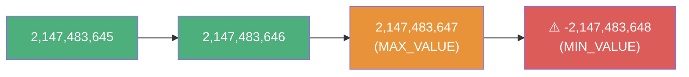
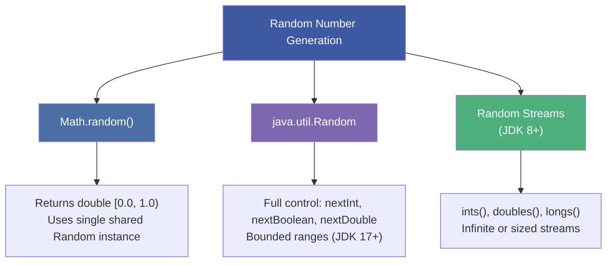
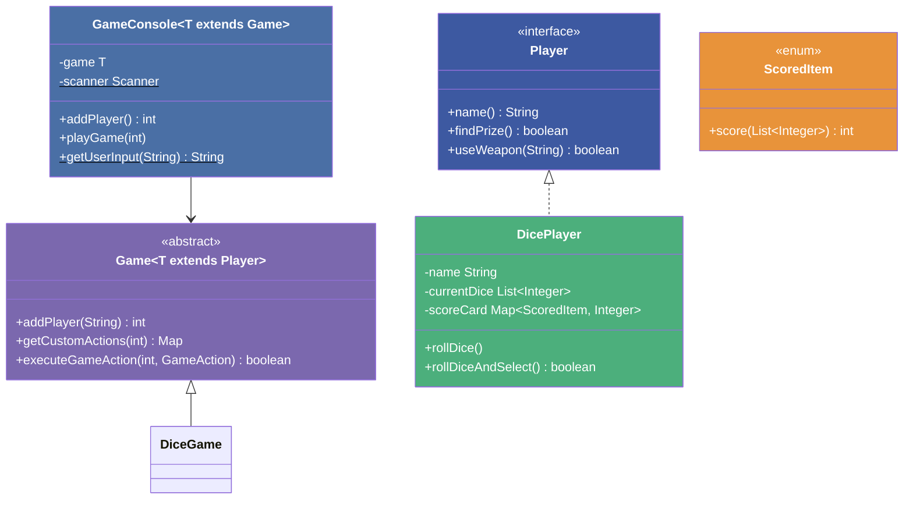
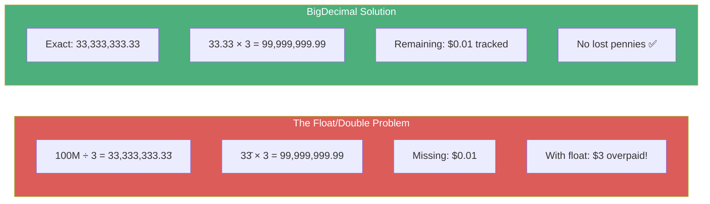

# :material-pencil: Topic Note Part 1: Math Class, Randomization & BigDecimal

> **Course:** Java Programming Masterclass — Tim Buchalka (Udemy)
> **Section:** 18 — Java Core Fundamentals: Math, Randomization, BigDecimal, and DateTime
> **Lectures:** 1–7
> **Status:** :material-check-circle: Complete

---

## :material-target: Learning Objectives

By the end of this part, you should be able to:

- [x] Use the `Math` class for arithmetic operations (abs, max, min, round, floor, ceil, sqrt, pow)
- [x] Detect and prevent integer overflow/underflow with `*Exact` methods
- [x] Generate random numbers using `Math.random()` and `java.util.Random`
- [x] Explain the seed mechanism and pseudorandom number generation
- [x] Use `Random.ints()` to produce stream-based random sequences
- [x] Understand why `float`/`double` are unsuitable for financial arithmetic
- [x] Use `BigDecimal` for arbitrary-precision decimal operations
- [x] Control scale and rounding with `setScale()`, `RoundingMode`, and `MathContext`
- [x] Build a dice rolling game with scoring using enums and game framework

---

## :material-calculator: 1. The `Math` Class — Your Java Calculator

### Overview

The `Math` class is a **utility class** (all static methods, no constructors) in `java.lang`. It provides basic and scientific math functions.

```mermaid
flowchart TD
    MATH["java.lang.Math"] --> BASIC["Basic Operations"]
    MATH --> ROUNDING["Rounding"]
    MATH --> POWER["Powers & Roots"]
    MATH --> OVERFLOW["Overflow Protection"]
    MATH --> CONST["Constants"]

    BASIC --> ABS["abs(x)\nAbsolute value"]
    BASIC --> MAXMIN["max(a,b) / min(a,b)\nLarger / smaller"]

    ROUNDING --> ROUND["round(x)\nNearest whole (≥0.5 rounds up)"]
    ROUNDING --> FLOOR["floor(x)\nAlways rounds down → double"]
    ROUNDING --> CEIL["ceil(x)\nAlways rounds up → double"]

    POWER --> SQRT["sqrt(x)\nSquare root → double"]
    POWER --> POW["pow(base, exp)\nExponentiation → double"]

    OVERFLOW --> INCR["incrementExact / decrementExact"]
    OVERFLOW --> ADDEX["addExact / subtractExact"]
    OVERFLOW --> ABSEX["absExact"]

    CONST --> PI["Math.PI"]
    CONST --> E["Math.E"]

    style MATH fill:#3d59a1,color:#fff
    style BASIC fill:#4a6fa5,color:#fff
    style ROUNDING fill:#7b68ae,color:#fff
    style POWER fill:#4caf7c,color:#fff
    style OVERFLOW fill:#dc5c59,color:#fff
    style CONST fill:#e8933a,color:#fff
```



### Rounding Behavior

```java
System.out.println(Math.round(10.2));   // 10 (rounds down)
System.out.println(Math.round(10.8));   // 11 (rounds up)
System.out.println(Math.round(10.5));   // 11 (0.5 rounds UP)

System.out.println(Math.floor(10.8));   // 10.0 (always down → double)
System.out.println(Math.ceil(10.2));    // 11.0 (always up → double)
```

| Method | Returns | Behavior at 0.5 |
|--------|---------|:---:|
| `round(double)` | `long` | Rounds **up** |
| `round(float)` | `int` | Rounds **up** |
| `floor(double)` | `double` | Always down |
| `ceil(double)` | `double` | Always up |

### Powers and Roots

```java
System.out.println(Math.sqrt(100));       // 10.0
System.out.println(Math.pow(2, 3));       // 8.0  (2³)
System.out.println(Math.pow(10, 5));      // 100000.0  (10⁵)
```

!!! info "Both `sqrt` and `pow` Always Return `double`"
    Even `Math.pow(2, 3)` returns `8.0`, not `8`. Cast to `int` if you need an integer result.

---

## :material-alert: 2. Integer Overflow & The `*Exact` Methods

### The Silent Overflow Problem

```java
int maxMinusFive = Integer.MAX_VALUE - 5;
for (int j = 0, id = maxMinusFive; j < 10; id++, j++) {
    System.out.printf("Assigning id %d%n", id);
}
// After iteration 6: ids go NEGATIVE silently!
// 2,147,483,642 → 2,147,483,647 → -2,147,483,648 (wrap-around)
```



### Protection with `*Exact` Methods

```java
for (int j = 0, id = maxMinusFive; j < 10;
     id = Math.incrementExact(id), j++) {
    System.out.printf("Assigning id %d%n", id);
}
// ✅ Throws ArithmeticException: integer overflow
```

| Method | Throws If |
|--------|-----------|
| `Math.incrementExact(int)` | Result > `Integer.MAX_VALUE` |
| `Math.decrementExact(int)` | Result < `Integer.MIN_VALUE` |
| `Math.addExact(int, int)` | Sum overflows |
| `Math.subtractExact(int, int)` | Difference overflows |
| `Math.absExact(int)` | `abs(Integer.MIN_VALUE)` — can't represent as positive `int` |

### The `abs(Integer.MIN_VALUE)` Trap

```java
System.out.println(Math.abs(-50));                // 50 ✅
System.out.println(Math.abs(Integer.MIN_VALUE));   // -2147483648 ⚠️ (STILL negative!)
// System.out.println(Math.absExact(Integer.MIN_VALUE)); // ArithmeticException ✅
System.out.println(Math.abs((long) Integer.MIN_VALUE)); // 2147483648 ✅ (cast to long first)
```

!!! danger "Why `abs(MIN_VALUE)` Is Negative"
    `Integer.MIN_VALUE` is `-2,147,483,648`. Its absolute value would be `2,147,483,648` — but `Integer.MAX_VALUE` is only `2,147,483,647`. The result **overflows back to negative**. Use `absExact()` to catch this, or cast to `long` first.

---

## :material-dice-6: 3. Random Number Generation

### Three Approaches to Randomization



### `Math.random()` — The Simple Way

```java
// Returns a double in [0.0, 1.0)
// Internally: creates ONE Random instance, calls nextDouble()

// To get integers 1-10:
int randomInt = (int) (Math.random() * 10) + 1;

// To get random uppercase letters (A-Z):
for (int i = 0; i < 10; i++) {
    System.out.printf("%1$d = %1$c%n", (int) (Math.random() * 26) + 65);
}
```

### `java.util.Random` — Full Control

```java
Random r = new Random();

// Bounded: [65, 91) → characters A–Z
r.nextInt(65, 91);                    // JDK 17+ two-arg overload

// Using character casts for readability
r.nextInt((int) 'A', (int) 'Z' + 1); // Same result, clearer intent

// Negative ranges are supported
r.nextInt(-10, 11);                    // [-10, 10]

// No-arg nextInt → full int range (may be negative!)
r.nextInt();                           // any int from MIN_VALUE to MAX_VALUE
```

### Stream-Based Random Numbers (JDK 8+)

```java
Random r = new Random();

// Infinite stream → must limit
r.ints()                              // IntStream of full-range ints
    .limit(10)
    .forEach(System.out::println);

// Bounded infinite stream
r.ints(0, 10)                         // IntStream of [0, 10)
    .limit(10)
    .forEach(System.out::println);

// Finite stream (size as first arg)
r.ints(10, 0, 10)                     // 10 ints in [0, 10)
    .forEach(System.out::println);

// Size-only → full range, finite
r.ints(10)                            // 10 ints, full range
    .forEach(System.out::println);
```

!!! warning "Single-Argument `ints(n)` — It's the SIZE, Not the Bound"
    `r.ints(10)` produces **10** random ints (full range), not ints from **0 to 10**. The single argument specifies the **stream size**.

### Seeds & Pseudorandom Determinism

```java
long nanoTime = System.nanoTime();

Random pseudoRandom = new Random(nanoTime);        // Seeded
pseudoRandom.ints(10, 0, 10).forEach(i -> System.out.print(i + " "));

Random notReallyRandom = new Random(nanoTime);     // Same seed!
notReallyRandom.ints(10, 0, 10).forEach(i -> System.out.print(i + " "));

// ⚠️ BOTH produce the SAME sequence because they share the same seed!
```

!!! tip "When to Use a Seed"
    Seeds are useful for **testing** — when you need reproducible "random" sequences. The no-arg `Random()` constructor internally uses `System.nanoTime()` XOR'd with a uniquifier to ensure distinct seeds across invocations.

---

## :material-trophy: 4. Dice Rolling Challenge

### Basic Implementation

```java
private static final Random random = new Random();
private static final Scanner scanner = new Scanner(System.in);

private static void rollDice(List<Integer> currentDice) {
    int randomCount = 5 - currentDice.size();

    var newDice = random
            .ints(randomCount, 1, 7)     // [1, 6] — six-sided dice
            .sorted()
            .boxed()
            .toList();

    currentDice.addAll(newDice);
    System.out.println("Your dice are: " + currentDice);
}
```

### Advanced Game Framework

The advanced version introduces a **game framework** using generics and interfaces:



Key design points:
- `GameConsole<T extends Game<? extends Player>>` — double-bounded generic type
- `DicePlayer` uses `EnumMap<ScoredItem, Integer>` for O(1) category lookups
- Stream pipeline to generate sorted dice: `random.ints(n, 1, 7).sorted().boxed().toList()`

---

## :material-currency-usd: 5. BigDecimal — Precision for Financial Applications

### Why Not `float`/`double`?

```java
double policyAmount = 100_000_000;
int beneficiaries = 3;

float percentageFloat = 1.0f / beneficiaries;
double percentage = 1.0 / beneficiaries;

System.out.printf("Float payout = %,.2f%n", policyAmount * percentageFloat);
// Float payout = 33,333,334.00 (ONE DOLLAR over!)

System.out.printf("Double payout = %,.2f%n", policyAmount * percentage);
// Double payout = 33,333,333.33 (looks correct, but...)

// Reconciliation check
double total = policyAmount - ((policyAmount * percentage) * beneficiaries);
System.out.printf("Remaining = %,.2f%n", total);
// Remaining = 0.00 — where's the missing penny?
```



### How BigDecimal Works Internally

BigDecimal stores a number as two integer fields:

| Field | Type | Purpose |
|-------|------|---------|
| **Unscaled Value** | `BigInteger` | All digits without decimal point |
| **Scale** | `int` | Number of digits after decimal point |

```java
// "15.456" → unscaled: 15456, scale: 3, precision: 5
// "8"      → unscaled: 8,     scale: 0, precision: 1
// ".123"   → unscaled: 123,   scale: 3, precision: 3
```

### Creating BigDecimal — String vs Double Constructor

```java
// ✅ ALWAYS use String constructor — exact representation
BigDecimal bd1 = new BigDecimal("15.456");

// ❌ NEVER use double constructor — inherits floating-point approximation
BigDecimal bd2 = new BigDecimal(15.456);
// bd2 = 15.45600000000000039...

// ✅ Alternative: BigDecimal.valueOf(double) — uses Double.toString() internally
BigDecimal bd3 = BigDecimal.valueOf(15.456);
// bd3 = 15.456 (predictable, but still limited to double's 16-digit precision)
```

!!! danger "Rule #1: Never Use `new BigDecimal(double)`"
    The `double` constructor captures the floating-point approximation, not the decimal you intended. **Always use the String constructor** or `BigDecimal.valueOf()`.

### Arithmetic Operations

```java
BigDecimal policyPayout = new BigDecimal("100000000.00");

// Division with MathContext (required for repeating decimals)
BigDecimal percent = BigDecimal.ONE.divide(
    BigDecimal.valueOf(3),
    new MathContext(60, RoundingMode.UP)
);
// 0.333333333333333333333333333333333333333333333333333333333334

// Multiplication
BigDecimal checkAmount = policyPayout.multiply(percent);

// Set scale to 2 decimal places (financial)
checkAmount = checkAmount.setScale(2, RoundingMode.HALF_UP);
// 33,333,333.34

// Reconciliation
BigDecimal totalChecks = checkAmount.multiply(BigDecimal.valueOf(3));
BigDecimal remaining = policyPayout.subtract(totalChecks);
// remaining = -0.02 (tracked, not lost!)
```

### Scale Rules for BigDecimal Operations

| Operation | Result Scale |
|-----------|:---:|
| `add` / `subtract` | `max(scale1, scale2)` |
| `multiply` | `scale1 + scale2` |
| `divide` | Must specify via `MathContext` or `setScale` |

!!! warning "BigDecimal Is Immutable!"
    Every method returns a **new** BigDecimal instance. You must reassign:
    ```java
    bd.setScale(2, RoundingMode.HALF_UP);          // ❌ Return value ignored!
    bd = bd.setScale(2, RoundingMode.HALF_UP);     // ✅ Reassigned
    ```

### RoundingMode Reference

| Mode | Behavior | Example (1.5 → scale 0) |
|------|----------|:---:|
| `UP` | Away from zero | 2 |
| `DOWN` | Toward zero | 1 |
| `CEILING` | Toward +∞ | 2 |
| `FLOOR` | Toward −∞ | 1 |
| `HALF_UP` | ≥ 0.5 → up (standard rounding) | 2 |
| `HALF_DOWN` | > 0.5 → up | 1 |
| `HALF_EVEN` | Banker's rounding (nearest even) | 2 |
| `UNNECESSARY` | Assert no rounding needed | Exception if rounding required |

### MathContext Presets

```java
MathContext.UNLIMITED    // No rounding — throws for repeating decimals
MathContext.DECIMAL32    // 7 digits precision (like float)
MathContext.DECIMAL64    // 16 digits precision (like double)
MathContext.DECIMAL128   // 34 digits precision

// Custom:
new MathContext(60, RoundingMode.UP)  // 60 digits, round up
```

---

## :material-help-circle: Questions Explored

- [x] What's the difference between `round`, `floor`, and `ceil`?
- [x] Why does `Math.abs(Integer.MIN_VALUE)` return a negative number?
- [x] How do the `*Exact` methods protect against overflow?
- [x] What's the difference between `Math.random()` and `Random.nextInt()`?
- [x] How do seeds affect pseudorandom number generation?
- [x] Why should you never use `new BigDecimal(double)`?
- [x] What are precision and scale in BigDecimal?
- [x] How do you choose the right `RoundingMode`?
- [x] What's the difference between `MathContext` and `setScale`?

---

## :material-navigation: Related Notes

| Part | Topic | Link |
|:----:|-------|------|
| 1 | Math, Randomization & BigDecimal | **You are here** |
| 2 | Date & Time API | [Part 2 →](topic-note-part2.md) |
| 3 | Localization, Internationalization & Challenge | [Part 3 →](topic-note-part3.md) |

---

*Last Updated: 2026-05-07*
