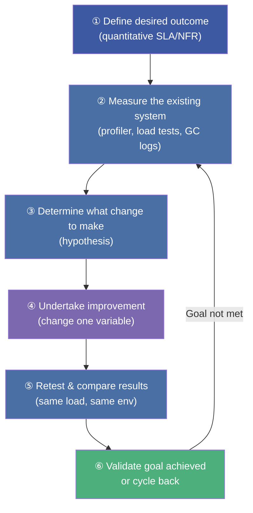
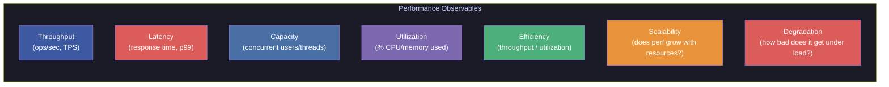
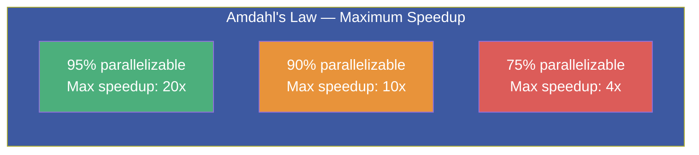
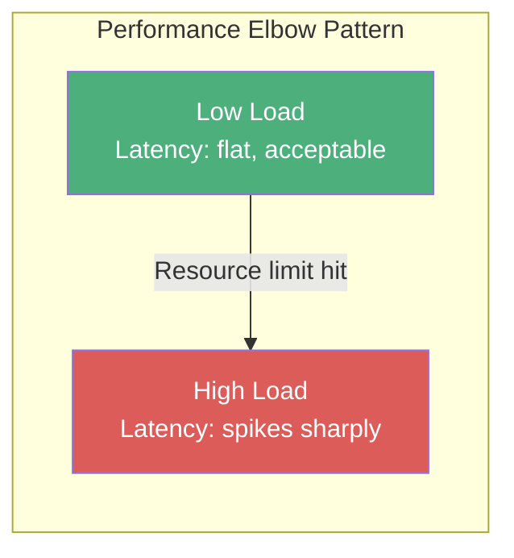
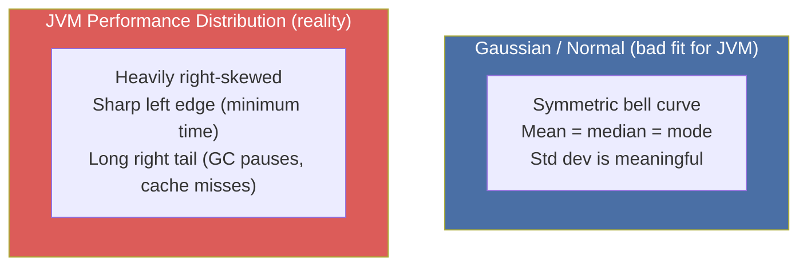
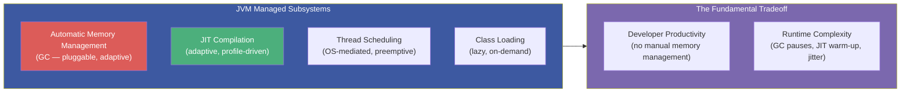

# :material-speedometer: Chapter 1: Optimizing Java — Introduction & Performance Vocabulary

> **Book:** Optimizing Java — Practical Techniques for Improving JVM Application Performance
>
> **Authors:** Benjamin J. Evans, James Gough, Chris Newland
>
> **Chapter:** 1 — Optimizing Java: What This Book Is About
>
> **Status:** :material-check-circle: Complete

---

## :material-target: Learning Objectives

By the end of this chapter, you should be able to:

- [x] Articulate why Java performance is an **experimental science** — not a bag of tricks
- [x] Define and apply the seven core **performance observables** (Throughput, Latency, Capacity, Utilization, Efficiency, Scalability, Degradation)
- [x] Explain why standard (Gaussian) statistics are misleading for JVM measurements
- [x] Read and interpret performance graphs: performance elbows, sawtooth GC patterns, allocation rate charts
- [x] Understand the traps of premature optimization and measurement-free tuning

---

## :material-flask: 1. Performance as an Experimental Science

This chapter opens with a critical reframing: **Java performance tuning is not about memorizing JVM flags or applying cargo-cult optimizations.** It is empirical, measurement-driven engineering.



!!! important "The Engineer's Creed"
    A measurement not clearly defined is worse than useless. — *Eli Goldratt*

    Performance is achieved by **defining and achieving nonfunctional requirements (NFRs)** — not by guessing.

### Disciplines of Performance Engineering

A skilled Java performance engineer must master **five distinct disciplines**:

| Discipline | What It Means |
|-----------|--------------|
| **Methodology** | Fitting performance work into the software lifecycle (not just at crisis time) |
| **Testing Theory** | Designing fair, repeatable experiments with controlled variables |
| **Measurement & Statistics** | Choosing right metrics; understanding non-normal distributions |
| **Analysis Skills** | Reading profiler output, GC logs, thread dumps, flame graphs |
| **Underlying Technology** | How the JVM, JIT, GC, OS scheduler, CPU caches actually work |

!!! tip "The Most Dangerous Myth"
    There are **no magic "go faster" JVM switches**, no hidden tricks, no secret algorithm repositories. Anyone claiming otherwise is selling snake oil.

---

## :material-chart-line: 2. A Taxonomy for Performance — The Seven Observables

Every performance exercise must be framed in terms of **quantitative, measurable observables**. The book defines exactly seven:



### Throughput

> **Rate of work** the system performs — e.g., transactions per second (TPS), requests per second (RPS), messages per second.

- Must always be stated with a **reference platform** (hardware spec, JVM version, OS)
- Increasing throughput usually requires either more resources or more efficient code

### Latency

> **Time elapsed** from request to response — the most user-visible metric.

- Expressed as distributions (p50, p90, p99, p99.9), **not averages**
- Low average latency can coexist with devastating p99 latency — always use percentiles
- **Goal:** usually to meet a specific SLA (e.g., p99 < 100ms)

!!! warning "The Mean Is Lying to You"
    For JVM workloads, the **arithmetic mean is nearly useless**. A single 10-second GC pause in 10,000 requests barely moves the mean but ruins the p99.9 and causes visible user impact. Always report percentiles.

### Capacity

> The **number of units of work** the system can handle simultaneously (concurrent users, connections, threads-in-flight).

- Closely linked to thread pool sizing, connection pool limits, and GC pause tolerance

### Utilization

> The **fraction of resource capacity in use** — CPU%, heap occupancy%, network bandwidth%.

- High utilization near 100% is a warning sign; the system has no headroom
- For GC-heavy workloads, CPU utilization from GC threads should be tracked separately

### Efficiency

> **Throughput per unit of resource** — how much work you get per CPU core, per GB of RAM. Tells you whether you're getting value from hardware investment.

### Scalability

> Does the system **scale proportionally** as resources are added?



!!! important "Amdahl's Law — The Scalability Ceiling"
    Even if **only 5% of your algorithm is serial**, the maximum possible speedup is **20x** regardless of how many CPU cores you add. And the x-axis of Amdahl's graph is **logarithmic** — 32 cores give only a 12x speedup for a 95% parallel algorithm. Most real algorithms are far more than 5% serial.

### Degradation

> How does the system **behave under increasing load** — does latency stay flat, or does it elbow upward?

The **performance elbow** is a critical pattern: a system handles load gracefully until a resource limit is hit, then latency explodes suddenly.

---

## :material-chart-bar: 3. Reading Performance Graphs — Critical Patterns

### Pattern 1: The Performance Elbow



A **performance elbow** appears in latency-vs-load graphs when a resource becomes saturated (thread pool exhaustion, GC overhead limit, connection pool starvation). The system seems fine, then suddenly breaks.

### Pattern 2: The GC Sawtooth

Healthy Java applications show a **sawtooth pattern** in memory usage graphs:

- Memory climbs as objects are allocated
- Memory drops sharply as GC reclaims space
- The pattern repeats regularly

A broken sawtooth (teeth getting progressively taller, or the floor rising) indicates a **memory leak** or **premature tenuring**.

### Pattern 3: Allocation Rate Cliff

If the allocation rate drops suddenly while throughput also drops, the application is **GC-throttled** — the GC threads are consuming so much CPU that the application threads can't allocate fast enough. Over 4 GB/sec allocation is considered dangerous for most hardware.

### Pattern 4: Degrading Latency Under Load

Slow, steady latency degradation that accelerates as load increases is the signature of a **resource leak** (thread-local memory, file handles, connection pool entries that are not returned).

---

## :material-alert: 4. Why JVM Statistics Are Different — The Non-Normal Problem

Standard statistical techniques assume a **normal (Gaussian) distribution**. JVM performance data is almost **never** normally distributed.



!!! danger "Std Dev Is Meaningless for JVM Data"
    Standard deviation assumes symmetric, Gaussian data. JVM response times have a **hard lower bound** (minimum execution time) and a **long tail** of slow outliers from GC pauses and OS scheduling jitter. Applying `mean ± σ` to JVM data produces **incorrect and misleading** conclusions.

### The Right Approach: Logarithmic Percentiles

Instead of mean and std dev, use a sampling of the distribution that reflects the long-tail shape:

```
50th percentile  (p50)   : 23 ns   — typical case
90th percentile  (p90)   : 30 ns   — most users see this or better
99th percentile  (p99)   : 43 ns   — 1 in 100 is this slow
99.9th percentile (p99.9): 164 ns  — 1 in 1,000 → real outlier
99.99th percentile       : 248 ns  — 1 in 10,000
99.999th percentile      : 3,458 ns — 1 in 100,000
```

This logarithmic sampling pattern matches the shape of the distribution — the bulk of the data is sampled at p50, and the increasingly rare but important outliers are captured at p99.9+.

### HdrHistogram — The Right Tool

[HdrHistogram](https://github.com/HdrHistogram/HdrHistogram) by Gil Tene (Azul Systems) is purpose-built for high dynamic range distributions:

```java
// Maven: org.hdrhistogram:HdrHistogram:2.1.9
Histogram histogram = new Histogram(TimeUnit.MINUTES.toMicros(1), 2);

// Record each measurement
histogram.recordValue(observedNanos);

// Output logarithmic percentile distribution
histogram.outputPercentileDistribution(System.out, 1000.0);
```

!!! tip "Dynamic Range"
    The **dynamic range** = maximum value / minimum value. JVM distributions often have a dynamic range of 1,000x or more. Standard statistics discard this information; HdrHistogram preserves it.

---

## :material-information: 5. The JVM's Managed Complexity

Java deliberately chose **managed subsystems** over zero-overhead abstractions:



This complexity means:

1. **Measurements must be treated as experiments** — the JVM is adaptive and changes behavior over time
2. **Outliers are critically important** — GC pauses and JIT compilation events create spikes that Gaussian statistics wash out
3. **Sampling has observer effect** — frequent measurement itself can alter JVM behavior
4. **Warmup is mandatory** — the JVM is not in its "steady state" until JIT compilation has profiled and compiled hot paths

---

## :material-alert-circle: 6. Common Mistakes in Java Performance Work

### Mistake 1: Cargo-Cult JVM Flags

Copying JVM flags from blog posts or Stack Overflow without measuring their effect on **your specific workload** is one of the most common and dangerous mistakes. A flag that helps a batch processing application can actively harm a low-latency trading system.

### Mistake 2: Premature Optimization

Optimizing before measuring is like prescribing medicine before diagnosing. You may "cure" a problem that wasn't the bottleneck and create new ones.

### Mistake 3: Measuring With the Wrong Tool

Using `System.currentTimeMillis()` for nanosecond-precision benchmarks, using `-client` mode JVM when production uses `-server`, or measuring on an underloaded test machine all produce invalid data.

### Mistake 4: Ignoring Outliers

Reporting only `mean` latency while ignoring p99 means your "fast" application is failing real users on every 1-in-100 request.

### Mistake 5: Observer Effect

Enabling `-verbose:gc` in production adds GC pause logging overhead. Java agents with reflection-based instrumentation add their own latency. Factor this in when comparing measured vs. unmeasured runs.

---

## :material-help-circle: Questions Explored

- [x] What makes Java performance an experimental science rather than an art?
- [x] Why are the seven performance observables (throughput, latency, capacity, utilization, efficiency, scalability, degradation) each necessary to understand?
- [x] Why is Amdahl's Law a fundamental constraint on scalability?
- [x] What are the three most common patterns seen in performance graphs (elbow, sawtooth, allocation cliff)?
- [x] Why is the arithmetic mean misleading for JVM performance data?
- [x] What is HdrHistogram and why is it preferred for JVM latency analysis?
- [x] What are the five disciplines of a Java performance engineer?

---

## :material-navigation: Related Notes

| Chapter | Topic | Link |
|:-------:|-------|------|
| 1 | Introduction & Performance Vocabulary | **You are here** |
| 2 | JVM Anatomy — Bytecode, JIT & HotSpot | [Ch 2 →](book-reading-ch2.md) |
| 3 | Hardware & OS — CPU Caches, NUMA, Scheduler | [Ch 3 →](book-reading-ch3.md) |
| 4 | Performance Testing Types & Antipatterns | [Ch 4 →](book-reading-ch4.md) |
| 5 | Microbenchmarking & JMH | [Ch 5 →](book-reading-ch5.md) |

---

*Last Updated: 2026-07-16*
