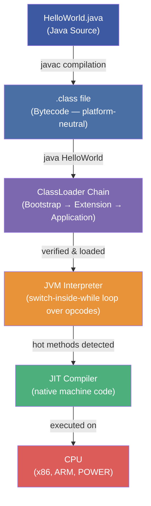
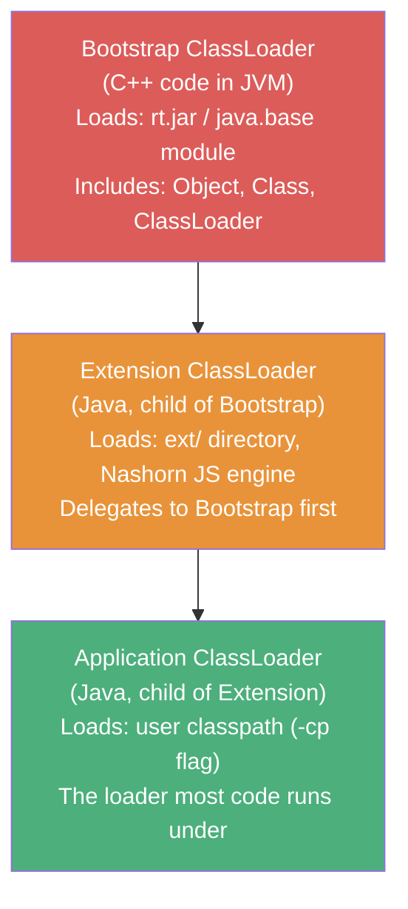
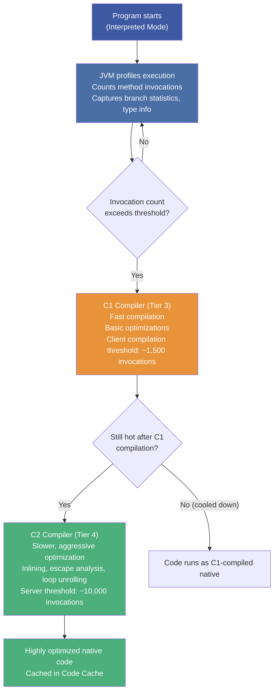
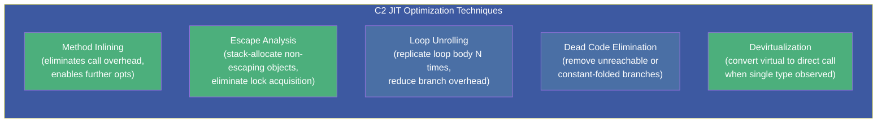
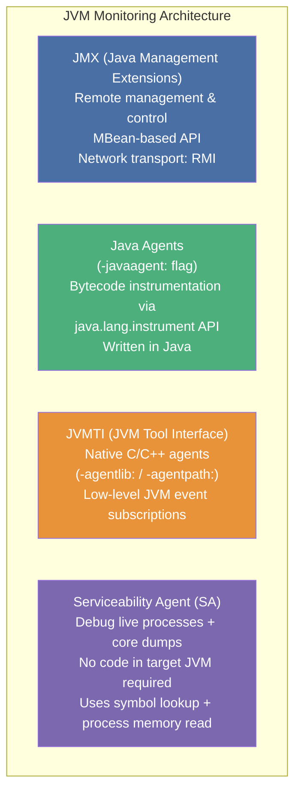

# :material-cpu-64-bit: Chapter 2: Overview of the JVM — Bytecode, Classloading & HotSpot

> **Book:** Optimizing Java — Practical Techniques for Improving JVM Application Performance
>
> **Chapter:** 2 — Overview of the JVM
>
> **Status:** :material-check-circle: Complete

---

## :material-target: Learning Objectives

By the end of this chapter, you should be able to:

- [x] Explain the **three-phase classloading chain** (Bootstrap → Extension → Application)
- [x] Describe how `javac` compiles Java to **bytecode** and what bytecode is
- [x] Read and interpret **`javap` disassembly output**
- [x] Explain how **HotSpot JIT compilation** works and why it outperforms AOT in many cases
- [x] Distinguish the **C1 (client) and C2 (server) JIT compilers** and their compilation tiers
- [x] Understand what **JMX, Java agents, JVMTI, and the Serviceability Agent** are for
- [x] Use **VisualVM** to monitor a running JVM

---

## :material-transit-connection: 1. Interpreting and Classloading

The JVM is defined by the **VM Specification** as a **stack-based interpreted machine**. Instead of CPU registers, it operates on an **evaluation stack** — pushing operands, applying opcodes, and popping results.



### The Classloading Chain

When `java HelloWorld` is invoked, the JVM initializes a **three-level delegation chain** of classloaders:



!!! important "Delegation Model — Parent First"
    When an `Application ClassLoader` receives a `loadClass(name)` request, it **first delegates to its parent** (Extension), which delegates to Bootstrap. Only if no parent can find the class does the child attempt its own load. This prevents untrusted code from replacing `java.lang.String` with a malicious version.

!!! warning "Class Identity = ClassLoader + Class Name"
    The same fully-qualified class name loaded by **two different classloaders** produces **two distinct, incompatible types**. Casting between them throws `ClassCastException`. This is a source of subtle bugs in OSGi and application server environments.

---

## :material-file-code: 2. Executing Bytecode — The Class File Format

`javac` produces `.class` files with a precisely defined binary structure:

| Component | Description |
|-----------|-------------|
| **Magic Number** | `0xCAFEBABE` — identifies a valid class file |
| **Version** | Major + minor class file version (e.g., 65.0 = Java 21) |
| **Constant Pool** | Interned strings, type descriptors, method refs, field refs |
| **Access Flags** | `public`, `abstract`, `final`, `interface`, etc. |
| **This Class / Superclass** | Indexes into the constant pool |
| **Interfaces** | Array of interface type indexes |
| **Fields** | Field declarations with type, modifiers, attributes |
| **Methods** | Method signatures + `Code` attribute (actual bytecode) |
| **Attributes** | `SourceFile`, `LineNumberTable`, `LocalVariableTable`, etc. |

### Reading `javap` Disassembly

For the classic HelloWorld loop:

```java
public class HelloWorld {
    public static void main(String[] args) {
        for (int i = 0; i < 10; i++) {
            System.out.println("Hello World");
        }
    }
}
```

Running `javap -c HelloWorld` produces:

```
public static void main(java.lang.String[]);
  Code:
    0: iconst_0          // push int constant 0 (i = 0)
    1: istore_1          // store into local var slot 1 (i)
    2: iload_1           // push i onto stack
    3: bipush  10        // push byte 10 onto stack
    5: if_icmpge 22      // if i >= 10, jump to 22 (exit loop)
    8: getstatic  #2     // push System.out (PrintStream)
   11: ldc  #3           // push "Hello World" from constant pool
   13: invokevirtual #4  // call println(String)
   16: iinc  1, 1        // increment local var 1 (i++) directly
   19: goto  2           // jump back to loop start
   22: return            // method exit
```

!!! note "Bytecode Insight — `iinc` is Atomic in Bytecode"
    Notice that `i++` in the loop translates to a single `iinc` opcode — **not** a separate load-add-store sequence. However, this is bytecode-level atomicity only; at the JIT-compiled native code level this distinction may not hold. Never rely on bytecode-level instruction "atomicity" for thread safety.

### JVM Opcode Naming Convention

Opcodes are named with a **type prefix + operation + variant**:

- `i` = int, `l` = long, `f` = float, `d` = double, `a` = reference
- `const_N` = push small constant; `push` = push arbitrary value
- `load_N` = load local var N onto stack; `store_N` = pop into local var N
- `invoke{virtual, special, static, interface, dynamic}` = method dispatch

---

## :material-lightning-bolt: 3. Introducing HotSpot — The Adaptive JIT

HotSpot, introduced by Sun in April 1999, is the execution engine that makes JVM performance **competitive with native languages**. Its philosophy is the antithesis of C++'s "zero-overhead abstractions":

> The goal of the HotSpot VM is to allow you to write idiomatic Java and follow good design principles rather than contort your program to fit the VM.

### How JIT Works



### Tiered Compilation (Default Since JDK 8)

Modern HotSpot uses **5 compilation tiers**:

| Tier | Mode | Threshold | Purpose |
|------|------|-----------|---------|
| 0 | Interpreter | — | Profile gathering only |
| 1 | C1 (trivial) | ~100 | Simple methods, no profiling |
| 2 | C1 (limited profile) | ~1,500 | Count-only profiling |
| 3 | C1 (full profile) | ~1,500 | Type + branch profiling |
| 4 | C2 (aggressive opt) | ~10,000–15,000 | Maximum optimization using profiles |

!!! warning "The JIT Warmup Trap"
    **Any benchmark that doesn't account for warmup is producing incorrect results.** The first 10,000+ invocations of a method run in interpreted or C1-compiled mode. Only after C2 compilation does the code reach steady-state performance. This is why naive benchmarks produce wildly variable results.

### Key JIT Optimizations



!!! tip "Inlining Is the King of JIT Optimizations"
    Method inlining is the most impactful JIT optimization because it **unlocks all other optimizations**. Once a callee is inlined into the caller, the JIT can see the complete data flow and apply dead code elimination, escape analysis, constant propagation, and loop optimizations that would be impossible across call boundaries.

### Code Cache

JIT-compiled native code is stored in the **Code Cache** — a fixed-size JVM memory region (outside the Java heap). When the Code Cache fills up, JIT compilation stops and the JVM reverts to interpreted mode. This causes a visible performance cliff.

```java
// Monitor Code Cache with:
// -XX:+PrintCodeCache
// -XX:ReservedCodeCacheSize=256m  (default 240m in Java 17+)
// -XX:+UseCodeCacheFlushing        (flush cold code when full)
```

---

## :material-monitor: 4. Monitoring and Tooling for the JVM

The JVM provides four main mechanisms for instrumentation:



### Java Agent Setup

```java
// MANIFEST.MF
// Premain-Class: com.example.MyAgent

public class MyAgent {
    // Called before main()
    public static void premain(String agentArgs, Instrumentation inst) {
        inst.addTransformer(new MyClassFileTransformer());
    }
}
```

```bash
java -javaagent:/path/to/agent.jar=key=value -jar myapp.jar
```

!!! warning "JVMTI Is Dangerous"
    JVMTI agents are native C/C++ code. A bug in a JVMTI agent can **crash the entire JVM process** — not just throw an exception. Prefer Java agents where possible. Use JVMTI only when data that is inaccessible through the Java Instrumentation API is needed.

### VisualVM — The All-in-One JVM Monitor

VisualVM (successor to the deprecated `jconsole`) provides five key views:

| Tab | Purpose |
|-----|---------|
| **Overview** | Full JVM flags, system properties, exact Java version |
| **Monitor** | Real-time CPU%, heap usage, classes loaded, thread count |
| **Threads** | Per-thread timeline, thread state (RUNNABLE/BLOCKED/WAITING), thread dumps |
| **Sampler** | Statistical CPU + memory sampling (low overhead) |
| **Profiler** | Instrumented CPU + memory profiling (higher accuracy, more overhead) |

The **VisualGC plugin** is particularly valuable — it provides a real-time visual display of Eden, Survivor spaces, and Old Gen with GC event annotations.

!!! note "VisualVM and Java 9+"
    From Java 9 onward, VisualVM was **removed from the JDK distribution**. It must be downloaded separately from [visualvm.github.io](https://visualvm.github.io/). In Java 9+ environments, Java Flight Recorder (JFR) and JDK Mission Control (JMC) are the preferred low-overhead profiling tools.

---

## :material-cogs: 5. The JVM Ecosystem Beyond HotSpot

The book provides an overview of the JVM vendor landscape, which is critical context for performance:

| JVM | Organization | Key Characteristic |
|-----|-------------|-------------------|
| **HotSpot** | Oracle / OpenJDK | Reference implementation; the JVM this book focuses on |
| **Eclipse OpenJ9** | Eclipse (IBM) | Faster startup, lower footprint; used in IBM WebSphere |
| **GraalVM** | Oracle Labs | Polyglot; Graal JIT as alternative to C2; Native Image (AOT) |
| **Amazon Corretto** | Amazon | OpenJDK distribution, LTS patches |
| **Azul Zulu / Zing** | Azul Systems | C4 GC (pauseless), long-term support |

!!! tip "Oracle JDK vs OpenJDK"
    Since 2019, Oracle contributes all commercial features to OpenJDK first, meaning **Oracle JDK and OpenJDK are functionally equivalent**. The only real difference is the **license** — Oracle JDK restricts redistribution and binary patching without a support contract. For most organizations, OpenJDK distributions (Corretto, Temurin, Zulu) are the better choice.

---

## :material-help-circle: Questions Explored

- [x] What is a classloader and why does Java have three of them?
- [x] What does `0xCAFEBABE` signify in a `.class` file?
- [x] What does `javap -c` show you and how do you read it?
- [x] What is the difference between interpreted mode, C1-compiled, and C2-compiled code?
- [x] Why does a JVM application need a warmup period before performance measurements can be trusted?
- [x] What is the Code Cache and what happens when it fills up?
- [x] What are the four JVM monitoring mechanisms and when would you choose each?

---

## :material-navigation: Related Notes

| Chapter | Topic | Link |
|:-------:|-------|------|
| 1 | Introduction & Performance Vocabulary | [← Ch 1](book-reading-ch1.md) |
| 2 | JVM Anatomy — Bytecode, JIT & HotSpot | **You are here** |
| 3 | Hardware & OS — CPU Caches, NUMA, Scheduler | [Ch 3 →](book-reading-ch3.md) |
| 4 | Performance Testing Types & Antipatterns | [Ch 4 →](book-reading-ch4.md) |
| 5 | Microbenchmarking & JMH | [Ch 5 →](book-reading-ch5.md) |

---

*Last Updated: 2026-07-16*
