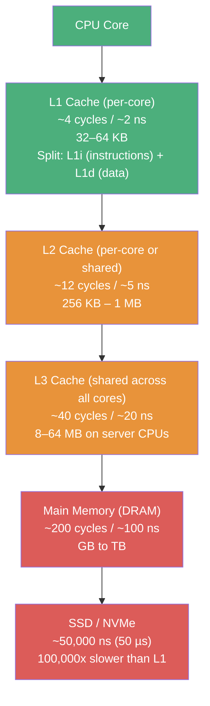
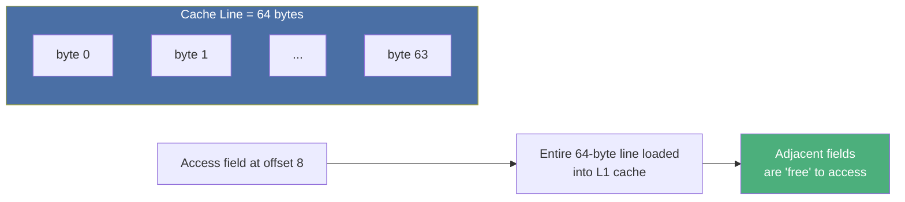
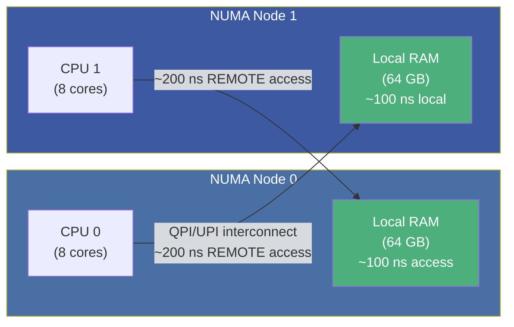
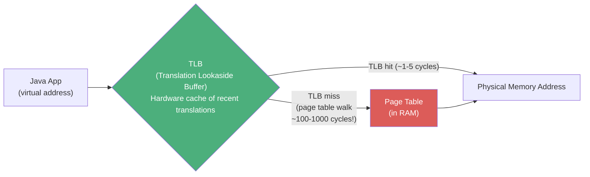
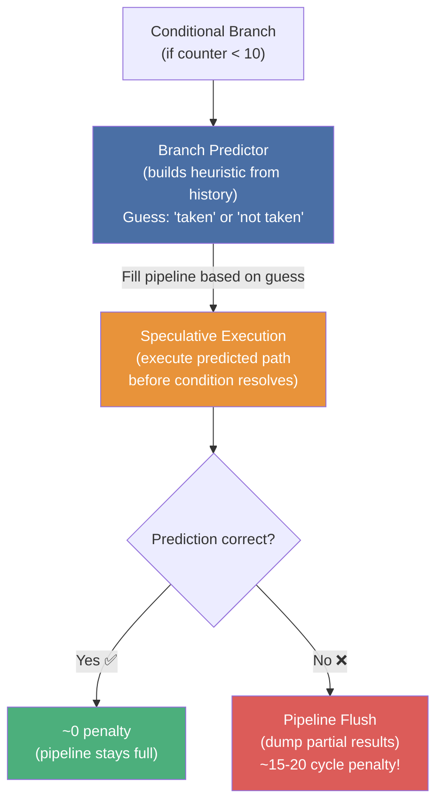
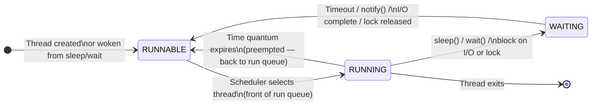
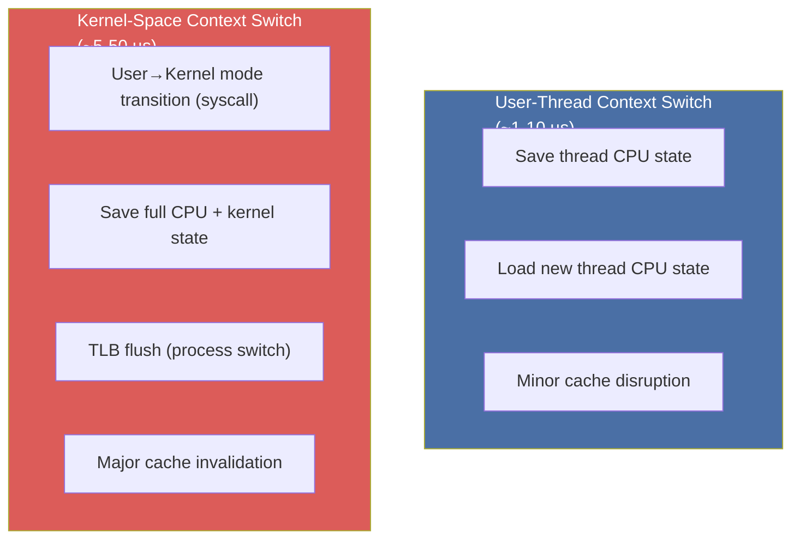

# :material-chip: Chapter 3: Hardware & OS — CPU Caches, NUMA, the Scheduler & Mechanical Sympathy

> **Book:** Optimizing Java — Practical Techniques for Improving JVM Application Performance
>
> **Chapter:** 3 — Hardware and Operating Systems
>
> **Status:** :material-check-circle: Complete

---

## :material-target: Learning Objectives

By the end of this chapter, you should be able to:

- [x] Describe the **CPU memory hierarchy** (L1/L2/L3 cache, RAM, disk) with actual access latencies
- [x] Explain **cache lines**, **false sharing**, and why they matter for Java concurrency
- [x] Define **NUMA** (Non-Uniform Memory Access) and its performance implications
- [x] Explain **TLBs** (Translation Lookaside Buffers) and why virtual memory adds overhead
- [x] Understand **branch prediction**, speculative execution, and why it matters for loops/conditionals
- [x] Describe the **hardware memory model** and why different CPU architectures allow different reorderings
- [x] Explain the **OS process scheduler** (run queue, time quantum, context switch cost)
- [x] Interpret **`vmstat`** output for CPU, memory, swap, and I/O analysis

---

## :material-memory: 1. The CPU Memory Hierarchy — The Single Most Important Hardware Concept for Performance

Modern CPUs are vastly faster than main memory. The **memory hierarchy** bridges this gap with a series of progressively slower, progressively larger caches:



### Approximate Access Latencies (Memorize These)

| Level | Latency | Relative Cost |
|-------|---------|--------------|
| L1 Cache hit | ~2 ns | 1x (baseline) |
| L2 Cache hit | ~5 ns | 2.5x |
| L3 Cache hit | ~20 ns | 10x |
| Main Memory (RAM) | ~100 ns | 50x |
| SSD read | ~50,000 ns | 25,000x |
| HDD read | ~10,000,000 ns | 5,000,000x |

!!! danger "Cache Miss = Performance Killer"
    A single L3 cache miss costs **~100 ns**. On a modern server running at 3 GHz, that's ~300 CPU cycles of wasted time waiting for memory. For a tight loop doing 10M iterations, the difference between L1-cached and RAM-resident data can be **50x in wall-clock time**.

### Cache Lines — The Unit of Cache Transfer

CPU caches don't transfer individual bytes — they transfer **cache lines** (typically **64 bytes**) at a time.



**Implications:**
- **Spatial locality** is critical: access array elements sequentially, not randomly
- Java's `long[]` is perfectly cache-friendly; chasing object pointers (`List<Long>`) is not
- **False sharing** between threads writing to different fields in the same cache line causes invisible performance degradation

### False Sharing — The Silent Thread Killer

```java
// DANGEROUS: seq and value likely share a cache line
class Counter {
    volatile long seq = 0;    // Thread A writes here
    volatile long value = 0;  // Thread B writes here
    // 16 bytes total — fits in one 64-byte cache line
}

// SAFE: Pad to separate cache lines (Java 8+ @Contended)
@sun.misc.Contended
class PaddedCounter {
    volatile long seq = 0;    // Gets its own 64-byte cache line
    volatile long value = 0;  // Gets its own 64-byte cache line
}
```

!!! warning "False Sharing in Action"
    When Thread A writes to `seq` and Thread B writes to `value`, the CPU must invalidate the **entire cache line** on both cores and force a reload. This causes two cores fighting over a single cache line — a phenomenon that can cause a **10x or worse** slowdown in highly parallel code, even though the threads never share the same variable.

---

## :material-server-network: 2. NUMA — Non-Uniform Memory Access

On multi-socket servers, **memory banks are physically attached to individual CPU sockets (NUMA nodes)**. Accessing memory attached to a remote socket is significantly slower:



**Java NUMA Implications:**
- The JVM's `-XX:+UseNUMA` flag enables NUMA-aware allocation (allocates Eden per NUMA node)
- Applications that create objects on thread A (NUMA node 0) then process them on thread B (NUMA node 1) suffer invisible NUMA penalties
- **`numactl --cpunodebind=0 --membind=0 java -jar app.jar`** pins a JVM to a single NUMA node for predictable latency

---

## :material-map-search: 3. Virtual Memory, Page Tables & TLBs

Every memory access goes through virtual-to-physical address **translation** via the MMU (Memory Management Unit):



- The **TLB** is a small, fast hardware cache of virtual→physical page mappings
- A **TLB miss** requires a full page table walk in RAM — expensive
- **Large Pages / Huge Pages** (2MB instead of 4KB) reduce TLB pressure by covering more memory per TLB entry
  - JVM flag: `-XX:+UseLargePages` (requires OS configuration)
  - Reduces TLB miss rate for large heap applications significantly

---

## :material-directions-fork: 4. Branch Prediction & Speculative Execution

Modern CPUs use **speculative execution** to hide the latency of conditional branches:



!!! note "Speculative Execution & Meltdown/Spectre (2018)"
    The same speculative execution mechanism that improves performance was exploited by **Meltdown and Spectre** — vulnerabilities that allowed speculative reads of kernel memory from user space. OS and JVM patches added memory barriers (`LFENCE`) that cost performance. Post-Spectre systems can be 5-30% slower for syscall-heavy workloads.

**Java Performance Implications:**
- Predictable branch patterns (e.g., `for (int i = 0; i < n; i++)`) are predicted correctly almost always
- Unpredictable branches (e.g., checking random boolean flags) cause frequent mispredictions
- The JIT compiler uses **branch frequency data** from the C1 profiling phase to guide which path to speculatively optimize in C2

---

## :material-reorder-horizontal: 5. Hardware Memory Models — Reordering Across Architectures

A critical insight for Java concurrency: **CPUs and compilers are allowed to reorder memory operations** as long as the outcome is correct from the executing thread's viewpoint.

```java
myInt = otherInt;      // Store 1
intChanged = true;     // Store 2

// On ARM/POWER: Store 2 may be visible to other threads BEFORE Store 1!
// On x86/AMD64: Stores are sequentially consistent — Store 1 is always visible first
```

| Reordering Type | ARMv7 | POWER | x86 | AMD64 |
|----------------|:-----:|:-----:|:---:|:-----:|
| Loads after loads | ✓ | ✓ | — | — |
| Loads after stores | ✓ | ✓ | — | — |
| Stores after stores | ✓ | ✓ | — | — |
| Stores after loads | ✓ | ✓ | ✓ | ✓ |
| Incoherent instructions | ✓ | ✓ | — | ✓ |

!!! important "The Java Memory Model (JMM) as a Portable Abstraction"
    The JMM is deliberately designed as a **weak memory model** — it only guarantees visibility ordering through explicit synchronization (`synchronized`, `volatile`, `java.util.concurrent` primitives). This allows the JVM to run on ARM, POWER, x86, and RISC-V without requiring the strongest consistency model of all architectures (which would unnecessarily penalize x86 code).

The term **"mechanical sympathy"** (coined by Martin Thompson) describes writing software that works *with* the hardware's natural behavior rather than against it — understanding cache lines, NUMA topology, and memory ordering to extract maximum performance.

---

## :material-shuffle-variant: 6. The OS Process Scheduler — Thread Lifecycle and Context Switches

The OS scheduler manages access to CPU cores via a **run queue**:



### Context Switch Cost

A **context switch** involves:
1. Saving the current thread's CPU registers (program counter, stack pointer, general registers)
2. Loading the next thread's saved registers
3. Flushing TLB entries (if switching between processes)
4. Cache warm-up penalty — the new thread's data is unlikely to be in L1/L2



!!! warning "Context Switches Are Hidden Latency"
    Every time a Java thread blocks on I/O, a lock, or `Thread.sleep()`, it is moved off-CPU. When it resumes, it must wait for a scheduler quantum AND pay the cache warm-up cost. For a thread that blocks 100 times per second, this hidden overhead can easily consume 1-5 ms of latency.

### Time Quantum

The time quantum (scheduling slice) on modern Linux is typically:
- **CFS scheduler (default)**: adaptive, ~4ms for interactive processes, ~15ms for batch
- **FIFO/RT scheduler**: unlimited quantum until the thread yields

Short quanta improve fairness and responsiveness; longer quanta improve throughput (fewer context switches).

---

## :material-chart-bar: 7. Practical OS-Level Performance Tools

### `vmstat` — System-Wide Performance Snapshot

```bash
vmstat 1   # Print stats every 1 second
```

Sample output:
```
procs -----------memory---------- ---swap-- -----io---- -system-- ------cpu-----
 r  b   swpd   free   buff  cache   si   so    bi    bo   in   cs us sy id wa st
 2  0      0 4096000 128000 8192000    0    0     0    50  500 2000 85  5  8  2  0
```

| Column | Meaning | Performance Signal |
|--------|---------|-------------------|
| `r` | Threads in run queue | >1x CPU count = CPU contention |
| `b` | Threads blocked on I/O | High = I/O bottleneck |
| `swpd` | Swap usage | Non-zero = memory pressure |
| `si/so` | Swap in/out rate | Non-zero on servers = critical |
| `cs` | Context switches/sec | Very high (>100K) = thread thrashing |
| `us` | User CPU % | Target: high for CPU-bound workloads |
| `sy` | Kernel CPU % | High = excessive syscalls, I/O, or kernel work |
| `id` | Idle CPU % | Low = busy; high = underutilized or I/O-bound |
| `wa` | I/O wait % | High = I/O bottleneck, not CPU-bound |

!!! tip "Context Switch Rate as a Health Metric"
    A Java server application doing high-throughput work with a fixed thread pool should have a relatively **stable, low context-switch rate** — threads should mostly be `RUNNING`, not constantly sleeping and waking. Context switch rates of 200K+/sec in a supposedly CPU-bound server indicate excessive blocking and thread signaling overhead.

---

## :material-help-circle: Questions Explored

- [x] What are the approximate latencies for L1, L2, L3 cache, and RAM?
- [x] What is a cache line, and why does array traversal order matter for performance?
- [x] What is false sharing, and how do you detect and fix it?
- [x] What is NUMA and how does `-XX:+UseNUMA` help?
- [x] Why is a TLB miss expensive and when should you use large pages?
- [x] What is branch prediction and what is the CPU penalty for a mispredicted branch?
- [x] Why are Meltdown/Spectre security patches relevant to Java performance?
- [x] Why does x86 allow fewer reorderings than ARM/POWER, and why does the JMM abstract this away?
- [x] What information does `vmstat` provide and what do each of the key columns indicate?

---

## :material-navigation: Related Notes

| Chapter | Topic | Link |
|:-------:|-------|------|
| 1 | Introduction & Performance Vocabulary | [← Ch 1](book-reading-ch1.md) |
| 2 | JVM Anatomy — Bytecode, JIT & HotSpot | [← Ch 2](book-reading-ch2.md) |
| 3 | Hardware & OS — CPU Caches, NUMA, Scheduler | **You are here** |
| 4 | Performance Testing Types & Antipatterns | [Ch 4 →](book-reading-ch4.md) |
| 5 | Microbenchmarking & JMH | [Ch 5 →](book-reading-ch5.md) |

---

*Last Updated: 2026-07-16*
