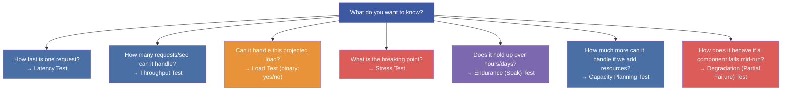
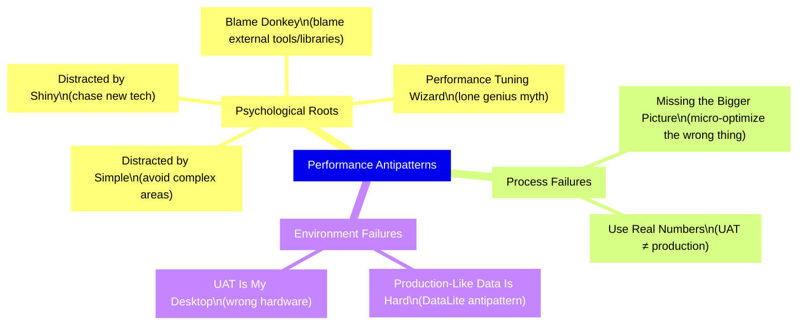
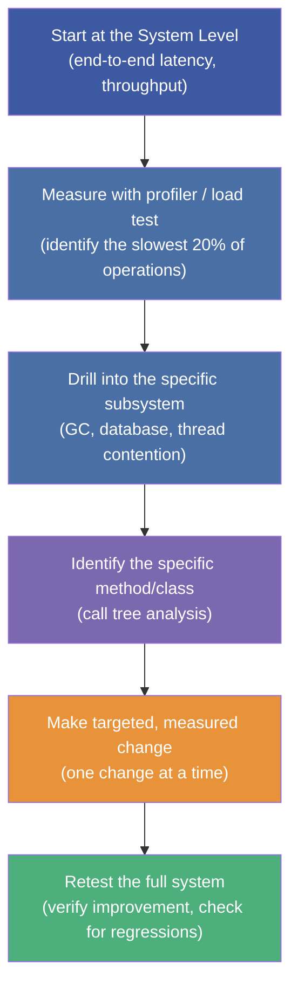

# :material-test-tube: Chapter 4: Performance Testing Types, Antipatterns & Best Practices

> **Book:** Optimizing Java — Practical Techniques for Improving JVM Application Performance
>
> **Chapter:** 4 — Performance Testing Patterns and Antipatterns
>
> **Status:** :material-check-circle: Complete

---

## :material-target: Learning Objectives

By the end of this chapter, you should be able to:

- [x] Distinguish the six **performance test types** (latency, throughput, load, stress, endurance, capacity planning, degradation) and know when to use each
- [x] Apply the **three golden rules** of performance optimization prioritization
- [x] Recognize and avoid all **performance antipatterns** in the book's catalogue
- [x] Structure a proper **top-down performance** testing approach
- [x] Know the requirements for a **valid test environment** and **production-like data**

---

## :material-flask-outline: 1. Performance Test Types — Six Distinct Experiments

Each performance test answers a **specific quantitative question**. Using the wrong test type gives you misleading answers.



### Latency Test

**Question:** "What is the response time distribution for a single user/request at a known, controlled concurrency level?"

- Always report as **distribution** (p50, p90, p99, p99.9) — never as a mean
- The latency test must state **both the load level AND the latency result** — isolated latency figures without a stated throughput are meaningless
- Goal: meet an SLA (e.g., p99 < 50ms at 1,000 concurrent users)

### Throughput Test

**Question:** "What is the maximum rate of requests the system handles before latency starts to degrade?"

- Conduct while simultaneously monitoring latency
- The "maximum throughput" is the request rate just *before* the latency distribution changes significantly — this is the **inflection point**
- Must be distinguished from load test: throughput test is exploratory, not binary

### Load Test

**Question:** "Can the system handle this specific, pre-determined load level?"

A **binary test** — pass or fail. Typically run:
- Before a new customer onboarding event
- Before a marketing campaign expected to drive unusual traffic
- After a major infrastructure change

### Stress Test

**Question:** "How much spare capacity do we have? Where is the breaking point?"

Process:
1. Establish a steady-state load (current peak production traffic)
2. Ramp up concurrent users/throughput gradually
3. Observe when observable metrics (latency, error rate) start degrading
4. Record the load level just before degradation — that's your headroom

### Endurance (Soak) Test

**Question:** "Are there any slow leaks that only manifest over time?"

Tests for:
- Slow **memory leaks** (heap grows progressively over hours)
- **Cache pollution** (caches fill and become inefficient)
- **Memory fragmentation** (especially with CMS GC — eventually causes concurrent mode failures)
- **Thread leaks**, **file descriptor leaks**, **connection pool exhaustion**

!!! important "Soak Test Duration"
    Effective soak tests run for **24-72 hours minimum** — not 10 minutes. Many slow leaks only become visible after hours of sustained load. Monitoring: heap trend line, GC overhead %, thread count, file descriptor count.

### Capacity Planning Test

**Question:** "If we add N more machines/cores/RAM, how much more throughput do we get?"

Distinct from stress testing in that it is **forward-looking** and proactive — done during planning cycles, not in response to a crisis. The results feed directly into infrastructure budget decisions.

### Degradation (Partial Failure) Test

**Question:** "How does the system behave when a component fails mid-run?"

Examples:
- Kill one application server node in a cluster
- Remove one RAID disk from the database server
- Drop network bandwidth to 50% of normal

The **Chaos Monkey** (Netflix) is the most famous implementation: randomly terminating production processes to verify that the overall system remains healthy despite component failures.

!!! tip "Chaos Engineering Prerequisites"
    You cannot safely run Chaos Monkey without first: automated health monitoring, automatic failover, circuit breakers, graceful degradation patterns, and a mature incident response process. These are **high-maturity operations** practices.

---

## :material-thumb-down: 2. Performance Antipatterns — A Field Guide to What Goes Wrong

The book catalogues specific named antipatterns. Each has a pattern, example, reality check, and resolution.



### Antipattern 1: Distracted by Shiny

> **The team targets the newest technology component first** because it's interesting, not because measurement points to it.

```
"It's teething trouble with the new Kafka cluster — let's look there first."
```

**Reality:** This is an educated guess masquerading as engineering. The performance problem might be in a 10-year-old SQL query that nobody wants to touch.

**Resolution:**
- Measure first — profiler output determines where you look
- Ensure adequate logging around new components
- Study best practices for new technologies *before* putting them in production

### Antipattern 2: Distracted by Simple

> **The team targets the most familiar, easiest-to-understand code first** — avoiding the specialist "wizard" components that only one senior developer understands.

```
"John wrote that low-latency messaging component and he's on holiday. Let's look at the REST layer instead."
```

**Reality:** The bottleneck doesn't care who wrote it or how complex it is. Only measurement reveals where the problem actually is.

**Resolution:** Broaden team knowledge through pairing, documentation, and code reviews. Seek help from domain experts rather than avoiding the problem.

### Antipattern 3: Performance Tuning Wizard

> **Management hires an external "performance hero"** who is expected to apply magical knowledge to fix all performance problems without investigation.

```
"I'm sure I know just where the problem is..."
```

**Reality:** Genuine performance experts know that *every* problem requires measurement and investigation. There is no universal fix. The wizard approach also alienates the team and creates a single point of failure.

### Antipattern 4: Blame Donkey

> **The team blames an external library, framework, or tool** for the performance problem, without measuring whether it's actually the cause.

```
"It must be Hibernate — it always generates bad SQL."
```

**Reality:** Hibernate, Spring, or any other framework may indeed be part of the problem — but only measurement via profiling and query analysis reveals whether this is true. Blaming without evidence leads to wasted rewrites that don't solve the real problem.

### Antipattern 5: Missing the Bigger Picture (Under-Scoped Optimization)

> **Micro-optimizing a single method in isolation** while the overall architecture is the actual bottleneck.

```
"We optimized the toString() method from 50ns to 30ns!"
```

**Reality:** If the bottleneck is a database round-trip taking 200ms, a 20ns improvement in a formatting method contributes nothing to user-visible performance.

**The Three Golden Rules of Optimization Prioritization:**
1. **Identify what you care about and figure out how to measure it** (define the SLA first)
2. **Optimize what matters, not what is easy to optimize** (follow the profiler)
3. **Play the big points first** (the highest-cost operations deserve the most attention)

### Antipattern 6: UAT Is My Desktop

> **Using a developer's laptop or a grossly under/over-powered test environment** as the baseline for performance testing.

**Two failure modes:**
1. **Under-powered UAT**: misses server-class memory and concurrency behaviors
2. **Over-powered UAT** (developer's 32-core workstation vs. 4-core production server): makes the application appear faster than it is in production

**Resolution:** Match hardware specs exactly — same CPU count, same RAM, same OS, same JVM version, same JVM flags, same GC algorithm.

### Antipattern 7: Production-Like Data Is Hard (DataLite)

> **Using simplified, sanitized, or small-volume test data** that doesn't reflect production characteristics.

Common failures:
- Capturing only a small sample of production messages (misses burst patterns)
- Simplifying complex financial calculations to simple arithmetic (misses actual computation cost)
- Running all messages through the system simultaneously (misses warm-up effects and rate-dependent optimizations)

!!! warning "Why Data Fidelity Matters More Than You Think"
    The JIT compiler makes optimization decisions based on **observed types and branch frequencies in the actual data**. If your test data always takes the "happy path," the JIT devirtualizes and aggressively inlines the happy path. In production, when unexpected data types appear, the JIT is forced to deoptimize (a "deopt event"), causing sudden performance cliffs.

---

## :material-arrow-up-bold: 3. Top-Down Performance Methodology

The book strongly advocates a **top-down** approach to performance work:



!!! important "Why Top-Down?"
    Large-scale benchmarking of Java applications is **easier** than microbenchmarking because the JVM's adaptive behaviors (JIT compilation, GC timing, classloading) tend to average out at the system level. At the micro level, these same behaviors create enormous variability that is nearly impossible to account for.

### The Test Environment Checklist

Before any performance test is considered valid, verify:

- [ ] **Same hardware spec** (CPU count, RAM, disk type, NIC speed)
- [ ] **Same OS and kernel version**
- [ ] **Same JVM version and vendor** (same HotSpot build number)
- [ ] **Same JVM flags** (heap size, GC algorithm, JIT settings)
- [ ] **Same application server / container version**
- [ ] **Same database version, schema, and data volume**
- [ ] **Network topology matches** (same latency between app server and DB)
- [ ] **No other significant load on the test machines during the test**
- [ ] **Production-like data** (volume, distribution, edge cases)

---

## :material-help-circle: Questions Explored

- [x] What are the six performance test types and what specific question does each answer?
- [x] When is a load test different from a stress test?
- [x] Why do soak tests need to run for 24-72 hours, not 10 minutes?
- [x] What are Chaos Monkey tests and what organizational maturity do they require?
- [x] What are the three golden rules for deciding where to focus optimization effort?
- [x] What is "top-down performance" and why is it preferred over micro-level optimization?
- [x] Describe the "Distracted by Shiny" and "Distracted by Simple" antipatterns — what psychological biases drive them?
- [x] Why does simplified UAT data produce invalid performance test results (DataLite antipattern)?

---

## :material-navigation: Related Notes

| Chapter | Topic | Link |
|:-------:|-------|------|
| 1 | Introduction & Performance Vocabulary | [← Ch 1](book-reading-ch1.md) |
| 2 | JVM Anatomy — Bytecode, JIT & HotSpot | [← Ch 2](book-reading-ch2.md) |
| 3 | Hardware & OS — CPU Caches, NUMA, Scheduler | [← Ch 3](book-reading-ch3.md) |
| 4 | Performance Testing Types & Antipatterns | **You are here** |
| 5 | Microbenchmarking & JMH | [Ch 5 →](book-reading-ch5.md) |

---

*Last Updated: 2026-07-16*
