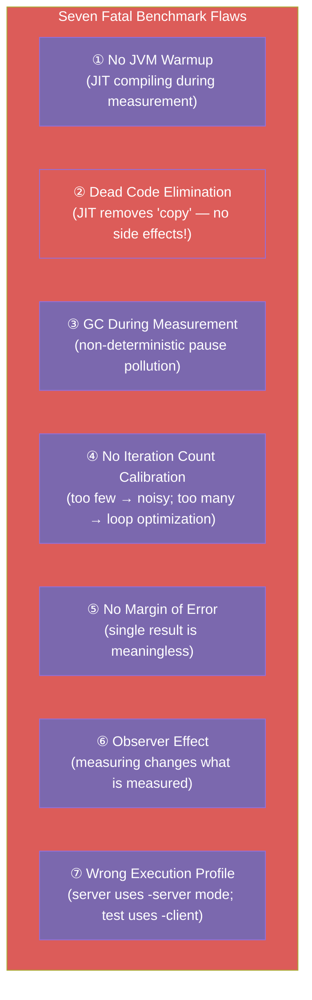
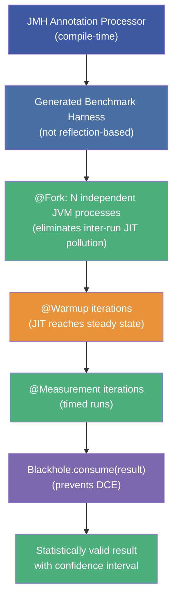
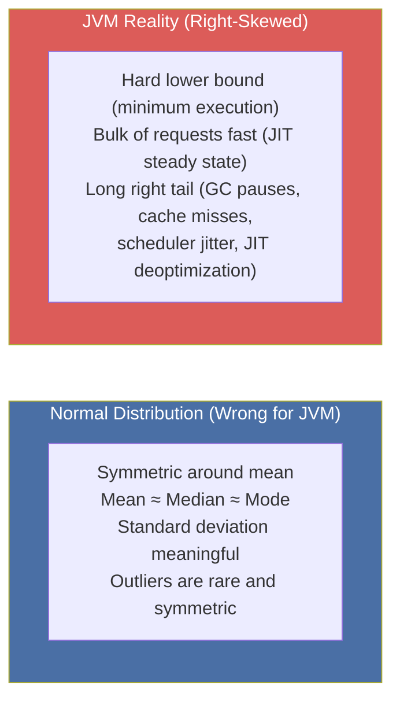

# :material-timer-sand: Chapter 5: Microbenchmarking, Statistics & JMH

> **Book:** Optimizing Java — Practical Techniques for Improving JVM Application Performance
>
> **Chapter:** 5 — Microbenchmarking and Statistics
>
> **Status:** :material-check-circle: Complete

---

## :material-target: Learning Objectives

By the end of this chapter, you should be able to:

- [x] Explain why naive Java benchmarks produce **systematically incorrect** results
- [x] List and explain the **seven key flaws** in hand-rolled benchmarks
- [x] Understand the conditions under which **microbenchmarking is appropriate**
- [x] Set up and write a correct benchmark using **JMH (Java Microbenchmark Harness)**
- [x] Use `@Benchmark`, `@Warmup`, `@Measurement`, `@State`, `@Scope`, and `Blackhole` correctly
- [x] Understand why JVM performance data is **non-normally distributed** and what to do about it
- [x] Use **logarithmic percentiles** and **HdrHistogram** for accurate latency analysis
- [x] Avoid spurious correlation in performance analysis

---

## :material-bug: 1. Why Hand-Rolled Benchmarks Fail — Seven Fatal Flaws

Naive benchmarks like this one are systematically unreliable:

```java
// BROKEN BENCHMARK — Produces incorrect results
public class ClassicSort {
    private static final int N = 1_000;
    private static final int I = 150_000;
    private static final List<Integer> testData = new ArrayList<>();

    public static void main(String[] args) {
        Random random = new Random();
        for (int i = 0; i < N; i++) testData.add(random.nextInt(Integer.MAX_VALUE));

        double startTime = System.nanoTime();
        for (int i = 0; i < I; i++) {
            List<Integer> copy = new ArrayList<>(testData);
            Collections.sort(copy);
        }
        double endTime = System.nanoTime();
        System.out.println("Result: " + (1 / ((endTime - startTime) / (1_000_000_000L * I))) + " op/s");
    }
}
```



### Flaw 1: No JVM Warmup

```bash
java -Xms2048m -Xmx2048m -XX:+PrintCompilation ClassicSort
```

Output shows `java.lang.Integer::compareTo` being compiled **while the benchmark is running** — the timings capture both interpreted and JIT-compiled execution. True steady-state performance is only visible after C2 compilation at ~10,000+ invocations.

### Flaw 2: Dead Code Elimination (DCE)

```java
List<Integer> copy = new ArrayList<>(testData);
Collections.sort(copy);
// 'copy' is never READ after this — it has no observable side effects
// C2 JIT is permitted to ELIMINATE the entire sort as dead code!
```

The JIT's **dead code elimination** (DCE) optimization silently removes work that has no observable effect. A benchmark that never *uses* its result measures nothing.

### Flaw 3: GC Interference

The benchmark allocates millions of `Integer` objects and `ArrayList` instances. GC pauses are:
- **Non-deterministic** (happen when allocation pressure triggers them)
- **Variable** (duration depends on heap occupancy and GC algorithm)

A 50ms GC pause embedded in 1 second of measurement inflates the result by 5%. Over 150,000 iterations with different GC timing, results vary wildly.

### Flaw 4: Lack of Statistical Rigor

A single timing result reveals nothing about measurement variance. Without multiple independent runs and confidence intervals, you cannot distinguish signal from noise.

---

## :material-check-circle: 2. When Is Microbenchmarking Appropriate?

!!! warning "Microbenchmarking Is Rarely the Right Tool"
    > The scary thing about microbenchmarks is that they always produce a number, even if that number is meaningless. — *Brian Goetz*

Only consider microbenchmarking if your application meets **all** of these criteria:

| Criterion | Threshold |
|-----------|-----------|
| **Total code path execution time** | < 1ms, ideally < 100µs |
| **Memory allocation rate** | < 1 MB/s, ideally near zero |
| **CPU utilization** | ~100% (computation-bound, not I/O-bound) |
| **System utilization** | < 10% from OS overhead |
| **Profiler analysis** | At most 2-3 dominant methods consuming CPU |

**Appropriate use cases:**
- JDK library development (OpenJDK contributors need JMH)
- Low-latency financial trading algorithm selection
- Algorithm selection for a proven hot path in a production system
- Comparing data structure implementations for a specific access pattern

**Inappropriate use cases:**
- Choosing between frameworks *before* building the system
- Optimizing code that profiling hasn't identified as a bottleneck
- "Proving" one API is faster than another without a real workload

---

## :material-wrench: 3. JMH — The Java Microbenchmark Harness

JMH is developed by OpenJDK engineers who know *exactly* how to avoid the JVM's optimization traps. It uses **annotation processing** (not reflection) to generate correct benchmark harness code at compile time.

### Project Setup

```bash
mvn archetype:generate \
  -DinteractiveMode=false \
  -DarchetypeGroupId=org.openjdk.jmh \
  -DarchetypeArtifactId=jmh-java-benchmark-archetype \
  -DgroupId=org.example \
  -DartifactId=my-benchmark \
  -Dversion=1.0
```

### Basic Benchmark Structure

```java
@BenchmarkMode(Mode.AverageTime)
@OutputTimeUnit(TimeUnit.NANOSECONDS)
@Warmup(iterations = 10, time = 1, timeUnit = TimeUnit.SECONDS)
@Measurement(iterations = 5, time = 1, timeUnit = TimeUnit.SECONDS)
@Fork(3)   // 3 separate JVM forks = 3 independent runs
public class SortBenchmark {

    @State(Scope.Thread)   // Each thread gets its own state instance
    public static class BenchmarkState {
        List<Integer> data;

        @Setup(Level.Invocation)   // Reset before each benchmark invocation
        public void setup() {
            data = new ArrayList<>();
            Random r = new Random(42);  // Fixed seed for reproducibility
            for (int i = 0; i < 1000; i++) data.add(r.nextInt());
        }
    }

    @Benchmark
    public List<Integer> measureSort(BenchmarkState state) {
        Collections.sort(state.data);
        return state.data;  // ← Return value prevents Dead Code Elimination!
    }
}
```



### JMH Key Annotations

| Annotation | Purpose |
|-----------|---------|
| `@Benchmark` | Marks the method to be benchmarked |
| `@BenchmarkMode` | `Throughput`, `AverageTime`, `SampleTime`, `SingleShotTime`, `All` |
| `@OutputTimeUnit` | `NANOSECONDS`, `MICROSECONDS`, `MILLISECONDS`, `SECONDS` |
| `@Warmup(iterations=N, time=T)` | N warmup iterations of T seconds each |
| `@Measurement(iterations=N, time=T)` | N measurement iterations of T seconds each |
| `@Fork(N)` | Run in N separate JVM processes |
| `@State(Scope.X)` | State lifecycle: `Thread` (per-thread), `Benchmark` (shared), `Group` (group) |
| `@Setup(Level.Y)` | `Trial` (once per JVM), `Iteration` (once per iteration), `Invocation` (per call) |

### The Blackhole — Defeating Dead Code Elimination

```java
// Option 1: Return the result (JMH consumes it implicitly)
@Benchmark
public int benchmarkCompute() {
    return expensiveComputation();  // returned value is consumed by JMH
}

// Option 2: Explicit Blackhole for multiple results
@Benchmark
public void benchmarkMultiple(Blackhole bh) {
    int a = computeA();
    int b = computeB();
    bh.consume(a);  // prevents DCE on a
    bh.consume(b);  // prevents DCE on b
}
```

### The `@State` Scope

```java
// Thread scope — each benchmark thread has its own instance (default, safest)
@State(Scope.Thread)
public static class ThreadState { ... }

// Benchmark scope — single shared instance across all threads (test sharing behavior)
@State(Scope.Benchmark)
public static class SharedState { ... }

// Group scope — shared within a group of threads (test producer-consumer)
@State(Scope.Group)
public static class GroupState { ... }
```

### Running Benchmarks

```java
public class MyBenchmark {
    public static void main(String[] args) throws RunnerException {
        Options opt = new OptionsBuilder()
            .include(SortBenchmark.class.getSimpleName())
            .warmupIterations(10)
            .measurementIterations(5)
            .forks(3)
            .jvmArgs("-server", "-Xms2048m", "-Xmx2048m")
            .build();
        new Runner(opt).run();
    }
}
```

Sample JMH output:
```
Benchmark                  Mode  Cnt    Score     Error  Units
SortBenchmark.measureSort  avgt   15  1234.567 ±  23.456  ns/op
```

The `± 23.456` is the **99% confidence interval** — if this is large relative to the score, the result is noisy.

---

## :material-chart-bell-curve: 4. Non-Normal Statistics for JVM Performance

### Why Normal Statistics Fail



**Why the JVM produces non-normal distributions:**
- JIT compilation creates a **hard lower bound** — code cannot run faster than fully-optimized machine code
- GC pauses add **discrete, irregular spikes** that have no upper bound
- OS scheduler preemption adds **jitter** that varies with system load
- First-time classloading creates **one-time slow paths** at startup

!!! danger "Standard Deviation Is Useless for JVM Data"
    Standard deviation assumes symmetric, Gaussian data. Applying mean ± σ to JVM performance data produces **statistically invalid conclusions**. Standard deviation is dominated by the rare GC pause outliers, making it appear that "variance is high" even when 99% of requests are perfectly fast.

### The Logarithmic Percentile Sampling Strategy

Instead of mean and standard deviation, use a **log-scale percentile distribution**:

```
p50  (50th percentile) : 23 ns   — typical case (the "hot path")
p90  (90th percentile) : 30 ns   — most users see this or better
p99  (99th percentile) : 43 ns   — 1 in 100 requests is this slow
p99.9                  : 164 ns  — 1 in 1,000 requests
p99.99                 : 248 ns  — 1 in 10,000 requests
p99.999                : 3,458 ns — 1 in 100,000 (GC pause territory)
p99.9999               : 17,463 ns — 1 in 1,000,000 (extreme outlier)
```

The logarithmic step pattern (50 → 90 → 99 → 99.9 → 99.99) matches the shape of the long-tail distribution — dense sampling where data is dense, sparse sampling where data is sparse.

!!! tip "SLA Design With Percentiles"
    Most service-level agreements should be expressed as **percentile targets**, not averages:
    - ✅ "p99 latency < 100ms at 1,000 RPS"
    - ❌ "Average latency < 50ms" (silent GC pauses blow past this routinely)

### HdrHistogram — High Dynamic Range Histogram

```java
// Add to pom.xml:
// <dependency>
//   <groupId>org.hdrhistogram</groupId>
//   <artifactId>HdrHistogram</artifactId>
//   <version>2.1.9</version>
// </dependency>

import org.HdrHistogram.Histogram;

// Create histogram for values up to 60 seconds, 2 significant digits
Histogram histogram = new Histogram(TimeUnit.MINUTES.toMicros(1), 2);

// Record values (in microseconds)
histogram.recordValue(observedMicros);

// Output logarithmic percentile distribution
histogram.outputPercentileDistribution(System.out, 1000.0);  // scale to ms
```

**HdrHistogram advantages:**
- Lock-free recording (can be used in production hot paths)
- Configurable precision (significant figures, not fixed bucket sizes)
- Fixed, bounded memory footprint
- Built-in serialization for later analysis

### Spurious Correlation — The Final Trap

> Correlation does not imply causation.

In performance analysis, it is tempting to link correlated observables:

- "GC frequency increased at the same time latency degraded" — may be causal, may be coincidental
- "CPU utilization is at 80% and throughput is high" — correlation, not causation (adding CPUs might help 0%)

!!! warning "The Feynman Standard"
    Richard Feynman: "The first principle is that you must not fool yourself — and you are the easiest person to fool." In performance work, confirmation bias is deadly. If you measure something and it "seems plausible" that A caused B, verify it by deliberately controlling A and observing B in isolation.

---

## :material-help-circle: Questions Explored

- [x] Name the seven flaws in the classic naive sort benchmark
- [x] What is dead code elimination and how does `Blackhole` in JMH prevent it?
- [x] Why do JMH benchmarks use `@Fork(N)` instead of running everything in one JVM?
- [x] What are the four `BenchmarkMode` options in JMH and when would you use each?
- [x] When is it legitimate to use microbenchmarking? What criteria must be met?
- [x] Why is the normal distribution a bad model for JVM performance data?
- [x] What is the logarithmic percentile sampling strategy and why does it suit JVM distributions?
- [x] What is HdrHistogram and what problem does it solve?
- [x] What is spurious correlation and why is it particularly dangerous in performance analysis?

---

## :material-navigation: Related Notes

| Chapter | Topic | Link |
|:-------:|-------|------|
| 1 | Introduction & Performance Vocabulary | [← Ch 1](book-reading-ch1.md) |
| 2 | JVM Anatomy — Bytecode, JIT & HotSpot | [← Ch 2](book-reading-ch2.md) |
| 3 | Hardware & OS — CPU Caches, NUMA, Scheduler | [← Ch 3](book-reading-ch3.md) |
| 4 | Performance Testing Types & Antipatterns | [← Ch 4](book-reading-ch4.md) |
| 5 | Microbenchmarking & JMH | **You are here** |

---

*Last Updated: 2026-07-16*
