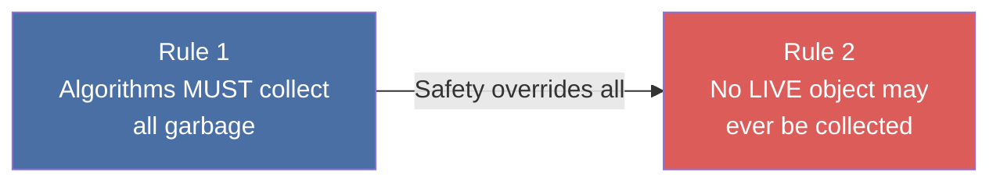
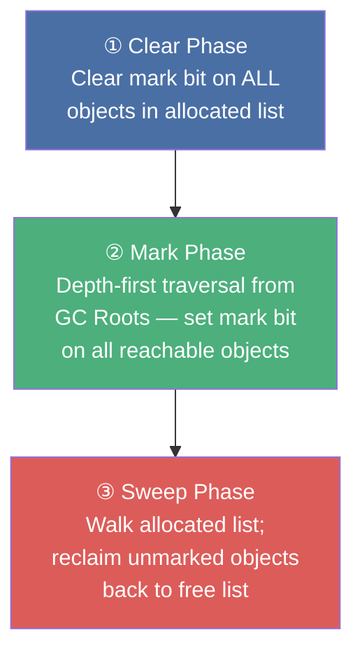
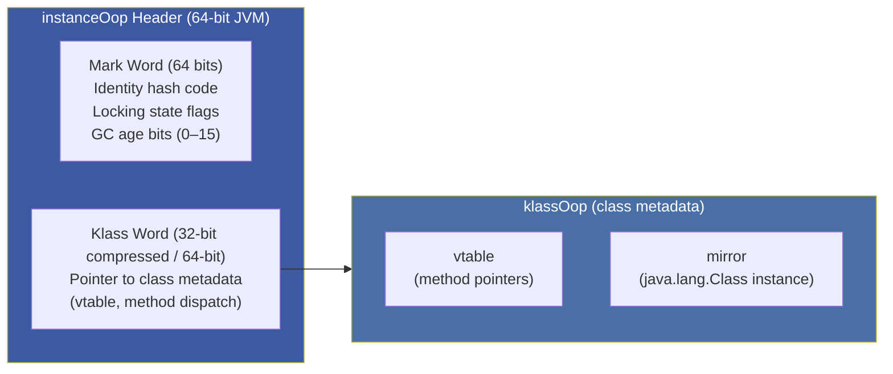
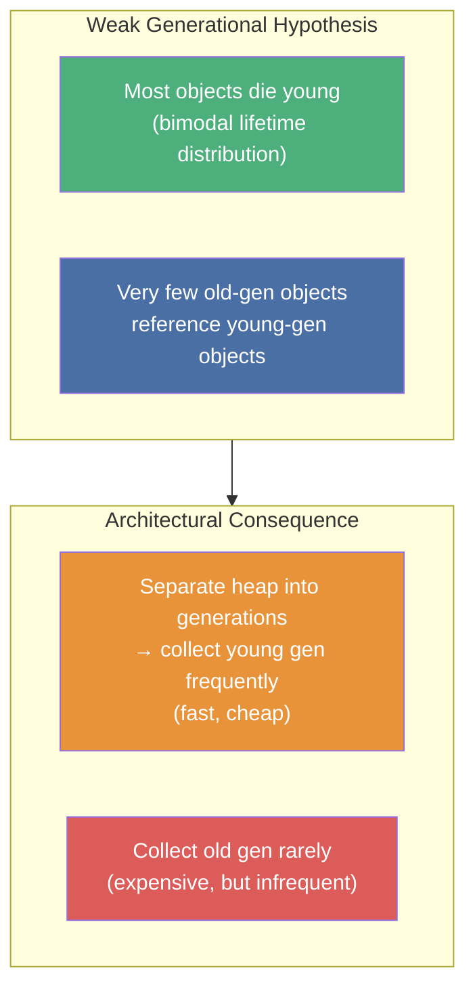
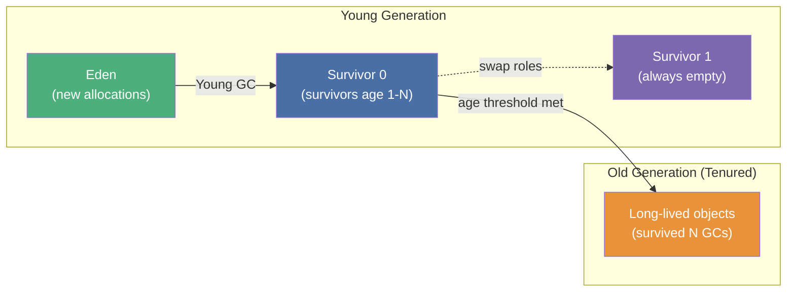
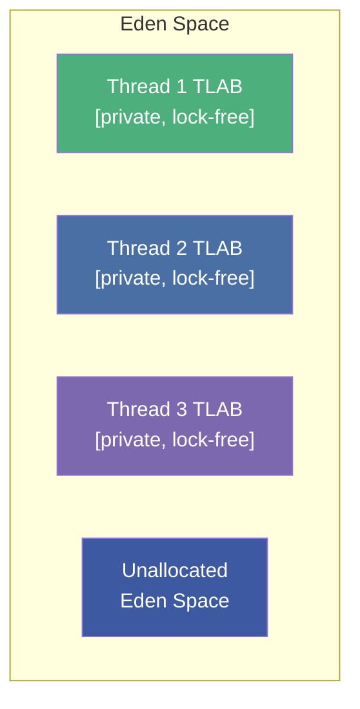
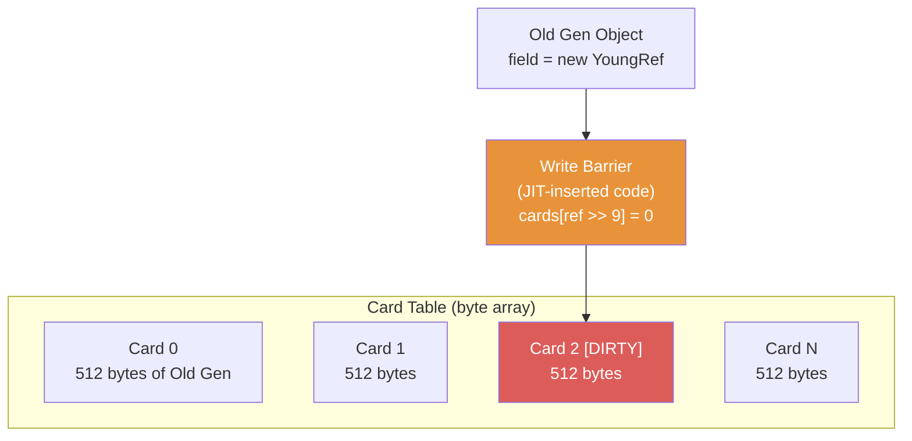
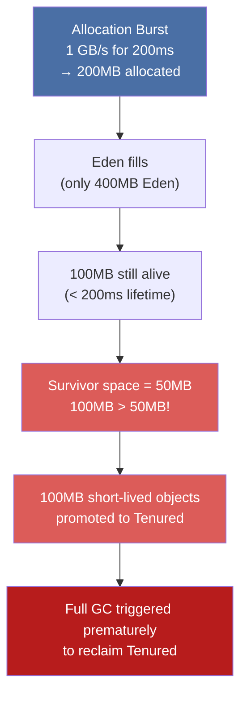

# :material-recycle: Chapter 6: Understanding Garbage Collection

> **Book:** Optimizing Java — Practical Techniques for Improving JVM Application Performance
>
> **Authors:** Benjamin J. Evans, James Gough, Chris Newland
>
> **Chapter:** 6 — Garbage Collection Algorithms & Collector Fundamentals
>
> **Status:** :material-check-circle: Complete

---

## :material-target: Learning Objectives

By the end of this chapter, you should be able to:

- [x] Explain the two fundamental rules of garbage collection and why Rule #2 is absolute
- [x] Describe the mark-and-sweep algorithm: phases, data structures, and limitations
- [x] Understand HotSpot's object representation (`instanceOop`, mark word, klass word)
- [x] Explain how Compressed Oops reduce heap overhead on 64-bit JVMs
- [x] Articulate the **Weak Generational Hypothesis** and the generational heap layout
- [x] Explain how TLABs enable lock-free O(1) allocation via pointer bumping
- [x] Describe what premature promotion is and why it causes Full GC pressure

---

## :material-shield-check: 1. The Two Fundamental Rules of GC

All garbage collection algorithms — regardless of complexity — must satisfy exactly two rules:



!!! danger "Rule #2 Is Absolute"
    Violating Rule #2 — collecting a live object — leads to **silent data corruption** or **segmentation faults**. Every GC design decision prioritizes Rule #2 above throughput, latency, or any other concern. This is why GC algorithms are conservative by design.

Java's GC eliminates the two most catastrophic C/C++ bugs: **dangling pointers** (use-after-free) and **double-frees**. The tradeoff is runtime overhead and non-deterministic pauses.

---

## :material-brush: 2. Mark-and-Sweep — The Baseline Algorithm

The simplest correct GC algorithm follows three phases:



### GC Roots — Where Tracing Begins

GC roots are external reference anchors outside the target memory pool that point into it. HotSpot recognizes these root types:

| Root Type | Description |
|-----------|-------------|
| **Thread Stack Frames** | Local reference variables in each live thread's stack |
| **JNI References** | Local and global JNI handles from native code |
| **Registers** | Variables hoisted into CPU registers by JIT |
| **Code Cache Roots** | Pointers embedded in JIT-compiled native code |
| **Static Variables** | References stored in class metadata |
| **Class Metadata** | References from loaded `ClassLoader` data |

### Limitations of Naive Mark-and-Sweep

1. **Fragmentation** — After sweeping, live and dead slots alternate in memory. Subsequent allocations for larger objects may fail even with enough total free bytes
2. **Stop-the-World (STW)** — Mutator threads must stop during marking to prevent the collector from missing newly created objects or following stale references
3. **Pause scales with live set** — The longer the traversal from GC roots, the longer the pause

---

## :material-memory: 3. HotSpot Object Representation — OOPs

HotSpot represents Java objects using C++ structures called **Ordinary Object Pointers (oops)**. An `instanceOop` header has two machine words:



!!! tip "PermGen → Metaspace"
    - **Java ≤ 7**: `klassOop` lived inside the Java heap in **PermGen** (fixed max size, notorious `OutOfMemoryError: PermGen space`)
    - **Java 8+**: Class metadata moved to **Metaspace** in native (C heap) memory outside the Java heap — eliminates PermGen OOMEs; limited only by OS memory

### Compressed Oops — `-XX:+UseCompressedOops`

On 64-bit JVMs, object references are 64 bits. With heaps < ~32 GB, HotSpot applies a 3-bit shift trick to compress references from 64 → 32 bits:

```
Physical address = CompressedOop × 8 + HeapBase
```

This saves enormous amounts of memory:

| Structure | Savings |
|-----------|---------|
| Klass word of every object header | 4 bytes per object |
| Every reference field in instances | 4 bytes per field |
| Every reference element in arrays | 4 bytes per element |

!!! important "Default Behavior"
    `-XX:+UseCompressedOops` is **enabled by default** on 64-bit JVMs when heap < ~32 GB. Setting `-Xmx` above ~32 GB silently disables it, increasing heap usage by ~30%.

### Object Header Layout Summary

| Field | Size | Notes |
|-------|------|-------|
| Mark Word | 64 bits | Always full native size |
| Klass Word | 32 bits (compressed) / 64 bits | Points to class metadata |
| Length Word | 32 bits | **Arrays only** |
| Alignment Padding | 0–4 bytes | Word boundary alignment |

---

## :material-sprout: 4. The Weak Generational Hypothesis

The entire generational GC architecture rests on a single empirical observation:



### Generational Heap Layout



**Survivor spaces use a hemispheric strategy**: one space is always kept 100% empty. On each Young GC, live objects are evacuated from Eden + active Survivor into the empty Survivor space, incrementing each object's GC age counter. One space is always completely empty — this is not wasted memory; it enables compaction for free.

---

## :material-lightning-bolt: 5. Thread-Local Allocation Buffers (TLABs)

Shared-heap allocation would require thread synchronization on every `new` operation. TLABs solve this:



**Allocation mechanics:**
1. Each thread gets a private TLAB slice from Eden
2. Allocation = **pointer bump** — advance the `next` pointer by `sizeof(object)` — O(1), no locking
3. When TLAB fills, thread requests a new TLAB (requires brief lock)
4. TLABs are dynamically sized based on thread allocation history

!!! note "TLABs Are Private at Allocation Time Only"
    After allocation, objects in a TLAB are immediately visible to other threads via normal memory visibility rules. TLABs only eliminate lock contention at allocation time.

### Allocation Escalation Waterfall

When TLAB runs out:

```
TLAB allocation (lock-free pointer bump)
  → New TLAB from Eden (brief lock)
    → Allocation directly in Eden outside TLAB
      → Young GC triggered
        → Direct allocation in Tenured (last resort — huge arrays)
```

---

## :material-cards: 6. Card Tables & Write Barriers

The Weak Generational Hypothesis assumes few old→young references. But some do exist. Young GC needs to scan them without scanning all of Old Gen:



Every time application code stores a reference from an Old Gen object to a Young Gen object, the JIT-inserted **write barrier** marks the corresponding 512-byte "card" in the Card Table as dirty:

```java
// Write barrier pseudo-code (executed on every reference store)
cards[objectAddress >> 9] = 0;   // shift right 9 bits = divide by 512
```

During Young GC, only dirty cards are scanned for cross-generational references — not all of Old Gen. A 1 GB old gen = only **2 MB of card table** to scan.

---

## :material-run-fast: 7. Parallel Collectors — The Throughput-First Approach

### Parallel Young GC

The default collector pair in Java 8: `ParNew` (young) + `ParallelOld` (old).

**Young GC mechanics:**

1. **Stop** all application threads (STW)
2. **Scan** GC roots + dirty cards in Card Table
3. **Evacuate** live objects from Eden + active Survivor to empty Survivor space
4. Objects exceeding `MaxTenuringThreshold` → promoted to Tenured
5. **Resume** application threads

!!! important "Young GC Pause is Proportional to Live Set — Not Dead Objects"
    A Young GC with 400 MB Eden and only 20 MB survivors is **fast** — it only copies 20 MB. Dead objects are simply abandoned (Eden is then reused). This is why high allocation rates with short lifetimes work well generationally.

### ParallelOld — Compacting Tenured

`ParallelOld` is a fully STW compacting collector. It relocates all live objects in Tenured to the bottom of the region, creating a single contiguous free area. **Pause time scales linearly with live set size and heap size** — on large heaps (> 10 GB live set), pauses can reach tens of seconds.

---

## :material-alert: 8. Premature Promotion — The Critical Antipattern

**Premature promotion** occurs when short-lived objects are forced into Tenured because Survivor space overflows:



**Case study from the book:**

| Metric | Normal (steady-state) | With Burst (premature promotion) |
|--------|----------------------|----------------------------------|
| Young GC | 20 MB evacuated to Survivor | 100 MB promoted to Tenured |
| Tenured occupancy | Stable | Grows rapidly with dead objects |
| Full GC frequency | Rare | Triggered prematurely |
| Application impact | Minimal | Long STW Full GC pauses |

**Diagnosis:** `-XX:+PrintTenuringDistribution` reveals the age distribution of survivors. If many age-1 objects are being promoted, Survivor space is too small.

---

## :material-help-circle: Questions Explored

- [x] What are the two fundamental rules of GC, and what happens if either is violated?
- [x] How does mark-and-sweep work, and why does it cause fragmentation?
- [x] What is an `instanceOop` and what does each field in the header represent?
- [x] Why does CompressedOops save ~30% heap space, and when does it get disabled?
- [x] What is the Weak Generational Hypothesis and why does it justify generational GC?
- [x] How do TLABs enable lock-free allocation, and what is the escalation waterfall?
- [x] Why does the hemispheric Survivor space enable implicit compaction?
- [x] What causes premature promotion and how do Card Tables help Young GC performance?

---

## :material-navigation: Related Notes

| Chapter | Topic | Link |
|:-------:|-------|------|
| 5 | Microbenchmarking & JMH | [← Ch 5](../topic-1-optimizing-java/book-reading-ch5.md) |
| 6 | GC Algorithms & Fundamentals | **You are here** |
| 7 | Advanced GC — Concurrent Algorithms | [Ch 7 →](book-reading-ch7.md) |
| 8 | GC Logging, Tuning & Tools | [Ch 8 →](book-reading-ch8.md) |

---

*Last Updated: 2026-07-23*
