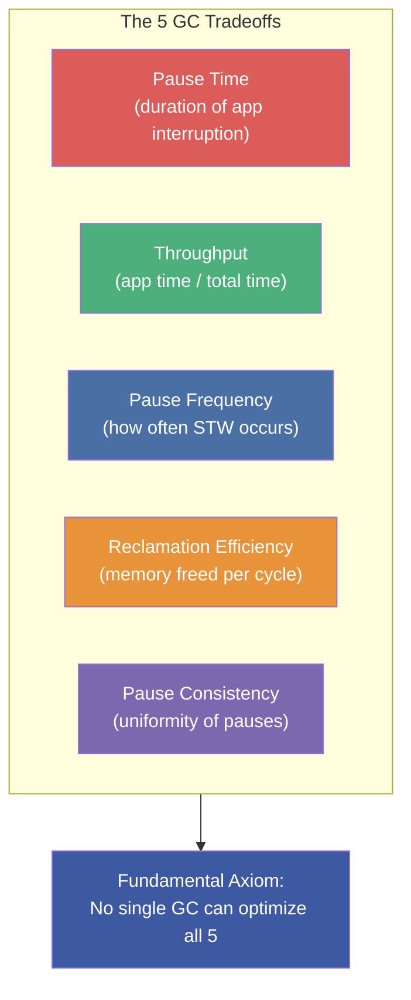
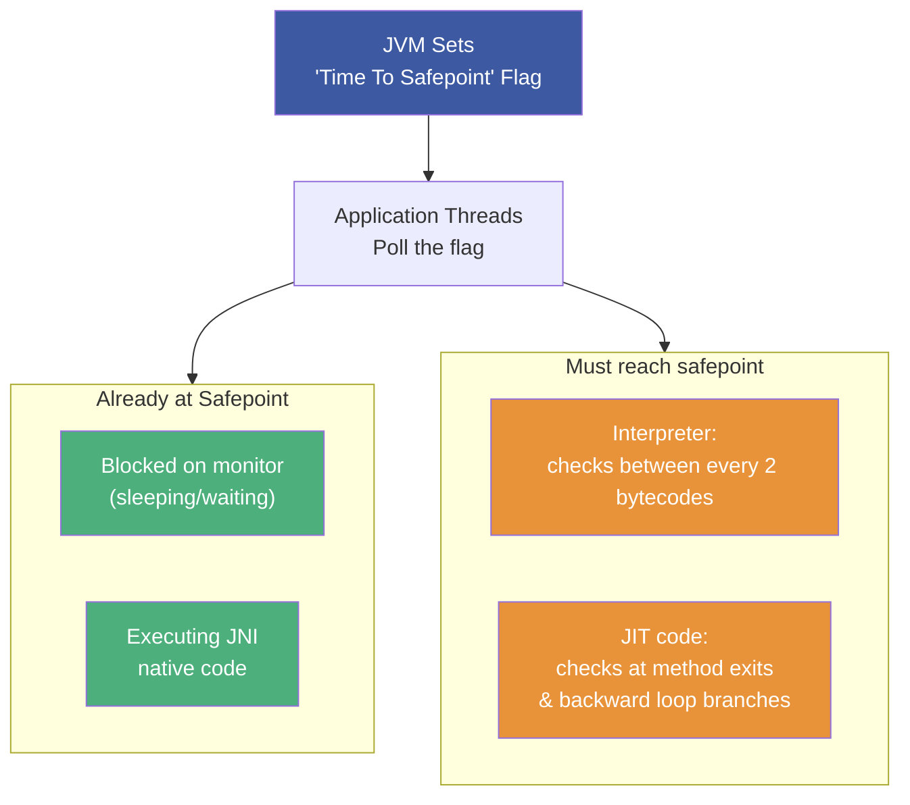
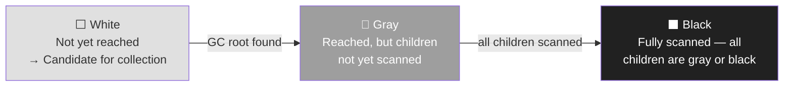
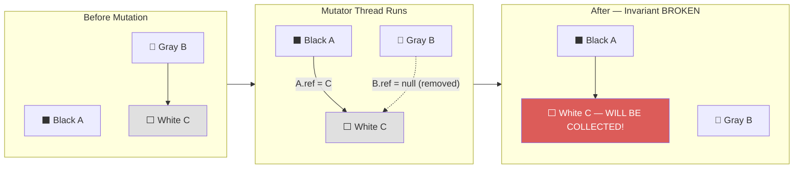
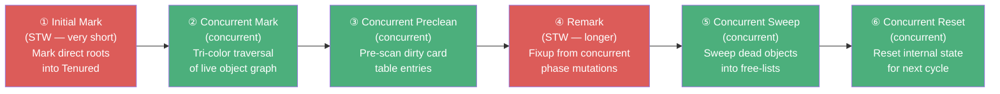
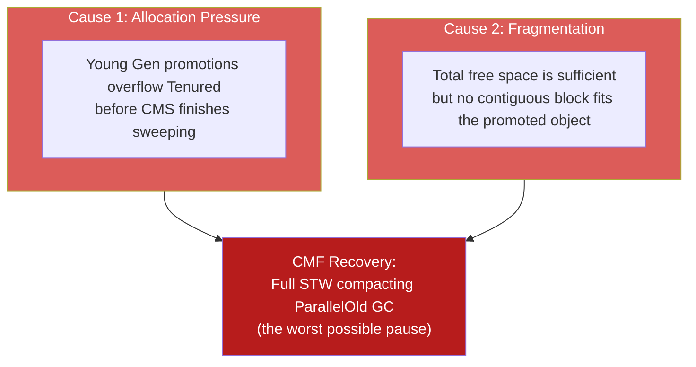
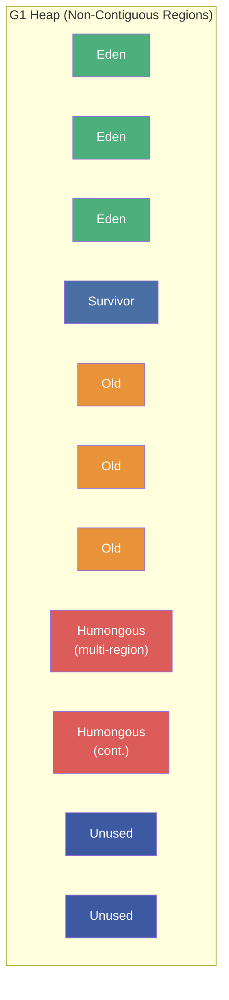
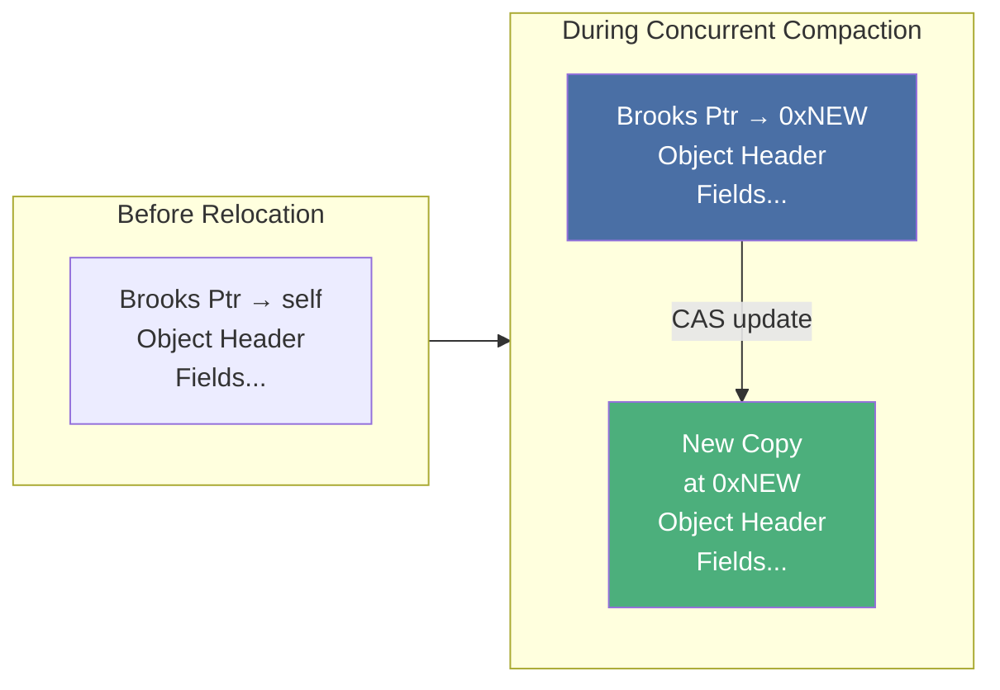

# :material-cogs: Chapter 7: Advanced Garbage Collection

> **Book:** Optimizing Java — Practical Techniques for Improving JVM Application Performance
>
> **Authors:** Benjamin J. Evans, James Gough, Chris Newland
>
> **Chapter:** 7 — Advanced GC: Concurrent Algorithms, G1, CMS & Low-Latency Collectors
>
> **Status:** :material-check-circle: Complete

---

## :material-target: Learning Objectives

By the end of this chapter, you should be able to:

- [x] Explain the 5 GC tradeoffs and why no single algorithm wins on all dimensions
- [x] Describe safepoints — how threads enter/exit them, and what TTSP (Time to Safepoint) is
- [x] Walk through tri-color marking and explain the invariant that makes it correct
- [x] Describe CMS's 6 phases and explain what causes Concurrent Mode Failure (CMF)
- [x] Explain G1GC's region-based architecture, Remembered Sets, and humongous objects
- [x] Understand Shenandoah's Brooks pointer mechanism for concurrent compaction
- [x] Compare ZGC/C4/Shenandoah at a high level (mechanism and tradeoffs)

---

## :material-scale-balance: 1. The Five GC Tradeoffs

There is no GC algorithm that optimally satisfies all concerns simultaneously. The pluggable GC architecture exists precisely because different workloads optimize for different tradeoffs:



| Collector | Best For | Weakness |
|-----------|----------|----------|
| **Serial GC** | Single-threaded, small heaps (< 100MB) | Single-threaded STW — unusable for production |
| **Parallel GC** | Throughput-first batch workloads | Long STW pauses on large heaps |
| **CMS** | Web apps needing low-pause old-gen collection | Fragmentation; Concurrent Mode Failure |
| **G1GC** | Mixed workloads with pause goals (default since Java 9) | Still has STW pauses; RSet overhead |
| **ZGC** | Sub-millisecond pause requirements | Higher memory overhead for load barriers |
| **Shenandoah** | Concurrent compaction; very large heaps | CPU overhead for forwarding pointers |

---

## :material-pause-circle: 2. Safepoints — Cooperative Thread Suspension

GC cannot simply pause threads at arbitrary points — it must wait for all threads to reach a **safepoint**: a known-good execution state where the thread's internal data structures are consistent and the GC can safely read/modify the heap.



!!! important "The Two Rules of Safepointing"
    1. **The JVM cannot force a thread into a safepoint state** — threads must cooperatively reach one
    2. **The JVM can prevent a thread from leaving a safepoint state** — once stopped, threads stay stopped

### Time to Safepoint (TTSP)

TTSP is the delay between the JVM signaling "stop" and all threads actually stopping. A long-running JIT loop with safepoint polls only at the back edge can inflate TTSP by many milliseconds, making observed pause times longer than the GC work itself.

!!! warning "TTSP Is Invisible Without Diagnostics"
    Use `-XX:+PrintGCApplicationStoppedTime` and `-XX:+PrintSafepointStatistics` to distinguish GC pause time from TTSP. A 100ms "GC pause" may be only 2ms of actual GC work and 98ms of TTSP.

---

## :material-palette: 3. Tri-Color Marking — Concurrent GC Without STW

Tri-color marking is the theoretical foundation for **concurrent GC**: marking the heap while application threads keep running.

### The Three Colors



### Algorithm Execution

1. Color all GC roots **Gray**; all other objects **White**
2. Select any Gray node → color its White children **Gray** → color the node **Black**
3. Repeat until no Gray nodes remain
4. All remaining **White** nodes are garbage — reclaim them

### The Tri-Color Invariant

!!! danger "The Invariant That Must Never Be Violated"
    **No Black object may directly reference a White object during concurrent marking.**

    If a Black→White reference exists, the White object will be collected even though it is reachable!

### The Mutator Race Condition



**Fix:** Write barriers that re-gray modified Black objects when references change, or SATB (Snapshot-At-The-Beginning) which treats anything reachable at GC start as live.

---

## :material-recycle-variant: 4. CMS — Concurrent Mark-Sweep

CMS was the first production low-latency HotSpot collector. It handles Tenured concurrently while `ParNew` handles Young Gen.

### The 6 CMS Phases



**STW phases** (red): Only Initial Mark and Remark stop the world — both are very short.
**Concurrent phases** (green): Run alongside application threads, consuming CPU.

### CMS Tradeoffs

| Pro | Con |
|-----|-----|
| Short STW pauses for old gen | Uses ~50% of CPU cores for concurrent GC work |
| Good for latency-sensitive web apps | No compaction → **fragmentation accumulates** |
| Shorter full GC cycles | Higher memory overhead |

### Concurrent Mode Failure (CMF) — The CMS Killer

CMF occurs when CMS cannot finish collecting before Tenured runs out of space:



!!! warning "CMF Is a Performance Disaster"
    CMF forces a fully Stop-the-World compacting collection of the entire heap — often multi-second pauses. CMS should be pre-emptively triggered at 60-70% occupancy using `-XX:CMSInitiatingOccupancyFraction=65` (default 75% is too late for bursty workloads).

---

## :material-grid: 5. G1GC — Garbage First

G1GC is the default collector since Java 9. It targets **predictable pause times** on heaps from 4 GB to 100+ GB by collecting the regions with the highest garbage-to-live ratio first — hence "Garbage First."

### Region-Based Heap Architecture



**Region sizing**: `HeapSize / 2048`, rounded to the nearest power of 2 (1 MB to 64 MB). Can be set explicitly via `-XX:G1HeapRegionSize`.

### Remembered Sets (RSets)

Each region has a private RSet that tracks **references pointing into this region from other regions**:

| Without RSets | With RSets |
|---------------|------------|
| Must scan entire heap to find cross-region references | Only scan the RSet of targeted regions |
| Pause scales with total heap size | Pause scales with number of targeted regions |

### Humongous Objects — The G1 Performance Trap

Objects > 50% of region size are **humongous objects** stored in contiguous Humongous regions in Old Gen:

!!! danger "Humongous Object Problems"
    1. Allocated directly in Old Gen — bypasses Eden and Young GC
    2. RSets are never populated for Humongous regions (too expensive)
    3. Can only be collected during concurrent marking or Full GC
    4. **Trigger**: Large byte arrays (e.g., HTTP request buffers, Kafka messages, JSON blobs)
    
    **Fix**: Increase region size with `-XX:G1HeapRegionSize` so objects < 50% of the new region size become regular old-gen allocations.

### G1 Mixed Collection Cycle


**Floating Garbage**: Objects that die during concurrent marking may be kept alive in the current cycle because they were reachable at SATB snapshot time. They are collected in the next cycle. This is accepted as a design tradeoff.

---

## :material-forward: 6. Shenandoah — Concurrent Compaction

Shenandoah (Red Hat) achieves concurrent compaction using a **Brooks pointer** (forwarding pointer) embedded before every object header:



**Concurrent compaction protocol:**
1. Shenandoah decides to relocate object from region A → region B
2. Creates a copy in new TLAB
3. **CAS** (Compare-And-Swap) atomically updates the Brooks pointer from `self` to `newAddress`
4. If CAS fails (another thread won the race), discard the speculative copy — winner's pointer is used
5. All subsequent accesses through any reference find the new location via Brooks pointer

**Shenandoah pauses**: Only Initial Mark and Final Mark are STW — all compaction is concurrent.

---

## :material-star-four-points: 7. Advanced Collectors — ZGC & Azul C4

### ZGC — Colored Pointers (Java 11+)

ZGC uses **colored pointers**: unused upper bits of 64-bit pointers carry metadata that enables concurrent relocation with a load barrier:

```
64-bit pointer layout (ZGC):
Bits 0-41:   Object offset (42 bits → up to 4 TB heap)
Bit  42:     Finalizable bit
Bit  43:     Remapped bit
Bit  44:     Marked1 bit
Bit  45:     Marked0 bit
Bits 46-63:  Unused
```

When an application thread loads a reference, the **load barrier** checks the colored bits and potentially remaps/heals the pointer before the memory access proceeds. This is what makes ZGC achieve sub-millisecond pauses.

### Azul C4 — Loaded Value Barrier

The commercial Azul Zing JVM's **Continuously Concurrent Compacting Collector (C4)** uses a **Loaded Value Barrier (LVB)** — a self-healing read barrier that transparently updates relocated object references at the point of first access.

Object headers in C4 are a single 64-bit word (vs HotSpot's 2 words), saving 8 bytes per object.

### IBM J9 Balanced Collector — Arraylets

J9's Balanced Collector uses **arraylets** to handle large arrays in a region-based heap:

- Large arrays are split into a **spine** object (array of pointers) and separate **array leaves** (actual data)
- Leaves can reside in different regions — no need for contiguous memory
- Enables NUMA-aware placement of array leaves near the threads accessing them

---

## :material-flask-empty: 8. Epsilon GC — The No-Op Collector

Epsilon GC is a special-purpose collector that:
- Allocates memory normally
- **Never collects garbage**
- JVM crashes when heap is exhausted

Use cases:
1. **Microbenchmark isolation** — Prevents GC from interfering with JMH measurements
2. **Allocation rate profiling** — Observe pure allocation behavior without GC noise
3. **Short-lived processes** — CLI tools that run and exit before filling the heap

---

## :material-help-circle: Questions Explored

- [x] Why is no single GC algorithm optimal for all workloads?
- [x] What is a safepoint and why can't the JVM force threads into them?
- [x] What is TTSP and how does it inflate observed GC pause times?
- [x] How does tri-color marking enable concurrent GC, and what invariant must be maintained?
- [x] What are the 6 phases of CMS and what causes Concurrent Mode Failure?
- [x] How does G1GC's region-based architecture improve on CMS?
- [x] What are humongous objects in G1 and why are they problematic?
- [x] How does Shenandoah's Brooks pointer enable concurrent compaction via CAS?
- [x] How does ZGC use colored pointers and load barriers for sub-millisecond pauses?

---

## :material-navigation: Related Notes

| Chapter | Topic | Link |
|:-------:|-------|------|
| 6 | GC Fundamentals — Mark-and-Sweep, OOPs, Generational GC | [← Ch 6](book-reading-ch6.md) |
| 7 | Advanced GC — Concurrent Algorithms | **You are here** |
| 8 | GC Logging, Tuning & Tools | [Ch 8 →](book-reading-ch8.md) |

---

*Last Updated: 2026-07-23*
