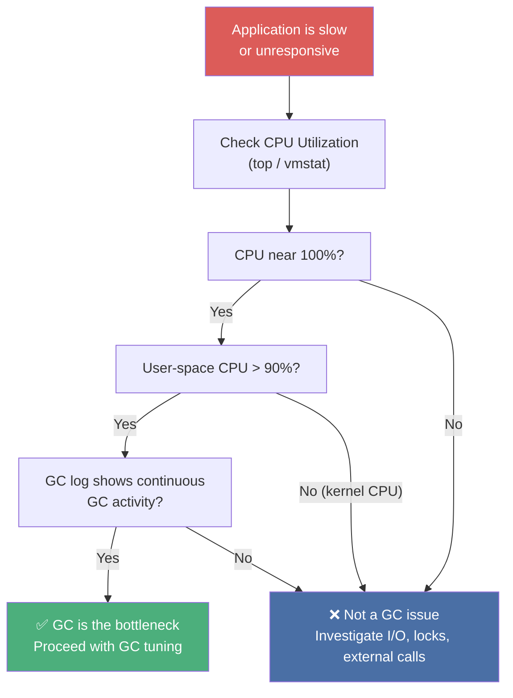
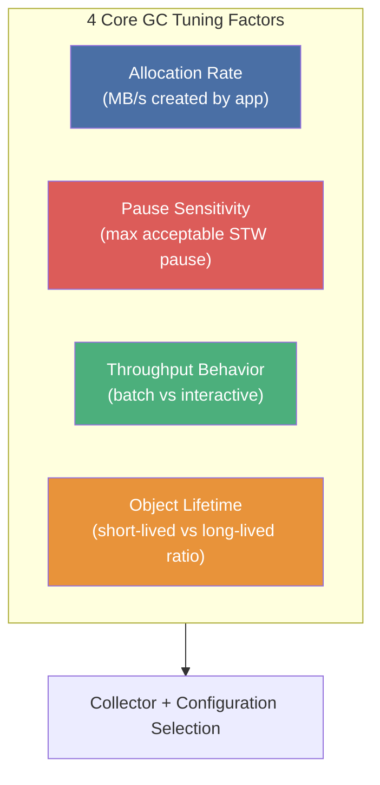
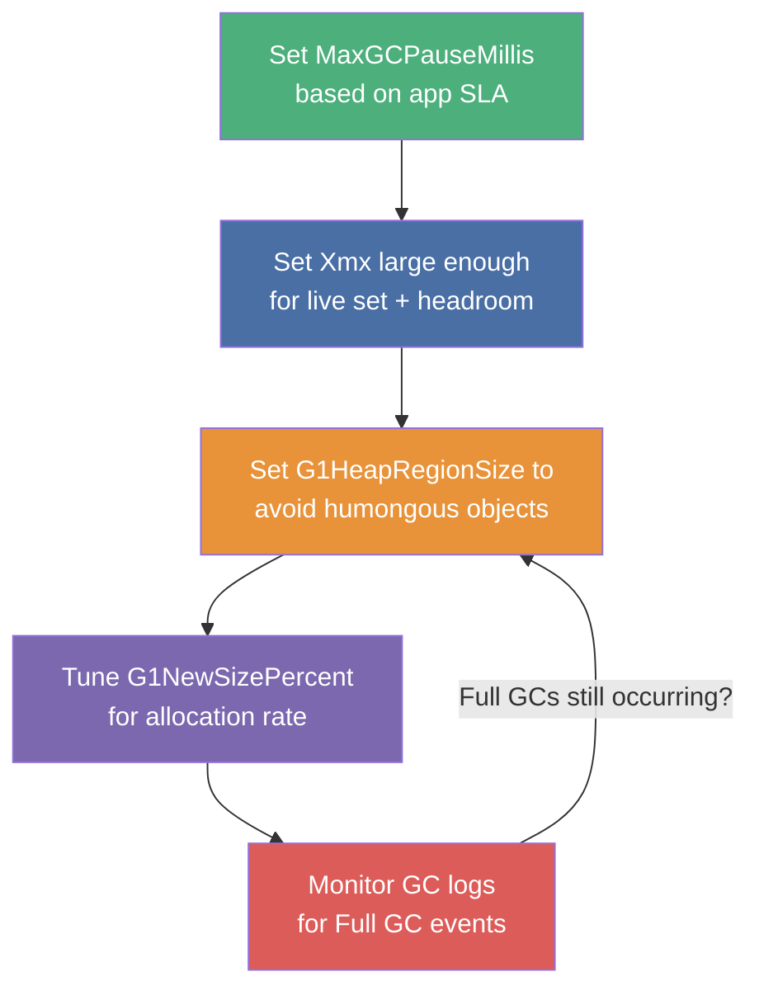
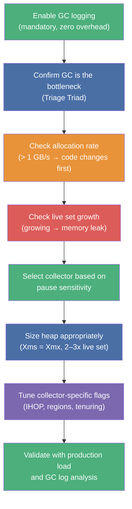

# :material-tune: Chapter 8: GC Logging, Monitoring, Tuning & Tools

> **Book:** Optimizing Java — Practical Techniques for Improving JVM Application Performance
>
> **Authors:** Benjamin J. Evans, James Gough, Chris Newland
>
> **Chapter:** 8 — GC Logging, Monitoring, Tuning and Tools
>
> **Status:** :material-check-circle: Complete

---

## :material-target: Learning Objectives

By the end of this chapter, you should be able to:

- [x] Configure mandatory GC logging flags for production JVMs
- [x] Explain why GC logs are superior to JMX for GC monitoring
- [x] Perform live incident triage to confirm/eliminate GC as the root cause
- [x] Apply the 4 core GC tuning factors to select the right approach
- [x] Tune Parallel GC, CMS, and G1GC with specific flag strategies
- [x] Understand the 1 GB/s allocation limit and its implication for tuning
- [x] Use `jHiccup` to measure JVM-level stall latency distributions

---

## :material-file-document: 1. GC Logging — Mandatory for Every Production JVM

!!! important "Non-Negotiable Production Requirement"
    **Every production JVM process must generate a GC log in a dedicated file.** GC logging is asynchronous, non-blocking, and adds ~0% performance overhead. There is no excuse not to enable it.

### Java 8 GC Logging Flags

```bash
# The complete mandatory GC logging configuration for Java 8
-Xloggc:/var/log/myapp/gc.log
-XX:+PrintGCDetails
-XX:+PrintTenuringDistribution
-XX:+PrintGCTimeStamps
-XX:+PrintGCDateStamps
-XX:+UseGCLogFileRotation
-XX:NumberOfGCLogFiles=10
-XX:GCLogFileSize=50m
```

| Flag | Purpose |
|------|---------|
| `-Xloggc` | Write to dedicated file (not stdout) |
| `-XX:+PrintGCDetails` | Full per-phase timing breakdown |
| `-XX:+PrintTenuringDistribution` | Age histogram — reveals premature promotion |
| `-XX:+PrintGCTimeStamps` | Seconds since JVM start (correlate with JVM events) |
| `-XX:+PrintGCDateStamps` | Wallclock timestamps (correlate with app logs) |

!!! tip "Log Volume Estimate"
    30 minutes at 50 MB/s allocation rate → ~600 KB of GC logs. Size your rotation accordingly.

---

## :material-compare: 2. GC Logs vs JMX — Why Logs Win

JMX is the wrong tool for GC monitoring:

| Concern | GC Logs | JMX |
|---------|---------|-----|
| **Data completeness** | Every GC event captured | Sampling-based — misses events |
| **Heap accuracy** | Exact before/after occupancy | Sampled snapshot only |
| **Overhead** | ~0% (async file write) | High — RMI proxies + serialization |
| **Metric count** | > 50 metrics per event | < 10 memory metrics |
| **Finalization trap** | None | RMI teardown forces hourly Full GCs! |

!!! danger "JMX Full GC Side Effect"
    RMI (used by JMX) has a built-in finalizer-based cleanup that triggers a **Full GC once per hour by default** (`sun.rmi.dgc.server.gcInterval=3600000`). If you see unexplained hourly Full GCs, JMX monitoring is likely the cause.

---

## :material-stethoscope: 3. Live Incident Triage — The GC Diagnostic Flowchart



**The Triage Triad**: 100% CPU + >90% user-space CPU + active GC log = confirmed GC bottleneck.

---

## :material-chart-scatter-plot: 4. GC Log Analysis Tools

| Tool | Type | Best For |
|------|------|---------|
| **Censum** (jClarity) | Commercial desktop/SaaS | Automated analytics: premature promotion, spiky allocation, memory leaks, capacity planning |
| **GCViewer** | Open-source desktop | Heap usage graphs, pause time visualization |
| **GCEasy** | Online SaaS | Quick upload-and-analyze for one-off analysis |

!!! warning "Never Write Custom GC Log Parsers"
    GC log formats are undocumented, non-standardized, and change between JDK minor releases. Hand-rolled parsers break silently on JDK updates. Always use established tools.

---

## :material-scale-balance: 5. The Four GC Tuning Factors

Every GC tuning decision is driven by four application characteristics:



### The 1 GB/s Allocation Wall

!!! danger "The Tuning Ceiling"
    **Sustained allocation rates > 1 GB/s cannot be solved by GC tuning alone.** No amount of GC configuration can outrun an application creating garbage faster than hardware can collect it.
    
    The only solution at > 1 GB/s is **application refactoring**: eliminate object creation, use object pools, reduce boxing, avoid string concatenation in hot paths.

### Pause Sensitivity Bands — Collector Selection

| Application Type | Max Pause Target | Recommended Collector |
|-----------------|-----------------|----------------------|
| Batch / ETL / MapReduce | > 1 second OK | **Parallel GC** |
| Web applications / REST APIs | 100 ms – 1 s | **G1GC** |
| Low-latency services | < 100 ms | **CMS / G1GC** |
| Ultra-low-latency / HFT | < 10 ms | **ZGC / Shenandoah** |

---

## :material-memory: 6. Understanding Allocation Hotspots

Common sources of excessive allocation in Java applications:

| Source | Description |
|--------|-------------|
| **Debug logging** | `log.debug("Processing " + request.id)` — string concat even if DEBUG is off |
| **Auto-boxing** | `Map<String, Integer>` boxing primitive `int` → `Integer` on every put |
| **Domain objects** | Order/Trade objects not being pooled or reused |
| **Framework overhead** | Spring/Jackson/Hibernate creating intermediate objects on every request |

**Top heap histogram entries in most Java apps** (from `jmap -histo`):

```
 num     #instances         #bytes  class name
   1:      15234891     1828186920  [C                   (char arrays — String data)
   2:       7823456      939614720  [B                   (byte arrays — binary data)
   3:       6234123      748094760  java.lang.String
   4:       4532011      544441320  java.util.HashMap$Entry
   5:       2341234      281347680  [Ljava.lang.Object;  (Object arrays)
```

---

## :material-tune-vertical: 7. Heap Sizing — The Foundation of GC Tuning

```bash
# Production heap sizing
-Xms4g        # Initial heap size
-Xmx4g        # Maximum heap size (set equal to -Xms to eliminate resize pauses)
-XX:MaxMetaspaceSize=256m   # Cap Metaspace (Java 8+)
```

!!! tip "Always Set -Xms = -Xmx in Production"
    If `Xms` < `Xmx`, HotSpot resizes the heap dynamically, which triggers Full GCs. Set them equal to eliminate heap resizing pauses entirely.

### Card Table Scanning Math

The card table imposes a hard lower bound on Young GC pause times for large heaps:

```
Card table size = Old Gen size / 512 bytes per card

Example:
  20 GB heap with 15 GB Old Gen
  → 15 GB / 512 = 30 MB card table
  → Single-threaded scan of 30 MB card table ≈ 10 ms minimum

Result: Young GC on a 20 GB heap can NEVER be faster than ~10ms,
        regardless of how few objects survive.
```

---

## :material-wrench: 8. Tuning Specific Collectors

### Tuning Parallel GC

Simplest collector — optimal for heaps < 4 GB where STW pauses are acceptable.

```bash
# Explicit sizing (legacy approach)
-XX:NewRatio=3      # OldGen:YoungGen = 3:1  → YoungGen = 25% of heap
-XX:SurvivorRatio=8 # Eden:Survivor = 8:1:1  → Eden = 80% of YoungGen

# Tenuring configuration
-XX:MaxTenuringThreshold=15    # Max GC cycles before promotion (default 4)
-XX:PretenureSizeThreshold=1m  # Objects > 1MB go straight to Old Gen
```

**Modern recommendation**: Let the JVM ergonomically size generations — manual ratio tuning is rarely beneficial.

### Tuning CMS

```bash
# Trigger CMS earlier to prevent CMF
-XX:CMSInitiatingOccupancyFraction=65   # Start at 65% (default 75% is too late for bursty apps)
-XX:+UseCMSInitiatingOccupancyOnly      # Disable adaptive occupancy (use fixed fraction)

# Thread allocation
-XX:ConcGCThreads=4   # Concurrent GC threads (default: 25% of available cores)

# Fragmentation diagnostics
-XX:PrintFLSStatistics=1   # Log free-list statistics (detects fragmentation-CMF)
```

**Signs of CMF approaching**:
- Back-to-back CMS cycles (CMS restarts immediately after completing — throughput drops 50%)
- Free-list max chunk size shrinking over time
- Promotion failures in GC logs

### Tuning G1GC

```bash
# Core G1 tuning
-XX:+UseG1GC
-Xmx32g -Xms32g
-XX:MaxGCPauseMillis=200           # Pause target (hint, not guarantee)
-XX:G1HeapRegionSize=16m           # Larger regions = less humongous object issues

# For high allocation rate workloads
-XX:MaxTenuringThreshold=15        # Keep objects in young gen longer
-XX:G1NewSizePercent=40            # Larger young gen → fewer promotions
-XX:G1MaxNewSizePercent=60

# Diagnostics
-XX:+UnlockExperimentalVMOptions
```

**G1 Tuning Philosophy**:



---

## :material-speedometer: 9. jHiccup — Measuring JVM Stall Latency

`jHiccup` (by Gil Tene, Azul Systems) measures JVM-level latency stalls — not just GC pauses, but **any JVM stoppage**: GC STW, OS scheduling preemption, hypervisor pauses, JIT compilation hiccups.

```bash
# Attach to running process
jHiccup -p <pid>

# Or as Java Agent
java -javaagent:jHiccup.jar="-d 0 -i 1000 -l hiccup.hlog" -jar myapp.jar

# Process the log
jHiccupLogProcessor -i hiccup.hlog -o hiccup-results.hgrm

# Output: HdrHistogram percentile distribution
# Value at 50th percentile: 0.23 ms
# Value at 99th percentile: 2.1 ms
# Value at 99.9th percentile: 47.3 ms   ← GC pause visible here
# Value at 99.99th percentile: 234 ms
```

!!! tip "jHiccup vs GC Logs"
    GC logs tell you pause duration as measured by the GC subsystem. jHiccup measures the actual wall-clock stall experienced by application threads — it captures TTSP overhead, OS scheduling delays, and all other sources of JVM latency.

---

## :material-checkbox-marked-outline: GC Tuning Checklist



---

## :material-help-circle: Questions Explored

- [x] What are the mandatory GC logging flags for production Java 8 JVMs?
- [x] Why is JMX inferior to GC logs for GC monitoring?
- [x] How do you triage a live performance incident to confirm GC is the root cause?
- [x] What is the 1 GB/s allocation ceiling and what does it mean for tuning?
- [x] How does the card table impose a hard lower bound on Young GC pause times?
- [x] What flags prevent Concurrent Mode Failure in CMS?
- [x] How should G1GC be tuned for high-allocation workloads?
- [x] What does jHiccup measure that GC logs don't?

---

## :material-navigation: Related Notes

| Chapter | Topic | Link |
|:-------:|-------|------|
| 6 | GC Fundamentals | [← Ch 6](book-reading-ch6.md) |
| 7 | Advanced GC — Concurrent Algorithms | [← Ch 7](book-reading-ch7.md) |
| 8 | GC Logging, Tuning & Tools | **You are here** |
| 9 | Code Execution & Bytecode on the JVM | [Ch 9 →](../topic-3-bytecode-jit/book-reading-ch9.md) |

---

*Last Updated: 2026-07-23*
