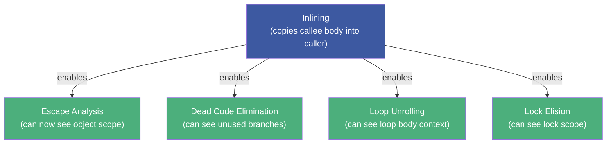
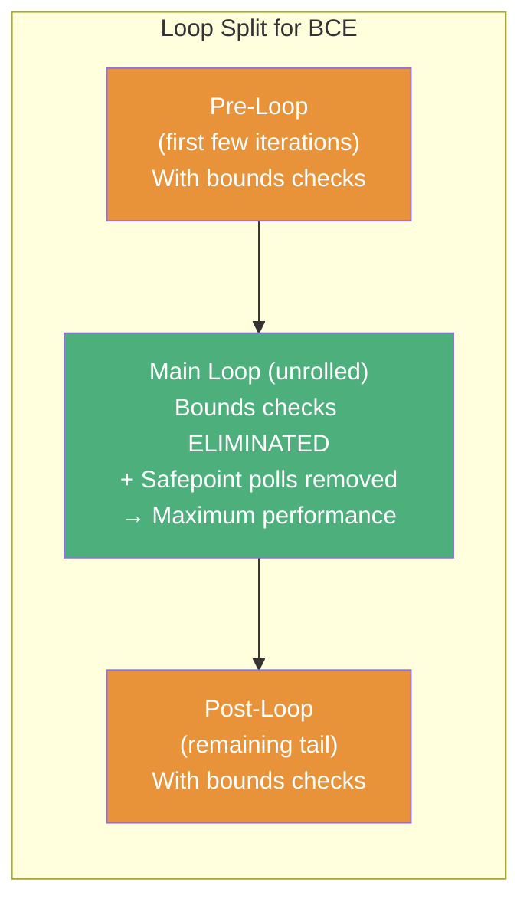
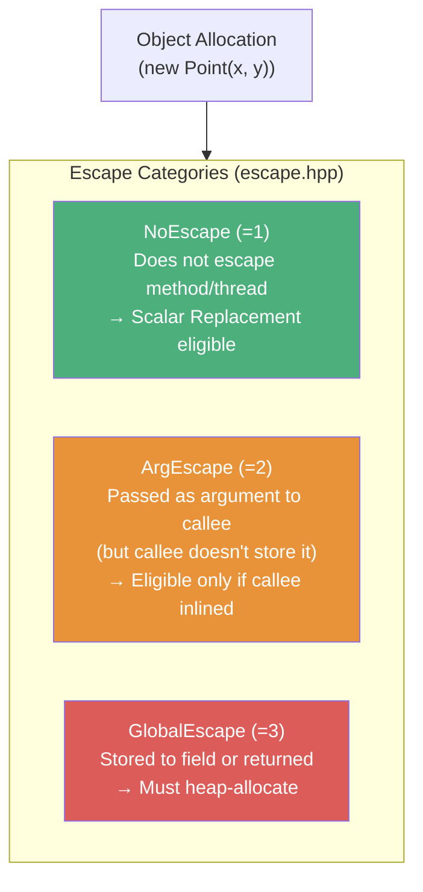
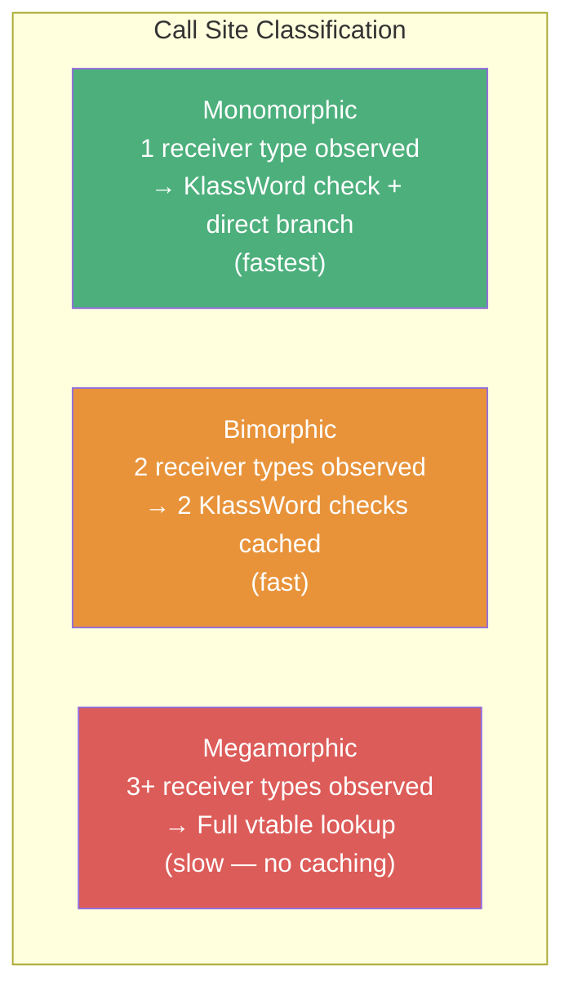
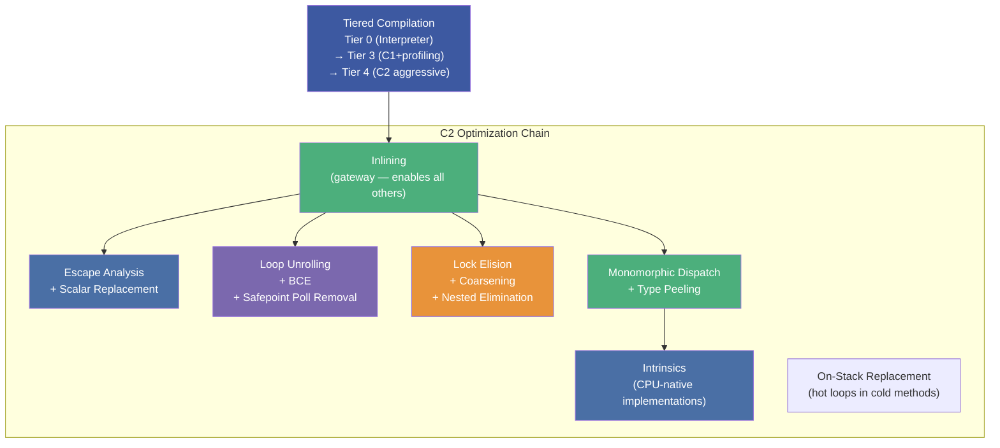

# :material-lightning-bolt: Chapter 10: Understanding JIT Compilation

> **Book:** Optimizing Java — Practical Techniques for Improving JVM Application Performance
>
> **Authors:** Benjamin J. Evans, James Gough, Chris Newland
>
> **Chapter:** 10 — Understanding JIT Compilation (Optimizations Deep Dive)
>
> **Status:** :material-check-circle: Complete

---

## :material-target: Learning Objectives

By the end of this chapter, you should be able to:

- [x] Use JITWatch's TriView to inspect inlining decisions and native assembly
- [x] Explain inlining as the **gateway optimization** and its size limits
- [x] Understand loop unrolling, why `long` loop counters defeat it, and bounds check elimination
- [x] Apply escape analysis to predict when objects will be stack-allocated (scalar replaced)
- [x] Explain the 64-element array scalar replacement limit and its benchmark consequences
- [x] Describe lock elision, lock coarsening, and nested lock elimination
- [x] Distinguish monomorphic/bimorphic/megamorphic call sites and apply type peeling
- [x] List key JVM intrinsics and understand why they matter
- [x] Know the 8,000-byte bytecode compilation wall and its consequences

---

## :material-magnify: 1. JITWatch — Inspecting JIT Decisions

JITWatch (by Chris Newland, one of this book's authors) is an open-source JavaFX tool that makes JIT decisions visible:

```bash
# Required flags to generate log for JITWatch
java -XX:+UnlockDiagnosticVMOptions \
     -XX:+TraceClassLoading \
     -XX:+LogCompilation \
     -jar myapp.jar
```

### JITWatch Views

| View | Purpose |
|------|---------|
| **Main Window** | Class tree, compiled methods, nmethod sizes, tier levels |
| **TriView** | Java source + Bytecode + Native Assembly side-by-side with annotations |
| **Sandbox** | Live prototyping — paste Java code, see JIT decisions in real-time |
| **Code Cache Layout** | Visual memory map of compiled nmethods by address |
| **JarScan** | Scans JAR files for methods exceeding inlining size limits |

!!! tip "TriView Is the Key Tool"
    TriView shows inline annotations like: `"Object of type int[] does not escape method. Heap allocation has been eliminated."` — this directly confirms scalar replacement happened.

---

## :material-merge: 2. Inlining — The Gateway Optimization

Inlining copies the **body of a callee method** directly into the caller's call site, eliminating:

- Parameter passing overhead
- Method lookup indirection (vtable traversal)
- Call stack frame creation
- Return value transfer

But the **real value** is what inlining *enables*:



!!! important "Inlining Is the Gateway"
    **Almost every other JIT optimization depends on inlining having happened first.** Escape analysis cannot prove an object doesn't escape if it passes through un-inlined call boundaries. Lock elision cannot prove a lock is thread-local if the method isn't inlined.

### Inlining Thresholds

| Flag | Default | Applies To |
|------|---------|------------|
| `-XX:MaxInlineSize=35` | 35 bytes | Non-hot methods |
| `-XX:FreqInlineSize=325` | 325 bytes | Hot (frequently invoked) methods |
| `-XX:InlineSmallCode=1000` | 1000 bytes | Existing compiled code (non-tiered) |
| `-XX:InlineSmallCode=2000` | 2000 bytes | Existing compiled code (tiered) |
| `-XX:MaxInlineLevel=9` | 9 levels | Maximum call depth for recursive inlining |

### Real-World Inlining Failure — `String.toUpperCase()`

In JDK 8, `String.toUpperCase()` is **439 bytes** of bytecode — exceeds `FreqInlineSize` of 325. The JIT refuses to inline it. Solution: write a specialized ASCII-only version:

```java
// JDK 8 String.toUpperCase() = 439 bytes → NOT inlined → slow

// Custom ASCII-only version = 69 bytes → inlined → fast
public static String toUpperCaseASCII(String s) {
    char[] chars = s.toCharArray();
    for (int i = 0; i < chars.length; i++) {
        if (chars[i] >= 'a' && chars[i] <= 'z') {
            chars[i] -= 32;
        }
    }
    return new String(chars);
}
// Result: 2.4x performance improvement purely from successful inlining
```

---

## :material-rotate-right: 3. Loop Unrolling & Bounds Check Elimination

### Loop Unrolling

Loop unrolling duplicates the loop body N times, reducing the frequency of back-branches:

```java
// Original loop (simplified)
for (int i = 0; i < n; i++) {
    sum += data[i];
}

// After 4x unrolling (JIT does this internally)
for (int i = 0; i < n - 3; i += 4) {
    sum += data[i];
    sum += data[i+1];
    sum += data[i+2];
    sum += data[i+3];
}
// Handle remaining elements in post-loop
```

### Why `long` Loop Counters Are Fatal

```java
// FAST: ~30 M ops/sec — int counter enables unrolling
for (int i = 0; i < N; i++) { ... }

// SLOW: ~11 M ops/sec — long counter defeats unrolling (64% slower!)
for (long i = 0; i < N; i++) { ... }
```

!!! danger "The Loop Counter Rule"
    **Always use `int`, `short`, or `char` for loop counters.** `long` counters are NOT unrolled by HotSpot. The performance penalty can be 64% — not a micro-optimization but a major architectural concern.

### Bounds Check Elimination (BCE)

Without BCE, every `data[i]` access requires a bounds check: `if (i < 0 || i >= data.length) throw AIOOB`. BCE eliminates these in the main loop body:



**Safepoint poll removal**: The main unrolled loop also has JVM safepoint polls removed — the JIT can prove the loop will terminate, so no mid-loop safepoint is needed.

---

## :material-target-account: 4. Escape Analysis & Scalar Replacement

Escape analysis determines whether an allocated object can **escape** its defining method or thread:



### Scalar Replacement — Stack Allocation Without a Stack

When an object is `NoEscape`, the JIT **deconstructs it into its primitive fields**:

```java
// Source code
void compute() {
    Point p = new Point(x, y);  // heap allocation?
    double dist = Math.sqrt(p.x * p.x + p.y * p.y);
    // p is never returned or stored anywhere
}

// After escape analysis + scalar replacement:
// Point p is NEVER allocated on the heap
// p.x and p.y become CPU registers (or stack slots)
// No GC pressure — completely allocation-free!
```

### The 64-Element Array Limit

!!! danger "The Hidden Array Cliff"
    Arrays are also subject to escape analysis and scalar replacement, but **only if they have ≤ 64 elements**:
    
    ```java
    int[] arr63 = new int[63];   // → Scalar replaced! No heap allocation
    int[] arr64 = new int[64];   // → Scalar replaced! No heap allocation
    int[] arr65 = new int[65];   // → Heap allocated! 2.4x performance drop
    ```
    
    **Benchmark results from the book:**
    - 64 elements: ~49.8 M ops/sec
    - 65 elements: ~21.1 M ops/sec (**2.4x slower!**)
    
    Fix: `-XX:EliminateAllocationArraySizeLimit=65` (or whatever your array size is)

### No Partial Escape Analysis

HotSpot uses **whole-method escape analysis** — if an object escapes on ANY code path (even an unlikely one), it's considered escaped on ALL paths:

```java
void process(boolean flag) {
    List<String> results = new ArrayList<>();  // Escape analysis result?
    
    if (flag) {
        globalCache.put(key, results);  // ESCAPES on this branch!
    }
    
    // Even though results doesn't escape on the !flag branch,
    // HotSpot marks it ArgEscape/GlobalEscape everywhere
    // → Always heap-allocated
}

// Fix: Move the allocation inside the non-escaping branch
void process(boolean flag) {
    if (!flag) {
        List<String> results = new ArrayList<>();  // Local only — NoEscape!
        // ... use results locally
    } else {
        globalCache.put(key, new ArrayList<>());
    }
}
```

---

## :material-lock: 5. Lock Optimizations — Elision, Coarsening & Nested Elimination

These optimizations apply **only to intrinsic `synchronized` locks** — not `ReentrantLock` or other `java.util.concurrent` locks.

### Lock Elision

If an object is `NoEscape`, its monitor is inaccessible to other threads. The JIT completely removes `monitorenter`/`monitorexit` bytecodes:

```java
// Source
void doWork() {
    synchronized (new Object()) {  // Lock on a local object!
        compute();
    }
}

// JIT eliminates the lock entirely — it's a NoEscape object
// No synchronization overhead
```

### Lock Coarsening

Adjacent synchronized blocks on the same monitor are merged into one:

```java
// Source
synchronized (lock) { operation1(); }
synchronized (lock) { operation2(); }  // Same lock!

// JIT merges into:
synchronized (lock) { operation1(); operation2(); }
// Eliminates redundant lock acquire/release pair
```

### Nested Lock Elimination

When the JIT can prove a thread already holds an outer lock on a `static final` object or `this`, inner synchronized blocks on the same object are eliminated:

```java
synchronized (LOCK) {
    // JIT can see LOCK is already held
    synchronized (LOCK) {  // ← Eliminated by JIT
        innerWork();
    }
}
```

Flag to observe: `-XX:-EliminateLocks` (disables) / `-XX:-EliminateNestedLocks` (disables nested)

---

## :material-ray-start: 6. Monomorphic Dispatch — The Call Site Optimization

Virtual method calls (`invokevirtual`, `invokeinterface`) require vtable lookup at runtime. The JIT profiles call sites using **Method Data Objects (MDOs)**:



### Type Peeling — Recovering Megamorphic Call Sites

```java
// Megamorphic call site (3+ types: Dog, Cat, Bird)
void handleAnimal(Animal a) {
    a.speak();  // → vtable lookup every time
}

// Type peeling — peel off dominant type
void handleAnimal(Animal a) {
    if (a instanceof Dog) {
        ((Dog) a).speak();   // Monomorphic — fast direct call
    } else {
        a.speak();           // Bimorphic (Cat + Bird) — still fast
    }
}
// Result: ~13% throughput improvement from the book's benchmark
```

!!! tip "When to Apply Type Peeling"
    Use type peeling when profiling shows a call site is megamorphic but one type overwhelmingly dominates. Explicitly checking that type transforms the remaining call site from megamorphic to bimorphic.

---

## :material-chip: 7. Intrinsics — Assembly-Optimized Core Methods

Intrinsics are **pre-written, architecture-specific assembly implementations** of selected core library methods that the JIT recognizes by name and replaces entirely:

| Method | What the JIT Does |
|--------|------------------|
| `System.arraycopy()` | SIMD vectorized copy using `MOVDQU`/`REP MOVSB` |
| `System.currentTimeMillis()` | Direct `rdtsc` / OS fast path (no JNI overhead) |
| `Math.min()` / `Math.max()` | `CMOV` conditional move (branchless) |
| `Math.log10()` | `fldlg2` + `fyl2x` FPU instructions directly |
| `AES encrypt/decrypt` | `AESENC`/`AESDEC` hardware AES instructions |
| `String.equals()` | Vectorized comparison |
| `Object.hashCode()` | Direct identity hash implementation |

**Annotated with `@HotSpotIntrinsicCandidate`** in Java 9+ source code.

!!! important "Intrinsics Are Why Java Can Match C++ Performance"
    For compute-intensive code using core library methods, HotSpot intrinsics ensure Java uses the same optimized CPU instructions as hand-written C. AES encryption in Java 9+ runs at native hardware speed.

---

## :material-update: 8. On-Stack Replacement (OSR)

OSR solves the problem of **hot loops inside cold methods** (e.g., a long-running loop in `main()`):

```java
public static void main(String[] args) {
    // Method 'main' is called once — invocation counter never triggers JIT
    // But this loop runs 10 million times — it's HOT!
    long sum = 0;
    for (long i = 0; i < 10_000_000; i++) {
        sum += i;
    }
    System.out.println(sum);
}
```

**OSR process:**
1. Back-branch counter in the interpreter increments on each loop iteration
2. When counter exceeds OSR threshold → compile the loop for C2
3. JIT compiles the entire method body around the loop
4. Execution **transfers mid-loop** from interpreted stack frame to compiled native frame
5. Subsequent iterations run at C2 speed

You can see OSR compilations in `-XX:+PrintCompilation` output as methods flagged with `%`.

---

## :material-wall: 9. The 8,000-Byte Compilation Wall

!!! danger "The Most Important Size Limit in Java Performance"
    Methods exceeding **8,000 bytes of bytecode** (`HugeMethodLimit`) will **NEVER be JIT-compiled** — they execute in the interpreter indefinitely.
    
    **Performance impact:**
    ```
    Method < 8000 bytes:  ~89,550 ops/sec (C2 compiled)
    Method > 8000 bytes:  ~44,429 ops/sec (interpreter only)
    ```
    **2x performance penalty — permanent, silent, no warning in production.**

### Who Hits the 8,000-Byte Wall?

- **Generated code**: ORM framework SQL builders (Hibernate Criteria, jOOQ)
- **Auto-generated parsers**: ANTLR-generated parsers with large switch tables
- **Hand-written god methods**: Business logic in 1,000-line methods
- **Deserialization code**: Auto-generated `readObject()` / Protobuf deserialization

**Detection with JarScan** (bundled in JITWatch):

```bash
java -jar jitwatch.jar jarScan --mode=bc --limit 8000 myapp.jar
# Lists all methods > 8000 bytes — compile-wall candidates
```

**Fix**: Refactor large methods by extracting sub-methods. Each extracted method can independently cross its inlining threshold and be JIT-compiled.

---

## :material-checklist: JIT Optimization Summary



---

## :material-help-circle: Questions Explored

- [x] Why is inlining called the "gateway" optimization and what does it unlock?
- [x] What are the inlining size limits and how did they cause `toUpperCase()` to be slow?
- [x] Why does a `long` loop counter cause ~64% performance regression?
- [x] How does bounds check elimination work and what is the 3-section loop split?
- [x] What are the three escape categories and when does scalar replacement happen?
- [x] Why is there a 64-element array limit for scalar replacement?
- [x] What is a "megamorphic" call site and how does type peeling fix it?
- [x] List 5 JVM intrinsics and explain why they matter for performance?
- [x] What is the 8,000-byte compilation wall and who is most at risk from it?
- [x] How does OSR enable JIT compilation of hot loops in cold methods?

---

## :material-navigation: Related Notes

| Chapter | Topic | Link |
|:-------:|-------|------|
| 9 | Code Execution on the JVM | [← Ch 9](book-reading-ch9.md) |
| 10 | Understanding JIT Compilation | **You are here** |

---

*Last Updated: 2026-07-23*
