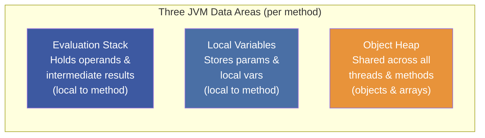
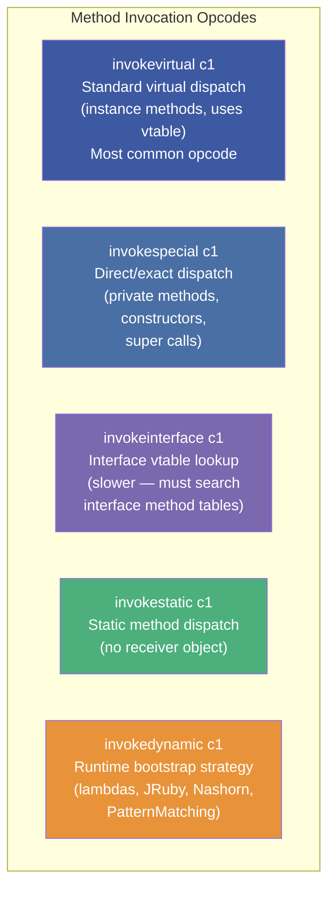
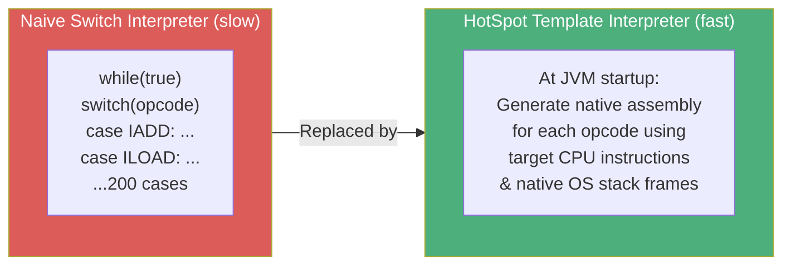
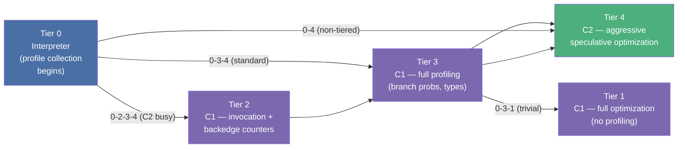
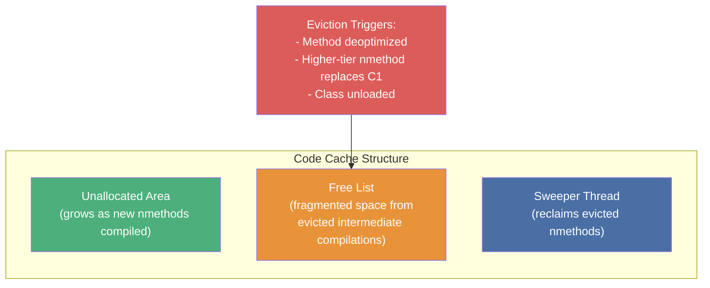

# :material-code-braces: Chapter 9: Code Execution on the JVM

> **Book:** Optimizing Java — Practical Techniques for Improving JVM Application Performance
>
> **Authors:** Benjamin J. Evans, James Gough, Chris Newland
>
> **Chapter:** 9 — Code Execution on the JVM (Bytecode, Interpreter & JIT Basics)
>
> **Status:** :material-check-circle: Complete

---

## :material-target: Learning Objectives

By the end of this chapter, you should be able to:

- [x] Explain the JVM's stack-machine execution model and its three data areas
- [x] Read and interpret basic bytecode sequences produced by `javac`
- [x] Distinguish the 5 opcode families and the operations in each
- [x] Explain the 5 method invocation opcodes and when each is used
- [x] Describe HotSpot's Template Interpreter and how it differs from a switch-loop interpreter
- [x] Explain tiered compilation (Tiers 0-4), C1 vs C2, and the 4 compilation pathways
- [x] Explain the Code Cache and why exhaustion silently kills JIT compilation

---

## :material-stack-overflow: 1. The JVM as a Stack Machine

Unlike physical CPUs that operate on **registers** (named, fixed-size storage locations), the JVM executes bytecode as a **stack machine**:



**How a simple expression evaluates on the stack:**

```java
// Java source
int result = x + 3 + 1;
```

```
Step 1: iload x     → Stack: [x]
Step 2: iconst_3    → Stack: [x, 3]
Step 3: iadd        → Stack: [x+3]      (pops 3 & x, pushes sum)
Step 4: iconst_1    → Stack: [x+3, 1]
Step 5: iadd        → Stack: [x+4]      (pops 1 & x+3, pushes sum)
Step 6: istore result → Stack: []       (pops into local variable slot)
```

---

## :material-file-code: 2. JVM Bytecode — The Architecture-Neutral IR

`javac` compiles Java source to **bytecode**: a compact, platform-neutral intermediate representation interpreted by the JVM (and JIT-compiled to native code for hot paths).

### Bytecode Properties

| Property | Detail |
|----------|--------|
| **Opcode size** | 1 byte per opcode (0–255; ~200 in active use) |
| **Endianness** | Strictly **big-endian** (MSB first) |
| **Typing** | Instructions are typed — `iadd` (int), `dadd` (double), `fadd` (float) |
| **Evolution** | Only 1 opcode added since Java 1.0 (`invokedynamic`); 2 deprecated (`jsr`, `ret`) |
| **Shortcut forms** | Common ops have argument-less shortcuts for compact class files (`aload_0`, `iconst_0`) |

### Reading Bytecode with `javap`

```bash
javap -c MyClass.class       # Show bytecode
javap -verbose MyClass.class # Full constant pool + bytecode
```

---

## :material-family-tree: 3. The Five Opcode Families

### Family 1: Load & Store

Moves values between local variable slots, the constant pool, and the evaluation stack:

| Opcode | Operation |
|--------|-----------|
| `iload i1` | Push int local variable at slot `i1` onto stack |
| `istore i1` | Pop stack top into local variable slot `i1` |
| `ldc c1` | Push constant from Constant Pool index `c1` |
| `aconst_null` | Push null reference (0-arg const shortcut) |
| `iconst_m1` | Push integer -1 (0-arg const shortcut) |
| `getfield c1` | Pop reference, push instance field value |
| `putfield c1` | Pop value + reference, store into instance field |
| `getstatic c1` | Push static field value (no receiver) |

### Family 2: Arithmetic

Purely stack-based type-specific arithmetic — always pops operands, pushes result:

```
iadd, isub, imul, idiv, irem, ineg, ishl, ishr  (int)
ladd, lsub, lmul, ldiv, lrem, lneg              (long)
fadd, fsub, fmul, fdiv, frem, fneg              (float)
dadd, dsub, dmul, ddiv, drem, dneg              (double)
i2l, i2f, i2d, l2i, l2f, f2i, d2i, ...         (type casts)
```

### Family 3: Flow Control

Implements all branching and looping:

| Opcode | Operation |
|--------|-----------|
| `goto i1` | Unconditional jump to offset `i1` |
| `if_icmpge i1` | Pop two ints; jump to `i1` if first ≥ second |
| `ifeq i1` | Pop int; jump to `i1` if == 0 |
| `tableswitch` | Dense integer switch (array lookup by index) |
| `lookupswitch` | Sparse integer switch (search through pairs) |

### Family 4: Method Invocation ⭐

The most important family — every method call in Java compiles to one of five opcodes:



!!! important "Why `final` methods use `invokevirtual`"
    JLS 13.4.17 states that removing `final` from a method must not break binary compatibility. Therefore `javac` emits `invokevirtual` for `final` methods. However, HotSpot replaces this with an internal private opcode for fast direct dispatch — you get virtual syntax, direct-call performance.

#### The `invokedynamic` Bootstrap Mechanism

`invokedynamic` (added in Java 7, used by Java 8 lambdas) enables a **bootstrap method** to determine the call target at first invocation:

```java
// Lambda in source
Runnable r = () -> System.out.println("hello");

// Compiled as invokedynamic → LambdaMetafactory.metafactory(...)
// At first invocation: Bootstrap creates a CallSite with a MethodHandle target
// At subsequent invocations: Direct dispatch — no bootstrap overhead
```

### Family 5: Platform (Memory & Sync)

Heap allocation and thread synchronization:

| Opcode | Operation |
|--------|-----------|
| `new c1` | Allocate new object of class at CP index `c1` |
| `newarray prim` | Allocate primitive array |
| `anewarray c1` | Allocate object reference array |
| `arraylength` | Get length of array on stack top |
| `monitorenter` | Acquire intrinsic lock (synchronized block entry) |
| `monitorexit` | Release intrinsic lock (synchronized block exit) |

---

## :material-engine: 4. HotSpot Interpreter — Template-Based, Not Switch-Loop

A naive bytecode interpreter uses `while(true) { switch(opcode) { ... } }`. HotSpot does not do this:



HotSpot generates a **template** — hand-written assembly snippets — for each opcode at startup. The templates exploit the native call stack and CPU registers directly, making interpreted execution significantly faster than a switch-loop approach.

### Safepoints in the Interpreter

Between every 2 bytecodes, the interpreter checks the **safepoint flag**. This is the natural safepoint cadence — the evaluation stack is in a known, consistent state between opcodes.

---

## :material-layers: 5. JIT Compilation — AOT vs JIT

### Why Not Ahead-of-Time (AOT)?

| AOT Compilation | JIT Compilation |
|-----------------|-----------------|
| Compiles **before** execution | Compiles **at runtime** for hot code |
| Must be conservative — doesn't know runtime CPU features | Can use **all** CPU features of the actual hardware |
| No runtime profile data — must guess call frequencies | Uses **real profiling data** (PGO) for speculative optimization |
| One-time optimization opportunity | Can re-optimize (deoptimize + recompile) as behavior changes |

!!! note "Profile Data Is Always Discarded"
    HotSpot discards all profile data on JVM shutdown. Why? Application behavior changes over time (e.g., a trading system on a high-volume news day behaves differently than on a quiet day). Using yesterday's profile for today's workload can **degrade** performance.

### JIT Compilation Units

- **Normal JIT**: Compiles a **complete method** when its invocation counter reaches threshold
- **On-Stack Replacement (OSR)**: Compiles a **hot loop inside a cold method** (e.g., a long-running loop in `main()`). Execution is transferred mid-loop from interpreted to compiled code.

---

## :material-stairs: 6. Tiered Compilation — 5 Execution Levels

HotSpot's default execution model (since Java 7/8) uses 5 levels, managed by `advancedThresholdPolicy`:



### Compilation Pathways Explained

| Pathway | Meaning |
|---------|---------|
| **0 → 3 → 4** (standard) | Normal hot method: Interpreter → C1 full profiling → C2 |
| **0 → 2 → 3 → 4** (C2 busy) | C2 queue is backlogged; C1 quick compile buys time |
| **0 → 3 → 1** (trivial method) | Method is so simple C2 cannot produce better code than C1 |
| **0 → 4** (non-tiered) | Legacy `-server` mode or explicit flag; skip C1 entirely |

### C1 vs C2 Compilers

| | C1 (Client) | C2 (Server) |
|--|-------------|-------------|
| **Speed** | Fast compilation | Slow compilation (seconds) |
| **Output quality** | Moderate optimization | Aggressive optimization |
| **Speculative opts** | No | Yes (with guards) |
| **Internal IR** | SSA form | Sea of Nodes |
| **Use case** | Desktop apps, quick startup | Server apps, long-running |

**SSA (Single Static Assignment)**: Internal form where every variable is assigned exactly once. Treats all variables as effectively `final`, enabling a wide range of dataflow optimizations.

---

## :material-database: 7. The Code Cache — JIT's Native Memory Region

The Code Cache is a fixed-size native memory region storing compiled **nmethods** (native methods — JIT output) and JVM internal stubs:



### Code Cache Sizing

| Condition | Default Size |
|-----------|-------------|
| Tiered compilation (Java 8+) | **240 MB** |
| No tiered compilation | 48 MB |

```bash
# Tune the code cache
-XX:ReservedCodeCacheSize=512m
```

!!! danger "Code Cache Exhaustion — The Silent JIT Killer"
    When the Code Cache fills up, HotSpot **silently stops all JIT compilation**. Application code reverts to running in the interpreter (~10x slower). You'll see this in logs as:
    ```
    VM warning: CodeCache is full. Compiler has been disabled.
    ```
    
    **Rule**: "Any method that wants to compile should be given the resources to do so." Keep the code cache large enough that it never fills.

### Logging JIT Compilation

```bash
# Basic JIT log
-XX:+PrintCompilation

# Output format:
#  timestamp  id  tier  method name         bytes  code-size
    284    1    n 0     java.lang.Object::hashCode (0 bytes)
   1042    2    3       com.example.MyClass::process (45 bytes)
   2841    2    4       com.example.MyClass::process (45 bytes)
   3010    2           com.example.MyClass::process  made not entrant

# Flags in output:
#   n = native method
#   s = synchronized method  
#   ! = has exception handlers
#   % = OSR compilation
#   'made not entrant' = deoptimized/invalidated
```

---

## :material-help-circle: Questions Explored

- [x] Why does the JVM use a stack machine instead of registers?
- [x] What are the 5 opcode families and what operations does each cover?
- [x] Why does `javac` use `invokevirtual` for `final` methods — and what does HotSpot actually do?
- [x] What is `invokedynamic` and how does the lambda bootstrap mechanism work?
- [x] Why is HotSpot's template interpreter faster than a switch-loop interpreter?
- [x] What are the 5 tiers of tiered compilation and the 4 compilation pathways?
- [x] What happens when the Code Cache fills up, and why is it dangerous?
- [x] What is OSR and when does it trigger?
- [x] Why does JIT profile data get discarded at JVM shutdown?

---

## :material-navigation: Related Notes

| Chapter | Topic | Link |
|:-------:|-------|------|
| 8 | GC Logging, Tuning & Tools | [← Ch 8](../topic-2-garbage-collection/book-reading-ch8.md) |
| 9 | Code Execution on the JVM | **You are here** |
| 10 | Understanding JIT Compilation | [Ch 10 →](book-reading-ch10.md) |

---

*Last Updated: 2026-07-23*
