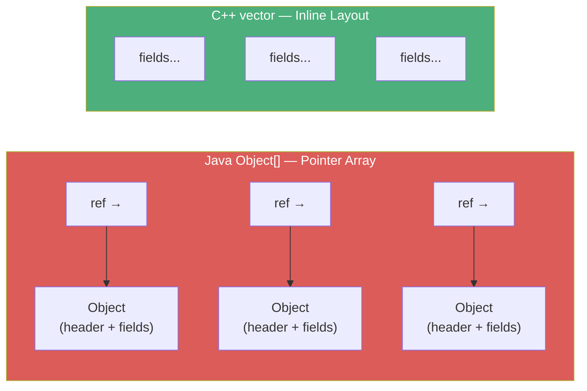
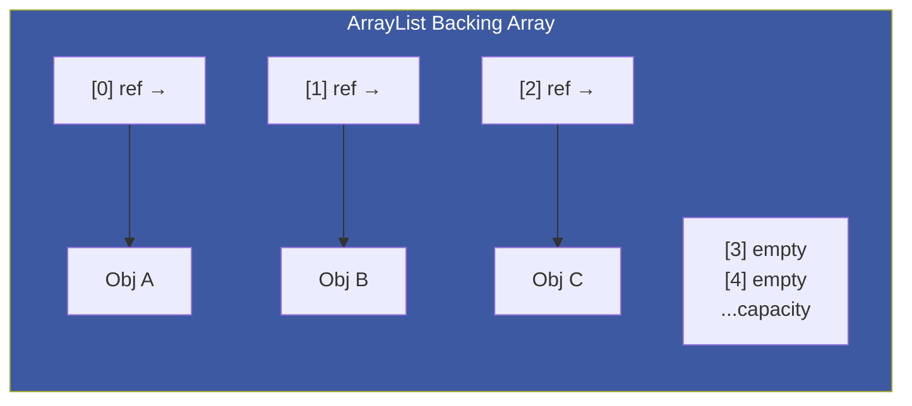
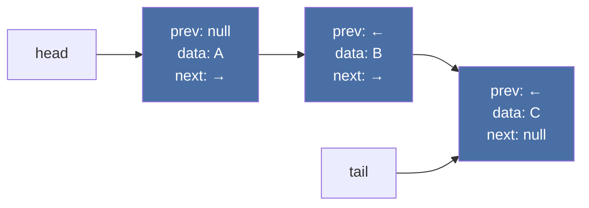
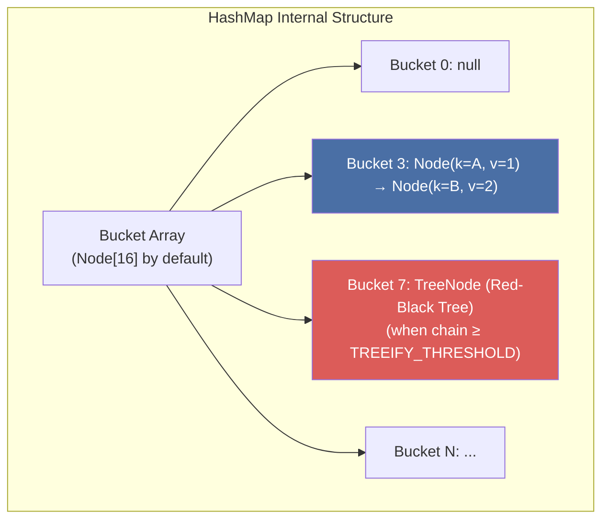
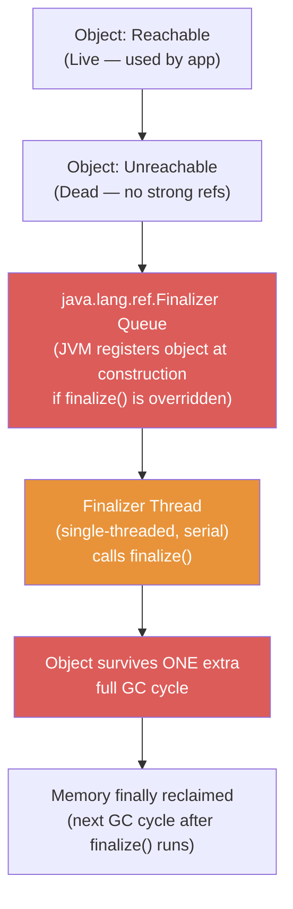

# :material-palette-swatch: Chapter 11: Java Language Performance Techniques

> **Book:** Optimizing Java — Practical Techniques for Improving JVM Application Performance
>
> **Authors:** Benjamin J. Evans, James Gough, Chris Newland
>
> **Chapter:** 11 — Java Language Performance Techniques
>
> **Status:** :material-check-circle: Complete

---

## :material-target: Learning Objectives

By the end of this chapter, you should be able to:

- [x] Explain the memory layout difference between `ArrayList` and `LinkedList` and when to use each
- [x] Pre-size collections correctly to avoid costly resize operations
- [x] Understand HashMap's bucket, spread function, treeify threshold, and load factor mechanics
- [x] Choose `TreeMap` vs `HashMap` for the right access patterns
- [x] Diagnose domain object memory leaks using `jmap -histo`
- [x] Explain why `finalize()` is deprecated and the lifecycle cost it imposes
- [x] Use `try-with-resources` as the deterministic alternative
- [x] Understand Method Handles as the JIT-friendly alternative to reflection

---

## :material-playlist-check: 1. Java's Memory Layout Constraint

Before diving into individual collections, the critical context: **Java stores reference-type fields as heap pointers, not inline object instances** (unlike C++ where arrays of structs are contiguous in memory).



!!! note "The Last Major Performance Gap"
    Gil Tene (CTO, Azul Systems) notes that Java's inability to store value types inline in arrays is one of the last significant performance barriers between Java and C. **Project Valhalla** and **Value Types** address this in future Java versions.

---

## :material-view-list: 2. Sequential Containers — ArrayList vs LinkedList

### ArrayList — O(1) Indexed Access, O(n) Head Insert

`ArrayList` is backed by a **contiguous array** in the heap:



**Key performance characteristics:**

| Operation | Complexity | Notes |
|-----------|------------|-------|
| `get(i)` / `set(i)` | O(1) | Direct array index |
| `add()` (append) | O(1) amortized | O(n) when backing array fills |
| `add(0, e)` (head insert) | O(n) | Shifts all elements right |
| `remove(i)` | O(n) | Shifts elements left |

**Resizing mechanic**: When the backing array fills, `Arrays.copyOf()` allocates a new array (~1.5× larger) and copies all elements — O(n) individual resize, O(1) amortized over many appends.

!!! tip "Always Pre-Size ArrayList"
    ```java
    // Bad: triggers multiple resize+copy cycles
    List<String> list = new ArrayList<>();
    for (int i = 0; i < 1_000_000; i++) list.add(items[i]);

    // Good: single allocation, zero resizing
    List<String> list = new ArrayList<>(1_000_000);
    for (int i = 0; i < 1_000_000; i++) list.add(items[i]);
    ```
    **JMH benchmark result**: Properly sized → 287 ops/s vs resizing → 190 ops/s (~51% faster).

### LinkedList — O(1) Head Insert, O(n) Indexed Access

`LinkedList` is a **doubly-linked list** of `Node` objects on the heap:



| Operation | Complexity | Notes |
|-----------|------------|-------|
| `add()` / `addFirst()` | O(1) | Adjust 2 pointers |
| `get(i)` | O(n) | Must traverse from head |
| Memory overhead | High | Each node = header + prev + next + data ref |

**JMH benchmark comparison:**

| Operation | ArrayList | LinkedList |
|-----------|-----------|------------|
| Head insert (`add(0, e)`) | 3.4 ops/ms | **559 ops/ms** (163× faster!) |
| Indexed access (`get(i)`) | **269,568 ops/ms** | 0.86 ops/ms (313,000× faster!) |

!!! important "Default to ArrayList"
    In practice, `ArrayList` outperforms `LinkedList` for almost all workloads because modern CPU caches love contiguous memory. Use `LinkedList` only when you have high-frequency insertions at the front/middle and never use indexed access.

!!! warning "Deprecated: Vector & Stack"
    `Vector` and `Stack` add unnecessary synchronization on every operation. Remove them from all new code. Use `ArrayList` + explicit synchronization or `Deque`/`ArrayDeque` for stack semantics.

---

## :material-table: 3. Associative Containers — HashMap Internals

### HashMap Architecture



**Node structure** (source: OpenJDK):

```java
static class Node<K,V> implements Map.Entry<K,V> {
    final int hash;     // pre-computed hash
    final K key;
    V value;
    Node<K,V> next;     // chain for collision
}
```

### The Spread Function — Shannon's Avalanche Criteria

The raw `hashCode()` is processed to prevent clustering in low buckets:

```java
static final int hash(Object key) {
    int h;
    return (key == null) ? 0 : (h = key.hashCode()) ^ (h >>> 16);
}
// Bucket index: (capacity - 1) & hash(key)
```

XORing with the upper 16 bits ensures that even when capacity is small (e.g., 16 buckets, only lower 4 bits matter), high-order bits of the hash code still influence bucket selection — satisfying **Shannon's Strict Avalanche Criteria** (small input changes cause large, unpredictable output changes).

### Tuning HashMap Performance

```java
// Default: capacity=16, loadFactor=0.75 → resizes at 12 entries
Map<String, Integer> map = new HashMap<>();

// Pre-sized: avoids rehashing for known max entries
// Formula: initialCapacity = expectedEntries / loadFactor
Map<String, Integer> map = new HashMap<>(expectedEntries / 0.75f + 1);
```

!!! danger "Treeify — The Hidden Memory Trap"
    When a bucket chain reaches `TREEIFY_THRESHOLD` (default 8), HashMap converts the chain to a **red-black tree** (`TreeNode`):
    - Lookup improves from O(n) → O(log n)
    - But `TreeNode` uses **double the memory** of a regular `Node`
    - Treeifying means your hash function is producing too many collisions!
    
    **Fix**: Review hash function quality, increase `initialCapacity`, or use a better key type.

### Map Comparison Matrix

| Collection | Get | Put | Sorted | Range Queries | Notes |
|------------|-----|-----|--------|---------------|-------|
| `HashMap` | O(1) avg | O(1) avg | ❌ | ❌ | Default choice |
| `LinkedHashMap` | O(1) | O(1) | Insertion/Access order | ❌ | LRU cache pattern |
| `TreeMap` | O(log n) | O(log n) | ✅ | ✅ | Range queries, `subMap()` |

Use `TreeMap` when:
- You need `subMap()`, `headMap()`, `tailMap()` for range operations
- You need sorted iteration over keys
- You partition data for Java 8 Streams with ordered semantics

---

## :material-account-group: 4. Domain Objects & Memory Leak Diagnosis

Domain objects (`Order`, `OrderItem`, `DeliverySchedule`) are the application's business entities. They are usually the **primary symptom of memory leaks** — surviving multiple GC cycles and filling Old Gen.

### Diagnosis with `jmap -histo`

```bash
jmap -histo <pid> | head -30
# Or: jmap -histo:live <pid>  (forces a GC first, then shows live objects)
```

**Healthy heap histogram** — top entries are JDK types:

```
 num     #instances    #bytes  class name
   1:      15234891  1828186  [C (char arrays)
   2:       7823456   939614  [B (byte arrays)
   3:       6234123   748094  java.lang.String
   4:       4532011   544441  java.util.HashMap$Entry
```

**Leaking heap** — domain objects appear in top 30:

```
   8:         83221   199730  com.example.domain.Order        ← PROBLEM
   9:         75431   181034  com.example.domain.OrderItem    ← PROBLEM
```

!!! warning "The All-Generations Effect"
    A leaking object accumulates instances with GC age 1, 2, 3, ... all the way to `MaxTenuringThreshold`. Use `-XX:+PrintTenuringDistribution` — if you see large volumes of objects at every age from 1 to 15, you have a retention leak, not just bursty allocation.

---

## :material-recycle-variant: 5. Finalization — Never Use It

### How Finalization Works (The Costly Lifecycle)



**Finalization registration**: HotSpot automatically registers objects at construction time via an internal `return_register_finalizer` bytecode (defined in `hotspot/share/interpreter/bytecodes.cpp`) — you pay the GC cost even before the object ever becomes unreachable.

!!! danger "The 5 Fatal Flaws of finalize()"
    1. **Nondeterministic** — runs at some indeterminate future time, or never
    2. **Exception swallowing** — uncaught exceptions inside `finalize()` are silently ignored
    3. **Object resurrection risk** — `finalize()` can create new strong references, preventing GC forever
    4. **Single-threaded bottleneck** — the finalizer thread is serial; a slow finalizer blocks all others
    5. **Deprecated** — `Object.finalize()` deprecated in Java 9, slated for removal

### The Correct Alternative: `try-with-resources`

```java
// Before Java 7: Manual cleanup, error-prone
BufferedReader br = null;
try {
    br = new BufferedReader(new FileReader(file));
    return br.readLine();
} finally {
    if (br != null) br.close();  // What if readLine() AND close() both throw?
}

// Java 7+: Compile-time desugaring, deterministic, handles suppressed exceptions
try (BufferedReader br = new BufferedReader(new FileReader(file))) {
    return br.readLine();
}
// javac generates: try { ... } finally { ... } with addSuppressed() handling
```

!!! tip "Zero Runtime Cost"
    `try-with-resources` is **purely a `javac` transformation** — it generates `try-catch-finally` bytecode. There is no JVM runtime overhead compared to manual `finally` blocks.

---

## :material-function: 6. Method Handles — JIT-Friendly Dynamic Dispatch

Method Handles (`java.lang.invoke`) were introduced in Java 7 alongside `invokedynamic`. They provide strongly-typed, JIT-compilable dynamic method invocation:

```java
// Traditional reflection — always allocates Object[] for args, boxes primitives
Method m = String.class.getMethod("hashCode");
int hash = (int) m.invoke(myString);  // → getfield, aastore, invokevirtual
                                       //   Method.invoke:(Object, Object[])

// Method Handle — signature-polymorphic, no boxing, JIT-inlinable
MethodType mt = MethodType.methodType(int.class);
MethodHandles.Lookup lookup = MethodHandles.lookup();
MethodHandle mh = lookup.findVirtual(String.class, "hashCode", mt);
int hash = (int) mh.invoke(myString);  // → invokevirtual MethodHandle.invoke:(String)I
                                        //   Exact parameter types — zero boxing!
```

**Lookup context** (`MethodHandles.lookup()`) captures access rights at creation time — no need for `setAccessible(true)`. Throws `IllegalAccessException` if unauthorized, unlike reflection's runtime `AccessControlException`.

!!! important "Signature Polymorphism"
    `javac` emits the exact calling signature in the bytecode (e.g., `invoke:(Ljava/lang/String;)I`). This means: no varargs `Object[]` allocation, no primitive boxing/unboxing, and the JIT can inline the call site just like a direct virtual dispatch.

---

## :material-help-circle: Questions Explored

- [x] When should you use `ArrayList` vs `LinkedList`? What's the 163× gap explained by?
- [x] How does pre-sizing an `ArrayList` avoid O(n) resize costs?
- [x] What is the HashMap spread function and why does it satisfy Avalanche Criteria?
- [x] What does treeifying mean and why is it a warning sign (not a feature)?
- [x] When should you choose `TreeMap` over `HashMap`?
- [x] How do you detect domain object memory leaks with `jmap -histo`?
- [x] Why does `finalize()` add at least one extra GC cycle to every object's lifetime?
- [x] How does `try-with-resources` handle suppressed exceptions from both the body and `close()`?
- [x] Why are Method Handles JIT-friendly while reflection is not?

---

## :material-navigation: Related Notes

| Chapter | Topic | Link |
|:-------:|-------|------|
| 10 | JIT Compilation — Inlining & Escape Analysis | [← Ch 10](../topic-3-bytecode-jit/book-reading-ch10.md) |
| 11 | Java Language Performance Techniques | **You are here** |
| 12 | Concurrent Performance Techniques | [Ch 12 →](book-reading-ch12.md) |

---

*Last Updated: 2026-07-31*
