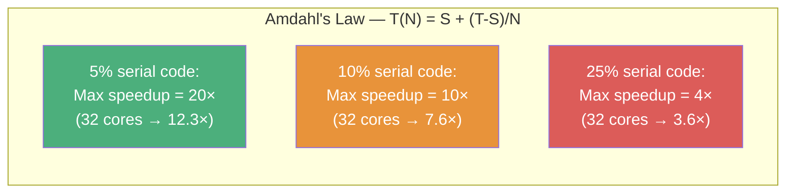
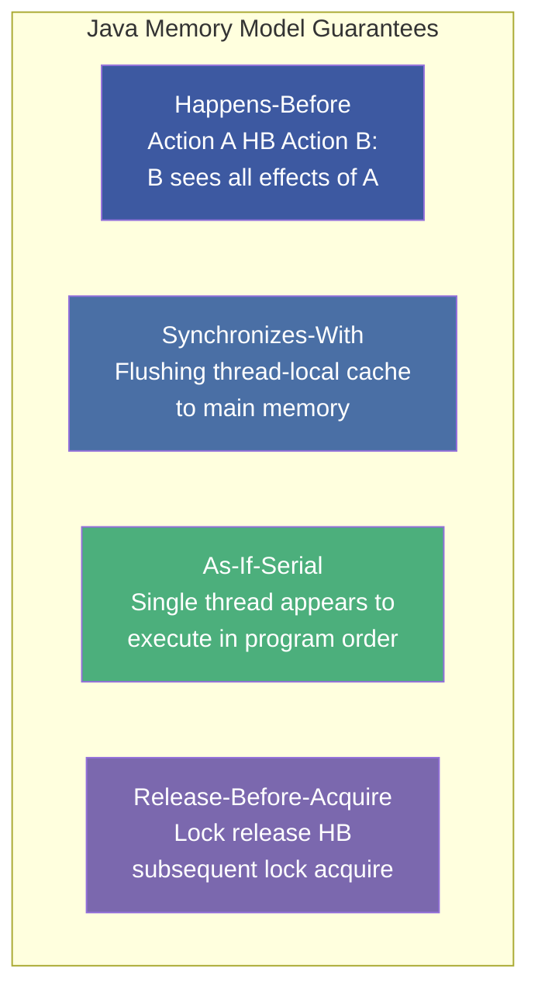
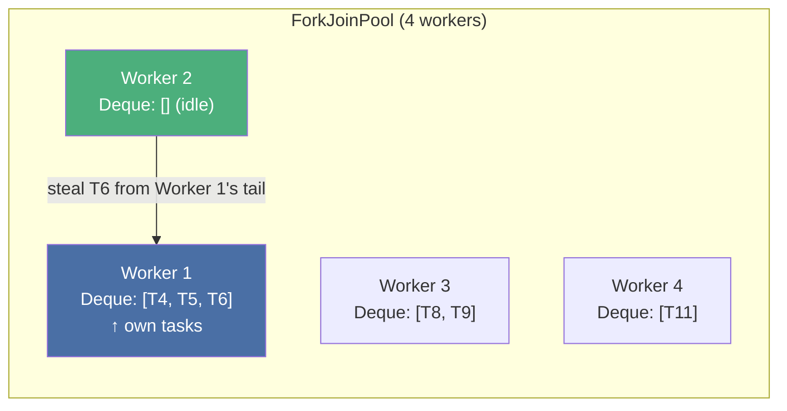
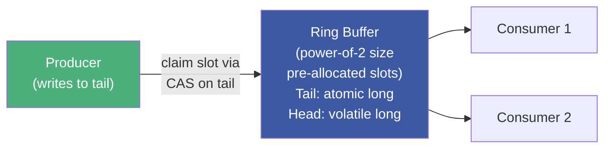
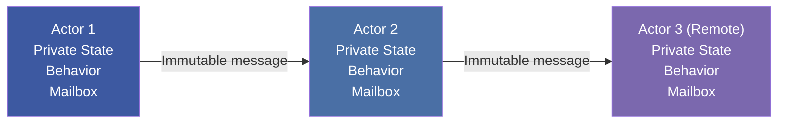

# :material-transit-connection-variant: Chapter 12: Concurrent Performance Techniques

> **Book:** Optimizing Java — Practical Techniques for Improving JVM Application Performance
>
> **Authors:** Benjamin J. Evans, James Gough, Chris Newland
>
> **Chapter:** 12 — Concurrent Performance Techniques
>
> **Status:** :material-check-circle: Complete

---

## :material-target: Learning Objectives

By the end of this chapter, you should be able to:

- [x] Apply Amdahl's Law to real JVM workloads including GC pauses and lock contention
- [x] Explain the Java Memory Model: happens-before, synchronizes-with, and why `volatile` ≠ atomic
- [x] Describe `sun.misc.Unsafe` and how CAS (Compare-And-Swap) works at the hardware level
- [x] Explain the difference between lock-based (`ReentrantLock`) and lock-free (`AtomicInteger`) concurrency
- [x] Choose the right `j.u.c` synchronizer for each scenario
- [x] Understand how ForkJoinPool's work-stealing algorithm scales embarrassingly parallel workloads
- [x] Explain why LMAX Disruptor beats `ArrayBlockingQueue` by 5–9× using Mechanical Sympathy

---

## :material-scale-balance: 1. Parallelism Limits — Amdahl's Law

### "The Free Lunch Is Over"

CPU clock speeds plateaued at ~3 GHz around 2005 (power/heat limits). All subsequent throughput gains require **parallelism** — but parallelism is fundamentally limited by the serial fraction of work.



**In JVM applications, the "serial fraction" includes:**
- GC Stop-The-World pauses (all threads stop)
- JIT compilation pauses (brief but frequent during warmup)
- Lock contention (threads serialized waiting for a monitor)
- Single-threaded I/O and logging

!!! important "GC Pauses Count as Serial Time"
    A 5% GC overhead in a throughput benchmark is not just 5% slower — it caps your maximum parallelism benefit at 20× regardless of how many cores you add.

---

## :material-memory: 2. The Java Memory Model (JMM)

### Why a Weak Memory Model?

Modern CPUs use cache coherency protocols (MESI) rather than constantly broadcasting all writes to all cores. JVM adopts a **weak memory model** (not all cores see changes simultaneously) for hardware portability — the JMM defines the ordering guarantees that Java code *can rely on*.

### Core JMM Guarantees



### `volatile` — Visibility Without Atomicity

```java
// This looks safe but is NOT
volatile int counter = 0;

// Thread 1                        Thread 2
counter++;                          counter++;
// bytecode: getfield               getfield (reads stale value!)
//           iadd                   iadd
//           putfield               putfield (overwrites Thread 1!)
```

!!! danger "`volatile` ≠ Atomic"
    `volatile` guarantees that **reads/writes of the variable are visible** across threads (no caching). But `counter++` is three bytecodes (`getfield`, `iadd`, `putfield`). Two threads can race on these three operations even with `volatile`. Use `AtomicInteger.getAndIncrement()` for atomic compound operations.

---

## :material-cpu-64-bit: 3. `sun.misc.Unsafe` & CAS — The JDK Foundation

All lock-free JDK concurrent utilities are built on `sun.misc.Unsafe`:

```java
// Unsafe provides direct hardware CAS instruction access
Unsafe unsafe = Unsafe.getUnsafe();

// CAS semantics: if *address == expected, atomically store newValue
// Returns true if swap succeeded
boolean success = unsafe.compareAndSwapInt(object, fieldOffset, expected, newValue);
```

### `AtomicInteger` — CAS in a Retry Loop

```java
// AtomicInteger.getAndIncrement() (simplified)
public final int getAndIncrement() {
    int v;
    do {
        v = unsafe.getIntVolatile(this, VALUE_OFFSET);  // read current
    } while (!unsafe.compareAndSwapInt(this, VALUE_OFFSET, v, v + 1));  // CAS retry
    return v;
}
```

**Properties:**
- **Lock-free**: No thread ever blocks; always making progress
- **Deadlock-immune**: No locks = no deadlock possible
- **Contention-sensitive**: Under high contention, many threads retry CAS repeatedly — throughput degrades

### Spinlocks — No OS Context Switch

```asm
; x86 assembly spinlock
spin_lock:
    mov eax, 1          ; load "locked" value into eax
    xchg eax, [locked]  ; atomically swap eax with lock memory location
    test eax, eax       ; test if lock was already held
    jnz spin_lock       ; if held, spin (busy-wait)
    ret                 ; if not held, we now own the lock
```

**Use when**: Lock hold time is very short (nanoseconds), and context-switch overhead (~1-5µs) would dominate. Used by LMAX Disruptor for ultra-low-latency messaging.

---

## :material-lock: 4. `java.util.concurrent` — The Lock Taxonomy

### `ReentrantLock` — AQS-Based Flexible Lock

```java
Lock lock = new ReentrantLock(false); // unfair (default, better throughput)
Lock fairLock = new ReentrantLock(true); // fair (FIFO, prevents starvation)

// Non-blocking attempt
if (lock.tryLock()) {
    try { doWork(); }
    finally { lock.unlock(); }
}

// Timed attempt (avoids deadlock)
if (lock.tryLock(100, TimeUnit.MILLISECONDS)) {
    try { doWork(); }
    finally { lock.unlock(); }
}
```

**AQS (AbstractQueuedSynchronizer)** is the internal base class. Uses a single `volatile int state` field + CLH wait queue. Uncontended acquisition = single CAS (fast). Contended acquisition = park thread via `LockSupport.park()`.

### `ReentrantReadWriteLock` — Parallel Readers

```java
ReadWriteLock rwl = new ReentrantReadWriteLock();
Map<String, Integer> cache = new HashMap<>();

// Multiple threads can hold read lock simultaneously
public int get(String key) {
    rwl.readLock().lock();
    try { return cache.get(key); }
    finally { rwl.readLock().unlock(); }
}

// Write lock is exclusive — blocks all readers and writers
public void put(String key, int value) {
    rwl.writeLock().lock();
    try { cache.put(key, value); }
    finally { rwl.writeLock().unlock(); }
}
```

### Synchronizer Selection Matrix

| Synchronizer | Use Case | Key Feature |
|---|---|---|
| `synchronized` | Simple mutual exclusion | JIT-optimizable (lock elision, coarsening) |
| `ReentrantLock` | Timed/interruptible lock | `tryLock()`, fair mode |
| `ReentrantReadWriteLock` | Read-heavy caches | Multiple concurrent readers |
| `StampedLock` | Optimistic reads | Validate stamp, avoid read lock acquisition |
| `Semaphore` | Resource pool limiting | Any thread can release permits |
| `CountDownLatch` | One-shot start/end gate | Non-resettable |
| `CyclicBarrier` | Phase-based parallel algorithms | Resettable, re-usable |
| `Phaser` | Dynamic party registration | Replaces both `CountDownLatch` + `CyclicBarrier` |

---

## :material-database: 5. Concurrent Collections

### `ConcurrentHashMap` — Fine-Grained Locking

```java
// Java 8+ implementation:
// - Reads: lock-free via volatile reads of Node chain heads
// - Writes: synchronized(bucketHead) — only locks ONE bucket
// - Iterators: snapshot semantics — no ConcurrentModificationException
ConcurrentHashMap<String, Integer> map = new ConcurrentHashMap<>();
```

**Thread safety model**: Reads never block. Writes acquire a lock only on the head `Node` of the target bucket — far finer granularity than `Collections.synchronizedMap()` which locks the entire map.

### `CopyOnWriteArrayList` — Read-Heavy, Write-Rare

```java
// Every mutation creates a FULL COPY of the backing array
// Iterators traverse a snapshot — never see concurrent mutations
CopyOnWriteArrayList<Handler> handlers = new CopyOnWriteArrayList<>();
handlers.add(myHandler);  // O(n) — copies entire array
// But iteration is O(1) per element, no locking at all
```

Use for **event listener lists, plugin registries** — written rarely, iterated frequently.

---

## :material-sitemap: 6. Executors & ForkJoinPool

### Choosing an `ExecutorService`

| Factory | Thread Count | Idle Timeout | Use Case |
|---------|-------------|--------------|---------|
| `newFixedThreadPool(n)` | Fixed n | None (threads persist) | Steady-state server workloads |
| `newCachedThreadPool()` | Unbounded | **60 seconds** | Short-lived burst tasks |
| `newSingleThreadExecutor()` | 1 | None | Sequential background processing |
| `newScheduledThreadPool(n)` | Fixed n | None | Recurring/delayed tasks |

### ForkJoinPool — Work-Stealing for Parallel Divide-and-Conquer



**Work-stealing**: Each worker thread has a **double-ended deque**. New tasks are pushed/popped from the front (LIFO for cache locality). Idle threads steal from other threads' **tails** (FIFO, reducing contention with the owner).

```java
// ForkJoinPool.commonPool() powers parallelStream()
// Default size: availableProcessors() - 1
// Override for I/O-bound workloads:
System.setProperty("java.util.concurrent.ForkJoinPool.common.parallelism", "32");

// Custom pool for task isolation
ForkJoinPool pool = new ForkJoinPool(8);
pool.submit(() -> largeList.parallelStream().map(...).collect(...)).get();
```

!!! warning "NUMA/Hyperthread `availableProcessors()` Anomaly"
    Heinz Kabutz found a 16-socket × 4-core × 2-thread machine where `availableProcessors()` returned **16** instead of 128, causing ForkJoinPool to use only 15 threads. Always verify pool sizing with `-Djava.util.concurrent.ForkJoinPool.common.parallelism=N` on NUMA/hyperthread hardware.

---

## :material-speedometer: 7. LMAX Disruptor — Mechanical Sympathy in Action

The LMAX Disruptor is a **lock-free ring buffer** that achieves 5–9× higher throughput than `ArrayBlockingQueue` by applying Mechanical Sympathy:



**Why it's faster:**

| Technique | `ArrayBlockingQueue` | Disruptor |
|-----------|----------------------|-----------|
| Locking | `ReentrantLock` on put/take | Spinlock + `volatile` |
| Cache lines | Head and tail share cache line (false sharing) | Padded to separate cache lines |
| Allocation | Allocates new nodes | Pre-allocated ring buffer slots |
| Consumer coordination | Single lock | Separate sequence barriers per consumer |

**Benchmark results from the book:**

| Scenario | ABQ (ops/sec) | Disruptor (ops/sec) | Speedup |
|----------|--------------|---------------------|---------|
| Unicast (1P → 1C) | 5,339,256 | 25,998,336 | **4.9×** |
| Pipeline (1P → 3C) | 2,128,918 | 16,806,157 | **7.9×** |
| Sequencer (3P → 1C) | 5,539,531 | 13,403,268 | **2.4×** |
| Multicast (1P → 3C) | 1,077,384 | 9,377,871 | **8.7×** |

The busy-wait spinlock pattern:
```java
// Disruptor's consumer waits for new data
while (sequence != proceedValue) {
    // Spin — burns CPU but avoids OS context-switch
    // LockSupport.parkNanos(1) is an optional compromise
}
```

---

## :material-robot: 8. Actor Model (Akka)

For distributed systems where shared mutable state is too complex to manage with locks:



**Actor properties:**
- **Isolated state** — no shared mutable state between actors
- **Async message passing** — immutable messages only, no direct method calls
- **Failure isolation** — actor failures are supervised and handled without cascading
- **Location transparency** — same code runs locally or across network nodes

Use Akka when: Lock-based solutions become too complex, or when building distributed/reactive systems.

---

## :material-help-circle: Questions Explored

- [x] What does Amdahl's Law predict for a JVM with 5% GC overhead? (20× max speedup)
- [x] Why is `volatile int counter; counter++` not thread-safe?
- [x] How does CAS differ from `synchronized` in behavior under contention?
- [x] When should you use `ReentrantReadWriteLock` vs `ReentrantLock`?
- [x] How does ForkJoinPool's work-stealing algorithm balance load without a central dispatcher?
- [x] Why does LMAX Disruptor beat `ArrayBlockingQueue` by up to 8.7×?
- [x] What is Mechanical Sympathy and how does it apply to the Disruptor?
- [x] What problem does the Actor model solve that lock-based concurrency cannot?

---

## :material-navigation: Related Notes

| Chapter | Topic | Link |
|:-------:|-------|------|
| 11 | Java Language Performance Techniques | [← Ch 11](book-reading-ch11.md) |
| 12 | Concurrent Performance Techniques | **You are here** |
| 13 | Profiling — Execution, Allocation & Heap Dump Analysis | [Ch 13 →](../topic-5-advanced-jvm/book-reading-ch13.md) |

---

*Last Updated: 2026-07-31*
