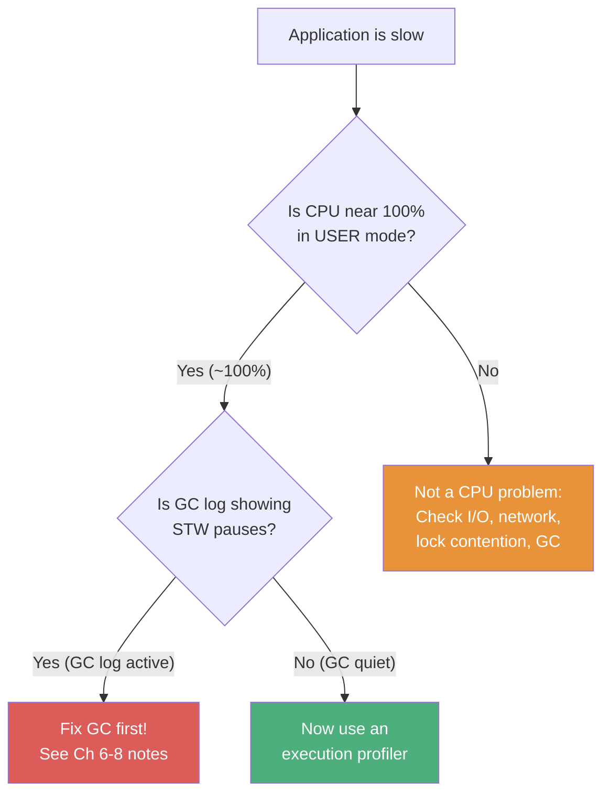
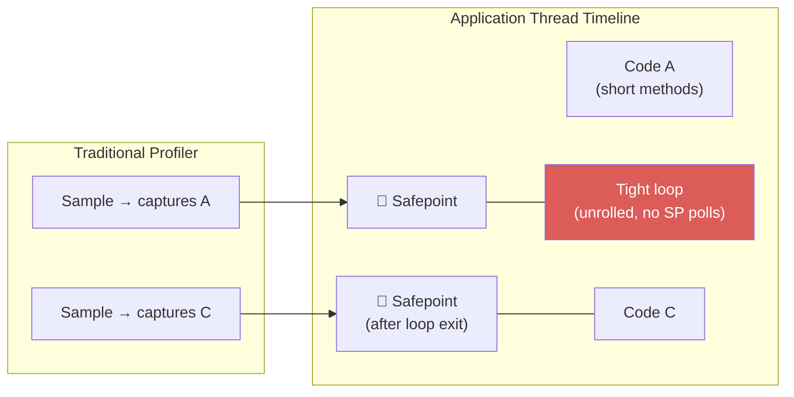
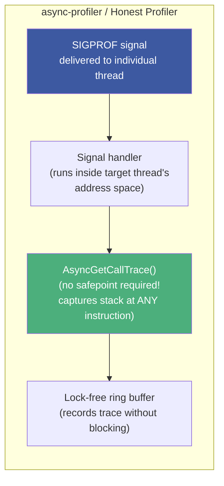
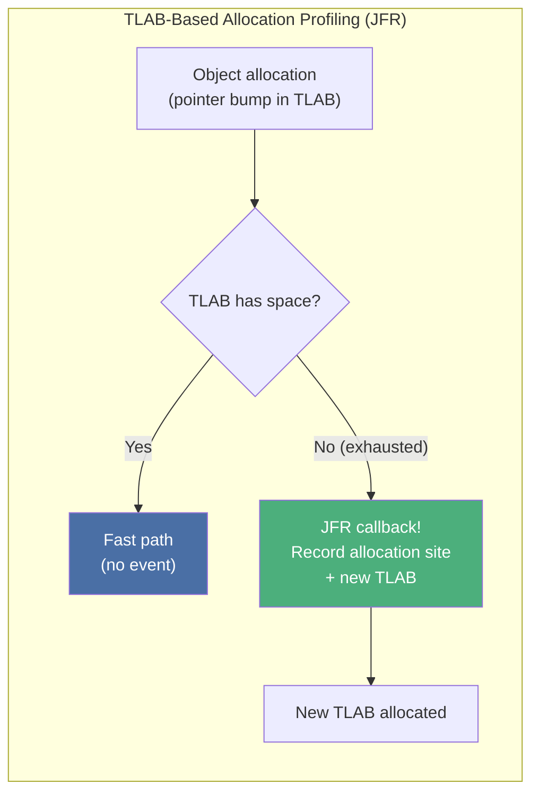

# :material-chart-areaspline: Chapter 13: Profiling

> **Book:** Optimizing Java — Practical Techniques for Improving JVM Application Performance
>
> **Authors:** Benjamin J. Evans, James Gough, Chris Newland
>
> **Chapter:** 13 — Profiling
>
> **Status:** :material-check-circle: Complete

---

## :material-target: Learning Objectives

By the end of this chapter, you should be able to:

- [x] Articulate the two pre-profiling prerequisites and why violating them wastes time
- [x] Explain safepoint bias: why traditional profilers miss hot code in unrolled counted loops
- [x] Describe the difference between `GetCallTrace()` and `AsyncGetCallTrace()` and why it matters
- [x] Choose the right profiler from the spectrum: VisualVM → JProfiler/YourKit → async-profiler → JFR
- [x] Read and interpret a CPU flame graph to find the hot path
- [x] Understand allocation profiling via bytecode instrumentation vs TLAB sampling
- [x] Use `jmap -histo` and heap dump analysis to investigate memory issues
- [x] Know why `hprof` is obsolete and what replaced it

---

## :material-magnify: 1. Profiling Prerequisites — Don't Reach for a Profiler First

### The Diagnostic Decision Tree



!!! important "Two Prerequisites Before Profiling"
    1. **CPU is ~100% in user mode** (not kernel mode) — check with `top`/`htop`: `%us` near 100, `%sy` near 0
    2. **GC log is quiet** while application logs show activity — if GC is active, you need GC tuning, not execution profiling

    Violating either condition means the profiler will show you the wrong thing or show you nothing useful.

---

## :material-alert-circle: 2. Safepoint Bias — Why Traditional Profilers Lie

### The Mechanics of Safepoint Sampling

Traditional profilers (VisualVM, JProfiler, YourKit) use HotSpot's internal `GetCallTrace()` C++ API to sample stack traces. `GetCallTrace()` has a critical constraint: **it can only sample a thread when that thread is at a JVM safepoint**.



**The consequence**: The JIT compiler **removes safepoint polls from unrolled counted loops** (a loop `for (int i = 0; i < LIMIT; i++)` with a simple body). That loop may consume 80% of CPU time — but the profiler never sees it, because the thread never reaches a safepoint while inside the loop.

**The cost at scale**: For N active threads, each profiler sample requires N safepoints — one per thread — which adds measurable overhead.

### The Fix: `AsyncGetCallTrace()`



`AsyncGetCallTrace()` is a private HotSpot API that samples thread stacks **without requiring a safepoint** — using OS `SIGPROF` signals to interrupt individual threads at any machine instruction. This captures code inside tight unrolled loops that traditional profilers miss entirely.

---

## :material-tools: 3. Profiler Comparison

### Developer Profilers

| Profiler | Sampling API | Safepoint Bias | Overhead | Best For |
|----------|-------------|---------------|---------|---------|
| **VisualVM** | `GetCallTrace()` | ✅ Affected | Low | Quick exploratory profiling |
| **JProfiler** | `GetCallTrace()` | ✅ Affected | Medium-High | Rich GUI, heap walker |
| **YourKit** | `GetCallTrace()` | ✅ Affected | Medium | CPU + memory combo profiling |
| **Honest Profiler** | `AsyncGetCallTrace()` | ❌ None | ~2% | Open-source, accurate CPU sampling |
| **async-profiler** | `AsyncGetCallTrace()` + `perf_events` | ❌ None | ~2% | **Recommended**: CPU + alloc + wall-clock |
| **JFR + JMC** | `AsyncGetCallTrace()` | ❌ None | **< 2%** | **Production-safe** continuous recording |

### JFR — Java Flight Recorder (Production-Safe)

```bash
# Enable JFR and record for 60 seconds
java -XX:+UnlockCommercialFeatures -XX:+FlightRecorder \
     -XX:StartFlightRecording=duration=60s,filename=myapp.jfr \
     myapp.jar

# Launch JMC to analyze
$JAVA_HOME/bin/jmc
```

**JFR event categories** (50+ events):

| Category | Events |
|----------|--------|
| GC | Collection pauses, phases, region stats |
| JIT | Method compilations, deoptimizations, inline decisions |
| Threading | Thread start/stop, sleep, park/unpark, lock contention |
| I/O | File reads/writes, socket operations (threshold: 10ms) |
| Memory | TLAB allocations, object sizing, GC roots |
| Exceptions | Throw sites, caught/uncaught |

!!! tip "JMC Thresholds"
    JMC default thresholds for synchronization, file I/O, and socket I/O events: **10ms** — events below threshold are ignored to reduce noise.

### Linux `perf` — Hardware Counter Profiling

```bash
# Requires: -XX:+PreserveFramePointer (up to 3% overhead) + perf-map-agent
java -XX:+PreserveFramePointer myapp.jar &

# Attach perf-map-agent to generate JIT symbol maps
java -cp perf-map-agent.jar net.virtualvoid.perf.AttachOnce <pid>

# Record with perf
perf record -F 99 -p <pid> -g -- sleep 30

# Generate flame graph
perf script | FlameGraph/stackcollapse-perf.pl | FlameGraph/flamegraph.pl > cpu.svg
```

`-XX:+PreserveFramePointer` prevents the JIT from using the frame pointer register for general-purpose register allocation — required for `perf` to reconstruct the call stack via frame pointer unwinding.

---

## :material-fire: 4. Flame Graphs — Reading the Hot Path

```
┌──────────────────────────────────────────────────┐  ← processOrder() [WIDE → HOT!]
│     computePrice()     │  validateOrder()         │
│   calculateTax()  │... │                          │
│ hashLookup() │ ...     │                          │
└──────────────────────────────────────────────────┘
             ↑ Bottom = callers   Top = callees ↑
```

**Flame graph reading rules:**
- **Width = CPU time** (inclusive of all callees) — wider = more time
- **Height** = call depth — tall stacks are deep call chains
- **Top of a wide column** = the function actually consuming CPU (leaf of the hot path)
- **Color** = frame type: Green = Java, Yellow = C++ (JVM), Red = OS Kernel

!!! tip "What Looks Bad on a Flame Graph"
    - **Wide, flat top**: One method consuming CPU with no deeper callees — your optimization target
    - **Sawteeth pattern**: Many short-lived functions all roughly equal width — parallelism overhead or allocation pressure
    - **Green→Yellow→Green transitions**: Java calling into JVM C++ and back — potential intrinsic opportunity

### Allocation Flame Graphs

```bash
# async-profiler allocation profiling mode
./profiler.sh -e alloc -d 30 -f alloc.svg <pid>
```

Instead of CPU time, width = bytes allocated. Wide boxes at the top show **the allocation hotspots** — code paths creating the most heap pressure. Used after establishing GC is a bottleneck.

---

## :material-memory: 5. Allocation Profiling — Two Approaches

### 1. Bytecode Instrumentation (Development Only)

Uses the Java Instrumentation API (`premain()`) + ASM bytecode manipulation library to inject static hooks before every allocation opcode (`NEW`, `NEWARRAY`, `ANEWARRAY`):

```java
// Injected before every 'new Object()' call
DUP
LDC <className>
INVOKESTATIC RuntimeCostAccounter.recordAllocation
```

**Overhead**: Very high — every allocation is intercepted. **Do not use in production**.

### 2. TLAB Exhaustion Sampling (Production-Safe)

Uses HotSpot callbacks (JDK 7u40+) triggered on:
- New TLAB creation (object allocated in a fresh TLAB)
- Object allocated outside a TLAB ("slow path" for humongous objects)

Aggregates allocation data every ~average TLAB size KB. **Overhead**: Low — JFR uses this mechanism.



---

## :material-cloud-download: 6. Heap Dump Analysis

Heap dumps are **full snapshots of the live object graph** — every object, every reference, every field value.

```bash
# Trigger heap dump
jmap -dump:live,format=b,file=heap.hprof <pid>

# Or via JVM flag (dumps on OOM)
java -XX:+HeapDumpOnOutOfMemoryError -XX:HeapDumpPath=/tmp/dumps/ myapp.jar
```

!!! warning "Heap Dump Costs"
    - File size: **300–400% of heap size** (e.g., 4GB heap → 12–16GB file)
    - Requires a **full STW pause** to write consistently
    - Analysis requires equivalent RAM on the analysis workstation
    
    Use heap dumps for post-mortem OOM investigation, not regular profiling.

**Tools for heap dump analysis:**
- **VisualVM**: Built-in heap walker
- **YourKit**: Retained size analysis, shortest path to GC root
- **Eclipse MAT (Memory Analyzer Tool)**: Best for large heaps; OQL query language
- **JMC**: Integrated heap analysis

---

## :material-skull: 7. `hprof` — Deprecated and Removed

`hprof` was a legacy JVMTI-based reference profiler shipped with JDK 5–8 for demonstration purposes. It was:
- **Never production-quality**
- High overhead by design
- Removed in **Java 9 (JEP 240)**

Modern replacements:
- **JFR + JMC** for allocation profiling (TLAB-based sampling)
- **async-profiler** for CPU profiling without safepoint bias
- **Eclipse MAT** for heap dump analysis

---

## :material-help-circle: Questions Explored

- [x] What are the two prerequisites to check before opening a profiler?
- [x] Why does a traditional profiler miss code inside a tight `for (int i = 0; i < N; i++)` loop?
- [x] How does `AsyncGetCallTrace()` solve the safepoint bias problem?
- [x] What is JFR's per-profiling overhead and why is it safe in production?
- [x] How do you read a CPU flame graph — what does width, height, and color represent?
- [x] What is TLAB exhaustion sampling and why is it preferred over bytecode instrumentation for allocation profiling?
- [x] What are the costs of taking a heap dump (file size, pause, analysis requirements)?
- [x] What replaced `hprof` and when was it removed?

---

## :material-navigation: Related Notes

| Chapter | Topic | Link |
|:-------:|-------|------|
| 12 | Concurrent Performance Techniques | [← Ch 12](../topic-4-profiling-concurrency/book-reading-ch12.md) |
| 13 | Profiling | **You are here** |
| 14 | High-Performance Logging and Messaging | [Ch 14 →](book-reading-ch14.md) |

---

*Last Updated: 2026-07-31*
