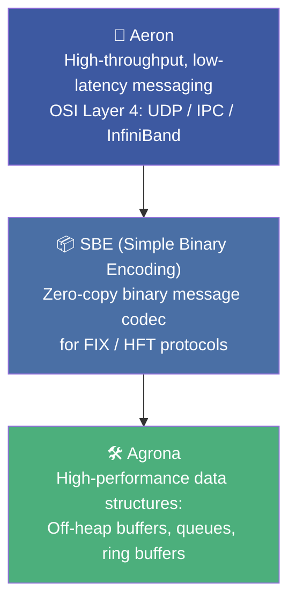
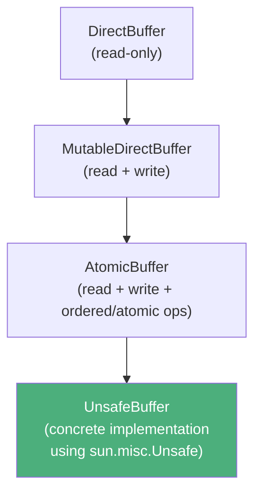
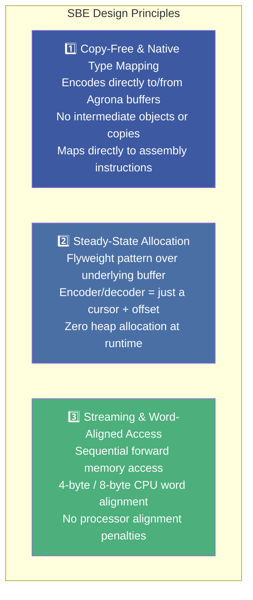
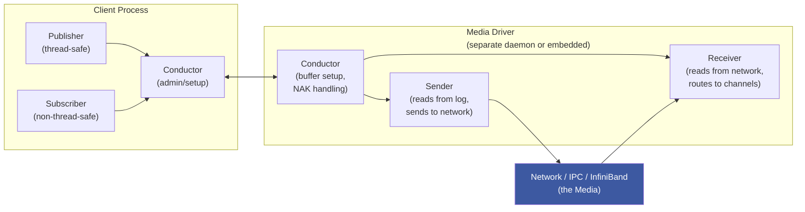
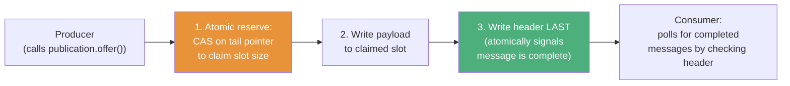
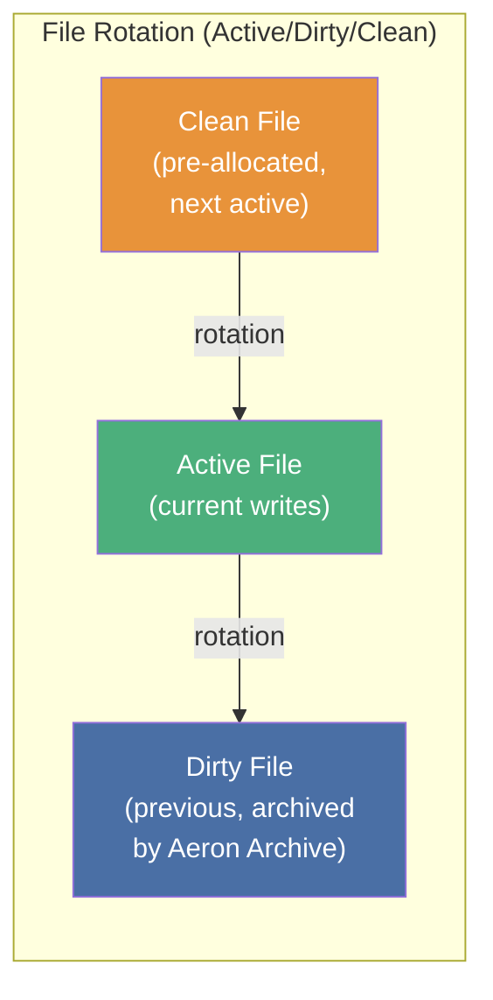

# :material-message-flash: Chapter 14: High-Performance Logging and Messaging

> **Book:** Optimizing Java — Practical Techniques for Improving JVM Application Performance
>
> **Authors:** Benjamin J. Evans, James Gough, Chris Newland
>
> **Chapter:** 14 — High-Performance Logging and Messaging
>
> **Status:** :material-check-circle: Complete

---

## :material-target: Learning Objectives

By the end of this chapter, you should be able to:

- [x] Benchmark the logging framework options and explain why JUL is 14× slower than Log4j 2.7
- [x] Explain how Log4j 2.6 achieves zero GC collections via ThreadLocal object reuse
- [x] Describe Agrona's buffer hierarchy and the cache-line padding technique for queues
- [x] Understand SBE's three core design principles (copy-free, steady-state allocation, word-aligned streaming)
- [x] Explain Aeron's 8 latency principles and the lock-free log appender architecture
- [x] Identify the trade-offs of the C++ "never compromise performance" philosophy vs Java's managed abstractions

---

## :material-take-a-walk: 1. The Logging Problem — A Real Customer Story

> *Kirk Pepperdine's customer case study: 4.5-second SLA budget. Profiling revealed 4.2 seconds was logging. Logging was the bottleneck.*

Logging looks harmless. But every log statement can:
- Allocate temporary `String` objects (format arguments)
- Allocate a log event object
- Trigger GC pressure that causes pauses

### Logging Framework Microbenchmarks

**Table: Execution Time (ns/op) — iMac:**

| Logger | No Logging | Logback Format | JUL Format | Log4j Format |
|--------|-----------|----------------|------------|--------------|
| **java.util.logging (JUL)** | 158 ns | 42,404 ns | 86,054 ns | 74,794 ns |
| **Log4j 2.7** | 138 ns | 8,056 ns | 32,755 ns | 5,323 ns |
| **Logback 1.2.1** | 214 ns | 5,507 ns | 27,420 ns | 3,501 ns |

**Table: Execution Time (ns/op) — AWS EC2 t2.2xlarge:**

| Logger | No Logging | Logback Format | JUL Format | Log4j Format |
|--------|-----------|----------------|------------|--------------|
| **java.util.logging (JUL)** | 1,376 ns | 54,658 ns | 144,661 ns | 109,895 ns |
| **Log4j 2.7** | 1,699 ns | 5,835 ns | 34,605 ns | 5,809 ns |
| **Logback 1.2.1** | 2,440 ns | 4,786 ns | 30,550 ns | 5,485 ns |

!!! danger "JUL is 14× Slower"
    `java.util.logging` is approximately **14× slower** than Log4j 2.7 for Log4j-format messages on an iMac. On EC2 the gap is even wider. **Never use JUL for performance-sensitive applications.**

### Log4j 2.6 — Zero Allocation Logger

Log4j 2.6 introduced **ThreadLocal object pooling and reusable byte buffers**:
- Log event objects are reused from a thread-local pool instead of being allocated fresh
- String-to-byte conversion uses reusable `byte[]` buffers instead of creating new arrays
- Result: **zero temporary object creation per log statement** in steady state

**JFR proof (12-second test run):**

| Version | GC Collections | Max GC Pause |
|---------|---------------|-------------|
| Log4j 2.5 | **141 collections** | 52 ms |
| Log4j 2.6 | **0 collections** | 0 ms |

!!! warning "ThreadLocal Reuse + Web Containers = Memory Leak"
    Log4j 2.6 **automatically disables ThreadLocal reuse** when running inside a web container (detected via `ClassLoader` hierarchy). ThreadLocal state attached to a web app's `ClassLoader` would cause memory leaks during redeployment. Additionally, the SLF4J facade only supports ≤ 2 parameters without allocation; for > 2 parameters use the Log4j2 API directly or accept a varargs array allocation.

---

## :material-layers: 2. Mechanical Sympathy — The Real Logic Stack

**Mechanical Sympathy** (term coined by Martin Thompson, quoting Formula 1 driver Jackie Stewart): designing software components to work *in harmony* with the underlying hardware mechanics — CPU cache lines, memory alignment, instruction pipelines, and hardware barriers.

The **Real Logic stack** is Martin Thompson's suite of open-source low-latency libraries:



---

## :material-buffer: 3. Agrona — High-Performance Buffers & Collections

### Buffer Hierarchy



`UnsafeBuffer` wraps either a `byte[]` (on-heap) or a `long` address (off-heap direct memory). All operations go through `sun.misc.Unsafe` for zero-copy reads/writes without JVM abstraction overhead.

**The `memset` trick** — bypasses a JVM optimization defect:
```java
// Forces JVM to emit assembly memset() call (even-address optimization)
UNSAFE.putByte(byteArray, indexOffset, value);
UNSAFE.setMemory(byteArray, indexOffset + 1, length - 1, value);
```

### Primitive Collections — No Autoboxing

Agrona provides `IntArrayList`, `Long2LongHashMap`, etc., backed by primitive arrays (`int[]`, `long[]`):
- **No autoboxing**: integers stored as raw primitives, not `Integer` objects
- **Open-addressing maps**: keys and values stored side-by-side in the same array — key-value pairs share the same CPU cache line

### Queue Cache-Line Padding — False Sharing Prevention

The classic concurrent queue false sharing problem:

```
Without padding:
[tail][headCache][head] → same 64-byte cache line
  ↑producer writes      ↑consumer writes
  → every producer write invalidates consumer's cache line!
```

Agrona's solution — explicit inheritance padding with unused `long` fields:

```java
class Padding1 { protected long p1,p2,p3,p4,p5,p6,p7,p8,p9,p10,p11,p12,p13,p14,p15; }
class Producer extends Padding1 {
    protected volatile long tail;      // ← producer writes
    protected long headCache;
    protected volatile long sharedHeadCache;
}
class Padding2 extends Producer { protected long p16,p17,...,p30; }
class Consumer extends Padding2 {
    protected volatile long head;      // ← consumer writes
}
class Padding3 extends Consumer { protected long p31,p32,...,p45; }
```

**Math**: 15 longs × 8 bytes = 120 bytes of padding → `tail` and `head` separated by two full 64-byte cache lines → **zero false sharing**.

### Queue Variants

| Queue | Producers | Consumers | Mechanism |
|-------|-----------|-----------|-----------|
| `OneToOneConcurrentArrayQueue` | 1 | 1 | No CAS — just volatile reads/writes |
| `ManyToOneConcurrentArrayQueue` | N | 1 | CAS on `tail` for producer coordination |
| `ManyToManyConcurrentArrayQueue` | N | N | CAS on both `head` and `tail` |

### Ring Buffer — Off-Heap IPC

```
RecordDescriptor Binary Layout:
┌────────────────┬──────────────┬──────────────────────┐
│ R bit + Length │     Type     │   Encoded Message    │
│   (32 bits)    │  (32 bits)   │      (variable)      │
└────────────────┴──────────────┴──────────────────────┘
```

`OneToOneRingBuffer` and `ManyToOneRingBuffer` (uses `Unsafe.storeFence()` for memory barrier) enable inter-process communication via off-heap `DirectBuffer`.

---

## :material-package-variant: 4. SBE — Simple Binary Encoding

SBE is the **binary encoding for FIX protocol** in High-Frequency Trading systems — designed for maximum encode/decode speed.

### Three Core Design Principles



### Workflow

```bash
# 1. Define message schema in XML
# message-schema.xml: fields, types, enums

# 2. Generate Java encoder/decoder classes
java -jar sbe-tool-1.7.5-all.jar message-schema.xml

# 3. Use generated classes — zero allocation
OrderEncoder encoder = new OrderEncoder();
encoder.wrap(buffer, 0).price(12345).quantity(100).side(Side.BUY);
```

The generated encoder wraps the `DirectBuffer` at a given offset and writes directly to memory — no intermediate `OrderEncoder` state is kept, no temporary buffers created.

---

## :material-airplane: 5. Aeron — High-Throughput Low-Latency Messaging

Aeron is an OSI Layer 4 transport library (like UDP/TCP but optimized for JVM) supporting UDP Unicast, UDP Multicast, IPC (shared memory), and InfiniBand.

### Architecture Overview



### The 8 Latency Principles of Aeron

| # | Principle | How Aeron Implements It |
|---|-----------|------------------------|
| 1 | **Garbage-free** | Zero allocation in steady state — Agrona buffers, flyweight objects |
| 2 | **Smart batching** | Bursts of messages bundled into single network packets up to capacity |
| 3 | **Lock-free** | No mutex in the message path — CAS on tail pointer only |
| 4 | **Non-blocking I/O** | `java.nio` selectors, no blocking calls in the critical path |
| 5 | **No exceptional cases** | Errors and edge cases handled out-of-band; hot path stays simple |
| 6 | **Single writer principle** | Each buffer has exactly one writing thread — zero CAS contention for common case |
| 7 | **Unshared state** | Thread-local state where possible — no cross-thread coordination |
| 8 | **No unnecessary copies** | Data written directly to memory-mapped files from producer |

### Under the Hood — The Lock-Free Persistent Log



**Key insight**: The header is written **last** — this is the completion signal. A consumer reading a slot with no header knows the producer hasn't finished yet (even though the slot was reserved). This allows multiple producers to write in parallel without coordination after the initial CAS.

### Memory-Mapped File Architecture



- Files live in **`tmpfs` (RAM filesystem)** by default for maximum throughput
- Three-file rotation prevents page faults from infinite file growth
- Out-of-order messages fill **pre-reserved gaps** in the file — no complex index needed
- **Watermark** tracks last contiguous received message; discrepancies trigger **NAKs (Negative Acknowledgments)** for retransmission

### Message Coordinates

Every Aeron message is uniquely identified by a 4-tuple:

```
(streamId, sessionId, termId, termOffset)
```

This allows subscribers to identify gaps, request retransmissions, and maintain ordering without a centralized sequence number authority.

### Publisher & Subscriber Code

```java
// Publisher
try (Aeron aeron = Aeron.connect(ctx);
     Publication pub = aeron.addPublication(CHANNEL, STREAM_ID)) {
    long result = pub.offer(buffer, 0, messageBytes.length);
    // result < 0 means backpressure (NOT_CONNECTED, BACK_PRESSURED, etc.)
}

// Subscriber
FragmentHandler handler = SamplesUtil.printStringMessage(STREAM_ID);
try (Subscription sub = aeron.addSubscription(CHANNEL, STREAM_ID)) {
    int fragmentsRead = sub.poll(handler, FRAGMENT_LIMIT);
    // Non-blocking poll — returns how many fragments were consumed
}
```

---

## :material-help-circle: Questions Explored

- [x] Why is `java.util.logging` 14× slower than Log4j 2.7 for formatted messages?
- [x] How does Log4j 2.6 eliminate GC pressure — and what's the caveat for web containers?
- [x] What is the 15-long padding trick in Agrona queues and what problem does it solve?
- [x] What are SBE's three design principles and how does the flyweight pattern achieve zero allocation?
- [x] What is Aeron's "Single Writer Principle" and why does it eliminate CAS contention?
- [x] Why is the message header written LAST in the Aeron lock-free log appender?
- [x] What are NAKs in Aeron and how does the watermark trigger retransmission?
- [x] What does the Active/Dirty/Clean file rotation prevent?

---

## :material-navigation: Related Notes

| Chapter | Topic | Link |
|:-------:|-------|------|
| 13 | Profiling | [← Ch 13](book-reading-ch13.md) |
| 14 | High-Performance Logging and Messaging | **You are here** |
| 15 | Java 9 and the Future | [Ch 15 →](book-reading-ch15.md) |

---

*Last Updated: 2026-07-31*
