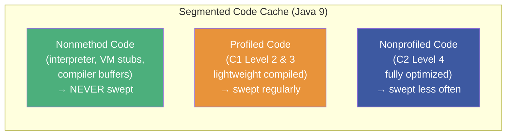
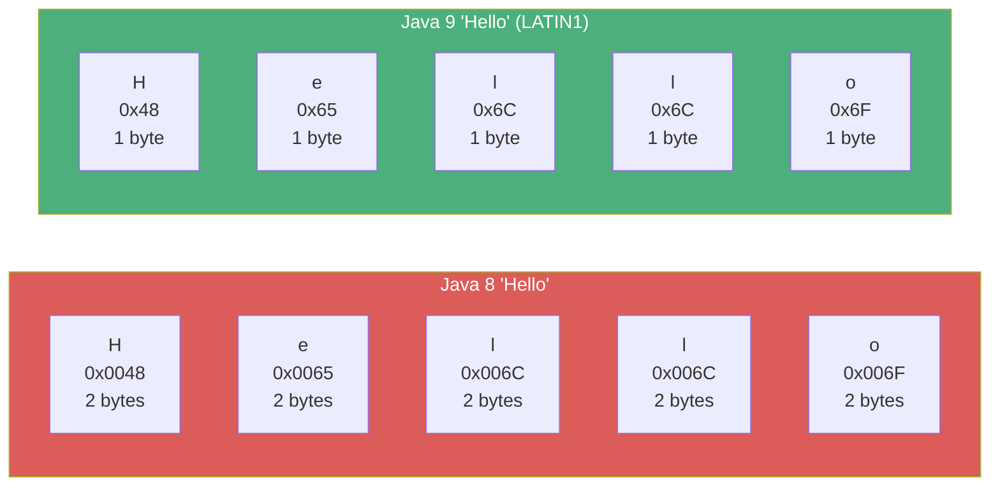
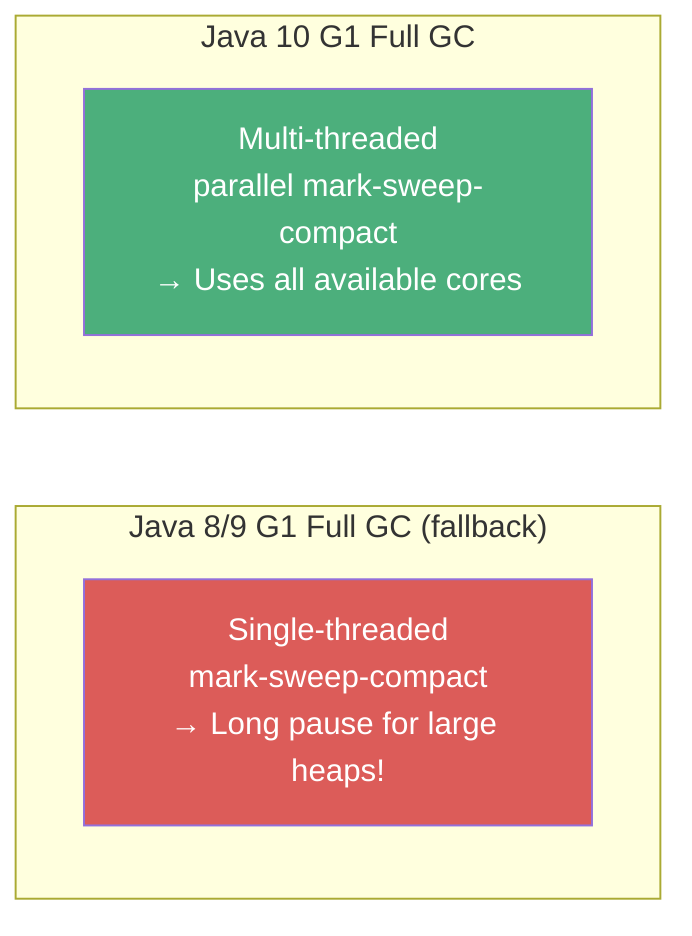
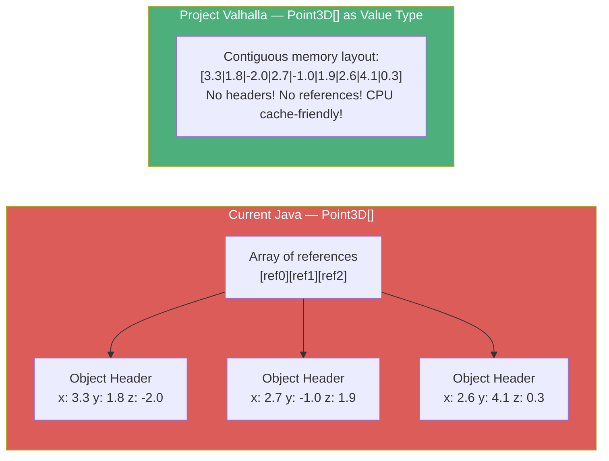
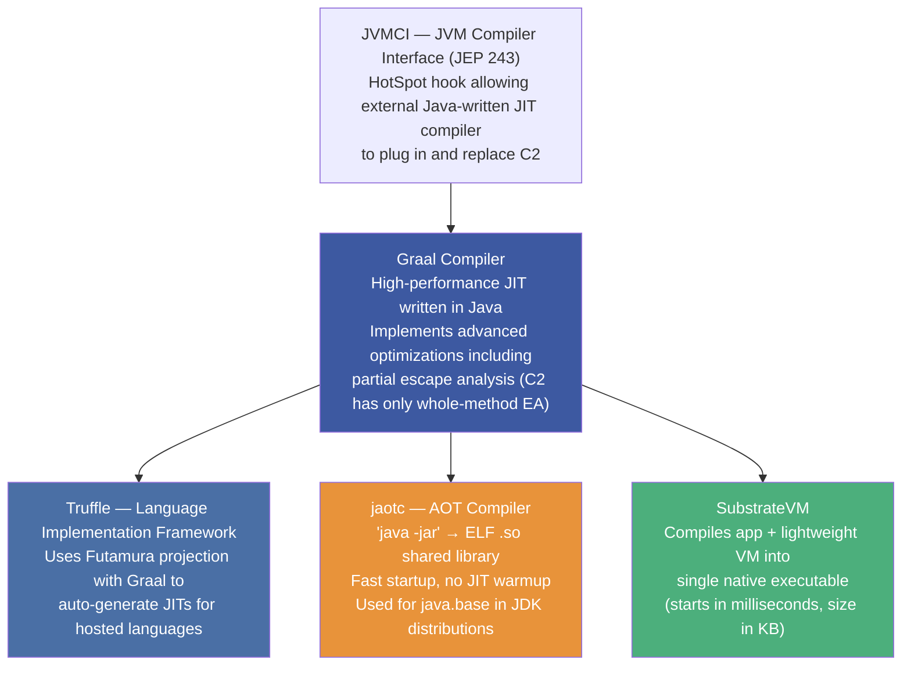
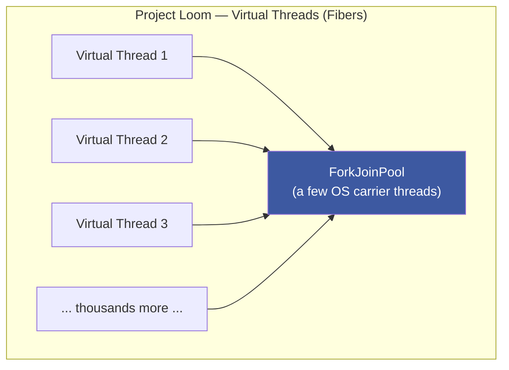
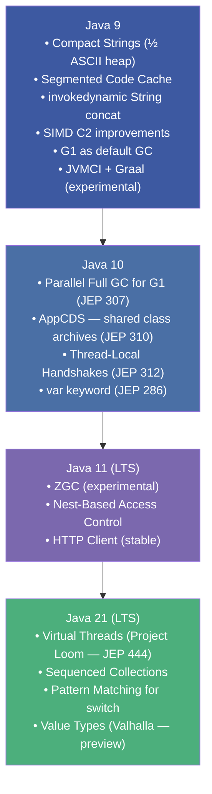

# :material-rocket-launch: Chapter 15: Java 9 and the Future

> **Book:** Optimizing Java — Practical Techniques for Improving JVM Application Performance
>
> **Authors:** Benjamin J. Evans, James Gough, Chris Newland
>
> **Chapter:** 15 — Java 9 and the Future
>
> **Status:** :material-check-circle: Complete

---

## :material-target: Learning Objectives

By the end of this chapter, you should be able to:

- [x] Explain the three Code Cache regions introduced in Java 9 and their sweeping benefits
- [x] Describe Compact Strings: `byte[] + coder` layout and the halved memory footprint for ASCII
- [x] Explain the new `invokedynamic`-based String concatenation and why it's better than `StringBuilder` desugaring
- [x] List the five C2 SIMD improvements and understand the SuperWord principle
- [x] Know the key Java 10 JEPs: Parallel Full GC for G1 (307), AppCDS (310), Thread-Local Handshakes (312)
- [x] Explain VarHandles (JEP 193) as the official replacement for `sun.misc.Unsafe`
- [x] Describe Project Valhalla: value types, the Q/R/U type triad, and `vdefault`/`withfield` opcodes
- [x] Explain Graal (JVMCI JIT compiler), Truffle (Futamura projection), and `jaotc` AOT tool
- [x] Understand Project Loom's fibers as a replacement for heavyweight OS threads

---

## :material-segment: 1. Segmented Code Cache (Java 9)

Java 9 splits the monolithic Code Cache into **three distinct regions**:



**Benefits of segmentation:**

| Benefit | Explanation |
|---------|-------------|
| **Shorter sweep times** | The sweeper excludes the nonmethod region (interpreter/VM stubs never become obsolete) — sweeper only scans C1/C2 regions |
| **Better code locality** | Hot, fully-optimized C2 code is contiguous in one region → better instruction cache utilization |
| **Independent sizing** | `-XX:NonProfiledCodeHeapSize`, `-XX:ProfiledCodeHeapSize`, `-XX:NonMethodCodeHeapSize` for fine-grained control |

!!! warning "Code Cache Region Exhaustion Risk"
    The biggest risk of segmentation: **one region fills up while other regions have free space**. If nonprofiled (C2) region fills, the JIT stops compiling at Tier 4 even if profiled and nonmethod regions are mostly empty. Monitor with `-XX:+PrintCodeCache` or JFR Code Cache events.

---

## :material-text-short: 2. Compact Strings (Java 9)

### Before Java 9 — Wasteful UTF-16

```java
// Pre-Java 9 String internals
private final char[] value;  // Always UTF-16: 2 bytes per character
// "Hello" → 5 chars × 2 bytes = 10 bytes (even for ASCII!)
```

### Java 9 — Compact Strings

```java
// Java 9 String internals
private final byte[] value;   // 1 byte per char for LATIN-1, 2 for UTF-16
private final byte coder;     // LATIN1 = 0, UTF16 = 1
static final byte LATIN1 = 0;
static final byte UTF16  = 1;
```

**Result**: ASCII and Latin-1 strings (the vast majority in English-language applications) use **half the heap memory** they did in Java 8.



Controlled by: `-XX:+CompactStrings` (enabled by default) / `-XX:-CompactStrings` (disable). String operations transparently check the `coder` flag and use appropriate code paths.

---

## :material-code-string: 3. New String Concatenation (Java 9)

### Before Java 9 — `StringBuilder` Desugaring

```java
// Source code
String result = "Hello " + name + "!";

// javac (Java 8) compiles to:
new StringBuilder()
    .append("Hello ")
    .append(name)
    .append("!")
    .toString();
// → Fixed bytecode, no runtime optimization possible
```

### Java 9 — `invokedynamic` Bootstrap

```java
// javac (Java 9) compiles to:
invokedynamic #2,0 // makeConcatWithConstants:(String)String
// Bootstrap: StringConcatFactory.makeConcatWithConstants()

// Bootstrap reads a "recipe" string at linkage time and generates
// an optimized concatenation MethodHandle for the specific argument types
```

**Advantages:**
- Bytecode is smaller and more readable
- The JVM can select the **best concatenation strategy at runtime** without changing bytecode
- Future JVM improvements automatically benefit all concatenation without recompiling application code

---

## :material-cpu-64-bit: 4. C2 Compiler SIMD Improvements

C2's architecture is mature — further structural changes have diminishing returns. Java 9+ improvements focus on **leveraging modern CPU SIMD (Single Instruction, Multiple Data) instruction sets**:

| Improvement | CPU Instruction Set |
|-------------|-------------------|
| Automatic Java code vectorization | AVX2, SSE4 |
| SuperWord loop unrolling analysis | AVX / SSE |
| Masked vector post-loops | AVX-512 |
| Multiversioning for range check elimination | General |
| Double-precision `sqrt` vectorization | SSE2/AVX |
| `CMovVD` (vector conditional move) | Intel AVX |
| Improved parallel stream vectorization | AVX2 |

!!! note "SuperWord Principle"
    SuperWord is the JIT's algorithm for detecting opportunities to replace a loop over scalar values with a single SIMD instruction over a vector. E.g., a loop adding elements of two `float[]` arrays can become one AVX `VADDPS` instruction operating on 8 floats simultaneously.

---

## :material-calendar-sync: 5. Java 10+ — Six-Month Release Cadence

### Why the New Cadence?

Java 8 and Java 9 suffered years of delays due to the feature-driven release model (wait for all features to be ready). Java 10 adopted a strict **6-month time-based feature release** with features cut if not ready:

```
Java 9  → Sept 2017
Java 10 → March 2018 (6 months later)
Java 11 → Sept 2018 (LTS)
...
```

### Key Java 10 JEPs

#### JEP 307: Parallel Full GC for G1



G1's full GC fallback (triggered when concurrent GC can't keep up) was single-threaded in Java 8/9 — catastrophically slow for large heaps. JEP 307 parallelizes it using all available GC threads.

#### JEP 310: Application Class-Data Sharing (AppCDS)

Extends Class-Data Sharing (CDS — already used for `java.base` bootstrap classes) to **application and custom classloader classes**:

1. **Archive creation**: JVM dumps all loaded class metadata to a shared archive file
2. **Multi-JVM sharing**: Subsequent JVM instances `mmap()` the archive instead of parsing class files
3. **Benefits**: Faster startup, reduced per-JVM memory footprint when multiple JVMs share the same archive

```bash
# Step 1: List all loaded classes
java -Xshare:off -XX:+UseAppCDS -XX:DumpLoadedClassList=classes.lst -cp app.jar MyApp

# Step 2: Create archive
java -Xshare:dump -XX:+UseAppCDS -XX:SharedClassListFile=classes.lst \
     -XX:SharedArchiveFile=app.jsa -cp app.jar

# Step 3: Use archive (faster startup, lower memory)
java -Xshare:on -XX:+UseAppCDS -XX:SharedArchiveFile=app.jsa -cp app.jar MyApp
```

#### JEP 312: Thread-Local Handshakes

!!! important "A Major JVM Internal Improvement"
    Before JEP 312, any per-thread callback (biased lock revocation, stack sampling for profilers) required a **global JVM safepoint** — all threads stop. JEP 312 enables executing a callback on **a single specific thread** without stopping any other threads.
    
    **Impact:**
    - Dramatically reduces safepoint pause frequency for biased lock revocations
    - Enables efficient per-thread stack trace sampling (async-profiler style)
    - Removes global memory barriers needed between safepoints

---

## :material-shield-lock: 6. VarHandles (JEP 193) — The Safe `Unsafe` Replacement

Java 9 encapsulated `sun.misc.Unsafe` inside the `jdk.unsupported` module (still accessible but officially discouraged). **VarHandles** are the official, safe, type-checked replacement:

```java
// Old way (Unsafe — unsafe!)
Unsafe unsafe = Unsafe.getUnsafe();
long offset = unsafe.objectFieldOffset(MyClass.class.getDeclaredField("value"));
unsafe.compareAndSwapInt(obj, offset, expected, newValue);  // no type safety!

// New way (VarHandle — safe & JIT-friendly)
public class AtomicIntegerWithVarHandles {
    private volatile int value = 0;
    private static final VarHandle V;

    static {
        try {
            V = MethodHandles.lookup()
                    .findVarHandle(AtomicIntegerWithVarHandles.class, "value", int.class);
        } catch (ReflectiveOperationException e) {
            throw new Error(e);
        }
    }

    public final int getAndSet(int newValue) {
        int v;
        do {
            v = (int) V.getVolatile(this);
        } while (!V.compareAndSet(this, v, newValue));
        return v;
    }
}
```

**VarHandle capabilities:**

| Operation | Example |
|-----------|---------|
| `getVolatile` / `setVolatile` | Volatile read/write of a field |
| `compareAndSet` | CAS — atomic conditional update |
| `getAndAdd` | Atomic fetch-and-add |
| `getAcquire` / `setRelease` | Acquire/release memory ordering (lighter than volatile) |
| `getOpaque` / `setOpaque` | No ordering guarantees — maximum throughput |

---

## :material-crystal-ball: 7. Project Valhalla — Value Types

### The Current Problem: Object Header Indirection



### The Three JVM Type Shapes

| Symbol | Type | Properties |
|--------|------|-----------|
| **R** | Reference type | Identity-bearing, nullable, heap-allocated |
| **Q** | Value type | Identity-less, non-nullable, flattened in memory |
| **U** | Universal type | Either R or Q — generic type parameter |

### New Opcodes for Value Types

```
vdefault  → emits the default instance of a Q type (all fields zeroed)
withfield → emits a copy of a Q type with one field updated
            (throws on non-value or null input)
```

```java
// A value type declaration (Project Valhalla syntax)
value class Point3D {
    final double x, y, z;
    // No object identity — == compares fields, not references
    // No null — can never be null
    // Stored inline in arrays — no object headers
}

// Point3D[] is now a flat array of doubles: [x0,y0,z0,x1,y1,z1,...]
// CPU loads 3 values in a single cache line — not 3 separate pointer chases
```

!!! important "Why This Matters"
    For numeric computing, simulations, and data-intensive applications, value types eliminate the **object header tax** (16 bytes per object) and the **pointer indirection** (random memory access) that make Java collections 2-3× less cache-efficient than equivalent C++ arrays. Valhalla brings Java's memory layout in line with modern CPU cost models.

---

## :material-application-braces: 8. Graal, Truffle & Project Metropolis

### Project Metropolis — Java-in-Java

The initiative to rewrite HotSpot components in Java itself — starting with the JIT compiler:



### Futamura Projection — Truffle's Magic

Truffle's theoretical foundation: a **partial evaluator** (Graal) applied to a language **interpreter** automatically generates an optimized **JIT compiler** for that language — without writing a compiler manually.

```
Step 1: partial_eval(interpreter, program) → specialized_program
Step 2: partial_eval(partial_eval, interpreter) → compiler_for_language
Step 3: partial_eval(partial_eval, partial_eval) → compiler-compiler
```

Languages supported via Truffle: JavaScript (GraalJS), Ruby (TruffleRuby), Python (GraalPy), R (FastR), LLVM bitcode (Sulong).

### `jaotc` — AOT Compilation

```bash
# Compile a single class to native code
jaotc --output libHelloWorld.so HelloWorld.class

# Compile an entire module (used in JDK for java.base)
jaotc --output libjava.base.so --module java.base

# JVM loads the .so and uses pre-compiled code for matching methods
java -XX:AOTLibrary=libjava.base.so MyApp  # faster startup!
```

---

## :material-thread: 9. Project Loom — Lightweight Concurrency

### The Problem with OS Threads

```
Traditional Java thread = OS thread
  - Stack: 512KB–2MB by default
  - 10,000 threads = 5–20 GB of just stack memory!
  - Context switches: ~5-10µs each (expensive OS operation)
```

### Fibers/Continuations (Project Loom)



**Virtual threads (Project Loom, became GA in Java 21 as JEP 444):**
- Lightweight cooperative execution units — no OS thread backing
- Blocked virtual thread (I/O wait, `Thread.sleep()`) **yields carrier thread** back to ForkJoinPool
- Another virtual thread runs on freed carrier thread
- Millions of concurrent virtual threads on a few OS carrier threads
- Same `Thread` API — no code changes needed!

```java
// Java 21 — Virtual threads via standard API
Thread.ofVirtual().start(() -> {
    // This thread is lightweight — thousands can run concurrently
    var result = db.query(...);  // blocks? → carrier thread freed for another virtual thread
});

// Or via ExecutorService
try (var executor = Executors.newVirtualThreadPerTaskExecutor()) {
    executor.submit(this::handleRequest);  // each request = its own virtual thread
}
```

---

## :material-checklist: Java Evolution Summary



---

## :material-help-circle: Questions Explored

- [x] What are the three Code Cache regions in Java 9 and which is never swept?
- [x] How do Compact Strings halve ASCII string memory? What is the `coder` field?
- [x] Why is `invokedynamic`-based string concatenation better than `StringBuilder` desugaring?
- [x] What is SuperWord loop unrolling and which CPU instruction sets does it use?
- [x] Why did G1's single-threaded full GC become a serious problem in Java 8/9?
- [x] How do Thread-Local Handshakes (JEP 312) benefit both profilers and lock revocation?
- [x] How do VarHandles replace `sun.misc.Unsafe` for CAS and memory ordering operations?
- [x] What are the three JVM type shapes in Project Valhalla (R, Q, U)?
- [x] What is the Futamura projection and how does Truffle use it to support polyglot JIT?
- [x] How do Project Loom virtual threads differ from OS threads in memory and scheduling?

---

## :material-navigation: Related Notes

| Chapter | Topic | Link |
|:-------:|-------|------|
| 14 | High-Performance Logging and Messaging | [← Ch 14](book-reading-ch14.md) |
| 15 | Java 9 and the Future | **You are here** |

---

*Last Updated: 2026-07-31*
