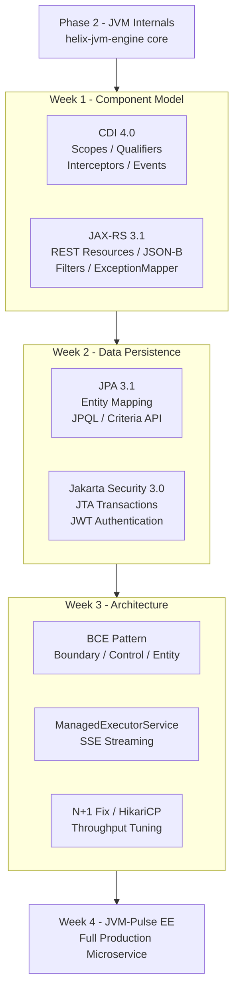

# Phase 3: Jakarta EE 10 — Microservices & Architecture

Master enterprise Java: contextual dependency injection, RESTful services, data persistence, distributed transactions, architecture patterns, and real-time streaming — all built on top of the JVM internals mastered in Phase 2.

**Duration:** 4 Weeks (21 study days + 1-week Capstone)

---

## :material-bookshelf: Learning Resources

| Label | Book | Notes |
|-------|------|-------|
| **Book A (Pro Persistence)** | *Pro Jakarta Persistence in Jakarta EE 10* — Apress 2023 | JPA 3.1, EntityManager, JPQL, Criteria API |
| **Book B (EE8 AppDev)** | *Java EE 8 Application Development* — David R. Heffelfinger (Packt) | Use `jakarta.*` namespace everywhere |
| **Book C (EE Patterns)** | *Real-World Java EE Patterns* — Adam Bien | BCE pattern, async, architectural pragmatics |
| **Book D (Web APIs)** | *Design Web APIs (2nd Ed.)* — Lorna Jane Mitchell et al. | REST design, HTTP semantics, OpenAPI |

> **Daily Time Budget:** 2.0–2.5 hours/day split as:
> - **45 min** — Core theory & specification mechanics
> - **30 min** — Targeted book reading
> - **60–75 min** — Practical hands-on lab

---

## :material-folder-open: Weeks

-   :material-injection-syringe:{ .lg .middle } **Week 1 — Component Model (CDI 4.0) & RESTful Services (JAX-RS 3.1)**

    ---

    Contextual dependency injection, scopes, qualifiers, producers, interceptors, decoupled events, REST resource architecture, JSON-B/JSON-P, unified exception mapping, and request/response filter pipelines.

    **Books:** EE8 AppDev (Ch5, Ch6, Ch10, Ch13) · EE Patterns (Ch5)

    [:octicons-arrow-right-24: Explore Week 1](week-1-cdi-jaxrs/index.md)

-   :material-database:{ .lg .middle } **Week 2 — Data Persistence (JPA 3.1), Transactions (JTA) & Security**

    ---

    Object-Relational Mapping, entity lifecycle, JPQL queries, Criteria API, declarative JTA transactions, optimistic/pessimistic locking, and Jakarta Security 3.0 with JWT authentication.

    **Books:** Pro Persistence (Ch4-9, Ch12) · EE8 AppDev (Ch3, Ch9)

    :material-clock-outline: *Upcoming in Week 2*

-   :material-sitemap:{ .lg .middle } **Week 3 — Architecture Patterns (BCE), Async Execution & Performance**

    ---

    Adam Bien's Boundary-Control-Entity pattern, managed thread pools, ManagedExecutorService, Server-Sent Events streaming, JPA N+1 diagnosis and batch fetching, HikariCP tuning.

    **Books:** EE Patterns (Ch3, Ch6) · Pro Persistence (Ch11, Ch12, Ch14) · EE8 AppDev (Ch10, Ch13)

    :material-clock-outline: *Upcoming in Week 3*

-   :material-rocket-launch:{ .lg .middle } **Week 4 — Capstone: JVM-Pulse EE Platform**

    ---

    Build a high-performance, real-time JVM Bytecode Inspection & Telemetry Microservice combining `helix-jvm-engine` (Phase 2) with all 3 weeks of Jakarta EE 10: JWT auth, CDI-driven metric collection, JPA analytical logging, async instrumentation, SSE streaming, and HikariCP tuning.

    :material-clock-outline: *Upcoming in Week 4*

---

## :material-timeline: Phase 3 Architecture

---

## :material-checkbox-marked-outline: Phase Progress

**Week 1 — Component Model & REST**

- [ ] Day 01: CDI 4.0 Scopes, Contexts & Lifecycle Management
- [ ] Day 02: Qualifiers, Producers, Interceptors & Decoupled Events
- [ ] Day 03: JAX-RS 3.1 Fundamentals & REST Resource Architecture
- [ ] Day 04: JSON-B / JSON-P Processing & Unified Exception Handling
- [ ] Day 05: JAX-RS Filters & Request/Response Pipelines
- [ ] Days 06-07: Week 1 Integration Milestone — JVM-Pulse Core Microservice

**Week 2 — Persistence, Transactions & Security**

- [ ] Day 08: JPA 3.1 Entity Mapping & Relationship Boundaries
- [ ] Day 09: Persistence Context, EntityManager & Lifecycle Events
- [ ] Day 10: Dynamic JPQL Queries & Criteria API
- [ ] Day 11: JTA Declarative Transactions & Concurrency Control
- [ ] Day 12: Jakarta Security 3.0 & Password Hashing
- [ ] Days 13-14: JWT Authentication & Week 2 Milestone

**Week 3 — Architecture Patterns & Performance**

- [ ] Day 15: Adam Bien's BCE Pattern (Boundary-Control-Entity)
- [ ] Day 16: Enterprise Concurrency & Managed Threads
- [ ] Day 17: Real-Time Communication via Server-Sent Events (SSE)
- [ ] Day 18: Performance Tuning — JPA N+1 & Batch Fetching
- [ ] Day 19: Database Connection Pool & HTTP Throughput Tuning
- [ ] Days 20-21: Full 3-Week Consolidation & Architectural Audit

**Week 4 — Capstone Project**

- [ ] Day 22: Project Setup, BCE Packaging & Security Init
- [ ] Day 23: Bytecode Upload & Inspection Engine Integration
- [ ] Day 24: JPA 3.1 Persistence & Criteria API Analytical Logging
- [ ] Day 25: Concurrency Utilities & Async Instrumentation
- [ ] Day 26: Real-Time Telemetry Streaming via SSE
- [ ] Day 27: EE Performance Optimization & DB Connection Tuning
- [ ] Day 28: Capstone Finalization, Dockerization & Portfolio Showcase

---

*Phase 3 Start Date: <!-- Add date --> | Target Completion: <!-- Add date -->*
