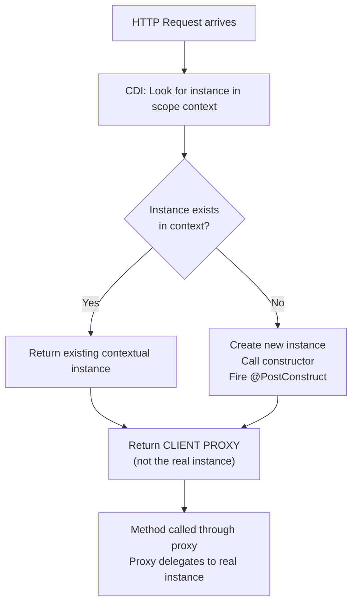

# :material-book-open-page-variant: EE8 AppDev — Chapter 5: Contexts and Dependency Injection

> **Book:** Java EE 8 Application Development — David R. Heffelfinger (Packt)  
> **Chapter coverage:** Named beans, `@Inject`, Qualifiers, Scopes, CDI Events  
> **Appears in:** Day 01 (scopes, lifecycle) · Day 02 (qualifiers & events)

---

## :material-information: Introduction

CDI (Contexts and Dependency Injection) was added to Java EE in **Java EE 6**. Java EE 8 introduced CDI 2.0 with major additions: **asynchronous events** and **event ordering**. Jakarta EE 10 ships CDI 4.0.

CDI provides capabilities previously unavailable to Java EE developers:
- Any JavaBean — including stateless and stateful session beans — can be used as a **JSF managed bean**
- Simplifies dependency injection across all Java EE tiers
- Enables loosely-coupled communication via **events**

---

## :material-tag: Named Beans — `@Named`

The `@Named` annotation makes a CDI bean accessible by name in **EL (Expression Language)** — used from JSF pages via `#{beanName.property}`.

```java
@Named
@RequestScoped
public class Customer {
    private String firstName;
    private String lastName;
    // getters and setters
}
```

- By default, the bean name = **class name with first letter lowercase** → `customer`
- Custom name: `@Named("customerBean")` or `@Named(value = "customerBean")`
- Accessed in JSF: `#{customer.firstName}`

!!! warning "Don't use `@Named` for injection disambiguation"
    `@Named` is for EL access. Use **Qualifiers** to disambiguate multiple implementations at injection points — `@Named` is string-based and has no compile-time safety.

---

## :material-needle: Dependency Injection — `@Inject`

`@Inject` is CDI's universal injection annotation. It can be placed on:

- **Fields** (most common in Java EE)
- **Constructors** (preferred for required dependencies, enables testability)
- **Setter methods** (optional dependencies)

```java
@Named
@RequestScoped
public class CustomerController {
    @Inject
    private Customer customer;   // CDI injects Customer instance automatically

    public String saveCustomer() {
        logger.info("Saving: " + customer);
        return "confirmation";
    }
}
```

When the container constructs `CustomerController`, it creates a `Customer` instance (according to its scope) and injects it into the `@Inject` field before any method is called.

---

## :material-label: Qualifiers

When an injection point type is an **interface** or **superclass**, CDI needs to know which implementation to inject. **Qualifiers** solve this at compile time.

A qualifier is a custom annotation meta-annotated with `@Qualifier`:

```java
@Qualifier
@Retention(RetentionPolicy.RUNTIME)
@Target({ElementType.METHOD, ElementType.FIELD, ElementType.PARAMETER, ElementType.TYPE})
public @interface Premium {}
```

Apply qualifier to the **implementation class**:

```java
@Named
@RequestScoped
@Premium
public class PremiumCustomer extends Customer {
    private Integer discountCode;
    // ...
}
```

Apply qualifier at **injection point** to select the specific implementation:

```java
@Named
@RequestScoped
public class CustomerController {
    @Inject
    @Premium
    private Customer customer;   // injects PremiumCustomer
}
```

!!! tip "Enum-backed qualifiers"
    For multiple discriminated variants, use an enum member inside the qualifier:
    ```java
    @Qualifier @Retention(RUNTIME) @Target({TYPE, METHOD, FIELD, PARAMETER})
    public @interface MetricEngine {
        EngineType value();
        enum EngineType { HIGH_THROUGHPUT, STANDARD }
    }
    ```
    Then inject as `@Inject @MetricEngine(EngineType.HIGH_THROUGHPUT)`.

---

## :material-clock-time-four: Named Bean Scopes

CDI beans are **contextual objects**. When a bean is needed, CDI looks for an existing instance in the bean's scope. If none exists, it creates one and stores it in the scope.

| Scope | Annotation | Lifetime | Shared? | CDI Proxy? |
|-------|-----------|----------|---------|-----------|
| Request | `@RequestScoped` | Single HTTP request, EJB invocation, or JMS message | No — per request | **Yes** |
| Conversation | `@ConversationScoped` | Developer-controlled; spans multiple requests | Per conversation | **Yes** |
| Session | `@SessionScoped` | HTTP session lifetime | Per user session | **Yes** |
| Application | `@ApplicationScoped` | Application lifetime | Shared across all users | **Yes** |
| Dependent | `@Dependent` | Same as the owning bean | No — created fresh every injection | **No** |



### Why `@Dependent` Has No Proxy

- Normal scopes (`@RequestScoped`, `@ApplicationScoped`, etc.) need proxies because the lifecycle of the injected bean may differ from the bean holding the reference. For example: a `@SessionScoped` bean injected into an `@ApplicationScoped` bean — the application-scoped bean lives longer, so the proxy dynamically looks up the correct session-scoped instance per call.
- `@Dependent` beans do **not** have proxies — they are directly instantiated and bound to the **lifecycle of the owner**. If the owner is destroyed, the dependent bean is destroyed too.

### The Conversation Scope

- Similar to JSF's flow scope but not tied to JSF
- Requires injection of `javax.enterprise.context.Conversation`:
  ```java
  @Inject Conversation conversation;
  // Start:
  conversation.begin();
  // End:
  conversation.end();
  ```
- Two modes: **transient** (ends at request boundary) and **long-running** (explicitly started)
- `@ConversationScoped` beans must implement `java.io.Serializable`

---

## :material-client-proxy: CDI Client Proxies (Deep Dive)

For every **normal-scoped** bean (`@RequestScoped`, `@ApplicationScoped`, etc.), CDI generates a **bytecode subclass** (client proxy) at deployment time using Weld's internal bytecode generation (based on ASM/Javassist).

**What gets injected is ALWAYS the proxy, never the real instance:**

```java
RequestContextService svc = container.select(RequestContextService.class).get();
System.out.println(svc.getClass().getName());
// Prints: com.ee.lab.cdi.RequestContextService$Proxy$_$$_Weld$EnterpriseProxy$
```

**On every method call**, the proxy:
1. Looks up the active context for the scope (e.g., the current request context)
2. Retrieves or creates the **contextual instance** from that context
3. Delegates the method call to the real instance

This is why you can safely inject `@ApplicationScoped` into `@RequestScoped` (or vice versa) — the proxy handles scope mismatch correctly.

```java
// System.identityHashCode reveals proxy vs real instance:
System.out.println(System.identityHashCode(proxy));        // e.g., 12345 (proxy object)
System.out.println(System.identityHashCode(realInstance)); // e.g., 67890 (real CDI instance)
```

---

## :material-power: Lifecycle Callbacks

CDI supports standard lifecycle annotations:

| Annotation | When Called | Typical Use |
|-----------|-------------|-------------|
| `@PostConstruct` | After injection, before first use | Initialize resources, log creation |
| `@PreDestroy` | Before bean is destroyed | Release resources, flush buffers |

```java
@ApplicationScoped
public class ApplicationCounter {
    private int count = 0;

    @PostConstruct
    public void init() {
        System.out.println("ApplicationCounter created — hashCode: " + System.identityHashCode(this));
    }

    @PreDestroy
    public void cleanup() {
        System.out.println("ApplicationCounter destroyed — final count: " + count);
    }

    public void increment() { count++; }
    public int getCount() { return count; }
}
```

---

## :material-bell: CDI Events

CDI events allow **loosely-coupled communication** between beans. A producer fires an event; any number of observers handle it — with no direct dependency between them.

### Firing Events

Inject `Event<PayloadType>`, then call `fire()` or `fireAsync()`:

```java
@Inject
private Event<NavigationInfo> navigationEvent;

public String navigateToPage1() {
    NavigationInfo info = new NavigationInfo();
    info.setPage("1");
    info.setCustomer(customer);
    navigationEvent.fire(info);       // synchronous: blocks until all observers complete
    return "page1";
}
```

### Observing Events

Any CDI bean can observe an event by declaring a method with `@Observes` on the payload parameter:

```java
public void handleNavigation(@Observes NavigationInfo info) {
    System.out.println("Navigating to page: " + info.getPage());
}
```

Multiple observer methods for the same event type are all called.

### Asynchronous Events (CDI 2.0+)

Fire with `fireAsync()` — returns immediately; observers run on a worker thread:

```java
navigationEvent.fireAsync(info);   // non-blocking; returns CompletionStage<NavigationInfo>
```

Async observer method (identical syntax to sync):

```java
public void handleNavAsync(@ObservesAsync NavigationInfo info) {
    System.out.println("Async on thread: " + Thread.currentThread().getName());
    // Runs on ForkJoinPool.commonPool-worker-X
}
```

### Event Ordering (`@Priority`)

CDI 2.0 allows ordering observer methods with `@Priority`:

```java
// Lower value = higher priority
void handleFirst(@Observes @Priority(Interceptor.Priority.APPLICATION) MyEvent e) { ... }
void handleSecond(@Observes @Priority(Interceptor.Priority.APPLICATION + 100) MyEvent e) { ... }
```

Default priority = `Interceptor.Priority.APPLICATION + 500`.

---

## :material-key: Key Takeaways

1. `@Named` is for EL access only — use `@Qualifier` for DI disambiguation
2. Normal scopes (`@RequestScoped`, `@ApplicationScoped`) use **client proxies** — injected reference is never the real instance
3. `@Dependent` beans have **no proxy** — they are directly bound to owner lifecycle
4. `@PostConstruct` fires **after injection** — you can safely use injected fields inside it
5. `Event<T>.fire()` is **synchronous** (blocks); `fireAsync()` is **non-blocking** (returns `CompletionStage`)
6. Event ordering uses `@Priority` — lower integer = higher priority

---

[:octicons-arrow-left-24: Back to Day 01 Index](index.md) | [:octicons-arrow-right-24: Day 02 — Qualifiers & Interceptors](../day-02-qualifiers-interceptors-events/index.md)
