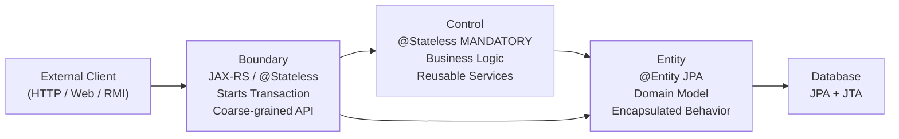

# :material-book-open-page-variant: EE Patterns — Chapter 5: Infrastructural Patterns and Utilities

> **Book:** Real-World Java EE Patterns — Adam Bien (2009)  
> **Chapter:** 5 — Infrastructural Patterns and Utilities (pp. 205–252)  
> **Also covers:** Chapter 3 — BCE Pattern (Boundary-Control-Entity)

---

## :material-information: Overview

Chapter 5 covers **crosscutting, infrastructural utilities** applicable across all enterprise tiers. Unlike business-tier patterns (Ch3), these are technical patterns for managing lifecycle, concurrency, monitoring, resource binding, and contextual data propagation.

> *"Rather than solving business problems, infrastructural patterns solve technical problems that arise when deploying and running enterprise applications in a managed container environment."* — Adam Bien

---

## :material-sitemap: Chapter 3: BCE Pattern (Boundary-Control-Entity)

> From Adam Bien's Chapter 6 (Pragmatic Java EE Architectures), the BCE (ECB) pattern is the foundational architecture for clean Jakarta EE microservices.

### The Core Idea

| Role | Java EE Realization | Responsibility |
|------|-------------------|---------------|
| **Boundary** | `@Stateless` EJB / JAX-RS Resource | Entry point; façade to the outside world; starts transactions |
| **Control** | `@Stateless` EJB with `@TransactionAttribute(MANDATORY)` | Reusable business logic; internal use only |
| **Entity** | `@Entity` JPA class | Data model with encapsulated behavior |



Key insight from Adam Bien:
> *"Premature encapsulation is the root of all evil... Eliminate unnecessary interfaces, DTO mappers, and Service Locators. A JAX-RS resource directly injecting an EntityManager is perfectly valid for simple CRUD."*

**Package structure:**
```
com.pulse/
  boundary/   ← JAX-RS resources, EJB session beans (entry points)
  control/    ← Reusable business logic beans (internal only)
  entity/     ← JPA entities, value objects
```

---

## :material-play-circle: Pattern 1: Service Starter (pp. 207–210)

### Problem
Infrastructural services (caches, connection validation, configuration loading) need to start **eagerly at server boot** — not lazily on first user request.

### Solution

**EJB 3.1+:** `@Singleton @Startup @DependsOn`

```java
@Singleton
@Startup
@DependsOn("Initializer")   // boots after Initializer singleton
public class ServiceStarter {

    @EJB
    private ExistingServiceBean service;

    @PostConstruct
    public void onInitialize() {
        System.out.println("#" + getClass().getSimpleName() + " @PostConstruct");
        service.pleaseInitialize();
    }
}
```

- `@Startup` — container calls `@PostConstruct` during deployment
- `@DependsOn("X")` — guarantees singleton X is initialized first

**Pre-EJB 3.1 workaround:** Use an HttpServlet with `<load-on-startup>1</load-on-startup>` and inject EJBs in `Servlet.init()`.

### Consequences
- Eager initialization reduces first-request latency
- Failures during `@PostConstruct` are visible at deployment time (not at first user request)

---

## :material-one-up: Pattern 2: Singleton (pp. 211–215)

### Problem
EJB instances are pooled and dedicated to a single thread/client request. There is no standard portable way to share mutable state across all requests without `static` fields or manual synchronization.

### Solution

EJB 3.1 `@Singleton` with container-managed concurrency:

```java
@Singleton
@Startup
@Lock(LockType.READ)           // allows concurrent reads
public class CachingSingleton {
    private CacheManager cacheManager;
    private Cache cache;

    @PostConstruct
    void initializeCache() {
        this.cacheManager = CacheManager.create();
        this.cache = this.cacheManager.getCache("memory");
    }

    public Serializable get(long id) {
        Element element = this.cache.get(id);
        return element != null ? (Serializable) element.getValue() : null;
    }

    @Lock(LockType.WRITE)      // exclusive write lock
    public void put(long id, Serializable value) {
        this.cache.put(new Element(id, value));
    }

    @PreDestroy
    void shutdownCache() {
        this.cacheManager.shutdown();
    }
}
```

| Lock Type | Behavior | Use Case |
|-----------|----------|----------|
| `LockType.READ` (default) | Multiple concurrent readers | Read-heavy caches |
| `LockType.WRITE` | Exclusive — single writer, no readers | Write or throttling |

### Strategies
1. **Gatekeeper** — `LockType.WRITE` to throttle concurrency to non-thread-safe legacy systems
2. **Caching Singleton** — `LockType.READ` wrapping EHCache, Infinispan

---

## :material-search-web: Pattern 3: Bean Locator (pp. 217–223)

### Problem
`@Inject` only works in CDI/EJB-managed classes. Unmanaged POJOs, dynamic lookup, or helper utilities need JNDI — which is verbose and throws checked `NamingException`.

### Solution

A type-safe generic utility wrapping JNDI:

```java
public class BeanLocator {

    public static <T> T lookup(Class<T> clazz, String jndiName) {
        return clazz.cast(lookup(jndiName));
    }

    public static Object lookup(String jndiName) {
        Context context = null;
        try {
            context = new InitialContext();
            return context.lookup(jndiName);
        } catch (NamingException ex) {
            throw new IllegalStateException("JNDI lookup failed for: " + jndiName, ex);
        } finally {
            if (context != null) {
                try { context.close(); } catch (NamingException ignored) {}
            }
        }
    }
}
```

EJB 3.1 **Global JNDI name** format:
```
java:global/<app-name>/<module-name>/<bean-name>#<fully-qualified-interface>
```

> *"Dependency Injection can be considered as BeanLocator 2.0. DI uses a generic version of BeanLocator, factored out from the application code into the framework."* — Adam Bien

---

## :material-clock-time-eight: Pattern 4: Thread Tracker (pp. 225–229)

### Problem
Application servers pool threads with generic names like `httpSSLWorkerThread-8080-0`. When debugging deadlocks or performance bottlenecks in JConsole/VisualVM, it's impossible to identify which business method is stuck.

### Solution

An `@AroundInvoke` interceptor that **renames the thread** to include the EJB class and method name during execution:

```java
public class ThreadTracker {

    @AroundInvoke
    public Object annotateThread(InvocationContext ctx) throws Exception {
        String originalName = Thread.currentThread().getName();
        String tracingName  = ctx.getTarget().getClass().getName()
                            + "#" + ctx.getMethod().getName()
                            + " " + originalName;
        try {
            Thread.currentThread().setName(tracingName);
            return ctx.proceed();
        } finally {
            Thread.currentThread().setName(originalName);  // always restore
        }
    }
}
```

**Result in VisualVM thread monitor:**
```
BEFORE: httpSSLWorkerThread-8080-1
AFTER:  com.pulse.control.BytecodeParserService#analyzeClass httpSSLWorkerThread-8080-1
```

This makes identifying bottlenecks during profiling **instantly obvious** — bridges directly into Phase 2's profiling knowledge.

### Consequences
- Zero production overhead (just a `setName()` call)
- Enormously simplifies thread dump analysis and deadlock diagnosis
- Activatable/deactivatable without code changes (via `beans.xml` interceptors list)

---

## :material-connection: Pattern 5: Dependency Injection Extender (pp. 231–235)

### Problem
Third-party IoC frameworks (Google Guice, Spring) have richer injection mechanisms incompatible with EJB 3 container injection. Existing Guice/Spring components cannot participate in EJB transactions without integration glue.

### Solution

An EJB interceptor that bootstraps an external `Injector` in `@PostConstruct` and applies injection via `injector.injectMembers()` in `@AroundInvoke`:

```java
public class PerMethodGuiceInjector {
    private Injector injector;

    @PostConstruct
    public void startupGuice(InvocationContext ctx) throws Exception {
        ctx.proceed();
        this.injector = Guice.createInjector(new MessagingModule());
    }

    @AroundInvoke
    public Object injectDependencies(InvocationContext ctx) throws Exception {
        this.injector.injectMembers(ctx.getTarget());
        return ctx.proceed();
    }
}
```

### Strategies
1. **Stateful Session Bean** — inject once in `@PostConstruct` (1:1 client association)
2. **Stateless Session Bean** — inject per-method via `@AroundInvoke` (instances are pooled/shared)

---

## :material-email-fast: Pattern 6: Payload Extractor (pp. 237–242)

### Problem
Message-Driven Bean `onMessage(Message msg)` requires tedious type-checking and downcasting. Unhandled exceptions cause **endless poisoned message redeliveries**.

### Solution

An `@AroundInvoke` interceptor that:
1. Inspects the JMS `Message` type
2. Extracts the payload
3. Reflects onto a typed `consume(PayloadType)` method on the MDB
4. Routes invalid messages to a `DeadLetterHandlerBean`

```java
public class PayloadExtractor {
    @EJB private DeadLetterHandler dlh;

    @AroundInvoke
    public Object extract(InvocationContext ctx) throws Exception {
        Object mdb = ctx.getTarget();
        Message msg = (Message) ctx.getParameters()[0];

        if (msg instanceof TextMessage textMsg) {
            try {
                String payload = textMsg.getText();
                mdb.getClass().getMethod("consume", String.class).invoke(mdb, payload);
            } catch (Exception e) {
                this.dlh.wrongMessageType(msg);
            }
        }
        return ctx.proceed();
    }
}
```

---

## :material-lan-connect: Pattern 7: Resource Binder (pp. 243–246)

### Problem
Application servers register standard resources (DataSources, JMS queues) via admin console — but there is no standard portable way to bind **custom POJO resources** into JNDI for `@Resource` injection.

### Solution

A `@Startup @Singleton` bean binds POJOs into JNDI in `@PostConstruct`:

```java
@Startup @Singleton
public class ResourceBinder {

    @PostConstruct
    public void bindResources() {
        try {
            new InitialContext().rebind(CustomResource.JNDI_NAME, new CustomResource());
        } catch (NamingException ex) {
            throw new IllegalStateException("Cannot bind resource", ex);
        }
    }
}

// Consumer — @DependsOn ensures ResourceBinder runs first
@Singleton @Startup @DependsOn("ResourceBinder")
public class CustomResourceClient {
    @Resource(name = CustomResource.JNDI_NAME)
    private CustomResource resource;
}
```

---

## :material-map-marker: Pattern 8: Context Holder (pp. 247–252)

### Problem
Passing technical contextual data (security tokens, correlation IDs, audit timestamps) **across multiple EJB service calls** without polluting business method signatures.

### Solutions

**Strategy 1 (Preferred — Portable):** `TransactionSynchronizationRegistry`

```java
// Producer interceptor — sets context
@AroundInvoke
public Object injectContext(InvocationContext ctx) throws Exception {
    registry.putResource(ContextKey.CORRELATION_ID, UUID.randomUUID().toString());
    registry.putResource(ContextKey.REQUEST_TIMESTAMP, System.currentTimeMillis());
    return ctx.proceed();
}

// Downstream consumer — reads context in same transaction
@Resource private TransactionSynchronizationRegistry registry;

public void performAction() {
    String correlationId = (String) registry.getResource(ContextKey.CORRELATION_ID);
    // use correlationId in logging, audit trail, etc.
}
```

**Strategy 2 (ThreadLocal — use only if no transaction boundary):**

```java
public class ThreadLocalContextHolder {
    private static final ThreadLocal<Map<String, Object>> CONTEXT =
        ThreadLocal.withInitial(HashMap::new);

    public static void put(String key, Object value) { CONTEXT.get().put(key, value); }
    public static Object get(String key)             { return CONTEXT.get().get(key); }
    public static void clear()                        { CONTEXT.remove(); }
}
```

!!! warning "ThreadLocal caveat"
    Application servers may reassign threads between calls. If the server hops threads within a single request, `ThreadLocal` context is lost. `TransactionSynchronizationRegistry` is transaction-scoped and safe across thread hops within the same transaction.

---

## :material-key: Key Takeaways from Adam Bien

1. **BCE (Boundary-Control-Entity)** is the lean architecture for Jakarta EE — replaces bloated DTO/DAO/Service layers
2. **`@Singleton @Startup`** is the portable way to eagerly initialize services at deployment
3. **Thread Tracker** is a zero-cost interceptor that makes JVM profiling and thread dumps instantly readable — critical for Phase 2 JVM knowledge applied in Phase 3
4. **`TransactionSynchronizationRegistry`** is the correct portable way to propagate contextual data across EJB method boundaries
5. **`@AroundInvoke` interceptors** are the cornerstone of cross-cutting concerns in Jakarta EE — logging, auditing, security, monitoring

---

[:octicons-arrow-left-24: Back to Day 02 Index](index.md)
