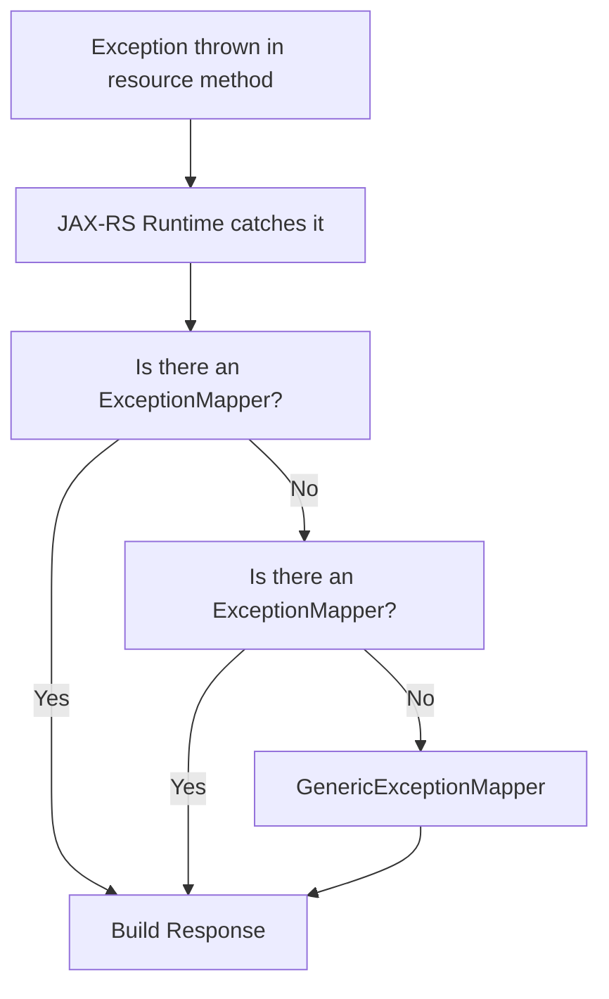

# :material-book-open-page-variant: EE8 AppDev Ch10 — ExceptionMapper & RFC-7807 (Cross-Reference)

> **Original Chapter:** EE8 AppDev Chapter 10 — RESTful Web Services with JAX-RS  
> **Full Ch10 content:** [Day 03 — book-ee8appdev-ch10.md](../day-03-jaxrs-fundamentals/book-ee8appdev-ch10.md)  
> **This page covers:** The `ExceptionMapper<T>` pattern and RFC-7807 problem details

---

## :material-alert: The Problem: Raw Exception Leakage

Without `ExceptionMapper`, unhandled exceptions in resource methods produce `HTTP 500` responses with raw stack traces — security risk and terrible UX:

```
HTTP/1.1 500 Internal Server Error
Content-Type: text/html

<html><body><h1>HTTP Status 500</h1>
java.lang.NullPointerException at com.pulse.TelemetryResource.getById(TelemetryResource.java:42)...
</body></html>
```

---

## :material-shield-check: Solution: `ExceptionMapper<T>` + `@Provider`

`ExceptionMapper<T extends Throwable>` is a JAX-RS SPI for converting exceptions to `Response` objects. Annotate with `@Provider` for auto-registration:

```java
@Provider
public class ResourceNotFoundExceptionMapper
        implements ExceptionMapper<ResourceNotFoundException> {

    @Override
    public Response toResponse(ResourceNotFoundException e) {
        ProblemDetails problem = new ProblemDetails(
            "https://api.example.com/problems/resource-not-found",
            "Resource Not Found",
            404,
            e.getMessage(),
            "/api/v1/resources/" + e.getResourceId()
        );
        return Response.status(404)
            .type("application/problem+json")
            .entity(problem)
            .build();
    }
}
```

### Resolution Priority

JAX-RS selects the **most specific** mapper for the thrown exception type. The hierarchy:



### Full ExceptionMapper Chain

```java
// 404 Not Found
@Provider
public class ResourceNotFoundExceptionMapper
        implements ExceptionMapper<ResourceNotFoundException> {
    @Override
    public Response toResponse(ResourceNotFoundException e) {
        return rfc7807Response(404, "Resource Not Found", e.getMessage());
    }
}

// 400 Bad Request
@Provider
public class InvalidPayloadExceptionMapper
        implements ExceptionMapper<InvalidPayloadException> {
    @Override
    public Response toResponse(InvalidPayloadException e) {
        return rfc7807Response(400, "Invalid Request Payload", e.getMessage());
    }
}

// 409 Conflict
@Provider
public class DuplicateResourceExceptionMapper
        implements ExceptionMapper<DuplicateResourceException> {
    @Override
    public Response toResponse(DuplicateResourceException e) {
        return rfc7807Response(409, "Duplicate Resource", e.getMessage());
    }
}

// 500 Safety Net — catches everything not handled above
@Provider
public class GenericExceptionMapper implements ExceptionMapper<Throwable> {
    @Override
    public Response toResponse(Throwable t) {
        // Log full stacktrace internally — never expose to client
        logger.severe("Unhandled exception: " + t.getMessage());
        return rfc7807Response(500, "Internal Server Error",
            "An unexpected error occurred. Contact support.");
    }
}

// Shared builder method
private static Response rfc7807Response(int status, String title, String detail) {
    ProblemDetails p = new ProblemDetails(
        "https://api.example.com/problems/" + title.toLowerCase().replace(" ", "-"),
        title, status, detail, null
    );
    return Response.status(status)
        .type("application/problem+json")
        .entity(p)
        .build();
}
```

---

## :material-format-list-bulleted: RFC-7807 — Problem Details for HTTP APIs

[RFC 7807](https://datatracker.ietf.org/doc/html/rfc7807) standardizes error responses for HTTP APIs.

### Standard Fields

| Field | Type | Required | Description |
|-------|------|----------|-------------|
| `type` | URI | No (default: `about:blank`) | URI identifying the problem type |
| `title` | String | No | Short human-readable summary |
| `status` | Integer | No | HTTP status code |
| `detail` | String | No | Human-readable explanation for this occurrence |
| `instance` | URI | No | URI identifying this specific occurrence |

Plus any **extension members** (domain-specific fields).

### `ProblemDetails` Record

```java
public record ProblemDetails(
    @JsonbProperty("type")     String type,
    @JsonbProperty("title")    String title,
    @JsonbProperty("status")   int    status,
    @JsonbProperty("detail")   String detail,
    @JsonbProperty("instance") String instance
) {}
```

### Example RFC-7807 Response

```json
HTTP/1.1 404 Not Found
Content-Type: application/problem+json

{
  "type": "https://api.example.com/problems/resource-not-found",
  "title": "Resource Not Found",
  "status": 404,
  "detail": "TelemetryReport with ID 'TEL-999' does not exist",
  "instance": "/api/v1/telemetry/TEL-999"
}
```

!!! important "Content-Type must be `application/problem+json`"
    This is a distinct MIME type from `application/json`. REST clients can detect it and switch to error-handling mode automatically (e.g., Angular `HttpInterceptor`, React error boundaries).

---

## :material-key: Key Takeaways

1. **`ExceptionMapper<T>`** converts any thrown exception to a clean `Response` — removes stack traces from HTTP responses
2. **Most specific mapper wins** — `ExceptionMapper<NotFoundException>` takes priority over `ExceptionMapper<RuntimeException>`
3. **`GenericExceptionMapper<Throwable>`** is the safety net — always register one
4. **RFC-7807** standardizes error format: `type` URI + `title` + `status` + `detail` + `instance`
5. **`application/problem+json`** is a distinct content type — use it consistently across all error mappers
6. **Domain exceptions** should be plain POJOs with no dependency on JAX-RS — the mapper bridges them to HTTP

---

[:octicons-arrow-left-24: Back to Day 04 Index](index.md)
