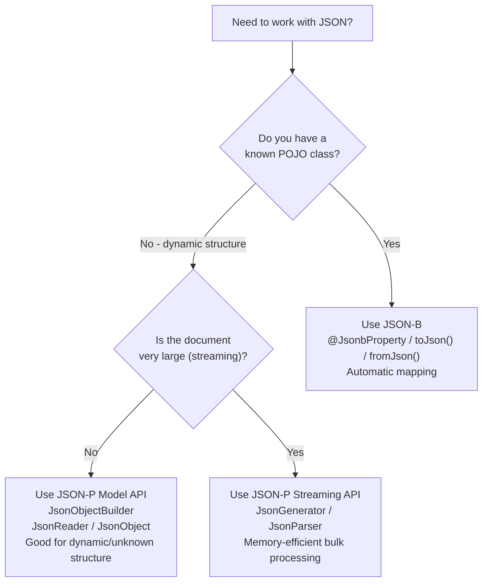

# :material-book-open-page-variant: EE8 AppDev — Chapter 6: JSON Processing with JSON-P and JSON-B

> **Book:** Java EE 8 Application Development — David R. Heffelfinger (Packt)  
> **Chapter:** 6 — JSON Processing with JSON-P and JSON-B

---

## :material-information: Introduction

| API | Full Name | Jakarta Package | Purpose |
|-----|-----------|----------------|---------|
| **JSON-P** | Jakarta JSON Processing | `jakarta.json` | Low-level DOM + streaming JSON parsing/generation |
| **JSON-B** | Jakarta JSON Binding | `jakarta.json.bind` | High-level POJO ↔ JSON transparent mapping |

- **Java EE 7** introduced JSON-P (Model API + Streaming API)  
- **Java EE 8** introduced JSON-B and JSON-P 1.1 (JSON Pointer, JSON Patch)

---

## :material-tree: JSON-P — Model API

The Model API builds an **in-memory tree** of a JSON document. More flexible than streaming, but requires more heap.

### Generating JSON with `JsonObjectBuilder`

```java
JsonObjectBuilder builder = Json.createObjectBuilder();
JsonObject jsonObject = builder
    .add("firstName", "Ahmed")
    .add("lastName", "Ashour")
    .add("email", "ahmed@example.com")
    .add("age", 28)
    .add("active", true)
    .build();

// Write to string:
StringWriter sw = new StringWriter();
try (JsonWriter writer = Json.createWriter(sw)) {
    writer.writeObject(jsonObject);
}
String json = sw.toString();
// {"firstName":"Ahmed","lastName":"Ashour","email":"ahmed@example.com","age":28,"active":true}
```

### `JsonObjectBuilder.add()` Overloads

| Method | Adds |
|--------|------|
| `add(String name, String value)` | String value |
| `add(String name, int value)` | int value |
| `add(String name, long value)` | long value |
| `add(String name, double value)` | double value |
| `add(String name, boolean value)` | boolean value |
| `add(String name, BigDecimal value)` | BigDecimal |
| `add(String name, BigInteger value)` | BigInteger |
| `add(String name, JsonObjectBuilder value)` | Nested JSON object |
| `add(String name, JsonArrayBuilder value)` | JSON array |
| `add(String name, JsonValue value)` | Any `JsonValue` |

### Building JSON Arrays

```java
JsonArray array = Json.createArrayBuilder()
    .add(Json.createObjectBuilder()
        .add("opcode", "INVOKEVIRTUAL").add("count", 42))
    .add(Json.createObjectBuilder()
        .add("opcode", "GETFIELD").add("count", 18))
    .build();
```

### Parsing JSON with `JsonReader`

```java
JsonObject parsed;
try (JsonReader reader = Json.createReader(new StringReader(jsonString))) {
    parsed = reader.readObject();
}

String firstName = parsed.getString("firstName");  // "Ahmed"
int age          = parsed.getInt("age");           // 28
boolean active   = parsed.getBoolean("active");    // true
```

### `JsonObject` Retrieval Methods

| Method | Returns |
|--------|---------|
| `getString(String name)` | `String` |
| `getInt(String name)` | `int` |
| `getBoolean(String name)` | `boolean` |
| `getJsonNumber(String name)` | `JsonNumber` |
| `getJsonArray(String name)` | `JsonArray` |
| `getJsonObject(String name)` | Nested `JsonObject` |
| `getJsonString(String name)` | `JsonString` |
| `get(Object key)` | `JsonValue` (raw) |

---

## :material-water: JSON-P — Streaming API

The Streaming API processes JSON **sequentially** — much faster and more memory-efficient for large documents.

### Generating JSON with `JsonGenerator`

```java
StringWriter sw = new StringWriter();
try (JsonGenerator gen = Json.createGenerator(sw)) {
    gen.writeStartObject()
       .write("firstName", "Ahmed")
       .write("lastName", "Ashour")
       .write("heapUsedMb", 256)
       .writeEnd();
}
// {"firstName":"Ahmed","lastName":"Ashour","heapUsedMb":256}
```

### Parsing JSON with `JsonParser`

`JsonParser` is a **pull parser** — call `next()` to advance and check the `Event` type:

```java
try (JsonParser parser = Json.createParser(new StringReader(jsonString))) {
    while (parser.hasNext()) {
        JsonParser.Event event = parser.next();
        switch (event) {
            case KEY_NAME   -> System.out.print("Key: " + parser.getString());
            case VALUE_STRING -> System.out.println(" = " + parser.getString());
            case VALUE_NUMBER -> System.out.println(" = " + parser.getInt());
            case VALUE_TRUE  -> System.out.println(" = true");
            case VALUE_FALSE -> System.out.println(" = false");
            case VALUE_NULL  -> System.out.println(" = null");
        }
    }
}
```

### `JsonParser.Event` Enum Values

| Event | Meaning |
|-------|---------|
| `START_OBJECT` | `{` — start of a JSON object |
| `END_OBJECT` | `}` — end of a JSON object |
| `START_ARRAY` | `[` — start of a JSON array |
| `END_ARRAY` | `]` — end of a JSON array |
| `KEY_NAME` | Property name string |
| `VALUE_STRING` | String value |
| `VALUE_NUMBER` | Numeric value (use `getInt()`, `getLong()`, `getBigDecimal()`) |
| `VALUE_TRUE` | Boolean `true` |
| `VALUE_FALSE` | Boolean `false` |
| `VALUE_NULL` | JSON `null` |

---

## :material-map-marker: JSON Pointer (JSON-P 1.1)

JSON Pointer (IETF RFC 6901) navigates within a JSON document using path expressions — similar to XPath for XML:

```java
JsonArray array = jsonReader.readArray();

// Navigate to the lastName of the second element (0-indexed)
JsonPointer pointer = Json.createPointer("/1/lastName");
String value = pointer.getValue(array).toString();   // e.g., "Ashour"
```

Path syntax:
- `/` = root
- `/0` = first array element
- `/1/lastName` = `lastName` property of second array element

---

## :material-pencil: JSON Patch (JSON-P 1.1)

JSON Patch (IETF RFC 6902) applies partial updates to a JSON document:

```java
JsonPatch patch = Json.createPatchBuilder()
    .replace("/1/dateOfBirth", "1990-05-15")
    .add("/1/email", "ahmed@example.com")
    .remove("/0/internalToken")
    .build();

JsonArray patched = patch.apply(originalArray);
```

### JSON Patch Operations

| Operation | Effect |
|-----------|--------|
| `add` | Adds value at path |
| `remove` | Removes value at path |
| `replace` | Replaces value at path |
| `move` | Moves value to new path |
| `copy` | Copies value to new path |
| `test` | Asserts value at path equals expected |

---

## :material-swap-horizontal: JSON-B — Transparent POJO Binding

JSON-B maps Java POJOs to/from JSON automatically with zero configuration for standard types.

### Basic Usage

```java
// POJO → JSON
Jsonb jsonb = JsonbBuilder.create();
Customer customer = new Customer(123L, "Ahmed", "Ashour");
String json = jsonb.toJson(customer);
// {"id":123,"firstName":"Ahmed","lastName":"Ashour"}

// JSON → POJO
Customer parsed = jsonb.fromJson(json, Customer.class);
```

### Customizing with Annotations

```java
public class AnalysisJob {

    @JsonbProperty("job_id")                          // rename field in JSON
    private String id;

    @JsonbProperty("created_at")
    @JsonbDateFormat("yyyy-MM-dd'T'HH:mm:ss")         // custom date format
    private LocalDateTime createdAt;

    @JsonbTransient                                    // completely excluded from JSON
    private String internalSecuritySignature;

    @JsonbTypeAdapter(JobStatusAdapter.class)          // custom enum → string mapping
    private JobStatus status;
}
```

| Annotation | Effect |
|-----------|--------|
| `@JsonbProperty("name")` | Rename field in JSON wire format |
| `@JsonbDateFormat("pattern")` | Custom date/time string format |
| `@JsonbTransient` | Exclude field from serialization AND deserialization |
| `@JsonbTypeAdapter(Adapter.class)` | Custom type conversion via `JsonbAdapter<T, U>` |
| `@JsonbCreator` | Mark constructor/factory for deserialization |
| `@JsonbNillable` | Include `null` fields as JSON `null` (omitted by default) |

### Custom Type Adapter

```java
public class JobStatusAdapter implements JsonbAdapter<JobStatus, String> {

    @Override
    public String adaptToJson(JobStatus status) {
        return status.name().toLowerCase().replace("_", "-");
        // e.g., IN_PROGRESS → "in-progress"
    }

    @Override
    public JobStatus adaptFromJson(String s) {
        return JobStatus.valueOf(s.toUpperCase().replace("-", "_"));
        // e.g., "in-progress" → IN_PROGRESS
    }
}
```

### Configuring a Custom `Jsonb` Instance

```java
Jsonb jsonb = JsonbBuilder.create(
    new JsonbConfig()
        .withFormatting(true)          // pretty-print output
        .withNullValues(true)          // serialize null fields as JSON null
        .withDateFormat("yyyy-MM-dd", Locale.ENGLISH)
);
```

### Serializing Collections

```java
List<Customer> customers = repo.findAll();
String json = jsonb.toJson(customers);
// JSON array of Customer objects

List<Customer> parsed = jsonb.fromJson(json, new ArrayList<Customer>(){}.getClass());
```

---

## :material-note-text: JSON-P vs JSON-B — When to Use Which



---

## :material-key: Key Takeaways

1. **JSON-P Model API** (`JsonObjectBuilder`, `JsonReader`) — good for dynamic/unknown JSON structures; more memory usage
2. **JSON-P Streaming API** (`JsonGenerator`, `JsonParser`) — best for large documents; sequential processing only
3. **JSON Pointer** = XPath for JSON; `Json.createPointer("/x/y")` navigates into the tree
4. **JSON Patch** = structured partial update operations (add/remove/replace/move) on JSON documents
5. **JSON-B** — zero-config POJO mapping; annotations for customization; `@JsonbTransient` is the security-redaction tool
6. **`JsonbAdapter`** — bridges any custom type to a JSON-serializable form (e.g., enums, external library types)

---

[:octicons-arrow-left-24: Back to Day 04 Index](index.md)
