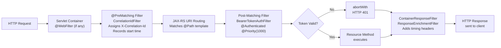

# :material-book-open-page-variant: EE8 AppDev Ch10 — JAX-RS Filters (Cross-Reference)

> **Original Chapter:** EE8 AppDev Chapter 10 — RESTful Web Services with JAX-RS  
> **Full Ch10 content:** [Day 03 — book-ee8appdev-ch10.md](../day-03-jaxrs-fundamentals/book-ee8appdev-ch10.md)  
> **This page covers:** The JAX-RS filter pipeline — `ContainerRequestFilter`, `@PreMatching`, `@NameBinding`, `abortWith()`

---

## :material-filter: JAX-RS Filter Architecture

JAX-RS defines two filter contracts:

| Interface | Direction | When Called |
|-----------|-----------|------------|
| `ContainerRequestFilter` | Inbound | **Before** resource method; can abort early |
| `ContainerResponseFilter` | Outbound | **After** resource method (or after abort); cannot cancel |

Both are registered as `@Provider` beans and participate in the same container lifecycle.

---

## :material-run-fast: Pre-Matching vs Post-Matching Request Filters

### Pre-Matching (`@PreMatching`)

Fires **before** JAX-RS performs URI template matching. The resource class and method are not yet known.

**Use cases:**
- Correlation ID assignment (request hasn't been routed yet)
- URI normalization (trailing slash removal)
- Request logging with raw URI

```java
@PreMatching
@Provider
@Priority(Priorities.HEADER_DECORATOR)
public class CorrelationIdFilter implements ContainerRequestFilter {

    @Override
    public void filter(ContainerRequestContext ctx) {
        String corrId = ctx.getHeaderString("X-Correlation-Id");
        if (corrId == null || corrId.isBlank()) {
            corrId = UUID.randomUUID().toString();
        }
        // Store for response filter to read back
        ctx.setProperty("correlationId", corrId);
        ctx.setProperty("requestStart", System.currentTimeMillis());
    }
}
```

### Post-Matching (Default)

Fires **after** routing; the matched resource class/method is known. Can inject `@Context ResourceInfo` to inspect the matched endpoint.

```java
@Provider
@Priority(Priorities.AUTHENTICATION)
public class AuditFilter implements ContainerRequestFilter {

    @Context ResourceInfo resourceInfo;   // only available post-matching

    @Override
    public void filter(ContainerRequestContext ctx) {
        String method = resourceInfo.getResourceMethod().getName();
        String clazz  = resourceInfo.getResourceClass().getSimpleName();
        System.out.println("Routing to: " + clazz + "::" + method);
    }
}
```

---

## :material-link: `@NameBinding` — Selective Filter Binding

Apply a filter **only to specific resources or methods** (not globally):

### Step 1: Define the Binding Annotation

```java
@NameBinding
@Retention(RetentionPolicy.RUNTIME)
@Target({ElementType.TYPE, ElementType.METHOD})
public @interface Authenticated {}
```

### Step 2: Apply to Both Filter and Resource

```java
// On the filter:
@Authenticated
@Provider
@Priority(Priorities.AUTHENTICATION)
public class BearerTokenAuthFilter implements ContainerRequestFilter { ... }

// On the resource (whole class = all methods protected):
@Path("/metrics")
@Authenticated           // all methods in this class require authentication
public class ProtectedMetricsResource { ... }

// Or on a specific method only:
@Path("/admin")
public class AdminResource {
    @GET @Path("/audit")
    @Authenticated       // only this method requires auth
    public Response getAuditLog() { ... }
}
```

!!! important "Name binding requires annotation on BOTH filter AND resource"
    If you forget to add `@Authenticated` to the filter class, the filter becomes global (applies to all resources).

---

## :material-sort-numeric-ascending: `@Priority` — Filter Execution Order

Filters execute in ascending numeric priority order (lower value = earlier execution):

| Constant | Value | Intended Use |
|---------|-------|-------------|
| `Priorities.SECURITY` | 200 | Security checks (rarely used directly) |
| `Priorities.AUTHENTICATION` | 1000 | Token verification, credential extraction |
| `Priorities.AUTHORIZATION` | 2000 | Role/permission checking |
| `Priorities.HEADER_DECORATOR` | 3000 | Adding/modifying request or response headers |
| `Priorities.USER` | 5000 | Application-specific custom logic |

```java
@Priority(Priorities.AUTHENTICATION)   // fires at 1000 — before authorization
public class BearerTokenAuthFilter implements ContainerRequestFilter { ... }

@Priority(Priorities.AUTHORIZATION)    // fires at 2000 — after authentication
public class RoleCheckFilter implements ContainerRequestFilter { ... }
```

For `ContainerResponseFilter`, execution order is **reversed** (highest priority fires first for responses).

---

## :material-close-octagon: `abortWith()` — Short-Circuit Request

`requestContext.abortWith(Response)` stops the filter chain immediately. **The resource method is never called.** However, `ContainerResponseFilter` **still fires** with the aborted response:

```java
@Authenticated
@Provider
@Priority(Priorities.AUTHENTICATION)
public class BearerTokenAuthFilter implements ContainerRequestFilter {

    private static final Set<String> VALID_TOKENS = Set.of("secret-token-123");

    @Override
    public void filter(ContainerRequestContext ctx) {
        String auth = ctx.getHeaderString(HttpHeaders.AUTHORIZATION);

        if (auth == null || !auth.startsWith("Bearer ")) {
            ctx.abortWith(
                Response.status(401)
                    .entity("{\"error\":\"Missing Authorization header\"}")
                    .type(MediaType.APPLICATION_JSON)
                    .build()
            );
            return;   // no further execution in this filter
        }

        String token = auth.substring("Bearer ".length()).trim();
        if (!VALID_TOKENS.contains(token)) {
            ctx.abortWith(
                Response.status(401)
                    .entity("{\"error\":\"Invalid token\"}")
                    .type(MediaType.APPLICATION_JSON)
                    .build()
            );
        }
        // if no abortWith() called, chain continues to resource method
    }
}
```

---

## :material-arrow-right-circle: Response Filter — `ContainerResponseFilter`

Always runs (after resource method OR after `abortWith`):

```java
@Provider
public class ResponseEnrichmentFilter implements ContainerResponseFilter {

    @Override
    public void filter(ContainerRequestContext req, ContainerResponseContext resp) {
        // Read properties set by request filter
        String corrId   = (String) req.getProperty("correlationId");
        Long   start    = (Long)   req.getProperty("requestStart");

        if (corrId != null) {
            resp.getHeaders().add("X-Correlation-Id", corrId);
        }
        if (start != null) {
            resp.getHeaders().add("X-Execution-Time-Millis",
                System.currentTimeMillis() - start);
        }
        resp.getHeaders().add("X-Security-Policy", "strict-transport-security");
    }
}
```

---

## :material-sitemap: Full Pipeline Diagram



---

## :material-key: Key Takeaways

1. **`@PreMatching`** fires before routing — use for URI normalization, correlation IDs, global request logging
2. **Post-matching filters** fire after routing — can inspect `ResourceInfo` to know which endpoint was matched
3. **`@NameBinding`** + same annotation on filter + resource = selective binding (most important security pattern)
4. **`@Priority`** controls order: lower number = earlier execution for request filters; reversed for response filters
5. **`abortWith()`** short-circuits the chain — resource method never called; response filter still fires
6. Store per-request data with `ctx.setProperty()` in request filter; read with `req.getProperty()` in response filter

---

[:octicons-arrow-left-24: Back to Day 05 Index](index.md)
