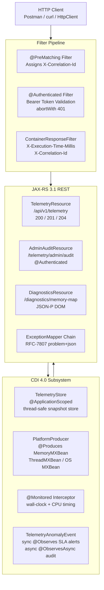

# Days 06-07 — Week 1 Integration Milestone: JVM-Pulse Core Microservice

> **Lab Repo:** [:material-github: 7amo10/JavaEE-Labs — Week-1-CDI-JAXRS-REST](https://github.com/7amo10/JavaEE-Labs/tree/main/Week-1-CDI-JAXRS-REST)

---

## :material-trophy: Milestone Objective

Integrate all five days of Week 1 into a **production-grade, standalone JVM telemetry microservice** that:

- Collects JVM platform metrics using **CDI 4.0** qualifiers, producers, interceptors, and decoupled events
- Exposes them through a **secure JAX-RS 3.1 REST API** with JSON-B customization
- Handles errors uniformly with **RFC-7807 problem details**
- Generates dynamic data via **JSON-P DOM builder**
- Enforces security through a **`@PreMatching` + `@Authenticated`** filter pipeline

---

## :material-sitemap: Consolidated Architecture

---

## :material-cube-outline: Full Component Inventory

### CDI 4.0 Subsystem

| Component | Scope | Role |
|-----------|-------|------|
| `TelemetryStore` | `@ApplicationScoped` | Thread-safe `ConcurrentHashMap` holding JVM snapshots |
| `@MetricEngine(HIGH_PRECISION)` | Qualifier | Disambiguates `HighPrecisionCollector` from `StandardCollector` |
| `PlatformProducer` | `@ApplicationScoped` | `@Produces` `MemoryMXBean`, `ThreadMXBean`, `OperatingSystemMXBean` |
| `@Monitored` + `PerformanceMonitorInterceptor` | Interceptor | Records `@AroundInvoke` wall-clock and thread CPU time |
| `TelemetryAnomalyEvent` | Event Payload | Immutable record fired on anomaly detection |
| `SlaAlertObserver` | `@Observes` | Synchronous: logs SLA breach on main thread |
| `AuditTrailObserver` | `@ObservesAsync` | Async: writes audit log on ForkJoinPool worker |

### JAX-RS 3.1 REST Subsystem

| Endpoint | Method | Status Codes | Auth |
|----------|--------|-------------|------|
| `/telemetry/live` | GET | 200 | No |
| `/telemetry/snapshots` | POST | 201 | No |
| `/telemetry/snapshots/{id}` | GET | 200, 404 | No |
| `/telemetry/snapshots/{id}/summary` | GET | 200 (text/plain) | No |
| `/diagnostics/memory-map` | GET | 200 (JSON-P) | No |
| `/telemetry/snapshots` (invalid body) | POST | 400 (RFC-7807) | No |
| `/telemetry/admin/audit` | GET | 200, 401 | **Yes** |
| `/telemetry/snapshots/{id}` | DELETE | 204 | No |

### JSON Subsystem

| Feature | Annotation / API | Applied To |
|---------|-----------------|------------|
| Wire key renaming | `@JsonbProperty("heap_used_mb")` | `JvmSnapshot` fields |
| Date formatting | `@JsonbDateFormat("yyyy-MM-dd'T'HH:mm:ss")` | `snapshotTime` |
| Security redaction | `@JsonbTransient` | `internalToken` |
| Dynamic JSON tree | `Json.createObjectBuilder()` | `/diagnostics/memory-map` |

---

## :material-check-all: Milestone Verification Checklist (8 Endpoints)

| # | Request | Expected Behavior |
|---|---------|------------------|
| 1 | `GET /telemetry/live` | CDI collector fires, interceptor logs timing, sync/async events fire, returns JSON-B `JvmSnapshot` |
| 2 | `POST /telemetry/snapshots` (valid) | HTTP 201, `Location` header with new snapshot ID |
| 3 | `GET /telemetry/snapshots/{id}/summary` with `Accept: text/plain` | HTTP 200, ASCII plain-text JVM summary |
| 4 | `GET /diagnostics/memory-map` | HTTP 200, dynamic JSON-P memory pool tree |
| 5 | `POST /telemetry/snapshots` (invalid payload) | HTTP 400, `Content-Type: application/problem+json`, RFC-7807 body |
| 6 | `GET /telemetry/admin/audit` (no token) | HTTP 401, Bearer filter `abortWith()` fires |
| 7 | `GET /telemetry/admin/audit` (valid token) | HTTP 200, privileged audit log JSON |
| 8 | `DELETE /telemetry/snapshots/{id}` then `GET` same ID | DELETE → 204, subsequent GET → 404 |

---

## :material-lightbulb: Week 1 Consolidated Learning Outcomes

| Day | Concept Mastered | Applied In Milestone |
|-----|-----------------|---------------------|
| Day 01 | CDI scopes, proxying, `@ApplicationScoped` | `TelemetryStore` as singleton across requests |
| Day 02 | `@Qualifier`, `@Produces`, `@AroundInvoke`, events | `PlatformProducer`, `@Monitored`, `TelemetryAnomalyEvent` |
| Day 03 | JAX-RS CRUD, `Response` builder, `UriInfo` | All REST endpoints with proper status codes |
| Day 04 | JSON-B customization, JSON-P DOM, ExceptionMapper | `@JsonbTransient`, `/memory-map`, RFC-7807 mappers |
| Day 05 | Filter pipeline, `@NameBinding`, `abortWith` | Correlation ID filter + admin auth protection |

---

[:material-github: View Full Lab Solution](https://github.com/7amo10/JavaEE-Labs/tree/main/Week-1-CDI-JAXRS-REST) | [:octicons-arrow-left-24: Back to Week 1](../index.md)
