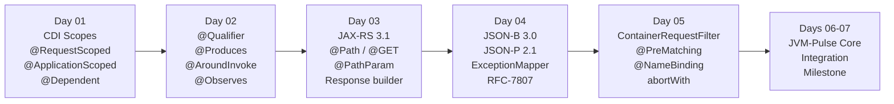

# Week 1 — Component Model (CDI 4.0) & RESTful Services (JAX-RS 3.1)

**Goal:** Master contextual dependency injection, interceptors, RESTful resource design, and lightweight JSON serialization.

---

## :material-calendar-week: Weekly Schedule

| Day | Topic | Books | Time | Lab Focus |
|-----|-------|-------|------|-----------|
| **01** | CDI 4.0 Scopes & Lifecycle | EE8 AppDev Ch5 | 2.5h | Multi-scoped bean hierarchy, CDI proxy analysis |
| **02** | Qualifiers, Producers, Interceptors & Events | EE8 AppDev Ch5 + EE Patterns Ch5 | 2.5h | `@Monitored` interceptor, decoupled event bus |
| **03** | JAX-RS 3.1 Fundamentals & REST Resources | EE8 AppDev Ch10 + Web APIs Ch4 | 2.0h | CRUD `TelemetryResource` with embedded Grizzly |
| **04** | JSON-B / JSON-P & Exception Mapping | EE8 AppDev Ch6 + Ch10 | 2.5h | RFC-7807 `ExceptionMapper` pipeline |
| **05** | JAX-RS Filters & Request/Response Pipelines | EE8 AppDev Ch10 + Ch13 | 2.0h | `@PreMatching`, `@NameBinding`, `abortWith` |
| **06-07** | Integration Milestone: JVM-Pulse Core | All above | 3.0h | Full CDI + JAX-RS + JSON + Filters microservice |

---

## :material-timeline: Week 1 Progression

---

## :material-folder-open: Days

-   :material-layers:{ .lg .middle } **Day 01 — CDI 4.0 Scopes, Contexts & Lifecycle**

    ---

    Normal scopes vs pseudo-scopes, CDI client proxy internals, `@PostConstruct`/`@PreDestroy`, scope mismatch handling, beans.xml discovery.

    **Book:** EE8 AppDev, Chapter 5

    [:octicons-arrow-right-24: Day 01 Notes](day-01-cdi-scopes-lifecycle/index.md)

-   :material-connection:{ .lg .middle } **Day 02 — Qualifiers, Producers, Interceptors & Events**

    ---

    Custom `@Qualifier` annotations, `@Produces` factory methods, `@Disposes` cleanup, `@AroundInvoke` interceptor chains, synchronous `@Observes` vs async `@ObservesAsync`.

    **Books:** EE8 AppDev Ch5 + EE Patterns Ch5

    [:octicons-arrow-right-24: Day 02 Notes](day-02-qualifiers-interceptors-events/index.md)

-   :material-api:{ .lg .middle } **Day 03 — JAX-RS 3.1 Fundamentals & REST Resource Architecture**

    ---

    `@Path` templates, HTTP verb mapping, parameter extraction (`@PathParam`, `@QueryParam`, `@HeaderParam`), content negotiation, `Response` builder API, Richardson Maturity Model.

    **Books:** EE8 AppDev Ch10 + Web APIs Ch4

    [:octicons-arrow-right-24: Day 03 Notes](day-03-jaxrs-fundamentals/index.md)

-   :material-code-json:{ .lg .middle } **Day 04 — JSON-B / JSON-P & Unified Exception Handling**

    ---

    `@JsonbProperty`, `@JsonbTransient`, `@JsonbTypeAdapter`, JSON-P DOM builder, `ExceptionMapper<T>`, RFC-7807 problem details standard.

    **Book:** EE8 AppDev Ch6 + Ch10

    [:octicons-arrow-right-24: Day 04 Notes](day-04-json-exception-mapping/index.md)

-   :material-filter:{ .lg .middle } **Day 05 — JAX-RS Filters & Request/Response Pipelines**

    ---

    `@PreMatching` vs post-matching filters, `@NameBinding` selective filters, `@Priority` ordering, `abortWith()` short-circuit, `ContainerResponseFilter` header enrichment.

    **Books:** EE8 AppDev Ch10 + Ch13

    [:octicons-arrow-right-24: Day 05 Notes](day-05-jaxrs-filters-pipelines/index.md)

-   :material-trophy:{ .lg .middle } **Days 06-07 — Week 1 Integration Milestone**

    ---

    Build the **JVM-Pulse Core Microservice**: production-grade CDI + JAX-RS + JSON-B + Filters service exposing live JVM telemetry via a secured REST API with RFC-7807 error responses.

    **Lab Repo:** [7amo10/JavaEE-Labs](https://github.com/7amo10/JavaEE-Labs/tree/main/Week-1-CDI-JAXRS-REST)

    [:octicons-arrow-right-24: Integration Milestone](day-06-07-integration-milestone/index.md)

---

## :material-checkbox-marked-outline: Week 1 Progress

- [ ] Day 01: CDI 4.0 Scopes, Contexts & Lifecycle Management
- [ ] Day 02: Qualifiers, Producers, Interceptors & Decoupled Events
- [ ] Day 03: JAX-RS 3.1 Fundamentals & REST Resource Architecture
- [ ] Day 04: JSON-B / JSON-P Processing & Unified Exception Handling
- [ ] Day 05: JAX-RS Filters & Request/Response Pipelines
- [ ] Days 06-07: JVM-Pulse Core Microservice Integration Milestone

---

[:octicons-arrow-left-24: Back to Phase 3](../index.md)
