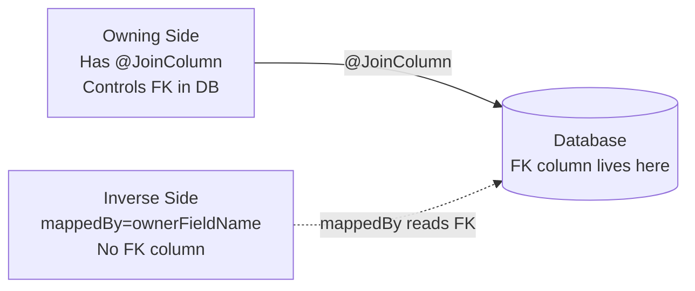

# :material-book-open-page-variant: Pro Persistence — Chapter 4: Object-Relational Mapping & Chapter 5: Collection Mapping

> **Book:** Pro Jakarta Persistence in Jakarta EE 10 (Apress, 2023)  
> **Chapters:** 4 — Object-Relational Mapping · 5 — Collection Mapping

---

## :material-information: Introduction

JPA bridges the **object model** (Java classes) with the **relational model** (database tables) using metadata annotations. The JPA provider (Hibernate, EclipseLink, OpenJPA) reads annotations at deployment time and handles SQL generation transparently.

---

## :material-format-list-numbered: Chapter 4 — Object-Relational Mapping

### Accessing Entity State

JPA supports two access modes that determine how the provider reads and writes field values:

| Access Mode | Annotation Location | Provider Uses |
|-------------|--------------------|----|
| **Field Access** | On private/protected/package fields | Reflection directly |
| **Property Access** | On getter methods | `getX()` / `setX()` |

```java
// Field access (recommended):
@Entity
public class Employee {
    @Id private long id;                    // annotation on field
    private String name;
}

// Mixed access — field default, property override:
@Entity
@Access(AccessType.FIELD)
public class Employee {
    @Id private long id;

    // Override only this property to use getter:
    @Access(AccessType.PROPERTY)
    @Column(name = "PHONE")
    public String getPhoneNumber() { ... }
}
```

---

### Table Mapping — `@Table`

```java
@Entity
@Table(name = "EMP", schema = "HR", catalog = "HR")
public class Employee { ... }
```

Defaults: unqualified class name → table name, no schema/catalog override.

---

### Basic Mappings

```java
@Entity
public class TelemetryRecord {
    @Id
    @GeneratedValue(strategy = GenerationType.IDENTITY)
    private Long id;

    @Column(name = "recorded_at", nullable = false, updatable = false)
    @Temporal(TemporalType.TIMESTAMP)
    private Date recordedAt;                         // java.util.Date

    @Lob                                             // CLOB — large character field
    @Column(name = "raw_metrics_json")
    private String rawMetricsJson;

    @Enumerated(EnumType.STRING)                     // stores "ACTIVE" not "0"
    private NodeStatus status;

    @Transient                                       // not persisted
    private transient String computedLabel;
}
```

| Annotation | Effect |
|-----------|--------|
| `@Column(name, nullable, length, updatable, insertable)` | Maps attribute → physical column |
| `@Basic(fetch=FetchType.LAZY)` | Optional; marks lazy loading of field |
| `@Lob` | Map to CLOB (String/char[]) or BLOB (byte[]/Serializable) |
| `@Enumerated(EnumType.STRING)` | Stores enum name string — safe if enum is reordered |
| `@Temporal(TemporalType.TIMESTAMP)` | Disambiguates `java.util.Date` → SQL type |
| `@Transient` | Explicitly excluded from persistence |

---

### Primary Keys — `@Id` and `@GeneratedValue`

```java
// Identity — relies on DB AUTO_INCREMENT; ID only available after INSERT
@Id @GeneratedValue(strategy = GenerationType.IDENTITY)
private Long id;

// Sequence — uses DB sequence; provider can pre-allocate in batches (allocationSize)
@Id @GeneratedValue(strategy = GenerationType.SEQUENCE, generator = "emp_seq")
@SequenceGenerator(name = "emp_seq", sequenceName = "EMP_SEQ", allocationSize = 50)
private Long id;

// Table — uses a dedicated counter table; most portable but slowest
@Id @GeneratedValue(strategy = GenerationType.TABLE, generator = "emp_gen")
@TableGenerator(name = "emp_gen", table = "ID_GEN",
                pkColumnName = "GEN_NAME", valueColumnName = "GEN_VAL",
                pkColumnValue = "Emp_Gen", initialValue = 0, allocationSize = 50)
private Long id;

// Auto — provider picks best strategy
@Id @GeneratedValue(strategy = GenerationType.AUTO)
private Long id;
```

---

### Embedded Value Objects — `@Embeddable` / `@Embedded`

Value types without their own database identity — columns are merged into the owning entity's table:

```java
@Embeddable
public class HardwareSpec {
    @Column(name = "cpu_cores")    private int cpuCores;
    @Column(name = "ram_gb")       private int ramGb;
    @Column(name = "storage_tb")   private double storageTb;
}

@Entity
public class ClusterNode {
    @Id @GeneratedValue(strategy = GenerationType.IDENTITY)
    private Long id;

    @Embedded
    private HardwareSpec hardware;

    // Override column names if this entity conflicts with another that uses HardwareSpec:
    @Embedded
    @AttributeOverrides({
        @AttributeOverride(name = "cpuCores",  column = @Column(name = "backup_cpu")),
        @AttributeOverride(name = "ramGb",     column = @Column(name = "backup_ram"))
    })
    private HardwareSpec backupHardware;
}
```

---

### Relationships — Full Mapping Guide

#### The Owning Side Rule

> The side with the physical **foreign key column** in the database is the **owning side**. The owning side controls INSERT/UPDATE. The inverse side uses `mappedBy` and has no FK column.



#### `@ManyToOne` (Always Owning)

```java
@Entity
public class ClusterNode {
    @ManyToOne(fetch = FetchType.LAZY)
    @JoinColumn(name = "rack_id", nullable = false)
    private ServerRack rack;
}
```

#### `@OneToMany` (Usually Inverse)

```java
@Entity
public class ServerRack {
    @OneToMany(mappedBy = "rack",
               cascade = CascadeType.ALL,
               orphanRemoval = true)
    private List<ClusterNode> nodes = new ArrayList<>();
}
```

#### `@OneToOne` (Bidirectional)

```java
// Owning side — has FK column:
@Entity
public class ClusterNode {
    @OneToOne(cascade = CascadeType.ALL, orphanRemoval = true)
    @JoinColumn(name = "diagnostics_id", unique = true)
    private NodeDiagnostics diagnostics;
}

// Inverse side:
@Entity
public class NodeDiagnostics {
    @OneToOne(mappedBy = "diagnostics")
    private ClusterNode node;
}
```

#### `@ManyToMany` with Join Table

```java
// Owning side — defines join table:
@Entity
public class ClusterNode {
    @ManyToMany(cascade = {CascadeType.PERSIST, CascadeType.MERGE})
    @JoinTable(
        name = "node_security_group",
        joinColumns         = @JoinColumn(name = "node_id"),
        inverseJoinColumns  = @JoinColumn(name = "group_id")
    )
    private Set<SecurityGroup> securityGroups = new HashSet<>();
}

// Inverse side:
@Entity
public class SecurityGroup {
    @ManyToMany(mappedBy = "securityGroups")
    private Set<ClusterNode> nodes = new HashSet<>();
}
```

#### Cascade Types

| `CascadeType` | Effect |
|--------------|--------|
| `PERSIST` | Persisting parent also persists new children |
| `MERGE` | Merging parent also merges detached children |
| `REMOVE` | Removing parent also removes children (use carefully!) |
| `REFRESH` | Refreshing parent also refreshes children |
| `DETACH` | Detaching parent also detaches children |
| `ALL` | All of the above |

#### Fetch Types

| Strategy | Collection Default | Single-Valued Default |
|----------|----------|----------|
| `FetchType.LAZY` | ✅ Yes | ❌ No |
| `FetchType.EAGER` | ❌ No | ✅ Yes |

!!! warning "EAGER loading at scale"
    `FetchType.EAGER` always triggers a SQL JOIN regardless of whether you need the data. For large collections this causes severe performance problems — stick with `LAZY` and use `JOIN FETCH` in queries when you need data.

---

## :material-layers: Chapter 5 — Collection Mapping

### Element Collections — `@ElementCollection`

Stores collections of **basic types** or **embeddables** without a separate entity class:

```java
@Entity
public class ClusterNode {
    // Collection of basic Strings — stored in separate table "node_tags"
    @ElementCollection(fetch = FetchType.LAZY)
    @CollectionTable(
        name = "node_tags",
        joinColumns = @JoinColumn(name = "node_id")
    )
    @Column(name = "tag_value")
    private Set<String> tags = new HashSet<>();

    // Collection of embeddables
    @ElementCollection
    @CollectionTable(name = "node_maintenance_windows",
                     joinColumns = @JoinColumn(name = "node_id"))
    private List<MaintenanceWindow> maintenanceWindows = new ArrayList<>();
}
```

### Ordering Collections

```java
// Logical ordering — ORDER BY applied on read (no extra column)
@OneToMany(mappedBy = "rack")
@OrderBy("hostname ASC, status DESC")
private List<ClusterNode> nodes;

// Persistent ordering — dedicated integer "position" column in DB
@OneToMany(mappedBy = "rack")
@OrderColumn(name = "display_position")
private List<ClusterNode> orderedNodes;
```

!!! tip "Prefer @OrderBy over @OrderColumn"
    `@OrderColumn` requires the DB to recompute and update position integers on every insert/delete. `@OrderBy` is a simple ORDER BY clause — much cheaper.

### Map Collections

```java
// Map<String, String> — key in @MapKeyColumn, value in @Column
@ElementCollection
@CollectionTable(name = "node_properties")
@MapKeyColumn(name = "prop_key")
@Column(name = "prop_value")
private Map<String, String> properties = new HashMap<>();

// Map keyed by entity attribute — @MapKey extracts target's field as key
@OneToMany(mappedBy = "rack")
@MapKey(name = "hostname")              // hostname becomes map key
private Map<String, ClusterNode> nodesByHostname = new HashMap<>();
```

---

## :material-key: Key Takeaways

1. **Field access** is preferred — avoids triggering business logic in getters during persistence operations
2. **`@GeneratedValue(IDENTITY)`** — IDs only available after the INSERT fires; don't rely on ID before `flush()`
3. **`mappedBy`** marks the INVERSE side — only the owning side with `@JoinColumn` controls the FK
4. **`orphanRemoval = true`** + cascade is required to automatically delete child rows when removed from parent collection
5. **`@ElementCollection`** is cheaper than a full entity for simple string/value lists
6. **`FetchType.EAGER` on collections** = SQL JOIN always fires = performance trap at scale

---

[:octicons-arrow-left-24: Back to Day 08 Index](index.md)
