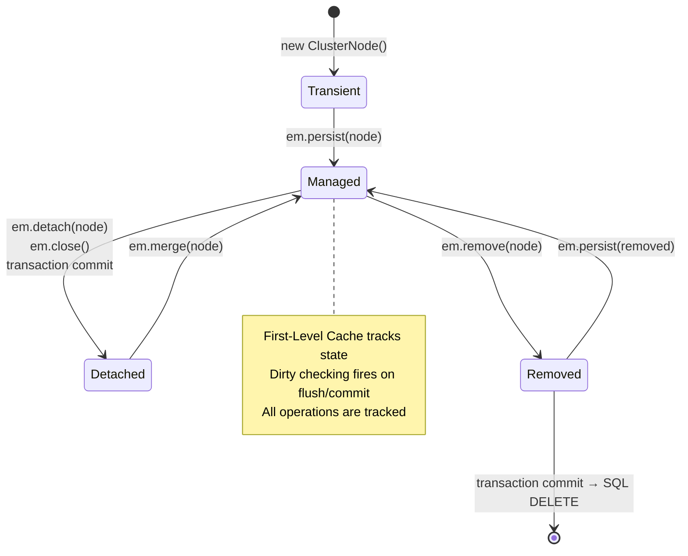

# :material-flask: Day 09 Lab Guide — Persistence Context, EntityManager & Lifecycle Events

> **Lab Repo:** [:material-github: 7amo10/JavaEE-Labs — Week-2-JPA-JTA-Security](https://github.com/7amo10/JavaEE-Labs/tree/main/Week-2-JPA-JTA-Security)  
> **Tech Stack:** Jakarta Persistence 3.1 | Hibernate ORM 6.4 | H2 In-Memory Engine

---

## :material-target: Laboratory Objective

Master the four JPA entity lifecycle states (Transient, Managed, Detached, Removed), First-Level Cache (Identity Map) mechanics, automatic dirty checking, entity synchronization (`flush()` and `refresh()`), and lifecycle callback annotations with external `@EntityListeners`.

---

## :material-refresh: The 4 Entity Lifecycle States



| State | Database Identity | Tracked by Context | SQL Generated |
|-------|------------------|--------------------|--------------|
| **Transient** | No | No | None |
| **Managed** | Yes (after persist+flush) | ✅ Yes | On flush/commit |
| **Detached** | Yes | ❌ No | None until `merge()` |
| **Removed** | Yes (until commit) | Yes (scheduled DELETE) | DELETE on commit |

---

## :material-cube-outline: Key Technical Concepts

### First-Level Cache — Identity Map Proof

```java
EntityManager em = emf.createEntityManager();
em.getTransaction().begin();

ClusterNode ref1 = em.find(ClusterNode.class, 1L);  // hits DB: SELECT
ClusterNode ref2 = em.find(ClusterNode.class, 1L);  // cache hit: NO SQL

// Java object identity guaranteed within same persistence context:
assert ref1 == ref2;   // TRUE — same instance, not just equal
System.out.println("Identity map verified: " + (ref1 == ref2));

em.getTransaction().commit();
em.close();
```

### Automatic Dirty Checking — No Explicit Save

```java
em.getTransaction().begin();
ClusterNode node = em.find(ClusterNode.class, 1L);  // Managed state

// Just modify the field — no em.merge() or em.save() needed:
node.setStatus(NodeStatus.MAINTENANCE);
node.getHardware().setRamGb(128);

em.getTransaction().commit();   // Hibernate issues: UPDATE cluster_node SET status=? WHERE id=?
```

### `flush()` vs `refresh()`

```java
em.getTransaction().begin();
ClusterNode node = em.find(ClusterNode.class, 1L);

node.setStatus(NodeStatus.OFFLINE);

// flush() — pushes pending SQL to DB but does NOT commit:
em.flush();
// Database now has OFFLINE but transaction is still open

// Simulate another thread updating the DB directly...

// refresh() — overwrites in-memory state with CURRENT DB row:
em.refresh(node);
// node.getStatus() now reflects whatever is in the DB (may have been changed externally)

em.getTransaction().commit();
```

### `merge()` — Integrating Detached Entities

```java
// entity is DETACHED after em.close():
em.close();

// Later, modify the detached entity:
node.setCpuUsagePercent(95.5);

// Open new EntityManager and merge:
EntityManager em2 = emf.createEntityManager();
em2.getTransaction().begin();

// WRONG — do not use the argument:
// em2.merge(node);  ← node is still detached after this!

// CORRECT — use the returned managed instance:
ClusterNode managedNode = em2.merge(node);   // copies state, returns managed copy
managedNode.setLastCheckedAt(Instant.now()); // now modifying the managed instance

em2.getTransaction().commit();
em2.close();
```

### Entity Lifecycle Callbacks

```java
// In-entity callbacks (no parameter):
@Entity
@EntityListeners(AuditListener.class)    // attach external listener
public class ClusterNode {

    @PrePersist
    private void onPrePersist() {
        this.createdAt = Instant.now();
        this.version = 0;
    }

    @PostLoad
    private void onPostLoad() {
        // Compute transient field from loaded state — NOT persisted:
        this.durationOpenSeconds = Duration.between(createdAt, Instant.now()).getSeconds();
    }
}
```

```java
// External listener class (entity passed as parameter):
public class AuditListener {

    @PrePersist
    public void onPrePersist(Object entity) {
        System.out.printf("[AUDIT] PRE_PERSIST: %s%n", entity.getClass().getSimpleName());
    }

    @PostPersist
    public void onPostPersist(Object entity) {
        System.out.printf("[AUDIT] POST_PERSIST: %s (committed)%n", entity.getClass().getSimpleName());
    }

    @PreUpdate
    public void onPreUpdate(Object entity) {
        System.out.printf("[AUDIT] PRE_UPDATE: %s%n", entity.getClass().getSimpleName());
    }

    @PostUpdate
    public void onPostUpdate(Object entity) {
        System.out.printf("[AUDIT] POST_UPDATE: %s%n", entity.getClass().getSimpleName());
    }

    @PreRemove
    public void onPreRemove(Object entity) {
        System.out.printf("[AUDIT] PRE_REMOVE: %s%n", entity.getClass().getSimpleName());
    }

    @PostRemove
    public void onPostRemove(Object entity) {
        System.out.printf("[AUDIT] POST_REMOVE: %s (deleted from DB)%n", entity.getClass().getSimpleName());
    }
}
```

### All Lifecycle Callback Annotations

| Annotation | When Called | Common Use |
|-----------|-------------|-----------|
| `@PrePersist` | Before `INSERT` SQL | Set `createdAt`, generate UUID |
| `@PostPersist` | After `INSERT` committed | Send notification, log audit |
| `@PreUpdate` | Before `UPDATE` SQL | Set `updatedAt`, validate state |
| `@PostUpdate` | After `UPDATE` committed | Invalidate caches |
| `@PreRemove` | Before `DELETE` SQL | Cascade cleanup, archive |
| `@PostRemove` | After `DELETE` committed | Notify dependent systems |
| `@PostLoad` | After entity loaded from DB | Compute `@Transient` fields |

---

## :material-check-all: Lab Verification Checklist

| # | Test | Expected Result |
|---|------|----------------|
| 1 | **Lifecycle State Transitions** | Entity transitions Transient → Managed → Detached → Merged cleanly |
| 2 | **L1 Identity Map** | Repeated `find()` calls within same transaction return `ref1 == ref2` with zero secondary SQL |
| 3 | **Dirty Checking** | Modifying entity field causes Hibernate to issue `UPDATE` on commit without explicit `merge()` |
| 4 | **Flush vs Refresh** | `flush()` pushes pending SQL before commit; `refresh()` reverts uncommitted mutations to DB values |
| 5 | **Lifecycle Events** | `AuditListener` logs all state transitions; `@PostLoad` calculates transient open duration |
| 6 | **Removed State** | Calling `em.remove()` deletes entity row from DB on commit |

---

[:octicons-arrow-left-24: Back to Day 09 Index](index.md) | [:octicons-arrow-right-24: Day 10 — JPQL & Criteria API](../day-10-jpql-criteria-queries/index.md)
