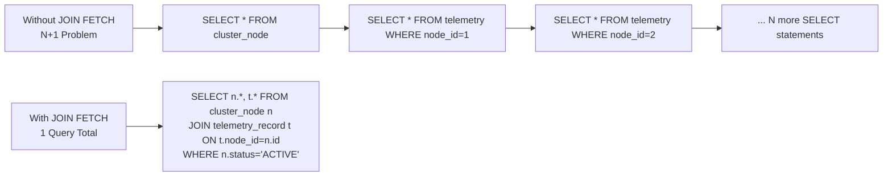

# :material-book-open-page-variant: Pro Persistence — Chapter 8: Query Language (JPQL)

> **Book:** Pro Jakarta Persistence in Jakarta EE 10 (Apress, 2023)  
> **Chapter:** 8 — Query Language (JPQL)

---

## :material-information: Overview

JPQL (Jakarta Persistence Query Language) is a **SQL-like language that operates on the object model**, not the relational model. You write queries using **entity class names** and **field names** — not table/column names. The JPA provider translates JPQL to dialect-specific SQL at runtime.

```
JPQL:  SELECT n FROM ClusterNode n WHERE n.hostname = 'node-1'
SQL:   SELECT * FROM cluster_node WHERE node_hostname = 'node-1'
```

---

## :material-select-all: SELECT and FROM Clauses

The `FROM` clause defines the **domain** using identification variables:

```sql
-- Full entity return (most common):
SELECT n FROM ClusterNode n

-- Single attribute:
SELECT n.hostname FROM ClusterNode n

-- Navigation through relationships (dot notation):
SELECT n.rack.datacenter.location FROM ClusterNode n WHERE n.id = :id

-- Multiple entity selection:
SELECT n, r FROM ClusterNode n LEFT JOIN n.rack r
```

### Constructor Expressions — `SELECT NEW`

Project directly into a Java record/class **without entity hydration or L1 cache overhead**:

```java
// Define the DTO:
public record NodeMetricSummaryDto(String hostname, Long recordCount, Double avgCpu) {
    // Must have a matching public constructor
}

// JPQL constructor expression:
TypedQuery<NodeMetricSummaryDto> q = em.createQuery(
    "SELECT NEW com.pulse.dto.NodeMetricSummaryDto(" +
    "    n.hostname, COUNT(t), AVG(t.cpuUsagePercent)" +
    ") " +
    "FROM ClusterNode n LEFT JOIN n.telemetryRecords t " +
    "GROUP BY n.hostname",
    NodeMetricSummaryDto.class
);
List<NodeMetricSummaryDto> summaries = q.getResultList();
```

!!! tip "When to use SELECT NEW"
    - Read-only reporting endpoints — no need to track entities in L1 cache
    - Dashboard aggregations — load only computed values
    - Large result sets — minimize heap usage by projecting only needed columns

---

## :material-link: JOINs in JPQL

### INNER JOIN

Returns only matching pairs — nodes that **have** a rack:

```sql
SELECT n FROM ClusterNode n JOIN n.rack r WHERE r.location = 'DC-01'
SELECT n.hostname, r.location FROM ClusterNode n INNER JOIN n.rack r
```

### LEFT OUTER JOIN

Returns all entities on the left side even without a matching join:

```sql
-- Returns nodes even if they have no rack:
SELECT n, r FROM ClusterNode n LEFT JOIN n.rack r
SELECT n FROM ClusterNode n LEFT JOIN n.securityGroups sg WHERE sg IS NULL
```

### JOIN FETCH — The N+1 Eliminator

Initializes lazy associations in a **single SQL query**, allowing safe detached traversal:

```sql
SELECT DISTINCT n FROM ClusterNode n
JOIN FETCH n.telemetryRecords t
JOIN FETCH n.rack r
WHERE n.status = :status
```

```java
List<ClusterNode> nodes = em.createQuery(
    "SELECT DISTINCT n FROM ClusterNode n " +
    "JOIN FETCH n.telemetryRecords " +
    "JOIN FETCH n.rack " +
    "WHERE n.status = :status",
    ClusterNode.class
)
.setParameter("status", NodeStatus.ACTIVE)
.getResultList();

em.close();
// Safe! Both telemetryRecords and rack are already initialized:
nodes.get(0).getTelemetryRecords().size();   // ✅ No LazyInitializationException
nodes.get(0).getRack().getLocation();         // ✅ No LazyInitializationException
```



!!! danger "DISTINCT is required with JOIN FETCH on collections"
    Without `DISTINCT`, JPA returns duplicate parent entities (one per child row). For 3 nodes each with 5 telemetry records, you get **15 rows** from the DB, producing **15 `ClusterNode` objects** in the list (with duplicates). `DISTINCT` collapses them back to 3.

---

## :material-filter: WHERE Clause — Conditional Expressions

### Comparison & Range Operators

```sql
WHERE n.hardware.ramGb >= 64
WHERE n.hardware.cpuCores BETWEEN 8 AND 32
WHERE n.createdAt > :since
```

### LIKE Pattern Matching

```sql
WHERE n.hostname LIKE 'node-%.cluster.local'
WHERE n.hostname LIKE '%primary%'
WHERE n.hostname NOT LIKE 'test-%'
-- Escape special characters:
WHERE n.hostname LIKE 'node\_01%' ESCAPE '\'
```

| Wildcard | Matches |
|---------|---------|
| `%` | Any sequence of characters (including empty) |
| `_` | Exactly one character |

### IS NULL / IS EMPTY

```sql
WHERE n.rack IS NULL                      -- no parent rack assigned
WHERE n.rack IS NOT NULL
WHERE n.telemetryRecords IS EMPTY         -- collection has zero elements
WHERE n.telemetryRecords IS NOT EMPTY
```

### IN Clause

```sql
WHERE n.status IN ('ACTIVE', 'MAINTENANCE')
WHERE n.status IN (:statusList)                 -- named parameter = Collection
WHERE n.rack.id NOT IN (1, 2, 3)
```

### EXISTS — Subquery Existence Check

```sql
-- Nodes that have at least one critical telemetry record:
WHERE EXISTS (
    SELECT t FROM TelemetryRecord t
    WHERE t.node = n AND t.cpuUsagePercent > 95.0
)
```

### ANY, ALL, SOME — Subquery Comparison

```sql
-- Nodes whose CPU is higher than ALL critical thresholds:
WHERE n.avgCpuPercent > ALL (
    SELECT th.cpuThreshold FROM AlertThreshold th WHERE th.severity = 'CRITICAL'
)

-- Nodes matching ANY maintenance window:
WHERE n.id = ANY (
    SELECT m.nodeId FROM MaintenanceSchedule m WHERE m.scheduledDate = :today
)
```

---

## :material-sort: ORDER BY

```sql
-- Ascending (default):
SELECT n FROM ClusterNode n ORDER BY n.hostname
SELECT n FROM ClusterNode n ORDER BY n.hostname ASC

-- Descending:
SELECT n FROM ClusterNode n ORDER BY n.hardware.ramGb DESC

-- Multi-column sorting:
SELECT n FROM ClusterNode n
ORDER BY n.status ASC, n.hardware.ramGb DESC, n.hostname ASC
```

---

## :material-chart-bar: Aggregate Functions with GROUP BY + HAVING

| Function | JPQL | SQL Equivalent |
|---------|------|---------------|
| Count | `COUNT(n)` or `COUNT(n.id)` | `COUNT(*)` |
| Average | `AVG(t.cpuUsagePercent)` | `AVG(...)` |
| Maximum | `MAX(t.cpuUsagePercent)` | `MAX(...)` |
| Minimum | `MIN(t.cpuUsagePercent)` | `MIN(...)` |
| Sum | `SUM(t.bytesTransferred)` | `SUM(...)` |

```sql
-- Nodes grouped by status with average CPU per group:
SELECT n.status, COUNT(n), AVG(t.cpuUsagePercent), MAX(t.cpuUsagePercent)
FROM ClusterNode n
LEFT JOIN n.telemetryRecords t
GROUP BY n.status
ORDER BY COUNT(n) DESC

-- Only groups with more than 5 nodes and avg CPU above 70%:
SELECT n.rack.location, COUNT(n), AVG(t.cpuUsagePercent)
FROM ClusterNode n
JOIN n.telemetryRecords t
GROUP BY n.rack.location
HAVING COUNT(n) > 5 AND AVG(t.cpuUsagePercent) > 70.0
ORDER BY AVG(t.cpuUsagePercent) DESC
```

---

## :material-hierarchy: Subqueries

### Non-Correlated Subquery (independent)

```sql
-- Nodes in racks at a specific data center:
SELECT n FROM ClusterNode n
WHERE n.rack.id IN (
    SELECT r.id FROM ServerRack r WHERE r.datacenter.location = 'DC-EAST'
)
```

### Correlated Subquery (references outer query)

```sql
-- Nodes whose CPU is above the average for their rack:
SELECT n FROM ClusterNode n
WHERE n.avgCpuPercent > (
    SELECT AVG(n2.avgCpuPercent) FROM ClusterNode n2
    WHERE n2.rack = n.rack    -- ← references outer n.rack
)
```

---

## :material-arrow-down: Bulk UPDATE and DELETE in JPQL

```sql
-- Bulk UPDATE:
UPDATE ClusterNode n
SET n.status = :newStatus, n.updatedAt = :now
WHERE n.rack.id = :rackId AND n.status = :oldStatus

-- Bulk DELETE:
DELETE FROM TelemetryRecord t
WHERE t.recordedAt < :cutoff AND t.node.status = 'DECOMMISSIONED'
```

---

## :material-dna: Polymorphism and `TREAT`

JPQL queries are **polymorphic by default** — querying a superclass returns all subclass instances:

```sql
-- Returns ALL Project subtypes (DesignProject, QualityProject, etc.):
SELECT p FROM Project p WHERE p.budget > 50000
```

**`TREAT` downcasting** — access subclass-specific fields in a polymorphic query:

```sql
-- Filter by a field that only exists on QualityProject:
SELECT p FROM Project p
WHERE TREAT(p AS QualityProject).qaRating > 4
```

---

## :material-key: Key Takeaways — Chapter 8

1. **JPQL uses entity names and field names** — never table/column names
2. **`JOIN FETCH`** collapses N+1 selects into 1 query — always use with `DISTINCT` for collection joins
3. **`SELECT NEW`** bypasses entity tracking — ideal for read-only projections and dashboards
4. **`IS EMPTY`** checks collection relationships (no elements) — not the same as `IS NULL`
5. **Subqueries** can be correlated (reference outer query) or non-correlated (independent)
6. **JPQL is polymorphic by default** — use `TREAT` to access subclass-specific fields
7. **Bulk UPDATE/DELETE bypass L1 cache** — always `em.clear()` afterward

---

[:octicons-arrow-left-24: Ch7 — Using Queries](book-pro-persistence-ch7.md) | [:octicons-arrow-right-24: Ch9 — Criteria API](book-pro-persistence-ch9.md) | [:octicons-arrow-left-24: Back to Day 10 Index](index.md)
