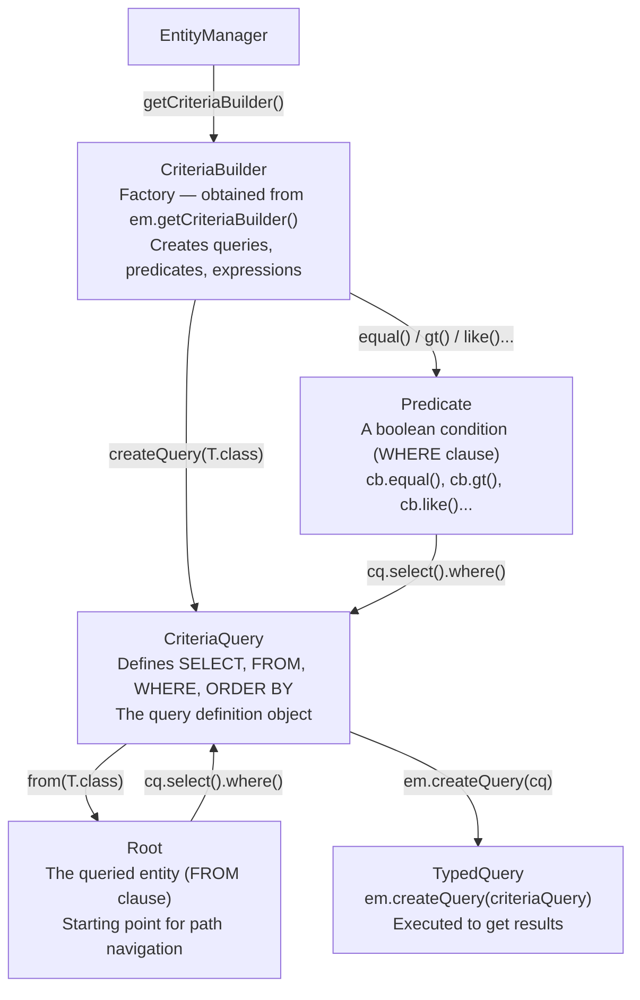

# :material-book-open-page-variant: Pro Persistence — Chapter 9: Criteria API

> **Book:** Pro Jakarta Persistence in Jakarta EE 10 (Apress, 2023)  
> **Chapter:** 9 — Criteria API

---

## :material-information: Overview

The Criteria API is a **type-safe, programmatic, object-oriented alternative to string-based JPQL**. Instead of building JPQL strings at runtime (which fail at runtime if wrong), you construct query objects using Java types — errors are caught at **compile time**.

| | JPQL | Criteria API |
|--|------|-------------|
| Syntax | String-based | Object-based |
| Error detection | Runtime | **Compile time** |
| Dynamic queries | String concat (fragile) | **Predicate accumulation (safe)** |
| Readability | More readable for simple queries | Verbose but explicit |
| Metamodel | Not applicable | Supports static typed metamodel |

**Best use case for Criteria API:** Dynamic queries where filter conditions are optional at runtime.

---

## :material-factory: The Three Core Interfaces



---

## :material-play: Basic Query Construction

```java
// Step 1: Get CriteriaBuilder from EntityManager
CriteriaBuilder cb = em.getCriteriaBuilder();

// Step 2: Create CriteriaQuery — defines the result type
CriteriaQuery<ClusterNode> cq = cb.createQuery(ClusterNode.class);

// Step 3: Define FROM clause — Root is the primary entity
Root<ClusterNode> node = cq.from(ClusterNode.class);

// Step 4: Build the query:
cq.select(node)
  .where(cb.equal(node.get("status"), NodeStatus.ACTIVE))
  .orderBy(cb.asc(node.get("hostname")));

// Step 5: Execute via TypedQuery:
List<ClusterNode> results = em.createQuery(cq).getResultList();
```

---

## :material-hammer-wrench: `CriteriaBuilder` — Expression Methods

### Comparison Predicates

```java
// Equal / Not Equal:
cb.equal(node.get("status"), NodeStatus.ACTIVE)
cb.notEqual(node.get("status"), NodeStatus.DECOMMISSIONED)

// Numeric comparisons:
cb.gt(node.get("hardware").get("ramGb"), 64)         // > 64
cb.ge(node.get("hardware").get("ramGb"), 64)         // >= 64
cb.lt(node.get("hardware").get("cpuCores"), 16)      // < 16
cb.le(node.get("hardware").get("cpuCores"), 16)      // <= 16
cb.between(node.get("hardware").get("ramGb"), 32, 128)

// String predicates:
cb.like(node.get("hostname"), "node-%.cluster.local")
cb.notLike(node.get("hostname"), "test-%")

// Null checks:
cb.isNull(node.get("rack"))
cb.isNotNull(node.get("rack"))

// Collection checks:
cb.isEmpty(node.get("telemetryRecords"))
cb.isNotEmpty(node.get("telemetryRecords"))
```

### Logical Composition

```java
// AND all predicates:
cq.where(cb.and(pred1, pred2, pred3));

// OR predicates:
cq.where(cb.or(pred1, pred2));

// NOT:
cq.where(cb.not(pred1));

// Array form (useful for dynamic lists):
Predicate[] predicateArray = predicates.toArray(new Predicate[0]);
cq.where(cb.and(predicateArray));
```

---

## :material-filter-plus: Dynamic Multi-Field Search (The Main Use Case)

This is the canonical Criteria API pattern — only add a predicate if the filter value is provided:

```java
public List<ClusterNode> searchNodes(NodeSearchCriteria criteria, int page, int pageSize) {
    CriteriaBuilder cb = em.getCriteriaBuilder();
    CriteriaQuery<ClusterNode> cq = cb.createQuery(ClusterNode.class);
    Root<ClusterNode> node = cq.from(ClusterNode.class);

    List<Predicate> predicates = new ArrayList<>();

    // Filter 1 — optional status:
    if (criteria.getStatus() != null) {
        predicates.add(cb.equal(node.get("status"), criteria.getStatus()));
    }

    // Filter 2 — optional min RAM:
    if (criteria.getMinRamGb() != null) {
        predicates.add(cb.ge(
            node.get("hardware").get("ramGb"),
            criteria.getMinRamGb()
        ));
    }

    // Filter 3 — optional hostname contains:
    if (criteria.getHostnameContains() != null && !criteria.getHostnameContains().isBlank()) {
        predicates.add(cb.like(
            cb.lower(node.get("hostname")),
            "%" + criteria.getHostnameContains().toLowerCase() + "%"
        ));
    }

    // Filter 4 — optional rack join:
    if (criteria.getRackId() != null) {
        Join<ClusterNode, ServerRack> rack = node.join("rack", JoinType.INNER);
        predicates.add(cb.equal(rack.get("id"), criteria.getRackId()));
    }

    // Build final query:
    cq.select(node)
      .where(cb.and(predicates.toArray(new Predicate[0])))
      .orderBy(cb.asc(node.get("hostname")));

    // Execute with pagination:
    return em.createQuery(cq)
             .setFirstResult(page * pageSize)
             .setMaxResults(pageSize)
             .getResultList();
}
```

---

## :material-link: Joins in Criteria API

```java
// INNER JOIN (default):
Join<ClusterNode, ServerRack> rack = node.join("rack");
Join<ClusterNode, ServerRack> rack = node.join("rack", JoinType.INNER);

// LEFT OUTER JOIN:
Join<ClusterNode, TelemetryRecord> tel = node.join("telemetryRecords", JoinType.LEFT);

// CROSS JOIN (no condition):
Root<SecurityGroup> sg = cq.from(SecurityGroup.class);   // implicit cross join

// FETCH JOIN (loads lazy association eagerly):
node.fetch("telemetryRecords", JoinType.LEFT);
node.fetch("rack");
```

---

## :material-format-list-bulleted: Projections — Multi-Column Selection

### Tuple Projection

```java
CriteriaQuery<Tuple> tq = cb.createTupleQuery();
Root<ClusterNode> node = tq.from(ClusterNode.class);

tq.multiselect(
    node.get("hostname").alias("hostname"),
    node.get("status").alias("status"),
    node.get("hardware").get("ramGb").alias("ramGb")
);

List<Tuple> tuples = em.createQuery(tq).getResultList();
for (Tuple t : tuples) {
    String hostname = t.get("hostname", String.class);
    NodeStatus status = t.get("status", NodeStatus.class);
    Integer ramGb = t.get("ramGb", Integer.class);
}
```

### Constructor Expression (DTO)

```java
CriteriaQuery<NodeMetricSummaryDto> cq = cb.createQuery(NodeMetricSummaryDto.class);
Root<ClusterNode> node = cq.from(ClusterNode.class);
Join<ClusterNode, TelemetryRecord> tel = node.join("telemetryRecords", JoinType.LEFT);

cq.select(cb.construct(NodeMetricSummaryDto.class,
    node.get("hostname"),
    cb.count(tel),
    cb.avg(tel.get("cpuUsagePercent"))
));

cq.groupBy(node.get("hostname"));
```

---

## :material-sort-descending: ORDER BY, GROUP BY, HAVING

```java
// ORDER BY — multiple columns:
cq.orderBy(
    cb.desc(cb.count(tel)),        // sort by count descending
    cb.asc(node.get("hostname"))   // then by hostname ascending
);

// GROUP BY:
cq.groupBy(node.get("status"));
cq.groupBy(node, node.get("rack").get("location"));  // multiple group keys

// HAVING — filter groups:
cq.having(
    cb.and(
        cb.ge(cb.count(tel), 10L),           // groups with >= 10 telemetry records
        cb.gt(cb.avg(tel.get("cpuUsagePercent")), 75.0)  // avg CPU > 75%
    )
);
```

---

## :material-code-braces-box: Subqueries in Criteria API

### Non-Correlated Subquery

```java
CriteriaQuery<ClusterNode> cq = cb.createQuery(ClusterNode.class);
Root<ClusterNode> node = cq.from(ClusterNode.class);

// Subquery — find racks in a specific datacenter:
Subquery<Long> rackIds = cq.subquery(Long.class);
Root<ServerRack> rack = rackIds.from(ServerRack.class);
rackIds.select(rack.get("id"))
       .where(cb.equal(rack.get("datacenter").get("location"), "DC-EAST"));

cq.select(node)
  .where(node.get("rack").get("id").in(rackIds));
```

### Correlated Subquery

```java
// Nodes with CPU above their rack's average:
CriteriaQuery<ClusterNode> cq = cb.createQuery(ClusterNode.class);
Root<ClusterNode> node = cq.from(ClusterNode.class);

Subquery<Double> avgCpu = cq.subquery(Double.class);
Root<ClusterNode> subNode = avgCpu.correlate(node);   // ← correlate, not from()
// Note: correlate() reuses the outer Root, giving access to outer query's entity

Subquery<Double> rackAvg = cq.subquery(Double.class);
Root<ClusterNode> rackNode = rackAvg.from(ClusterNode.class);
rackAvg.select(cb.avg(rackNode.get("avgCpuPercent")))
       .where(cb.equal(rackNode.get("rack"), node.get("rack")));  // correlated on rack

cq.select(node)
  .where(cb.gt(node.get("avgCpuPercent"), rackAvg));
```

---

## :material-update: Bulk Operations via Criteria API

### `CriteriaUpdate`

```java
CriteriaUpdate<ClusterNode> cu = cb.createCriteriaUpdate(ClusterNode.class);
Root<ClusterNode> cuNode = cu.from(ClusterNode.class);

cu.set(cuNode.get("status"), NodeStatus.MAINTENANCE)
  .set(cuNode.get("updatedAt"), Instant.now())
  .where(cb.equal(cuNode.get("rack").get("id"), rackId));

int updated = em.createQuery(cu).executeUpdate();
em.clear();   // evict stale L1 cache after bulk update
```

### `CriteriaDelete`

```java
CriteriaDelete<TelemetryRecord> cd = cb.createCriteriaDelete(TelemetryRecord.class);
Root<TelemetryRecord> tel = cd.from(TelemetryRecord.class);

cd.where(cb.lt(tel.get("recordedAt"), cutoffInstant));

int deleted = em.createQuery(cd).executeUpdate();
```

---

## :material-alpha-m-circle: Canonical Metamodel (Compile-Time Type Safety)

The metamodel generates companion classes (e.g., `ClusterNode_`) that contain static attribute descriptors — eliminating string-based path navigation:

```java
// Without metamodel (string-based — error only at runtime):
node.get("hostname")           // typo → runtime IllegalArgumentException
node.get("hardware").get("ramGb")

// With metamodel (compile-time safe):
node.get(ClusterNode_.hostname)
node.get(ClusterNode_.hardware).get(HardwareSpec_.ramGb)
```

Generated metamodel class (auto-generated by JPA provider annotation processor):

```java
@StaticMetamodel(ClusterNode.class)
public abstract class ClusterNode_ {
    public static volatile SingularAttribute<ClusterNode, Long>         id;
    public static volatile SingularAttribute<ClusterNode, String>       hostname;
    public static volatile SingularAttribute<ClusterNode, NodeStatus>   status;
    public static volatile SingularAttribute<ClusterNode, HardwareSpec> hardware;
    public static volatile SetAttribute<ClusterNode, SecurityGroup>     securityGroups;
    public static volatile ListAttribute<ClusterNode, TelemetryRecord>  telemetryRecords;
    public static volatile ManyToOneAttribute<ClusterNode, ServerRack>  rack;
}
```

Enable metamodel generation in `pom.xml`:

```xml
<dependency>
    <groupId>org.hibernate.orm</groupId>
    <artifactId>hibernate-jpamodelgen</artifactId>
    <version>6.4.0.Final</version>
    <scope>provided</scope>
</dependency>
```

---

## :material-key: Key Takeaways — Chapter 9

1. **Criteria API is for dynamic queries** — where filter conditions are optional/runtime; JPQL is cleaner for static queries
2. **Predicate accumulation pattern** — `List<Predicate>` with null checks, then `cb.and(array)` — the canonical safe dynamic query pattern
3. **`node.get("fieldName")`** uses string navigation — use **metamodel** (`ClusterNode_.fieldName`) for compile-time type safety
4. **`correlate(outerRoot)`** for correlated subqueries — NOT `from()` which creates an independent root
5. **`node.fetch()`** for join fetch in Criteria API — equivalent to `JOIN FETCH` in JPQL
6. **Tuple projection** allows named column access via `tuple.get("alias", Type.class)` — cleaner than `Object[]` arrays
7. **`CriteriaUpdate` / `CriteriaDelete`** bypass L1 cache — always `em.clear()` after

---

[:octicons-arrow-left-24: Ch8 — JPQL Language](book-pro-persistence-ch8.md) | [:octicons-arrow-left-24: Back to Day 10 Index](index.md)
