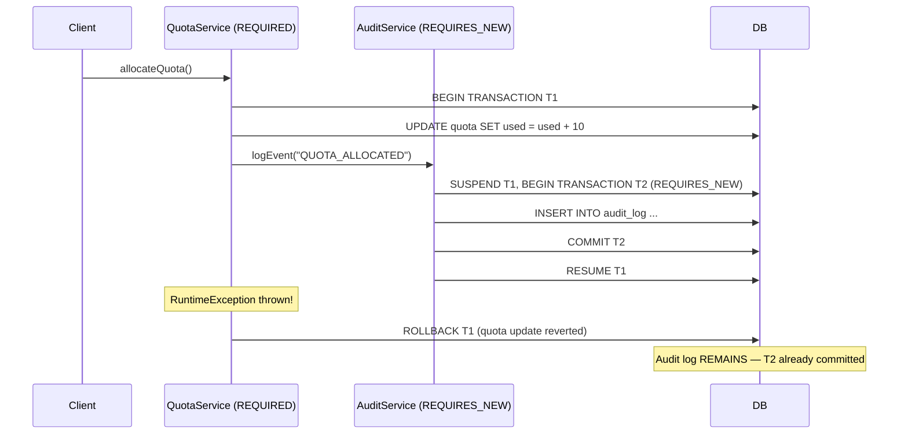

# :material-flask: Day 11 Lab Guide — JTA Declarative Transactions & Concurrency Control

> **Lab Repo:** [:material-github: 7amo10/JavaEE-Labs — Week-2-JPA-JTA-Security](https://github.com/7amo10/JavaEE-Labs/tree/main/Week-2-JPA-JTA-Security)  
> **Tech Stack:** Jakarta Transactions 2.0 | JPA 3.1 | Hibernate ORM 6.4 | H2 Engine

---

## :material-target: Laboratory Objective

Master enterprise transaction management: enforce ACID boundaries with `@Transactional`, analyze propagation (`REQUIRED` vs `REQUIRES_NEW`), manage rollback rules, and implement Optimistic Concurrency Control via `@Version` and `OptimisticLockException` handling.

---

## :material-swap-horizontal-bold: Transaction Propagation — `TxType`

| `TxType` | Behavior |
|---------|---------|
| `REQUIRED` (default) | Join existing transaction; start new if none exists |
| `REQUIRES_NEW` | Suspend outer transaction; start independent new one; resumes outer after |
| `MANDATORY` | Must join existing transaction; throws if no active transaction |
| `SUPPORTS` | Joins existing if present; runs without transaction if not |
| `NOT_SUPPORTED` | Suspends existing transaction; always runs without transaction |
| `NEVER` | Throws if any active transaction exists |



---

## :material-cube-outline: Key Technical Concepts

### `@Transactional(TxType.REQUIRED)` — Default

```java
@ApplicationScoped
public class QuotaAllocationService {

    @PersistenceContext
    private EntityManager em;

    @Inject
    private AuditService auditService;

    @Transactional(TxType.REQUIRED)   // default; joins caller's transaction or starts new
    public ClusterNode allocateQuota(Long nodeId, int cpuCores) {
        ClusterNode node = em.find(ClusterNode.class, nodeId);
        if (node == null) {
            throw new IllegalArgumentException("Node not found: " + nodeId);
        }

        node.getHardware().setCpuCores(cpuCores);   // dirty checking = auto UPDATE

        auditService.logEvent("QUOTA_ALLOCATED", nodeId, "cpu=" + cpuCores);

        return node;   // committed on outer transaction commit
    }
}
```

### `@Transactional(TxType.REQUIRES_NEW)` — Autonomous Audit

Audit log persists **even if the calling transaction rolls back** — because it's an independent transaction:

```java
@ApplicationScoped
public class AuditService {

    @PersistenceContext
    private EntityManager em;

    @Transactional(TxType.REQUIRES_NEW)   // always independent — suspends caller's TX
    public void logEvent(String eventType, Long nodeId, String details) {
        SecurityAuditEntry entry = new SecurityAuditEntry();
        entry.setEventType(eventType);
        entry.setNodeId(nodeId);
        entry.setDetails(details);
        entry.setTimestamp(Instant.now());
        em.persist(entry);
        // COMMITS immediately after this method returns
    }
}
```

### Rollback Rules — Checked vs Unchecked

```java
@Transactional
public void businessOperation() {
    // Unchecked (RuntimeException) → AUTOMATIC ROLLBACK:
    throw new NodeFailureException("hardware fault");   // rollback!

    // Checked (Exception) → NO rollback by default (commits partial work!):
    throw new QuotaExceededException("limit reached");  // commits by default!
}

// Force rollback on checked exception via rollbackOn:
@Transactional(rollbackOn = QuotaExceededException.class)
public void safeOperation() throws QuotaExceededException {
    throw new QuotaExceededException("limit reached");  // NOW rolls back
}

// Prevent rollback on specific RuntimeException:
@Transactional(dontRollbackOn = NodeNotFoundException.class)
public void partialOperation() {
    throw new NodeNotFoundException("not found");   // commits instead of rolling back
}
```

---

## :material-shield-check: Optimistic Concurrency Control — `@Version`

No database lock acquired upfront. Conflicts detected only **at commit time**:

```java
@Entity
public class ClusterNode {
    @Id @GeneratedValue(strategy = GenerationType.IDENTITY)
    private Long id;

    private String hostname;
    private NodeStatus status;

    @Version   // ← JPA manages this automatically
    private Long version;   // starts at 0, incremented on every UPDATE
}
```

**Generated SQL:**

```sql
-- Normal UPDATE (version check in WHERE clause):
UPDATE cluster_node
SET status = 'MAINTENANCE', version = 2
WHERE id = 1 AND version = 1   -- fails if another transaction already incremented version
```

**Handling the conflict:**

```java
@Transactional
public void updateNodeStatus(Long nodeId, NodeStatus newStatus) {
    try {
        ClusterNode node = em.find(ClusterNode.class, nodeId);
        node.setStatus(newStatus);
        // JTA commit fires here — UPDATE with version check
    } catch (OptimisticLockException e) {
        // Another concurrent transaction committed first — our version is stale
        throw new ConflictException("Node was modified by another operation. Please retry.", e);
    } catch (RollbackException e) {
        if (e.getCause() instanceof OptimisticLockException) {
            throw new ConflictException("Concurrent modification conflict. Please retry.", e);
        }
        throw e;
    }
}
```

**Concurrency collision scenario:**

```java
// Transaction A:
ClusterNode nodeA = em.find(ClusterNode.class, 1L);   // version=1

// Transaction B (concurrent):
ClusterNode nodeB = em.find(ClusterNode.class, 1L);   // version=1
nodeB.setStatus(NodeStatus.MAINTENANCE);
// TX B commits: UPDATE ... WHERE id=1 AND version=1 → sets version=2

// Transaction A tries to commit (version still thinks it's 1):
nodeA.setStatus(NodeStatus.OFFLINE);
// TX A commits: UPDATE ... WHERE id=1 AND version=1 → 0 rows affected!
// → OptimisticLockException thrown
```

---

## :material-lock: Pessimistic Locking — `LockModeType`

Acquires a database lock immediately — prevents any concurrent modification:

```java
// Exclusive write lock — no other transaction can read OR write until this TX commits:
ClusterNode node = em.find(ClusterNode.class, 1L, LockModeType.PESSIMISTIC_WRITE);

// Shared read lock — allows other reads but blocks writes:
ClusterNode node = em.find(ClusterNode.class, 1L, LockModeType.PESSIMISTIC_READ);

// With timeout — throw LockTimeoutException if lock not acquired within 5 seconds:
Map<String, Object> hints = Map.of("jakarta.persistence.lock.timeout", 5000);
ClusterNode node = em.find(ClusterNode.class, 1L, LockModeType.PESSIMISTIC_WRITE, hints);
```

!!! tip "Optimistic vs Pessimistic — when to use which"
    | Scenario | Choice |
    |----------|--------|
    | Reads far outnumber writes | **Optimistic** (`@Version`) |
    | Critical financial transactions | **Pessimistic** (PESSIMISTIC_WRITE) |
    | Short transactions, low contention | **Optimistic** |
    | Long-held locks, high contention risk | **Pessimistic** |

---

## :material-check-all: Lab Verification Checklist

| # | Test | Expected Result |
|---|------|----------------|
| 1 | **Atomic Commit (REQUIRED)** | Quota allocated and entity version starts at `0` after persist |
| 2 | **Unchecked Rollback** | `NodeFailureException` (RuntimeException) rolls back — quota update reverted |
| 3 | **Autonomous Audit (REQUIRES_NEW)** | Audit log entry persists despite outer transaction rollback |
| 4 | **Checked Exception Rollback** | `rollbackOn = QuotaExceededException.class` forces rollback on checked exception |
| 5 | **Optimistic Lock Collision** | Concurrent conflicting updates on same entity version trigger `OptimisticLockException` |

---

[:octicons-arrow-left-24: Back to Day 11 Index](index.md) | [:octicons-arrow-right-24: Day 12 — Jakarta Security](../day-12-jakarta-security/index.md)
