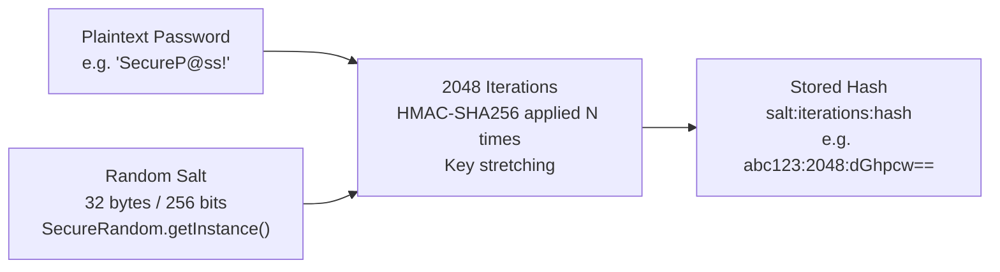

# :material-flask: Day 12 Lab Guide — Jakarta Security 3.0 & Password Hashing

> **Lab Repo:** [:material-github: 7amo10/JavaEE-Labs — Week-2-JPA-JTA-Security](https://github.com/7amo10/JavaEE-Labs/tree/main/Week-2-JPA-JTA-Security)  
> **Tech Stack:** Jakarta Security 3.0 | IdentityStore | Pbkdf2PasswordHash | @RolesAllowed | RBAC Authorization

---

## :material-target: Laboratory Objective

Master modern enterprise security: PBKDF2 cryptographic salt-based password hashing, custom `IdentityStore` validating credentials, and declarative Role-Based Access Control (RBAC) using `@DeclareRoles`, `@RolesAllowed`, `@PermitAll`, `@DenyAll`, and `SecurityContext`.

---

## :material-key: Part 1 — Cryptographic Password Hashing (PBKDF2)

### How PBKDF2 Works



**Critical properties:**
- Same password → **different hash each time** (unique random salt per user)
- Attacker cannot reverse the hash (one-way function)
- 2048 iterations = brute force takes 2048× longer than a simple hash

### Implementation — `Pbkdf2PasswordHash`

```java
import jakarta.security.enterprise.identitystore.Pbkdf2PasswordHash;

@ApplicationScoped
public class PasswordHashingService {

    @Inject
    private Pbkdf2PasswordHash passwordHash;

    @PostConstruct
    public void init() {
        // Configure: 2048 iterations, HMAC-SHA256, 32-byte salt
        Map<String, String> params = new HashMap<>();
        params.put("Pbkdf2PasswordHash.Iterations",  "2048");
        params.put("Pbkdf2PasswordHash.Algorithm",   "PBKDF2WithHmacSHA256");
        params.put("Pbkdf2PasswordHash.SaltSizeBytes", "32");
        passwordHash.initialize(params);
    }

    public String hashPassword(String plaintext) {
        return passwordHash.generate(plaintext.toCharArray());
        // Returns: "PBKDF2WithHmacSHA256:2048:salt:hash" format
    }

    public boolean verifyPassword(String plaintext, String storedHash) {
        return passwordHash.verify(plaintext.toCharArray(), storedHash);
        // Uses constant-time comparison — prevents timing attacks
    }
}
```

!!! important "Why constant-time comparison matters"
    A naive `storedHash.equals(computed)` leaks timing information — the comparison returns faster when the first byte differs. An attacker measuring response times can deduce the hash. `Pbkdf2PasswordHash.verify()` uses constant-time byte comparison that always takes the same time regardless of where the mismatch occurs.

### Verifying Salt Isolation

```java
String hash1 = passwordHashingService.hashPassword("SecureP@ss!");
String hash2 = passwordHashingService.hashPassword("SecureP@ss!");

// Two hashes of the SAME password are DIFFERENT (different salts):
assertNotEquals(hash1, hash2);   // ✅ Different strings

// But both verify correctly against the plaintext:
assertTrue(passwordHashingService.verifyPassword("SecureP@ss!", hash1));  // ✅
assertTrue(passwordHashingService.verifyPassword("SecureP@ss!", hash2));  // ✅
```

---

## :material-account-check: Part 2 — Custom `IdentityStore`

### Three-State Validation Result

```java
CredentialValidationResult.VALID_RESULT   // → credentials correct — includes principal + roles
CredentialValidationResult.INVALID_RESULT  // → wrong password OR disabled account
CredentialValidationResult.NOT_VALIDATED_RESULT  // → don't handle this credential type
```

### Full Custom IdentityStore Implementation

```java
@ApplicationScoped
public class DatabaseIdentityStore implements IdentityStore {

    @Inject
    private UserAccountRepository userRepo;

    @Inject
    private Pbkdf2PasswordHash passwordHash;

    @Override
    public CredentialValidationResult validate(Credential credential) {
        if (!(credential instanceof UsernamePasswordCredential upc)) {
            // This store only handles username+password — delegate to next store:
            return CredentialValidationResult.NOT_VALIDATED_RESULT;
        }

        String username = upc.getCaller();
        String password = upc.getPasswordAsString();

        // Lookup user in database:
        Optional<UserAccount> userOpt = userRepo.findByUsername(username);

        if (userOpt.isEmpty()) {
            return CredentialValidationResult.NOT_VALIDATED_RESULT;  // unknown user
        }

        UserAccount user = userOpt.get();

        // Check if account is active:
        if (!user.isEnabled()) {
            return CredentialValidationResult.INVALID_RESULT;   // locked account
        }

        // Verify password using constant-time PBKDF2 comparison:
        if (!passwordHash.verify(password.toCharArray(), user.getPasswordHash())) {
            return CredentialValidationResult.INVALID_RESULT;   // wrong password
        }

        // SUCCESS — return principal with roles:
        return new CredentialValidationResult(
            new CallerPrincipal(username),
            user.getRoles()   // Set<String> — e.g., {"ADMIN", "OPERATOR"}
        );
    }

    @Override
    public int priority() {
        return 100;   // lower number = higher priority in store chain
    }

    @Override
    public Set<ValidationType> validationTypes() {
        return Set.of(ValidationType.VALIDATE, ValidationType.PROVIDE_GROUPS);
    }
}
```

---

## :material-shield-account: Part 3 — Declarative RBAC with `@RolesAllowed`

### Role Declarations

```java
@DeclareRoles({"ADMIN", "OPERATOR", "VIEWER"})
@ApplicationScoped
public class ClusterManagementService { ... }
```

### Method-Level Security Annotations

```java
@ApplicationScoped
@DeclareRoles({"ADMIN", "OPERATOR", "VIEWER"})
public class ClusterNodeController {

    @Inject SecurityContext securityContext;

    // Only ADMIN can delete nodes:
    @RolesAllowed("ADMIN")
    public void deleteNode(Long nodeId) { ... }

    // Both ADMIN and OPERATOR can update:
    @RolesAllowed({"ADMIN", "OPERATOR"})
    public void updateNodeStatus(Long nodeId, NodeStatus status) { ... }

    // Any authenticated user (ADMIN, OPERATOR, or VIEWER):
    @RolesAllowed({"ADMIN", "OPERATOR", "VIEWER"})
    public List<ClusterNode> listNodes() { ... }

    // Anonymous allowed — no authentication required:
    @PermitAll
    public String healthCheck() { return "OK"; }

    // Nobody can call this (e.g., deprecated method):
    @DenyAll
    public void legacyBulkDelete() { throw new UnsupportedOperationException(); }
}
```

### Programmatic Security Checks — `SecurityContext`

```java
@Inject
private SecurityContext securityContext;

public Response getNodeDetails(Long id) {
    // Get authenticated caller:
    Principal caller = securityContext.getCallerPrincipal();
    String username = caller.getName();

    // Check role programmatically:
    if (securityContext.isCallerInRole("ADMIN")) {
        return Response.ok(getFullDetails(id)).build();
    } else if (securityContext.isCallerInRole("VIEWER")) {
        return Response.ok(getSummary(id)).build();   // restricted view
    } else {
        return Response.status(403).entity("Insufficient permissions").build();
    }
}
```

---

## :material-table-check: RBAC Authorization Matrix

| Endpoint | `ADMIN` | `OPERATOR` | `VIEWER` | `Anonymous` |
|---------|---------|-----------|---------|------------|
| `deleteNode()` | ✅ 200 OK | ❌ 403 Forbidden | ❌ 403 Forbidden | ❌ 401 Unauthorized |
| `updateNodeStatus()` | ✅ 200 OK | ✅ 200 OK | ❌ 403 Forbidden | ❌ 401 Unauthorized |
| `listNodes()` | ✅ 200 OK | ✅ 200 OK | ✅ 200 OK | ❌ 401 Unauthorized |
| `healthCheck()` | ✅ 200 OK | ✅ 200 OK | ✅ 200 OK | ✅ 200 OK |
| `legacyBulkDelete()` | ❌ 403 Forbidden | ❌ 403 Forbidden | ❌ 403 Forbidden | ❌ 403 Forbidden |

---

## :material-check-all: Lab Verification Checklist

| # | Test | Expected Result |
|---|------|----------------|
| 1 | **PBKDF2 Salt Isolation** | Two hashes of same password produce distinct strings but both verify against plaintext |
| 2 | **IdentityStore Success** | `admin_master` credentials → `VALID` with principal + `{ADMIN, OPERATOR, VIEWER}` roles |
| 3 | **IdentityStore Rejection** | Wrong password → `INVALID` immediately |
| 4 | **Store Delegation & Locked Accounts** | Unknown users → `NOT_VALIDATED`; disabled accounts → `INVALID` |
| 5 | **RBAC Authorization Matrix** | Admin/Operator/Viewer/Anonymous callers get correct HTTP status codes per endpoint |

---

[:octicons-arrow-left-24: Back to Day 12 Index](index.md) | [:octicons-arrow-right-24: Days 13-14 — JWT Milestone](../day-13-14-jwt-milestone/index.md)
