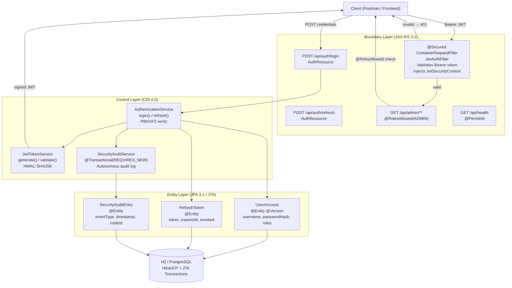

# :material-trophy: Days 13-14 — Stateless JWT Authentication & Week 2 Milestone

> **Milestone Time Investment:** 3.0 hours (across weekend)  
> **Lab Repo:** [:material-github: 7amo10/JavaEE-Labs — Week-2-JPA-JTA-Security](https://github.com/7amo10/JavaEE-Labs/tree/main/Week-2-JPA-JTA-Security)

---

## :material-target: Milestone Objective

Build an end-to-end **Stateless REST Security Gateway** integrating all Week 2 disciplines:

- **JPA 3.1** entity persistence (`UserAccount`, `RefreshToken`, `SecurityAuditEntry`)
- **JTA** declarative transactions with `REQUIRES_NEW` autonomous audit logging
- **PBKDF2** cryptographic password hashing (2048 iterations, unique salt per user)
- **RFC-7519 JWT** (JSON Web Token) issuance and HMAC-SHA256 signature validation
- **JAX-RS `ContainerRequestFilter`** via `@Secured` `@NameBinding` intercepting REST calls
- **RBAC** via `@RolesAllowed` and RFC-7807 `ProblemDetails` error responses

---

## :material-sitemap: Architectural Overview



---

## :material-cube-outline: Component Inventory

### 1. JPA Entities

```java
@Entity
@Table(name = "user_accounts")
public class UserAccount {
    @Id @GeneratedValue(strategy = GenerationType.IDENTITY)
    private Long id;

    @Column(unique = true, nullable = false)
    private String username;

    @Column(nullable = false)
    private String passwordHash;    // PBKDF2 format: algo:iter:salt:hash

    @ElementCollection(fetch = FetchType.EAGER)
    @CollectionTable(name = "user_roles", joinColumns = @JoinColumn(name = "user_id"))
    @Column(name = "role")
    private Set<String> roles = new HashSet<>();

    private boolean enabled = true;

    @Version
    private Long version;           // optimistic locking
}

@Entity
@Table(name = "refresh_tokens")
public class RefreshToken {
    @Id @GeneratedValue(strategy = GenerationType.IDENTITY)
    private Long id;

    @Column(unique = true, nullable = false)
    private String tokenValue;

    @ManyToOne(fetch = FetchType.LAZY)
    @JoinColumn(name = "user_id")
    private UserAccount user;

    private Instant expiresAt;
    private boolean revoked = false;

    @PrePersist
    private void setDefaults() {
        this.expiresAt = Instant.now().plus(Duration.ofDays(30));
    }
}

@Entity
@Table(name = "security_audit")
public class SecurityAuditEntry {
    @Id @GeneratedValue(strategy = GenerationType.IDENTITY)
    private Long id;

    @Column(nullable = false)
    private String eventType;   // LOGIN_SUCCESS, LOGIN_FAILURE, TOKEN_EXPIRED, etc.

    private String username;
    private String ipAddress;

    @Column(nullable = false)
    private Instant timestamp;

    private String details;
}
```

### 2. JWT Token Engine — HMAC-SHA256 (RFC-7519)

```java
@ApplicationScoped
public class JwtTokenService {

    private static final String SECRET_KEY = "my-very-long-256-bit-secret-key-for-hmac-sha256";
    private static final Duration ACCESS_TOKEN_TTL  = Duration.ofMinutes(15);
    private static final Duration REFRESH_TOKEN_TTL = Duration.ofDays(30);

    public String generateAccessToken(String username, Set<String> roles) {
        String header = base64UrlEncode("""
            {"alg":"HS256","typ":"JWT"}
            """);
        String claims = base64UrlEncode(String.format("""
            {
              "sub": "%s",
              "iss": "cluster-api",
              "iat": %d,
              "exp": %d,
              "roles": %s,
              "jti": "%s"
            }
            """,
            username,
            Instant.now().getEpochSecond(),
            Instant.now().plus(ACCESS_TOKEN_TTL).getEpochSecond(),
            toJsonArray(roles),
            UUID.randomUUID().toString()
        ));

        String signature = hmacSha256(header + "." + claims, SECRET_KEY);
        return header + "." + claims + "." + signature;
    }

    public JwtClaims validateToken(String token) throws JwtValidationException {
        String[] parts = token.split("\\.");
        if (parts.length != 3) {
            throw new JwtValidationException("Malformed token structure");
        }

        // Verify signature — constant-time comparison:
        String expectedSig = hmacSha256(parts[0] + "." + parts[1], SECRET_KEY);
        if (!MessageDigest.isEqual(
                expectedSig.getBytes(StandardCharsets.UTF_8),
                parts[2].getBytes(StandardCharsets.UTF_8))) {
            throw new JwtValidationException("Invalid signature");
        }

        // Decode and validate claims:
        JwtClaims claims = parseClaims(base64UrlDecode(parts[1]));
        if (claims.getExpiry().isBefore(Instant.now())) {
            throw new JwtValidationException("Token expired");
        }

        return claims;
    }

    private String hmacSha256(String data, String key) {
        try {
            Mac mac = Mac.getInstance("HmacSHA256");
            mac.init(new SecretKeySpec(key.getBytes(StandardCharsets.UTF_8), "HmacSHA256"));
            return base64UrlEncode(mac.doFinal(data.getBytes(StandardCharsets.UTF_8)));
        } catch (Exception e) {
            throw new RuntimeException("HMAC-SHA256 computation failed", e);
        }
    }
}
```

### 3. JAX-RS Security Filter — `@Secured` `@NameBinding`

```java
// Step 1: Define name-binding annotation:
@NameBinding
@Retention(RetentionPolicy.RUNTIME)
@Target({ElementType.TYPE, ElementType.METHOD})
public @interface Secured {}

// Step 2: Filter — validates token and injects SecurityContext:
@Secured
@Provider
@Priority(Priorities.AUTHENTICATION)
public class JwtAuthFilter implements ContainerRequestFilter {

    @Inject JwtTokenService jwtService;

    @Override
    public void filter(ContainerRequestContext ctx) {
        String authHeader = ctx.getHeaderString(HttpHeaders.AUTHORIZATION);

        if (authHeader == null || !authHeader.startsWith("Bearer ")) {
            abortWithProblem(ctx, 401, "Missing or malformed Authorization header");
            return;
        }

        String token = authHeader.substring("Bearer ".length()).trim();

        try {
            JwtClaims claims = jwtService.validateToken(token);
            // Inject custom security context with principal + roles:
            ctx.setSecurityContext(new JwtSecurityContext(claims));
        } catch (JwtValidationException e) {
            abortWithProblem(ctx, 401, e.getMessage());
        }
    }

    private void abortWithProblem(ContainerRequestContext ctx, int status, String detail) {
        ctx.abortWith(Response.status(status)
            .type("application/problem+json")
            .entity(String.format(
                "{\"type\":\"about:blank\",\"title\":\"%s\",\"status\":%d,\"detail\":\"%s\"}",
                status == 401 ? "Unauthorized" : "Forbidden", status, detail
            ))
            .build());
    }
}

// Step 3: Apply to resource:
@Path("/api/admin")
@Secured             // ← ALL methods require valid JWT
@RolesAllowed("ADMIN")
public class AdminResource { ... }
```

### 4. Autonomous Audit — `REQUIRES_NEW`

```java
@ApplicationScoped
public class SecurityAuditService {

    @PersistenceContext
    private EntityManager em;

    @Transactional(TxType.REQUIRES_NEW)   // always commits independently
    public void record(String eventType, String username, String details) {
        SecurityAuditEntry entry = new SecurityAuditEntry();
        entry.setEventType(eventType);
        entry.setUsername(username);
        entry.setTimestamp(Instant.now());
        entry.setDetails(details);
        em.persist(entry);
        // Committed IMMEDIATELY — even if caller rolls back
    }
}
```

---

## :material-check-all: Milestone Verification Checklist

| # | Test | Expected |
|---|------|---------|
| 1 | **User Seeding** | 3 accounts seeded: `admin_master`, `operator_bob`, `viewer_alice` with PBKDF2 hashes |
| 2 | **Authentication & JWT Issuance** | Valid login → access JWT + refresh token |
| 3 | **Authorized Dispatch** | Admin token → `@RolesAllowed({"ADMIN"})` endpoint → HTTP 200 |
| 4 | **RBAC Rejection** | Viewer token → admin endpoint → HTTP 403 + RFC-7807 `problem+json` |
| 5 | **Tampering Detection** | Mutated signature → HTTP 401 Unauthorized |
| 6 | **Token Expiration** | Expired token → HTTP 401 Unauthorized |
| 7 | **Token Refresh** | Valid refresh token → new access JWT (no credentials needed) |
| 8 | **Autonomous Audit** | All 9 security events persisted in audit log despite any transaction rollbacks |

---

## :material-note-alert: Prerequisites to Continue

!!! note "New concepts not seen in Phase 1 or Phase 2"
    - **RFC-7519 (JWT)** — JSON Web Token standard; three Base64URL-encoded segments: `header.payload.signature`; the signature proves authenticity
    - **HMAC-SHA256** — Hash-based Message Authentication Code using SHA-256; `Mac.getInstance("HmacSHA256")` in Java; the secret key must NEVER be embedded in client code
    - **Stateless authentication** — server stores no session; every request carries the JWT which contains all needed claims; horizontal scaling is trivial because no session state is shared
    - **`JwtSecurityContext`** — a custom implementation of `jakarta.ws.rs.core.SecurityContext` that reads principal and roles from validated JWT claims; injected into `ContainerRequestContext`
    - **`@NameBinding`** + `@Secured` — selective filter binding; only resources/methods annotated with `@Secured` are intercepted by `JwtAuthFilter` (review Day 05 for `@NameBinding` mechanics)
    - **`REQUIRES_NEW` for audit** — audit logs use a separate independent transaction that commits regardless of the outer transaction outcome — this is the enterprise pattern for tamper-proof audit trails
    - **RFC-7807 Problem Details** — standard JSON error body format: `type`, `title`, `status`, `detail`, `instance` fields; `Content-Type: application/problem+json`

---

[:octicons-arrow-left-24: Back to Week 2](../index.md) | [:octicons-arrow-right-24: Phase 3 Home](../../index.md)
