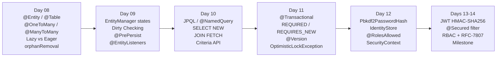

# Week 2 — Data Persistence (JPA 3.1), Transactions (JTA) & Security

**Goal:** Master Object-Relational Mapping, entity lifecycle, JPQL queries, declarative transactions, and JWT authentication.

---

## :material-calendar-week: Weekly Schedule

| Day | Topic | Books | Time | Lab Focus |
|-----|-------|-------|------|-----------|
| **08** | JPA 3.1 Entity Mapping & Relationship Boundaries | Pro Persistence Ch4 + Ch5 + EE8 AppDev Ch3 | 2.5h | Multi-entity schema, FetchType.LAZY boundary test |
| **09** | Persistence Context, EntityManager & Lifecycle Events | Pro Persistence Ch6 | 2.5h | Auto-audit `@EntityListeners`, dirty checking verification |
| **10** | Dynamic JPQL Queries & Criteria API | Pro Persistence Ch7 + Ch8 + Ch9 | 2.5h | Type-safe Criteria API multi-field search service |
| **11** | JTA Declarative Transactions & Concurrency Control | Pro Persistence Ch12 + EE Patterns Ch6 | 2.0h | `@Version` optimistic lock collision test |
| **12** | Jakarta Security 3.0 & Password Hashing | EE8 AppDev Ch9 | 2.5h | Custom `IdentityStore` with PBKDF2 + RBAC matrix |
| **13-14** | Stateless JWT Authentication & Week 2 Milestone | All above | 3.0h | Complete REST Security Gateway with JWT + JPA + audit |

---

## :material-timeline: Week 2 Progression

---

## :material-folder-open: Days

-   :material-database-plus:{ .lg .middle } **Day 08 — JPA 3.1 Entity Mapping & Relationship Boundaries**

    ---

    `@Entity`, `@Table`, all 4 cardinalities (`@OneToOne`, `@OneToMany`, `@ManyToMany`), `@Embeddable`/`@Embedded`, `@ElementCollection`, cascade lifecycle, `orphanRemoval`, `FetchType.LAZY` vs `EAGER`.

    **Books:** Pro Persistence Ch4 + Ch5 + EE8 AppDev Ch3

    [:octicons-arrow-right-24: Day 08 Notes](day-08-jpa-entity-mappings/index.md)

-   :material-database-sync:{ .lg .middle } **Day 09 — Persistence Context, EntityManager & Lifecycle Events**

    ---

    4 entity states (Transient → Managed → Detached → Removed), First-Level Cache, automatic dirty checking, `flush()`/`refresh()`/`merge()`, `@PrePersist`, `@PostLoad`, `@EntityListeners`.

    **Books:** Pro Persistence Ch6

    [:octicons-arrow-right-24: Day 09 Notes](day-09-persistence-context-lifecycle/index.md)

-   :material-magnify:{ .lg .middle } **Day 10 — Dynamic JPQL Queries & Criteria API**

    ---

    `@NamedQuery`, JPQL `JOIN FETCH`, `SELECT NEW` DTO projections, `GROUP BY`/`HAVING`, `CriteriaBuilder` type-safe queries, pagination with `setFirstResult()`/`setMaxResults()`.

    **Books:** Pro Persistence Ch7 + Ch8 + Ch9

    [:octicons-arrow-right-24: Day 10 Notes](day-10-jpql-criteria-queries/index.md)

-   :material-swap-horizontal-bold:{ .lg .middle } **Day 11 — JTA Declarative Transactions & Concurrency Control**

    ---

    `@Transactional(TxType.REQUIRED)`, `REQUIRES_NEW` for autonomous audit logs, `rollbackOn` for checked exceptions, `@Version` optimistic locking, `OptimisticLockException`.

    **Books:** Pro Persistence Ch12 + EE Patterns Ch6

    [:octicons-arrow-right-24: Day 11 Notes](day-11-jta-transactions-concurrency/index.md)

-   :material-shield-lock:{ .lg .middle } **Day 12 — Jakarta Security 3.0 & Password Hashing**

    ---

    `Pbkdf2PasswordHash` (PBKDF2 + HMAC-SHA256, 2048 iterations), custom `IdentityStore`, `CredentialValidationResult`, `@RolesAllowed`/`@PermitAll`/`@DenyAll`, `SecurityContext`.

    **Books:** EE8 AppDev Ch9

    [:octicons-arrow-right-24: Day 12 Notes](day-12-jakarta-security/index.md)

-   :material-trophy:{ .lg .middle } **Days 13-14 — JWT Authentication & Week 2 Milestone**

    ---

    Stateless REST Security Gateway: `POST /api/auth/login` issues HMAC-SHA256 JWT; `@Secured` `ContainerRequestFilter` validates and injects `JwtSecurityContext`; RBAC + RFC-7807 error responses.

    **Lab Repo:** [7amo10/JavaEE-Labs](https://github.com/7amo10/JavaEE-Labs/tree/main/Week-2-JPA-JTA-Security)

    [:octicons-arrow-right-24: Milestone Guide](day-13-14-jwt-milestone/index.md)

---

## :material-checkbox-marked-outline: Week 2 Progress

- [ ] Day 08: JPA 3.1 Entity Mapping & Relationship Boundaries
- [ ] Day 09: Persistence Context, EntityManager & Lifecycle Events
- [ ] Day 10: Dynamic JPQL Queries & Criteria API
- [ ] Day 11: JTA Declarative Transactions & Concurrency Control
- [ ] Day 12: Jakarta Security 3.0 & Password Hashing
- [ ] Days 13-14: Stateless JWT Authentication & Week 2 Milestone

---

[:octicons-arrow-left-24: Back to Phase 3](../index.md)
