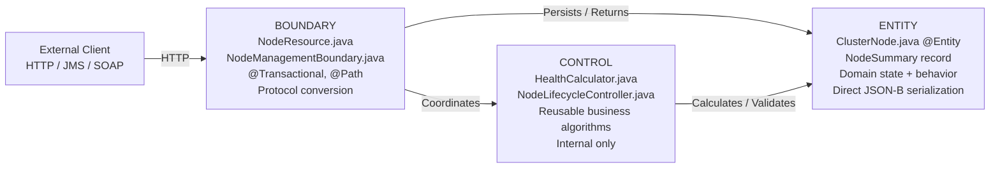

# :material-book-open-page-variant: Adam Bien — Real World Java EE Patterns, Chapter 3: Rethinking the Business Tier

> **Book:** Real World Java EE Patterns — Rethinking Best Practices (Adam Bien)  
> **Chapter:** 3 — BCE Pattern: Boundary, Control, Entity

---

## :material-information: Architectural Philosophy

Adam Bien argues that most J2EE patterns (Service Locator, DTO Assembler, Business Delegate, Value Object) were **workarounds for technical limitations** that no longer exist in Jakarta EE. Modern DI containers (CDI 4.0), JPA, and JAX-RS make these patterns harmful overhead.

**Core shift:**

| Old J2EE Thinking | Modern BCE Thinking |
|-------------------|---------------------|
| Package-by-layer: `service/`, `dao/`, `dto/` | **Package-by-feature**: `node/boundary/`, `node/control/`, `node/entity/` |
| Interface + Impl for everything | **No-interface view** — CDI proxies concrete classes |
| DTOs copied from entities | **Entity as DTO** — entity serialized directly via JSON-B |
| Anemic entities (only getters/setters) | **Rich domain objects** — entities carry domain behavior |

---

## :material-layers-triple: The Three BCE Stereotypes



### 1. Boundary — The Single Public Entry Point

The **hard wall** between the external world and business logic. Handles:
- HTTP/JMS/SOAP protocol conversion
- Transaction demarcation (`@Transactional`)
- Workflow coordination (calls Controls, returns Entities)
- Never contains business calculations

```java
// JAX-RS Boundary:
@Path("/api/nodes")
@Transactional
@ApplicationScoped
public class NodeResource {

    @Inject NodeManagementBoundary boundary;

    @POST
    @Consumes(MediaType.APPLICATION_JSON)
    @Produces(MediaType.APPLICATION_JSON)
    public Response createNode(ClusterNode node) {       // Entity as input — no DTO!
        ClusterNode created = boundary.create(node);
        return Response.created(URI.create("/api/nodes/" + created.getId()))
                       .entity(created).build();         // Entity as response — no DTO!
    }

    @GET
    @Path("/summary")
    @Produces(MediaType.APPLICATION_JSON)
    public List<NodeSummary> listSummaries() {           // Lightweight record projection
        return boundary.findAllSummaries();
    }
}

// Transactional Facade Boundary:
@ApplicationScoped
@Transactional
public class NodeManagementBoundary {

    @PersistenceContext EntityManager em;
    @Inject HealthCalculator healthCalculator;
    @Inject NodeLifecycleController lifecycleController;

    public ClusterNode create(ClusterNode node) {
        em.persist(node);
        return node;
    }

    public List<NodeSummary> findAllSummaries() {
        return em.createQuery(
            "SELECT new com.pulse.node.entity.NodeSummary(n.id, n.hostname, n.status) " +
            "FROM ClusterNode n ORDER BY n.hostname",
            NodeSummary.class
        ).getResultList();
    }
}
```

### 2. Control — Reusable Business Algorithms

Encapsulates algorithms, state machines, and validation logic. **Never exposed directly to external clients**.

Rules for Controls:
- Deployed `@ApplicationScoped` — internal only
- Must use `TxType.MANDATORY` — joins the Boundary's transaction, sharing the same JDBC connection
- Never calls Boundaries (no upward dependency)
- Never holds state — pure computation

```java
@ApplicationScoped
@Transactional(TxType.MANDATORY)   // MUST join caller's transaction
public class HealthCalculator {

    public double calculateHealthScore(ClusterNode node) {
        double cpuScore  = Math.max(0, 100 - node.getAvgCpuPercent());
        double ramScore  = 100.0 * node.getFreeRamGb() / node.getHardware().getRamGb();
        double diskScore = 100.0 * node.getFreeDiskGb() / node.getHardware().getStorageTb() / 1024;
        return (cpuScore * 0.4) + (ramScore * 0.4) + (diskScore * 0.2);
    }
}

@ApplicationScoped
@Transactional(TxType.MANDATORY)
public class NodeLifecycleController {

    private static final Map<NodeStatus, Set<NodeStatus>> VALID_TRANSITIONS = Map.of(
        NodeStatus.ACTIVE,       Set.of(NodeStatus.MAINTENANCE, NodeStatus.DECOMMISSIONED),
        NodeStatus.MAINTENANCE,  Set.of(NodeStatus.ACTIVE, NodeStatus.DECOMMISSIONED),
        NodeStatus.DECOMMISSIONED, Collections.emptySet()
    );

    public void transition(ClusterNode node, NodeStatus newStatus) {
        if (!VALID_TRANSITIONS.get(node.getStatus()).contains(newStatus)) {
            throw new IllegalStateException(
                "Invalid transition: " + node.getStatus() + " -> " + newStatus
            );
        }
        node.setStatus(newStatus);   // dirty checking fires UPDATE automatically
    }
}
```

### 3. Entity — Rich Domain Object as DTO

JPA `@Entity` that carries both state AND domain behavior. Serialized **directly** by JSON-B — no separate DTO class needed.

```java
@Entity
@Table(name = "cluster_node")
public class ClusterNode {

    @Id @GeneratedValue(strategy = GenerationType.IDENTITY)
    private Long id;

    private String hostname;

    @Enumerated(EnumType.STRING)
    private NodeStatus status;

    @Embedded
    private HardwareSpec hardware;

    @JsonbTransient                    // ← protects from serialization
    @OneToMany(mappedBy = "node", cascade = CascadeType.ALL, orphanRemoval = true)
    private List<TelemetryRecord> telemetryRecords = new ArrayList<>();

    // DOMAIN BEHAVIOR — not anemic!
    public boolean canTransitionTo(NodeStatus target) {
        return switch (this.status) {
            case ACTIVE       -> target == NodeStatus.MAINTENANCE || target == NodeStatus.DECOMMISSIONED;
            case MAINTENANCE  -> target == NodeStatus.ACTIVE || target == NodeStatus.DECOMMISSIONED;
            default           -> false;
        };
    }

    public boolean isHealthy() {
        return this.status == NodeStatus.ACTIVE && this.hardware.getRamGb() >= 16;
    }
}

// Lightweight projection record — used for listing summaries:
public record NodeSummary(Long id, String hostname, NodeStatus status) {}
```

---

## :material-close-circle: Anti-Patterns Eliminated by BCE

### Anti-Pattern 1: Interface-per-Class

```java
// ❌ OLD — pure overhead when only one implementation exists:
public interface INodeService { ClusterNode create(ClusterNode n); }

@ApplicationScoped
public class NodeServiceImpl implements INodeService {
    @Override public ClusterNode create(ClusterNode n) { ... }
}

// ✅ BCE — CDI proxies the concrete class directly:
@ApplicationScoped
public class NodeManagementBoundary {
    public ClusterNode create(ClusterNode n) { ... }
}
```

!!! tip "When interfaces ARE still useful"
    If you need **mockability** in unit tests (e.g., mock without a running container), or if you have **multiple implementations** selected at runtime via `@Qualifier`, then interfaces are appropriate. BCE doesn't ban them — it bans interfaces that exist only because of old J2EE habits.

### Anti-Pattern 2: DTO Explosion

```java
// ❌ OLD — 3 parallel classes + mapping logic for every entity:
public class NodeDTO { ... }
public class NodeCreateDTO { ... }
public class NodeMapper { NodeDTO toDto(ClusterNode e) { ... } }

// ✅ BCE — entity serializes directly via JSON-B:
@POST
public Response create(ClusterNode node) {          // ← ClusterNode as input body
    em.persist(node);
    return Response.created(...).entity(node).build(); // ← ClusterNode as response
}

// Sensitive fields protected with @JsonbTransient:
@JsonbTransient
private String passwordHash;    // never appears in JSON output
```

### Anti-Pattern 3: Anemic Domain Model

```java
// ❌ ANEMIC — entity has only getters/setters; all logic externalized:
ClusterNode node = em.find(ClusterNode.class, id);
if (node.getStatus() == NodeStatus.ACTIVE &&
    validTargets.contains(newStatus)) {        // business logic in Boundary
    node.setStatus(newStatus);
}

// ✅ BCE RICH ENTITY — logic lives where the data lives:
node.transitionTo(newStatus);   // throws IllegalStateException if invalid
```

---

## :material-exit-to-app: BCE Facade Variants

### CRUD Façade (Simple Read/Write Boundary)

```java
@ApplicationScoped
@Transactional
public class NodeCrudBoundary {
    @PersistenceContext EntityManager em;

    public ClusterNode findById(Long id) {
        return em.find(ClusterNode.class, id);
    }

    public void delete(Long id) {
        ClusterNode node = em.find(ClusterNode.class, id);
        if (node != null) em.remove(node);
    }
}
```

### Async Façade — `@Asynchronous`

```java
@ApplicationScoped
public class AsyncDiagnosticBoundary {

    @Asynchronous
    public Future<DiagnosticReport> runDiagnostics(Long nodeId) {
        DiagnosticReport report = performLongRunningDiagnostic(nodeId);
        return new AsyncResult<>(report);   // EJB async result wrapper
    }
}
```

### Gateway — Stateful Conversation Pattern

For multi-step UI workflows where the entity must remain managed across multiple requests:

```java
@Stateful
@Transactional(TxType.NOT_SUPPORTED)   // no auto-transaction
public class NodeEditGateway {

    @PersistenceContext(type = PersistenceContextType.EXTENDED)
    private EntityManager em;

    private ClusterNode current;

    public void beginEdit(Long id) {
        current = em.find(ClusterNode.class, id);   // stays MANAGED across calls
    }

    public ClusterNode getCurrent() { return current; }

    @Transactional(TxType.REQUIRES_NEW)   // flush on explicit save
    @Remove
    public void save() {
        // dirty checking auto-generates UPDATE — no merge() needed
    }
}
```

---

## :material-archive-cancel: Retired J2EE Patterns

| Retired Pattern | Reason Retired | BCE Replacement |
|----------------|---------------|----------------|
| **Service Locator** | `@Inject` / `@EJB` | CDI Dependency Injection |
| **DTO Assembler** | Boilerplate mapping | Entity as DTO + `@JsonbTransient` |
| **Business Delegate** | EJB 3 removed checked remote exceptions | Direct injection of concrete beans |
| **Domain Store** | Standardized | `EntityManager` |
| **Value List Handler** | `setFirstResult()`/`setMaxResults()` | JPA pagination |
| **Composite Entity** | Standardized | JPA relationships + `@Embeddable` |

---

## :material-key: Key Takeaways — Adam Bien BCE Ch3

1. **BCE = Boundary (entry point) → Control (algorithm) → Entity (data + behavior)** — strict one-way dependency
2. **No interfaces without polymorphic reason** — CDI 4.0 proxies concrete classes directly
3. **Entity as DTO** — `@JsonbTransient` protects sensitive fields; eliminates DTO explosion
4. **Rich entities** — domain logic belongs on the entity, not scattered across service layers
5. **Controls use `TxType.MANDATORY`** — they MUST join the Boundary's transaction; never start their own
6. **Package-by-feature** — all code for one domain lives together; horizontal layers scatter related code

---

[:octicons-arrow-left-24: Back to Day 15 Index](index.md)
