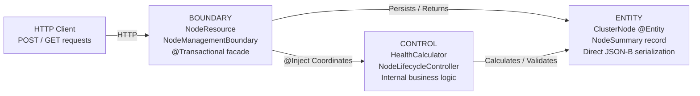

# :material-flask: Day 15 Lab Guide — BCE Architecture Pattern (Boundary-Control-Entity)

> **Lab Repo:** [:material-github: 7amo10/JavaEE-Labs — Week-3-BCE-Async-Performance](https://github.com/7amo10/JavaEE-Labs/tree/main/Week-3-BCE-Async-Performance)  
> **Book:** EE Patterns Ch3 — Adam Bien's BCE Pattern

---

## :material-target: Laboratory Objective

Restructure enterprise microservice applications away from bloated horizontal technical layers into clean, maintainable **vertical feature packages** adhering to Adam Bien's **Boundary-Control-Entity (BCE)** pattern. Eliminate redundant single-implementation interfaces, eliminate tedious DTO mapping layers by leveraging **Entity as DTO**, and isolate reusable business algorithms in dedicated Control beans.

---

## :material-layers-triple: The Three BCE Stereotypes

### Package Structure

```
com.pulse.node/
├── boundary/
│   ├── NodeResource.java           ← JAX-RS REST entry point
│   └── NodeManagementBoundary.java ← Transactional facade
├── control/
│   ├── HealthCalculator.java       ← Reusable scoring algorithm
│   └── NodeLifecycleController.java ← State machine validator
└── entity/
    ├── ClusterNode.java            ← JPA @Entity + domain behavior + JSON-B DTO
    ├── NodeStatus.java             ← Enum
    └── NodeSummary.java            ← Java 21 record projection
```

### BCE Dependency Flow



---

## :material-cube-outline: Key Implementation Details

### Scenario 1 — Entity as DTO (No DTO Mapping Layer)

```java
// ClusterNode @Entity serializes directly — no NodeDTO class needed:
@POST
@Path("/nodes")
@Consumes(MediaType.APPLICATION_JSON)
@Produces(MediaType.APPLICATION_JSON)
public Response createNode(ClusterNode node) {
    ClusterNode created = boundary.create(node);
    return Response.created(URI.create("/api/nodes/" + created.getId()))
                   .entity(created).build();   // ClusterNode returned directly
}
```

### Scenario 2 — Health Metrics via Control Bean

```java
@ApplicationScoped
@Transactional(TxType.MANDATORY)
public class HealthCalculator {
    public double calculateHealthScore(ClusterNode node) {
        double cpu  = Math.max(0.0, 100 - node.getAvgCpuPercent()) * 0.4;
        double ram  = (100.0 * node.getFreeRamGb() / node.getHardware().getRamGb()) * 0.4;
        double disk = (100.0 * node.getFreeDiskGb() / (node.getHardware().getStorageTb() * 1024)) * 0.2;
        return cpu + ram + disk;
    }
}
```

### Scenario 3 — State Machine in Control (HTTP 409 on Invalid Transition)

```java
@ApplicationScoped
@Transactional(TxType.MANDATORY)
public class NodeLifecycleController {
    public void transition(ClusterNode node, NodeStatus newStatus) {
        if (!node.canTransitionTo(newStatus)) {
            throw new WebApplicationException(
                Response.status(409)
                        .entity("Cannot transition from " + node.getStatus() + " to " + newStatus)
                        .build()
            );
        }
        node.setStatus(newStatus);   // dirty checking handles UPDATE
    }
}
```

### Scenario 4 — JPQL Constructor Expression → Java 21 Record Projection

```java
// No entity hydration — just 3 scalar columns:
public record NodeSummary(Long id, String hostname, NodeStatus status) {}

// Query in Boundary:
public List<NodeSummary> findAllSummaries() {
    return em.createQuery(
        "SELECT new com.pulse.node.entity.NodeSummary(n.id, n.hostname, n.status) " +
        "FROM ClusterNode n ORDER BY n.hostname",
        NodeSummary.class
    ).getResultList();
}
```

### Scenario 5 — Architecture Verification: Zero Redundant Interfaces

```java
// VERIFICATION — confirm no INodeService / NodeServiceImpl exists:
// Just: NodeResource (Boundary) @Inject NodeManagementBoundary (Boundary)
//       NodeManagementBoundary @Inject HealthCalculator (Control)
//       NodeManagementBoundary @Inject NodeLifecycleController (Control)
// All dependencies point downward: Boundary → Control → Entity ✅
```

---

## :material-check-all: Lab Verification Checklist

| # | Scenario | Expected |
|---|----------|---------|
| 1 | **Entity as DTO** | `POST /api/nodes` accepts `ClusterNode` JSON directly and returns created entity without any DTO class |
| 2 | **Health Metrics** | `HealthCalculator.calculateHealthScore()` returns weighted score based on CPU/RAM/disk telemetry |
| 3 | **State Machine** | Invalid transition (e.g., DECOMMISSIONED → ACTIVE) returns HTTP 409 Conflict; valid transition succeeds |
| 4 | **JPQL Record Projections** | `GET /api/nodes/summary` returns `NodeSummary` records with only id/hostname/status (no entity overhead) |
| 5 | **Architecture Verification** | Zero redundant interfaces, strict Boundary→Control→Entity dependency flow confirmed |

---

[:octicons-arrow-left-24: Back to Day 15 Index](index.md) | [:octicons-arrow-right-24: Day 16 — Enterprise Concurrency](../day-16-enterprise-concurrency/index.md)
