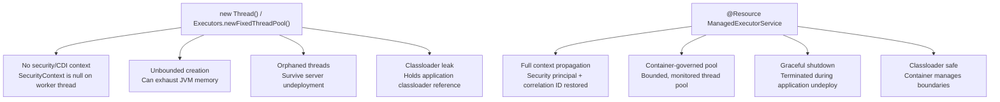

# :material-flask: Day 16 Lab Guide — Enterprise Concurrency & Managed Threads

> **Lab Repo:** [:material-github: 7amo10/JavaEE-Labs — Week-3-BCE-Async-Performance](https://github.com/7amo10/JavaEE-Labs/tree/main/Week-3-BCE-Async-Performance)  
> **Tech Stack:** Jakarta Concurrency 3.0 | ManagedExecutorService | CompletableFuture | Java 21

---

## :material-target: Laboratory Objective

Master container-managed asynchronous processing using **Jakarta Concurrency 3.0** and Java 21 `CompletableFuture`. Understand why raw threads are strictly forbidden in enterprise containers, implement container **Context Propagation** (Security Principal and Request Correlation ID), orchestrate non-blocking parallel fan-out/fan-in pipelines, and enforce clean lifecycle termination.

---

## :material-table-alert: Why Raw Threads are Forbidden



---

## :material-cube-outline: Key Technical Concepts

### 1. `ManagedExecutorService` Setup

```java
@Resource
private ManagedExecutorService executor;

// OR inject via CDI (Jakarta Concurrency 3.0+):
@Inject
@ManagedExecutorDefinition(
    name = "java:app/concurrent/ClusterExecutor",
    maxAsync = 8
)
private ManagedExecutorService clusterExecutor;
```

### 2. Context Propagation Engine

The container captures caller context at **submission time** and restores it on the worker thread before task invocation:

```java
@ApplicationScoped
public class SecurityContextHolder {
    private final ThreadLocal<String> correlationId = new ThreadLocal<>();
    private final ThreadLocal<String> principalName = new ThreadLocal<>();

    public Snapshot captureSnapshot() {
        return new Snapshot(correlationId.get(), principalName.get());
    }

    public void restoreSnapshot(Snapshot snap) {
        correlationId.set(snap.correlationId());
        principalName.set(snap.principalName());
    }

    public void clear() {
        correlationId.remove();
        principalName.remove();
    }
}

// Context-aware task wrapper:
public class ContextAwareTask<T> implements Supplier<T> {
    private final Supplier<T> delegate;
    private final SecurityContextHolder.Snapshot contextSnapshot;  // captured at submit time
    private final SecurityContextHolder contextHolder;

    @Override
    public T get() {
        contextHolder.restoreSnapshot(contextSnapshot);   // restore on worker thread
        try {
            return delegate.get();                         // run the actual task
        } finally {
            contextHolder.clear();                         // always clean up
        }
    }
}
```

### 3. Parallel Fan-Out / Fan-In with `CompletableFuture.allOf()`

```java
@ApplicationScoped
public class ParallelDiagnosticBoundary {

    @Resource ManagedExecutorService executor;
    @Inject HealthCalculator calculator;

    public AggregatedReport analyzeNodes(List<Long> nodeIds) throws Exception {
        long start = System.currentTimeMillis();

        // Fan-out: launch N parallel tasks simultaneously:
        List<CompletableFuture<NodeDiagnostic>> futures = nodeIds.stream()
            .map(id -> CompletableFuture.supplyAsync(
                () -> analyzeSingleNode(id),   // runs on managed thread
                executor                        // ALWAYS pass the managed executor
            ))
            .toList();

        // Fan-in: wait for ALL to complete:
        CompletableFuture.allOf(futures.toArray(new CompletableFuture[0])).get();

        List<NodeDiagnostic> results = futures.stream()
            .map(CompletableFuture::join)
            .toList();

        long elapsed = System.currentTimeMillis() - start;
        System.out.printf("Parallel: %dms (sequential would be ~%dms)%n",
            elapsed, nodeIds.size() * 85);  // ~175ms vs ~340ms for 4 nodes

        return new AggregatedReport(results);
    }
}
```

### 4. Non-Blocking Timeout Fallback

```java
CompletableFuture<NodeDiagnostic> future = CompletableFuture
    .supplyAsync(() -> slowNetworkCall(nodeId), executor)
    .completeOnTimeout(                          // non-blocking timeout
        NodeDiagnostic.degraded(nodeId, "timeout"),
        2, TimeUnit.SECONDS
    );
```

### 5. Exception Recovery — `.exceptionally()`

```java
CompletableFuture<NodeDiagnostic> safe = CompletableFuture
    .supplyAsync(() -> analyzeSingleNode(nodeId), executor)
    .exceptionally(ex -> {
        System.err.printf("[WARN] Node %d analysis failed: %s%n", nodeId, ex.getMessage());
        return NodeDiagnostic.degraded(nodeId, "analysis failed: " + ex.getMessage());
    });
```

### 6. Clean Lifecycle Termination

```java
@ApplicationScoped
public class ExecutorLifecycleManager {

    @Resource ManagedExecutorService executor;

    @PreDestroy
    public void shutdown() {
        executor.shutdown();
        try {
            if (!executor.awaitTermination(30, TimeUnit.SECONDS)) {
                executor.shutdownNow();
                System.out.println("[WARN] Forced shutdown — some tasks may not have completed");
            }
        } catch (InterruptedException e) {
            executor.shutdownNow();
            Thread.currentThread().interrupt();
        }
    }
}
```

---

## :material-check-all: Lab Verification Checklist

| # | Scenario | Expected |
|---|----------|---------|
| 1 | **Context Propagation** | Worker thread has caller's security principal + correlation ID available |
| 2 | **Parallel Fan-Out** | 4 nodes analyzed in ~175ms (parallel) vs ~340ms (sequential) — ~50% faster |
| 3 | **Non-Blocking Timeout** | Slow node analysis degrades gracefully after 2s; caller thread not blocked |
| 4 | **Exception Recovery** | Node failure handled by `.exceptionally()` — other nodes still complete normally |
| 5 | **Lifecycle Termination** | Shutdown waits 30s for graceful completion; no orphaned threads remain |

---

[:octicons-arrow-left-24: Back to Day 16 Index](index.md) | [:octicons-arrow-right-24: Day 17 — SSE Real-Time](../day-17-sse-realtime/index.md)
