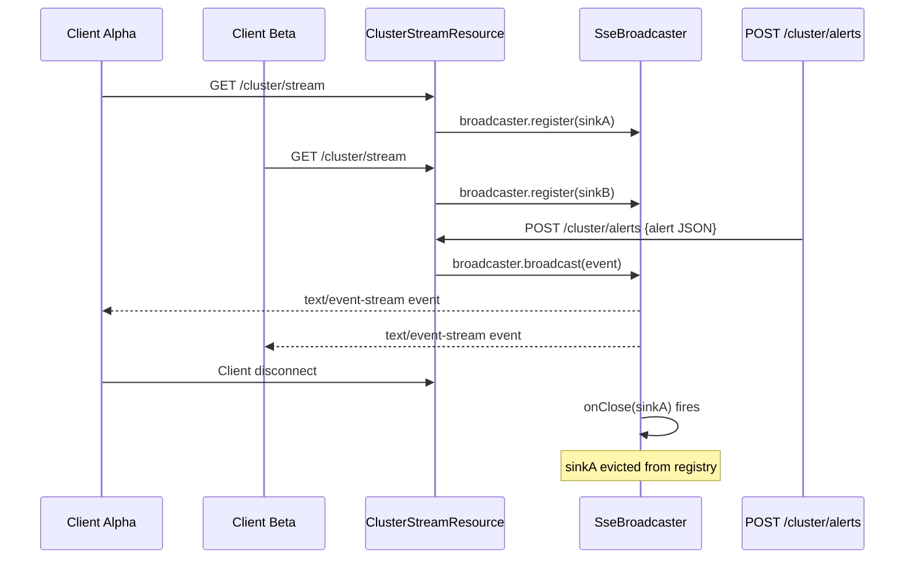

# :material-flask: Day 17 Lab Guide — Real-Time Communication via SSE

> **Lab Repo:** [:material-github: 7amo10/JavaEE-Labs — Week-3-BCE-Async-Performance](https://github.com/7amo10/JavaEE-Labs/tree/main/Week-3-BCE-Async-Performance)  
> **Tech Stack:** Jakarta RESTful Web Services 3.1 | JAX-RS SSE API | SseBroadcaster | Java 21

---

## :material-target: Laboratory Objective

Master unidirectional real-time event streaming using the **Jakarta RESTful Web Services 3.1 (JAX-RS) SSE API**. Implement `SseEventSink` unicast streaming, `SseBroadcaster` multicast publishing, structured `OutboundSseEvent` payloads, client lifecycle hooks (`onClose` / `onError`), and safeguard server resources through disconnect detection.

---

## :material-sitemap: SSE Communication Architecture



---

## :material-cube-outline: Implementation Details

### Scenario 1 — Unicast Progress Streaming (5 ETL Stages)

```java
@GET
@Path("/jobs/{jobId}/progress")
@Produces(MediaType.SERVER_SENT_EVENTS)
public void streamProgress(@PathParam("jobId") String jobId,
                            @Context SseEventSink sink,
                            @Context Sse sse) {

    List<String> stages = List.of(
        "Stage 1: Data extraction started",
        "Stage 2: Schema validation complete",
        "Stage 3: Record transformation in progress",
        "Stage 4: Loading to cluster database",
        "Stage 5: Index optimization complete"
    );

    executor.submit(() -> {
        try {
            for (int i = 0; i < stages.size(); i++) {
                if (sink.isClosed()) {
                    System.out.println("[SSE] Client disconnected mid-stream, aborting");
                    break;
                }
                sink.send(sse.newEventBuilder()
                    .name("etl-progress")
                    .id("stage-" + (i + 1))
                    .data(stages.get(i))
                    .reconnectDelay(2000)     // client retries every 2s on disconnect
                    .build());
                Thread.sleep(1000);
            }
            // Final EOF event — closes connection on client side:
            sink.send(sse.newEventBuilder().name("complete").data("Pipeline finished!").build());
            sink.close();   // server-side graceful close
        } catch (Exception e) {
            sink.close();
        }
    });
}
```

### Scenario 2 — Multicast Broadcaster Fan-Out

```java
@ApplicationScoped
@Path("/cluster")
public class ClusterStreamResource {

    @Context Sse sse;
    @Resource ManagedExecutorService executor;

    private SseBroadcaster broadcaster;

    @PostConstruct
    public void init() {
        broadcaster = sse.newBroadcaster();

        // Scenario 3: Lifecycle management — evict disconnected sinks:
        broadcaster.onClose(sink ->
            System.out.println("[SSE] Sink closed — evicted from broadcaster registry"));
        broadcaster.onError((sink, t) ->
            System.err.println("[SSE] Sink error: " + t.getMessage()));
    }

    @GET
    @Path("/stream")
    @Produces(MediaType.SERVER_SENT_EVENTS)
    public void subscribe(@Context SseEventSink sink) {
        broadcaster.register(sink);
    }

    @POST
    @Path("/alerts")
    @Consumes(MediaType.APPLICATION_JSON)
    public Response broadcastAlert(ClusterAlert alert) {
        OutboundSseEvent event = sse.newEventBuilder()
            .name("cluster-alert")
            .id("alert-" + System.currentTimeMillis())
            .data(ClusterAlert.class, alert)
            .build();
        broadcaster.broadcast(event);
        return Response.accepted().build();
    }
}
```

### Scenario 4 — Early Disconnect Detection

```java
// Safe streaming loop — never throws on dead connection:
while (!sink.isClosed() && hasMoreData()) {
    sink.send(sse.newEventBuilder()
        .name("telemetry")
        .data(nextTelemetryRecord())
        .build());
    Thread.sleep(500);
}

// After loop: if sink is closed, background resources are also cleaned up
if (sink.isClosed()) {
    System.out.println("[SSE] Client disconnected — background thread terminating");
    metricsCollector.stop();
}
```

---

## :material-check-all: Lab Verification Checklist

| # | Scenario | Expected |
|---|----------|---------|
| 1 | **Unicast Progress Streaming** | 5 ETL stages streamed over single persistent connection with clean EOF close |
| 2 | **Multicast Broadcaster Fan-Out** | Both Client Alpha and Client Beta receive the same broadcasted telemetry + alert payloads without starvation |
| 3 | **Broadcaster Lifecycle Management** | `onClose` listener fires when a subscriber disconnects; sink is evicted from registry to prevent resource leaks |
| 4 | **Early Disconnect Safeguards** | `sink.isClosed()` check prevents orphaned background threads when clients terminate streams unexpectedly |

---

[:octicons-arrow-left-24: Back to Day 17 Index](index.md) | [:octicons-arrow-right-24: Day 18 — JPA Performance](../day-18-jpa-performance-tuning/index.md)
