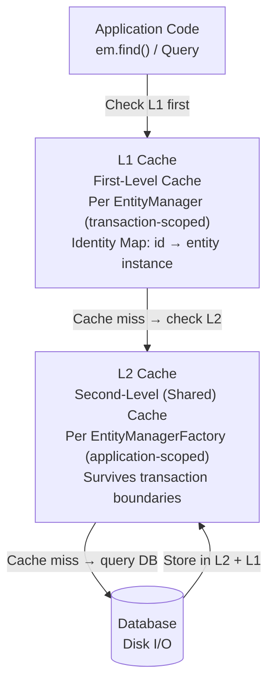
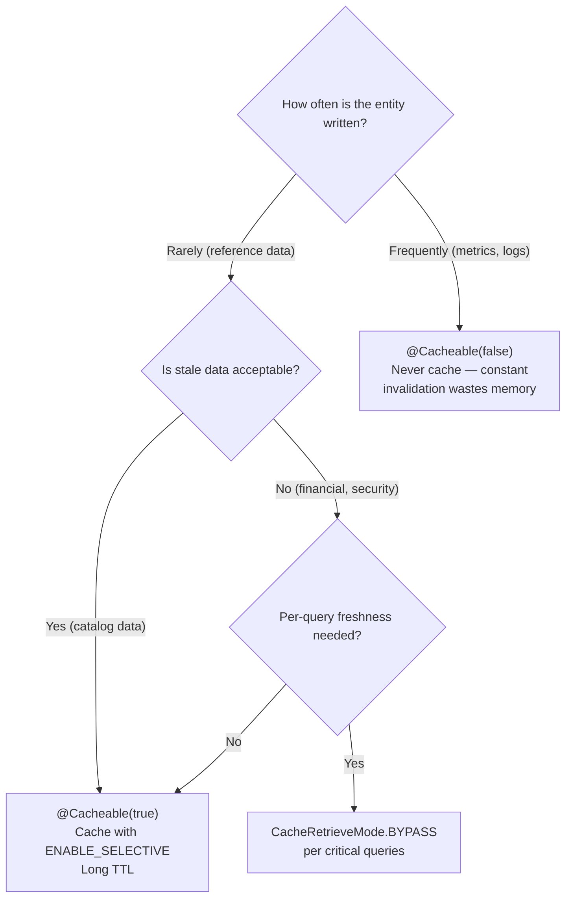

# :material-book-open-page-variant: Pro Jakarta Persistence — Chapter 12: Advanced Topics (L2 Caching Focus)

> **Book:** Pro Jakarta Persistence in Jakarta EE 10 (Apress, 2023)  
> **Chapter:** 12 — Other Advanced Topics (Caching section)

> **Note:** Locking (`@Version`, `LockModeType`) was covered in depth in [Week 2 — Day 11](../../week-2-jpa-transactions-security/day-11-jta-transactions-concurrency/book-pro-persistence-ch12.md). This note focuses on the **Second-Level Cache (L2 Cache)** section for Week 3's performance tuning theme.

---

## :material-information: JPA Cache Architecture Overview



---

## :material-database-check: 1. Configuring the L2 Cache

### `persistence.xml` — `shared-cache-mode`

```xml
<persistence-unit name="clusterPU">
    <shared-cache-mode>ENABLE_SELECTIVE</shared-cache-mode>
    <properties>
        <property name="hibernate.cache.use_second_level_cache" value="true"/>
        <property name="hibernate.cache.region.factory_class"
                  value="org.hibernate.cache.jcache.JCacheRegionFactory"/>
    </properties>
</persistence-unit>
```

| `shared-cache-mode` Value | Behavior |
|--------------------------|---------|
| `ALL` | Cache ALL entities in the persistence unit |
| `NONE` | Completely disable the L2 cache |
| `ENABLE_SELECTIVE` | Cache ONLY entities with `@Cacheable(true)` |
| `DISABLE_SELECTIVE` | Cache everything EXCEPT entities with `@Cacheable(false)` |
| `NOT_SPECIFIED` | Provider default (varies — often equivalent to `NONE`) |

### `@Cacheable` Annotation

```java
// With ENABLE_SELECTIVE — opt IN to caching:
@Entity
@Cacheable(true)
public class ServerRack {       // Rarely changes → cache it
    @Id private Long id;
    private String location;
    private int maxSlots;
}

// High write frequency → don't cache:
@Entity
@Cacheable(false)
public class TelemetryRecord {  // Written every second → would cause constant cache invalidation
    @Id private Long id;
    private Double cpuUsage;
    private Instant timestamp;
}

// No annotation with ENABLE_SELECTIVE → NOT cached:
@Entity
public class ClusterNode { ... }  // ← Not cached (default with ENABLE_SELECTIVE)
```

---

## :material-cog: 2. Runtime Cache Control Hints

Per-query or per-operation cache behavior overrides:

### `CacheRetrieveMode` — How to Read from Cache

```java
TypedQuery<ServerRack> query = em.createQuery("SELECT r FROM ServerRack r", ServerRack.class);

// USE (default): Read from L2 cache if available:
query.setHint("jakarta.persistence.cache.retrieveMode", CacheRetrieveMode.USE);

// BYPASS: Skip L2 cache — always go to DB (for guaranteed fresh data):
query.setHint("jakarta.persistence.cache.retrieveMode", CacheRetrieveMode.BYPASS);
```

### `CacheStoreMode` — How to Write to Cache

```java
// USE (default): Store results in L2 cache:
query.setHint("jakarta.persistence.cache.storeMode", CacheStoreMode.USE);

// BYPASS: Don't store in L2 cache (one-off queries, avoid cache pollution):
query.setHint("jakarta.persistence.cache.storeMode", CacheStoreMode.BYPASS);

// REFRESH: Re-hydrate L2 cache with freshest DB state (after external updates):
query.setHint("jakarta.persistence.cache.storeMode", CacheStoreMode.REFRESH);
```

### Per-Find Cache Control

```java
Map<String, Object> hints = new HashMap<>();
hints.put("jakarta.persistence.cache.retrieveMode", CacheRetrieveMode.BYPASS);  // fresh
hints.put("jakarta.persistence.cache.storeMode",    CacheStoreMode.REFRESH);    // update cache

ServerRack rack = em.find(ServerRack.class, 1L, hints);
```

---

## :material-application-cog: 3. Cache API — Programmatic Eviction

Access the L2 cache directly via `EntityManagerFactory.getCache()`:

```java
Cache cache = emf.getCache();

// Check if entity is currently in L2 cache:
boolean isCached = cache.contains(ServerRack.class, 1L);
System.out.println("Rack #1 cached: " + isCached);

// Evict a single entity:
cache.evict(ServerRack.class, 1L);   // forces next find() to go to DB

// Evict ALL entities of a specific class:
cache.evict(ServerRack.class);

// Nuclear option — clear entire L2 cache:
cache.evictAll();
```

!!! tip "When to evict"
    - After bulk DML operations (`em.createQuery("UPDATE ...").executeUpdate()`) — these bypass the L2 cache
    - After external modifications (another application modified the database directly)
    - In unit tests: `cache.evictAll()` before each test to prevent stale relationships

---

## :material-strategy: 4. Caching Strategy Decision Guide



### Recommended Caching Approach

| Entity Type | `@Cacheable` | Rationale |
|------------|-------------|-----------|
| `ServerRack` | `true` | Configuration data — rarely changes |
| `SecurityGroup` | `true` | Reference data — low write frequency |
| `ClusterNode` | `false` or not set | Status changes frequently |
| `TelemetryRecord` | `false` | Written every second — don't cache |
| `UserAccount` | `false` | Security-sensitive — always fetch fresh |

---

## :material-key: Key Takeaways — Chapter 12 (Caching)

1. **L2 cache is OFF by default** — you must configure `shared-cache-mode` and annotate entities
2. **`ENABLE_SELECTIVE`** — safest strategy; only opt-in entities are cached; no accidental caching
3. **`CacheRetrieveMode.BYPASS`** — use for read-your-own-writes scenarios or security-sensitive data
4. **`CacheStoreMode.REFRESH`** — forces cache update from DB; use after detecting external modifications
5. **`cache.evictAll()`** in unit tests — prevents test-order dependencies from stale L2 cache state
6. **L1 cache (persistence context)** is always active for the duration of a transaction — L2 is the cross-transaction cache
7. **Bulk DML bypasses L2** — always evict affected classes after `executeUpdate()`

---

[:octicons-arrow-left-24: Back to Day 18 Index](index.md)
