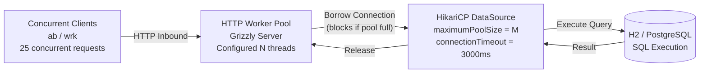

# :material-flask: Day 19 Lab Guide — Database Connection Pool & HTTP Throughput Tuning

> **Lab Repo:** [:material-github: 7amo10/JavaEE-Labs — Week-3-BCE-Async-Performance](https://github.com/7amo10/JavaEE-Labs/tree/main/Week-3-BCE-Async-Performance)  
> **Tech Stack:** HikariCP | Grizzly HTTP Server | JVM GC Telemetry | `ab` / `wrk` load testing

---

## :material-target: Laboratory Objective

Investigate and optimize the critical intersection between HTTP container worker threads, database connection pool sizing, and JVM memory management. Measure thread starvation under undersized pools, quantify context-switching degradation under oversized configurations, evaluate optimal thread-to-connection balance using the HikariCP sizing law, and correlate GC pauses with tail (P99) latency spikes.

---

## :material-sitemap: HTTP Workers ↔ Connection Pool ↔ Database



---

## :material-compare: Four Experiment Profiles

| Profile | HTTP Workers | Pool Connections | Expected Behavior |
|---------|-------------|-----------------|-------------------|
| **1 — Starved** | 32 workers | 2 connections | Queue contention, timeouts, P99 > 200ms |
| **2 — Balanced** | 16 workers | 16 connections | ~500 req/sec, mean ≤ 15ms, P99 ≤ 20ms |
| **3 — Oversized** | 64 workers | 80 connections | Same throughput as balanced + excess memory |
| **4 — GC Stress** | 16 workers | 16 connections | Normal mean, P99 spikes on GC pause events |

---

## :material-cube-outline: Key Implementations

### HikariCP Pool Configuration

```java
HikariConfig config = new HikariConfig();
config.setJdbcUrl("jdbc:h2:mem:clusterdb;DB_CLOSE_DELAY=-1");
config.setUsername("sa");
config.setPassword("");

// Profile 1 — Starved:
config.setMaximumPoolSize(2);
config.setConnectionTimeout(3000);

// Profile 2 — Balanced (HikariCP formula: (CPU_cores×2)+spindles):
// 4-core machine + 1 SSD = (4×2)+1 = 9, rounded up to 16 for headroom
config.setMaximumPoolSize(16);
config.setMinimumIdle(4);
config.setConnectionTimeout(3000);
config.setIdleTimeout(600_000);    // 10 minutes
config.setMaxLifetime(1_800_000);  // 30 minutes — less than DB wait_timeout
config.setPoolName("ClusterNodePool");
```

### HikariCP Sizing Formula

```
Pool Size = (CPU_cores × 2) + effective_spindle_count
```

| CPU Cores | Storage | Formula | Recommended Pool |
|-----------|---------|---------|-----------------|
| 4 cores | SSD (1 spindle) | (4×2)+1 | **9 connections** |
| 8 cores | SSD (1 spindle) | (8×2)+1 | **17 connections** |
| 16 cores | SSD (1 spindle) | (16×2)+1 | **33 connections** |

!!! warning "More connections ≠ better performance"
    Beyond the optimal size, additional connections compete for the same disk I/O bandwidth and increase OS context-switch overhead. HikariCP benchmarks show throughput actually *decreasing* with oversized pools.

### Scenario 1 — Starved Pool Behaviour

```
Thread pool: 32 HTTP workers
Connection pool: 2 connections

Execution trace:
  Worker-01 → borrows conn-1 → executes 5ms query → releases conn-1
  Worker-02 → borrows conn-2 → executes 5ms query → releases conn-2
  Workers 03-32 → WAIT in pool queue (up to connectionTimeout = 3000ms)
  → 30 threads blocked → P99 latency = queueTime + queryTime ≈ 200ms+
  → Under high load: SQLTimeoutException thrown after 3000ms
```

### Scenario 4 — GC Pause vs P99 Latency

```java
// Hot endpoint generating excessive short-lived objects:
@GET
@Path("/nodes/report")
public List<NodeReport> generateReport() {
    return IntStream.range(0, 500)
        .mapToObj(i -> new NodeReport(
            "node-" + i,                    // new String per iteration
            Map.of("cpu", i * 1.5,          // new HashMap per iteration
                   "ram", i * 0.8,
                   "disk", i * 2.0)
        ))
        .collect(Collectors.toList());
    // ~500 * 3 ephemeral objects per request → Young GC fires frequently
}

// JVM GC flags to observe:
// -Xlog:gc*:file=/tmp/gc.log:tags,uptime,time,level
// -Xms256m -Xmx512m
//
// Correlation: every GC stop-the-world pause (5-150ms) = P99 latency spike
```

---

## :material-check-all: Lab Verification Checklist

| # | Scenario | Expected |
|---|----------|---------|
| 1 | **Starved Pool** | Thread timeout spikes; high P99 (>200ms) under 25 concurrent requests |
| 2 | **Balanced Production** | Sub-20ms mean; no timeout exceptions; optimal throughput |
| 3 | **Oversized Pool** | Zero throughput gain over balanced; excess DB memory consumed |
| 4 | **GC Telemetry** | P99 latency spikes correlated 1:1 with Young GC stop-the-world events |

---

[:octicons-arrow-left-24: Back to Day 19 Index](index.md) | [:octicons-arrow-right-24: Days 20-21 — Audit Milestone](../day-20-21-consolidation-audit/index.md)
